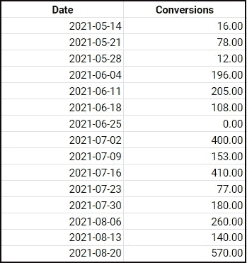
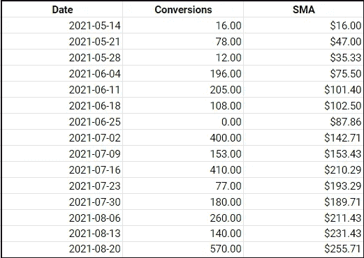

# 如何使用移动平均线在 SQL 中进行时间序列预测

> 原文：<https://towardsdatascience.com/how-to-conduct-time-series-forecasting-in-sql-with-moving-averages-fd5e6f2a456>

## 预测未来的逐步指南


[Icons8 团队](https://unsplash.com/@icons8?utm_source=unsplash&utm_medium=referral&utm_content=creditCopyText)在 [Unsplash](http://localhost:3000/s/photos/time?utm_source=unsplash&utm_medium=referral&utm_content=creditCopyText) 上的照片

> **请务必点击** [**订阅此处**](https://terenceshin.medium.com/membership) **千万不要错过另一篇关于数据科学指南、技巧和提示、生活经验等的文章！**

# 介绍

随着大数据和机器学习的出现，预测建模在商业中从未如此普遍。事实上，企业在运营中利用预测建模来保持竞争力几乎是必不可少的。

为什么？

通过准确预测未来会发生什么，它给你带来了几个好处:

1.  这给了你更多的时间来制定策略和执行你的计划。给自己更多的时间让你有机会更彻底地思考你的策略，并最终减少出错的机会。
2.  它可以帮助你进行资源分配。通过能够预测上升或下降的趋势，您可以将资源从预期具有较低 ROI 的计划中分配出来，并将它们转移到具有较高 ROI 的计划中。
3.  它让你比你的竞争对手跑得更快。通过能够预测未来会发生什么，您可以更加迭代地重新评估和调整，从而保持敏捷和适应性。

有几种类型的预测模型，但在本文中，我们将重点关注一种非常有价值的类型，称为**时间序列预测**。

# 时间序列预测到底是什么？

时间序列预测简单地说就是根据历史数据对未来事件进行预测。如果你不清楚这一点，这里有一些企业如何使用时间序列预测的例子:

*   预测下个月对产品的需求，以确定库存的累积量
*   估计明年可能辞职的员工数量，以主动制定满足公司需求的招聘计划
*   对几只股票的未来价格进行建模，以确定将哪只股票加入公司的投资组合

请注意，所有的例子都涉及到对未来事件的预测，以便企业能够积极主动地计划和执行。

就模型本身而言，有几种类型的时间序列模型被广泛采用，但我们将重点关注最基本的时间序列模型，即**简单移动平均线**。

> **请务必点击** [**订阅此处**](https://terenceshin.medium.com/membership) **千万不要错过另一篇关于数据科学指南、技巧和提示、生活经验等的文章！**

# 如何在 SQL 中进行简单的时间序列预测

现在，我们将向您展示如何使用**简单移动平均线(SMAs)进行基本的时间序列预测。**

SMA 是一种用于预测长期趋势的计算方法，它采用给定指标在过去一段特定时间内的平均值。请注意，在预测未来指标的*精确值*时，SMA**没有**有用。但是，它们仍然可以为您提供有用的信息，我们将在下面的示例中看到。

为了在 SQL 中计算 SMAs，您只需要做两件事:

1.  日期栏
2.  表示要预测的指标或值的列



表名:每周转换

假设我们有以下数据，它显示了一家公司从 2021 年 5 月 14 日到 2021 年 8 月 20 日每周的转化次数。

为了计算转换的 7 天 SMA，我们可以使用以下代码:

```
SELECT
   Date, Conversions,
   AVG(Conversions) OVER (ORDER BY Date ROWS BETWEEN 6 PRECEDING AND
   CURRENT ROW) as SMA
FROM daily_sales
```

这将产生以下表格和图表:



很简单，对吧？注意上图中蓝线的波动性。在这种情况下，你可以凭直觉猜测转化率呈上升趋势，但这并不总是那么容易。

通过查看 7 日 SMA，我们可以收集以下信息:

*   **我们可以看看一个指标的总体趋势**。基于这一时间段，每周转化率呈上升趋势。
*   **我们可以合理猜测指标的 SMA 走向。**如果最近的周线转换高于当前的 SMA，那么 SMA 应该继续上升。相反，如果转化率持续低于当前的 SMA，我们应该期待它开始下降。

现在，您知道了如何构建和解释 SQL 中最基本的时间序列模型之一！

# 感谢阅读！

> ***一定要*** [***订阅这里***](https://terenceshin.medium.com/membership) ***千万不要错过另一篇关于数据科学的指南、诀窍和技巧、生活经验等文章！***

不确定接下来要读什么？我为你选了另一篇文章:

[](/3-most-valuable-data-science-skills-that-increased-my-salary-by-60-89b4bbe0b34f)  

**还有一个:**

[](/the-5-best-data-science-books-you-should-read-in-2022-9209616c203f)  

# -特伦斯·申

*   ***如果您喜欢这个，*** [***订阅我的中***](https://terenceshin.medium.com/membership) ***为独家内容！***
*   ***同样，你也可以*** [***跟我上媒***](https://medium.com/@terenceshin)
*   [***报名参加我的个人简讯***](https://terenceshin.substack.com/embed)
*   ***关注我上***[***LinkedIn***](https://www.linkedin.com/in/terenceshin/)***其他内容***