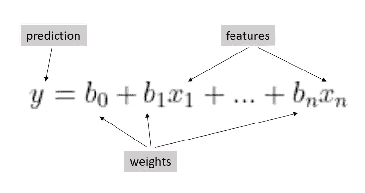
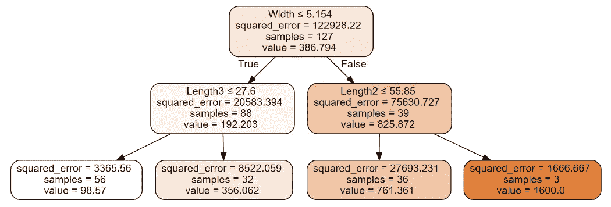
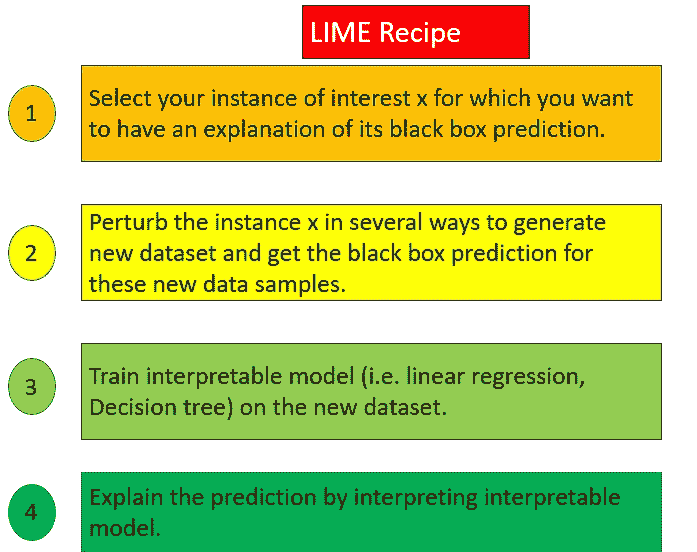

# 如何说服你的老板相信你的 ML/DL 模型

> 原文：<https://towardsdatascience.com/how-to-convince-your-boss-to-trust-your-ml-dl-models-671f707246a8>

## 使用 LIME 的机器学习模型可解释性，或者如何解释为什么模型做出了特定的预测

准确性与可解释性(图片由作者提供)

## **简介**

一些公司经理或利益相关者对机器学习模型预测持悲观态度。因此，数据科学家有理由让他们相信模型预测是可信的，也是人类可以理解的。因此，我们不仅需要专注于创建强大的机器学习/深度学习模型，还需要使模型能够被人类解释。

可解释性在许多方面都有帮助，例如帮助我们理解模型如何做出决策，它证明模型预测是正确的并获得洞察力，建立对模型的信任，并且它帮助我们改进模型。有两种类型的 ML 模型解释——全局和局部。

*   **本地解读**回答问题，为什么模型做出这个具体的预测？
*   **全球解读**回答了这个问题，预测最重要的特征是什么？

> 可解释性是人类能够理解决策原因的程度[Miller，Tim 2017]

在本文中，我们将关注本地可解释性，而**我们将涉及:**

1.  *固有的可解释模型*
2.  *局部解释方法:石灰*
3.  *实际工作—解释玩具数据集上的 XGBoost 模型预测*
4.  石灰的利弊

## 1.固有的可解释模型

固有解释模型的好例子是线性回归和决策树。

**1.1 线性回归**

线性回归背后的直觉是，它将目标预测为输入特征的加权和。

线性回归公式(图片作者提供)

基于线性回归的假设函数，解释是如此容易。很清楚哪个特征贡献更大，哪个特征对预测最重要。但是任何事情都是有代价的——模型的正确性取决于训练数据中的关系是否满足某些假设，例如[线性](https://en.wikipedia.org/wiki/Linearity)、[正态性](https://en.wikipedia.org/wiki/Normalization_(statistics))、[同方差性](https://en.wikipedia.org/wiki/Homoscedasticity_and_heteroscedasticity)、[独立性、](https://en.wikipedia.org/wiki/Independence_(probability_theory))和无[多重共线性](https://en.wikipedia.org/wiki/Multicollinearity)。

可以在 [**上一篇**](/fish-weight-prediction-regression-analysis-for-beginners-part-1-8e43b0cb07e) 中看到线性回归算法的详细解释。

 [## 鱼重预测(初学者回归分析)——第一部分

### 如何使用顶级线性 ML 算法(线性回归、套索回归和岭回归)构建 ML 回归模型

towardsdatascience.com](/fish-weight-prediction-regression-analysis-for-beginners-part-1-8e43b0cb07e) 

**1.2 决策树**

决策树也很容易解释。此外，它还可以处理特征之间的非线性关系，这是线性回归算法所无法做到的。决策树是通过基于某些标准(即基尼指数)进行分割来构建的，其中数据集的不同子集是通过分割来创建的。我们可以遵循从根节点到叶节点的树的结构，并理解为什么模型做出特定的预测。下面是一个可视化决策树示例。

决策树示例(图片由作者提供)

如果你想了解更多关于决策树是如何工作的，你可以访问我的[上一篇文章](/regression-analysis-for-beginners-using-tree-based-methods-2b65bd193a7)。

 [## 初学者回归分析—第二部分

### 使用基于树的算法(决策树、随机森林、XGboost)构建 ML 回归模型

towardsdatascience.com](/regression-analysis-for-beginners-using-tree-based-methods-2b65bd193a7) 

**2。局部解释方法:石灰**

随着模型变得越来越复杂，预测能力越来越强，对预测的解释也变得复杂。复杂模型，也称为黑盒模型，如 XGBoost、随机森林和神经网络，本质上是不可解释的，因此它们需要额外的方法来理解它们的预测性质。 **LIME** 是一种局部解释方法，解释如何对黑盒 ML 模型进行单独预测。LIME 背后的直觉是，它创建了代理模型(即线性回归、决策树)，该模型被训练为近似底层黑盒模型的预测。LIME 不是训练一个全局代理模型，而是专注于训练局部代理模型，以解释个体预测。这是下图所示的石灰配方。

石灰配方(图片由作者提供)

局部代理模型的数学表达式是:

哪里…

*   我们要解释的一个例子
*   f-原始模型(即深度神经网络，XGBoost)
*   g-代理模型(即线性回归、决策树)
*   π_x 邻近度，它定义了新生成的数据集应该有多大。
*   l 损失(即均方误差、交叉熵)
*   ω(g)-模型复杂性
*   G-一系列可能的解释(即所有可能的线性回归模型、线性回归、套索、岭)

在实践中，用户应该确定模型的复杂性，这意味着选择替代模型可以使用的最大数量的特征和样本。

**3。实际工作 XGBoost 模型的可解释性**

在这一节中，我们将讨论 LIME 的实际实现。我们将在来自 *sklearn* 的玩具数据集 *load_breast_cancer* 上做一个实验，这是一个带有标签的数据集，包含关于乳腺癌状况的信息，即它是良性还是恶性的。

**步骤 1:导入库和数据集**

首先，我们需要使用 **pip 安装石灰**来安装*石灰包*

数据帧结果(作者照片)

**第二步:构建 XGBoost 模型**

加载数据集后，让我们将数据分为训练和测试部分，使用默认超参数创建一个简单的 XGBoost 模型，并计算混淆矩阵和预测精度。

结果表明，该模型的准确率为 96%；现在是解释个别预测的时候了。

**第三步:创建代理模型**

现在我们创建一个 lime 表格解释器对象，它将尝试解释单个样本。将在新创建的包含 5000 个扰动样本的数据集上训练代理模型。

**步骤 4:解读单个样本。**

在这种情况下，我将尝试对两个随机样本进行解释。一个样本被正确分类，而另一个被错误分类。

示例 1(图片由作者提供)

示例 2(图片由作者提供)

如可视化所示，颜色 ***蓝色*和*橙色*** 分别代表 ***消极*和*积极*** 联想。

第一个样本是正确分类的示例，它被分类为良性类。让我们来回答这个问题— *为什么这个样本被归类为良性*？因为代理模型说如果特征*【最差纹理】* ≤21.05 或者*【最差凹点】* > 0.06 或者*【最差凹点】* > 0.12 或者*【面积误差】* ≤ 18.17 或者*【平均凹点】* > 0.1 那么他们倾向于预测为良性。该样本的所有特征值都满足这些条件，因此该示例被分类为良性。

第二个样本分类错误。问题— *为什么这个样本被错误地归类为良性，尽管它是恶性的？*因为从上面的可视化来看，代理模型说前五个特征中的三个特征满足良性属性，并且它们的特征的加权和大于满足恶性属性的特征的加权和。*这就是为什么这个特殊样本被错误分类的原因。*

## **4。石灰的利弊**

石灰法的优点是它使解释更人性化。尽管我们讨论了使用表格数据的例子，但是 LIME 也可以用于文本和图像数据。LIME 的缺点之一是采样的数据点来自高斯分布，忽略了特征之间的相关性。此外，有时解释可能不稳定。因为 LIME 是一个近似值，所以当法律要求您完全解释预测时，它不是一个充分的方法。

## **结论**

综上所述，LIME 是一个强有力的方法，它回答了我为什么要相信 ML 模型，以及为什么该模型做出了这个具体的预测？它创建了一个局部代理模型，与初始黑盒模型有很好的近似，这使得个体解释更容易。由于模型是可解释的，数据科学家也更容易让管理者和利益相关者相信预测是可信的。

> *希望你喜欢:)，这里也是我 GitHub 上的**[***全代码***](https://github.com/gurokeretcha/ML_interpretability/blob/main/LIME.ipynb) *。**
> 
> *下一篇文章将是关于任何 ML/DL 模型的全局可解释性。*
> 
> **你可以* ***关注我*** *上* [*中*](https://medium.com/@gkeretchashvili) *保持通知。**

*如果你想了解更多关于应用数据科学的知识，这里有 [**我的 YouTube 频道**](https://www.youtube.com/channel/UCvlF0PPaQ2GAuqYKJT4UpJQ) **。***

* [## 和朋友一起的 AI 学院

### 与朋友、家人和全世界分享您的视频

www.youtube.com](https://www.youtube.com/channel/UCvlF0PPaQ2GAuqYKJT4UpJQ) 

## **参考文献:**

[1] Molnar，Christoph“可解释的机器学习。让黑盒模型变得可解释的指南”(2019)

[2]米勒，蒂姆“人工智能中的解释:来自社会科学的见解”(2017)

[3]马尔科·图利奥·里贝罗《机器学习的模型不可知可解释性》(2016)*