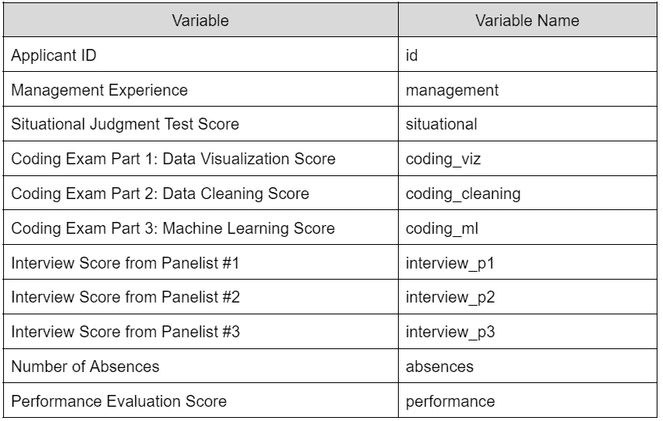
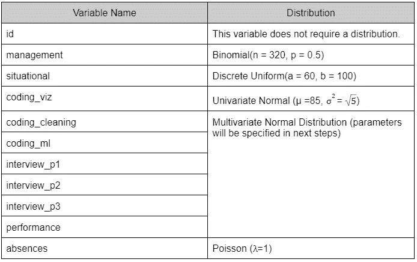

# 如何在 R 中创建自定义数据集

> 原文：<https://towardsdatascience.com/how-to-create-a-custom-dataset-in-r-cf045e286656>

## 制作您自己的合成数据集，用于分析您的投资组合


[斯科特·格雷厄姆](https://unsplash.com/@homajob?utm_source=medium&utm_medium=referral)在 [Unsplash](https://unsplash.com?utm_source=medium&utm_medium=referral) 上拍照

在你的数据科学之旅中，你可能会遇到*合成数据集*，有时也被称为*玩具*或*虚拟数据集。*这些对于实践数据争论、可视化和建模技术非常有用。与真实世界的数据相比，它们通常是清晰易懂的。这使得使用合成数据对初学者来说是一个很有吸引力的想法。今天，我将带你了解如何制作你自己的合成数据。阅读完本文后，您将能够创建自己的大数据，其中包含您喜欢的任意数量的变量。

本教程将介绍我如何创建这个人力资源数据集。它包含了 300 名数据科学家在一家假设公司的招聘考试中表现如何，以及他们在该公司工作 1 年后的绩效评估分数。

# **为什么要创建自己的数据集？**

除了易于分析之外，合成数据集还提供了优于真实世界数据的额外优势。这里有一些场景来说明:

**您正在寻找的数据是高度小众、特定或机密的**

起初，我试图在脑海中为我的项目寻找数据集。找了几个小时后，我两手空空。我意识到网上可能根本没有，因为公司不会到处公布申请人的数据。

**你想创建自己的教程**

假设你想写一个关于执行线性回归的教程(就像我一样！).你需要保证一些预测因子与你的自变量线性相关，而一些则不是。如果你寻找你自己的数据集，你将不得不对它们中的每一个进行测试。另一方面，如果你创建了你自己的，你可以设计它来保证这个假设成立。

**您希望拥有您数据的所有权利**

再也不用担心版权、数据隐私或使用条款，因为数据完全是你的。

**你的目标是练习你的数据可视化和沟通技巧**

就我而言，我的目的是展示我在人力资源分析方面的知识。具体来说，我想展示我在执行统计测试和将结果传达给业务经理方面的知识。

# 你需要什么

*   你的数据集将描述什么
*   关于数据性质的知识
*   关于常见概率分布的一些知识
*   R 的工作知识

# 制作数据集

r 有几个函数可以让你即时生成随机数据。以下步骤将指导您选择正确的函数、组织其输出并导出完成的数据集。

## 第一步:列出所有你想包含的变量



记下你需要多少单位或多少行数据。对于这个项目，我想要总共 320 个申请人/行的数据。

## 第二步:描述每个变量的要求


这就是背景和你的现场经验发挥作用的地方。例如，面试分数可能在 0 到 10 之间。但是作为招聘人员，你知道从 0 到 3 的分数是不现实的，所以你把 4 和 10 设为这个变量的最小值和最大值。同时，对于机器学习考试的分数，现实的最低和最高分数是 40 和 100。然而，你也知道平均分数是 80 分，大多数申请人的分数接近 80 分，所以你也希望你的数据能够反映这一趋势。如果你想让一些变量相互关联，也指出哪些变量。

## 第三步:为你的变量确定一个合适的分布



这是最棘手的部分，因为这是你要运用你的普通概率分布知识的地方。如果您只是使用数据集来练习争论或可视化，您可能只需要知道均匀和正态分布就可以了。但是在我的例子中，我希望我的数据有各种各样的关系和特性，所以我使用了一大堆。

我对面试分数使用了离散均匀分布，因为我希望申请人获得 4 分的概率等于获得 4.1 分或 4.2 分，一直到 10 分。同时，我对我的编码考试分数和性能分数使用了多元正态分布，因为我希望它们都是正态分布的，并且以不同的强度相互关联。

请注意，每个分布都有自己的一组参数，这就是我们在步骤 2 中的需求。你可以在这里阅读更多关于常见概率分布[。](https://en.wikipedia.org/wiki/List_of_probability_distributions)

## 步骤 4:编写代码

当然，这部分说起来容易做起来难。所以让我们一次解决一个变量(或一组变量)。

**套餐**

```
library(MASS)
library(tidyverse)
library(writexl)
```

首先，让我们装载所有我们需要的包。Tidyverse 用于数据操作，MASS 用于生成我们的多元正态分布，writexl 用于将我们的工作保存为 excel 文件。

**申请人身份证号**

```
id <- paste0("Applicant #", 1:320)
```

生成唯一 ID 号的最简单方法是创建一个整数序列。这里，我们还在“申请人#”后面追加了`paste0()`。

**管理**

```
# Assign Management Experience Randomly
set.seed(0717)
management_random <- rbinom(320, 1, 0.5)
management <- ifelse(management_random == 0, "manager", "non-manager")
```

随机生成分类变量的一种方法是首先随机抽取一组数字，然后给每个数字分配一个类别。这里，我们使用`rbinom`随机选择 0 和 1，然后将男性分配给 0，女性分配给 1

**情境判断考试成绩、缺课人数和数据可视化考试成绩**

```
# Situational Judgment Test Scores
set.seed(0717)
situational <- round(runif(320, 60, 100))# Number of Absences
set.seed(0717)
absences <- rpois(320, lambda = 1)# Data Viz Exam Scores
set.seed(0717)
coding_viz <- rnorm(320, 85, 5) %>%
  cap_score(., 100) %>% 
  round(2)
```

由于我们已经为这些变量指定了我们想要使用的分布和参数，我们现在需要做的就是将它们插入到它们各自的函数中:均匀分布的`runif` 、泊松分布的`rpois`和单变量正态分布的`rnorm` 。我们还将使用我们之前创建的函数`cap_score`，将数据可视化考试分数的最高分设为 100。

**相关变量**

```
cor_var_means <- c(6.8, 7.2, 8.4, 77, 84, 80)
cor_var_matrix <- matrix(
  c(
    0.87, 0.6, 0.7, 0.36, 1.55, 0.57,
    0.6, 1.2, 0.52, 0.5, 1.2, 2.34,
    0.7, 0.52, 0.68, 0.45, 0.89, 0.75,
    0.36, 0.5, 0.45, 15.2, 1.09, 1.64,
    1.55, 1.2, 0.89, 1.09, 17.2, 1.88,
    0.57, 2.34, 0.75, 1.64, 1.88, 9.3
  ), byrow = T, nrow = 6
)set.seed(0717)
correlated_vars_df <- as.data.frame(mvrnorm(n = 320, mu = cor_var_means, Sigma = cor_var_matrix))
```

我们需要一个均值向量和一个方差-协方差矩阵来生成多元正态分布。我们已经在前面的步骤中确定了均值，但是现在，我们必须用下面的公式计算协方差。您可能会发现在 Excel 中执行这一步更容易。

```
correlated_vars_df_cols <- c("interview_p1", "interview_p2", "interview_p3", "coding_cleaning", "coding_ml", "performance")
colnames(correlated_vars_df) <- correlated_vars_df_colscorrelated_vars_df <- correlated_vars_df %>%
  mutate(interview_p1 = round(cap_score(interview_p1, 10), 1),
         interview_p2 = round(cap_score(interview_p2, 10), 1),
         interview_p3 = round(cap_score(interview_p3, 10), 1),
         coding_cleaning = round(cap_score(coding_cleaning, 100), 2),
         coding_ml = round(cap_score(coding_ml, 100), 2),
         performance = round(cap_score(performance, 100))
         )
```

现在，我们有了随机生成的面试、编码考试和性能分数。让我们稍微清理一下。首先，我们给它们分配了所有的列名。接下来，让我们将面试分数四舍五入到小数点后一位，最高分为 10 分。为此，我创建了自己的函数`cap_score`。它将列和最大分数作为其参数。编码考试成绩，小数点后两位，最高 100 分。为了提高性能，我们也将它们设为最大值为 100 的整数。

## 第五步:收集并保存你的数据

```
applicant_scores <- cbind(
  id, management, situational, coding_viz, correlated_vars_df, absences)applicant_final <- applicant_scores[1:300, ]write_xlsx(applicant_final, "Employee Selection Scores.xlsx")
```

我们可以很容易地收集使用`cbind`生成的变量和数据集。我只保存前 300 行数据，因为我计划将它用作训练集。准备就绪后，您可以将最终数据集保存为您想要的格式。我选择了 Excel `.xlsx`

## (可选)第六步:分享！

您创建这个数据集可能是因为您没有任何替代方法。这意味着你的数据分析师同事可能也不知道。通过分享来回馈社区！这也是一个展示你的 R 技能和领域知识的机会。

你可以在这里访问我的数据集。

<https://github.com/MartinaGiron/R-Portfolio/tree/main/Employee-Selection>  

# 一些最后的话

今天，我们讨论了如何使用 320 个数据点和变量创建自己的数据集，这些数据点和变量遵循正态、泊松和离散均匀概率分布。现在，您可以分析这些数据，并将其添加到您的投资组合中。下一次，尝试添加更多的数据点(你可以有几十万，甚至几百万行！).您也可以通过让变量遵循不同的分布来进行试验，例如 beta 或几何分布。