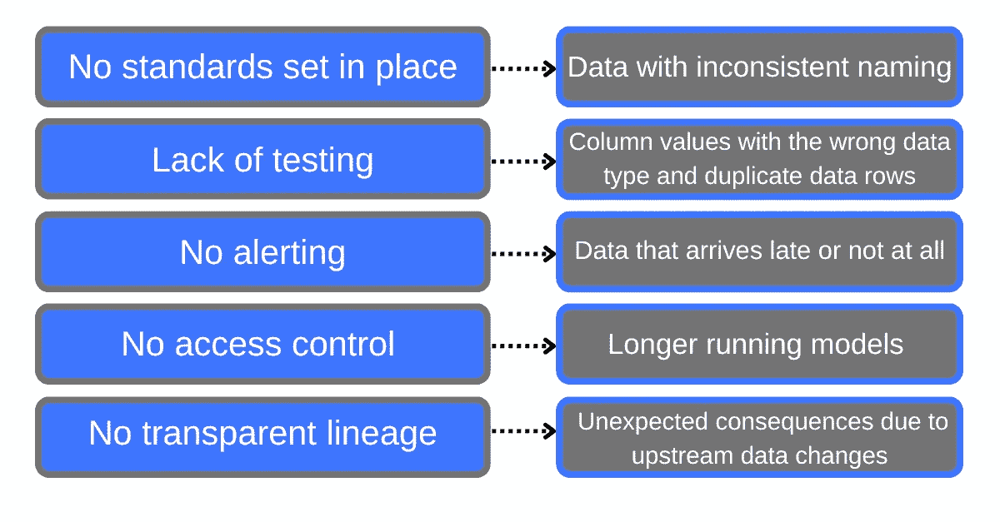
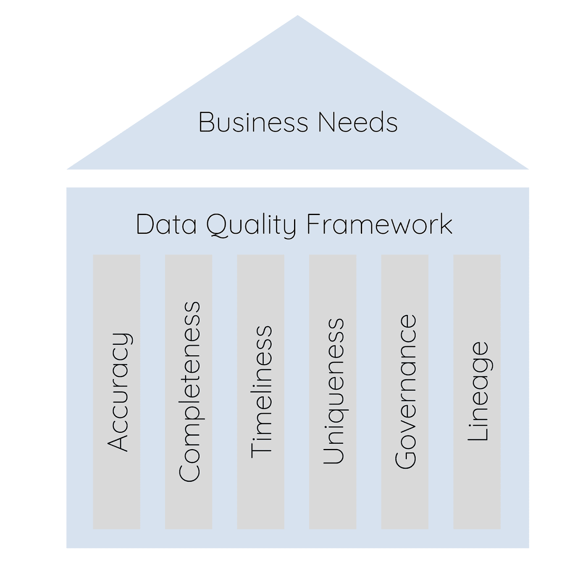
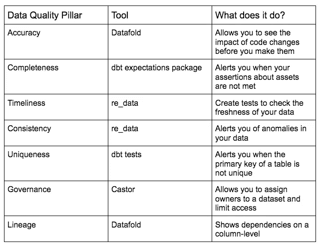

# 如何创建数据质量框架

> 原文：<https://towardsdatascience.com/how-to-create-a-data-quality-framework-6887dea268ae>

## 关于确定重点关注领域的逐步说明

照片由 [Unsplash](https://unsplash.com/s/photos/frame?utm_source=unsplash&utm_medium=referral&utm_content=creditCopyText) 上的[clément del Andrea](https://unsplash.com/@clementdellandrea?utm_source=unsplash&utm_medium=referral&utm_content=creditCopyText)拍摄

当您的数据比预期晚到达时会发生什么？或者一列中应该填充的值都是 NULL？像这样的数据质量问题通常是数据管道中出现问题的滞后指标。当它们发生时，损害已经造成，您需要找到一个解决方案来防止这些问题再次进入生产。

以下是一些常见的数据质量问题及其潜在原因:

作者图片

关注数据质量计划对于生成业务可依赖的数据至关重要。如果没有特定的工具和流程，您的数据将很难被信任。没有人会确切知道这些数据是否能带来准确的见解。如果你不能相信数据，你还能相信什么？

实施质量检查还将允许您减少花费在解决突然出现的问题上的时间。相反，你可以积极主动，在问题发生并扰乱工作流程之前*预见任何问题。强调数据质量的最佳方式是创建一个数据质量框架，供您的团队遵循。*

# 什么是数据质量框架？

数据质量框架是组织和数据团队定义不同数据质量特征的工具，以便他们能够致力于开发有助于改善这些特征的系统和过程。该框架关注数据质量的七个关键领域——准确性、完整性、及时性、唯一性、治理、沿袭和一致性。

**准确性**是指数据的实际值与其真实值的接近程度。与真实值相比，实际值的特征有意义吗？例如，信用卡号列是否像它应该的那样是 16 位数字？

**完整性**查看数据表中是否有缺失值。是否有缺少值的列或行？如果是，这是意料之中的吗？

**时效性**看你数据的新鲜程度。接收新数据的频率如何？当您的团队需要数据时，数据是否可用？

**唯一性**检查重复数据行。是否有两行具有相同的主键？他们的其他价值观相比如何？

**治理**指的是谁有权访问您的数据以及数据的安全性。每个人都应该拥有完成工作所需的最低访问权限。PII 数据应该对用户隐藏。您还希望确保您的数据符合您所在行业的法规。

**沿袭**跟踪数据从接收到编排的移动。理想情况下，您应该能够看到模型之间的依赖关系，以及源列是如何向下游转换的。

最后，**一致性**查看数据中的模式。您的数据每天都在同一时间被摄取和转换吗？或者这是变量？每周摄取的数据量相似吗？

# 为什么我应该创建一个数据质量框架？

数据质量框架允许您精确定位将对业务产生最大影响的质量领域。它遵循“80%的结果来自 20%的努力”的理念。当你花时间关注那些引起最多问题的领域时，你将对你的组织产生最大的影响。

框架让你更好地了解你所缺乏的领域。这也有助于您在投资数据质量方面获得支持，因为您将能够清晰、简明地向利益相关者展示您正在做的事情。一个框架允许你提出一个问题和一个解决方案，它可以帮助防止这个问题再次发生。

# 如何创建数据质量框架

那么，如何创建一个框架，让所有的数据质量计划都基于这个框架呢？让我们走一遍这些步骤。

1.  **记录您过去遇到的或怀疑将来会遇到的所有已知数据质量问题。**

想想你过去处理过的事件或遇到的问题。例如，如果您的数据管道在 3 周前出现故障，这将是您希望立即解决的问题。如果某一天某个表中的数据丢失了，您可能也想记录下来。

**2。将每一个分类为 7 个类别之一——准确性、完整性、及时性、唯一性、治理、沿袭和一致性。**

现在，您可能想重温一下我前面列出的不同数据质量支柱的描述。您列出的每个问题属于哪一类？管道故障属于及时性范畴，因为当天的数据交付较晚。表中缺失的数据属于完整性范畴。

**3。列出每一类，并把相应的项目放在下面。**

你要确保这些问题得到妥善组织。如果组织中的利益相关者或领导询问数据质量计划，这将为您提供一些演示材料。

**4。计算哪 3-4 个类别的商品数量最多。**

你需要将你的框架集中在拥有最多条目的类别上。这些是您的组织最头疼的问题。你 80%的进步将来自于关注这些。一旦你确定了这些，我建议你创建一个简单的图形来提醒自己什么是重要的。

作者图片

**5。在相应的类别下列出这些问题的潜在解决方案。**

这将帮助您为每个数据质量支柱定义一个总体目标。例如，测试可能对提高数据表的完整性和准确性很重要。我推荐头脑风暴潜在的工具，比如你想要实现的 [Datafold](https://www.datafold.com/) 和 [re_data](https://www.getre.io/) 来帮助每个支柱，并考虑不同类型的测试，比如 [dbt 测试](https://docs.getdbt.com/docs/build/tests)、 [dbt 期望](https://github.com/calogica/dbt-expectations)，甚至是定制的测试。

在创建解决方案时，系统与工具和测试同样重要。想想你的团队需要做什么来使这些计划成功。当出现问题时，您是否需要创建待命时间表或警报行动计划？

**6。细化每种解决方案，并列出每种解决方案成功所需完成的具体任务**

我建议在吉拉上创建这些特定的任务作为标签，这样它们就可以直接添加到 sprint 中。你希望它们足够详细，你可以指出它们，并立即开始实施。

**7。与利益相关者分享基本框架，让他们了解你在做什么以及为什么。**

最后，分享你做了什么！您这样做是为了产生每个人都可以依赖的高质量数据。请务必注意这一点！以利益相关者会感到兴奋的方式设计计划。例如，向我们的数据模型中添加测试将在某些东西损坏时提醒我们，允许我们在损坏之前修复您最喜欢的仪表板*。*

# 推荐工具

作者图片

# 结论

在创建数据质量框架时，您希望关注准确性、完整性、及时性、一致性、唯一性、治理和沿袭。牢记这些支柱的框架将有助于组织您的流程，并确保您正在执行的任务能够带来最佳结果。

幸运的是，有许多令人惊奇的工具使得产生高质量的数据变得更加容易。最大的障碍通常是弄清楚你需要做什么，以及哪些任务将对业务产生最大的影响。实现这种类型的框架永远不会太晚，即使您正在进行数据质量工作。

重组，重新组织，看你的数据质量飙升到新的高度！

更多关于产生高质量数据的信息，请查看我的免费每周[简讯](https://madisonmae.substack.com/)关于分析工程。

看看我的第一本电子书，[分析工程基础知识](https://madisonmae.gumroad.com/l/learnanalyticsengineering)，一本全方位的分析工程入门指南。