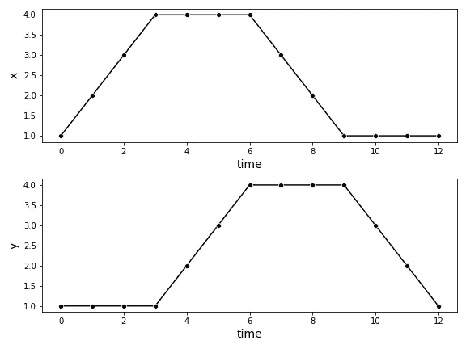
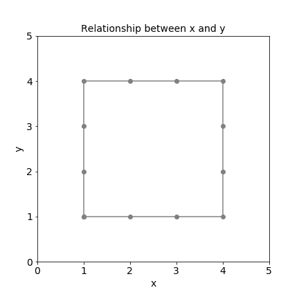
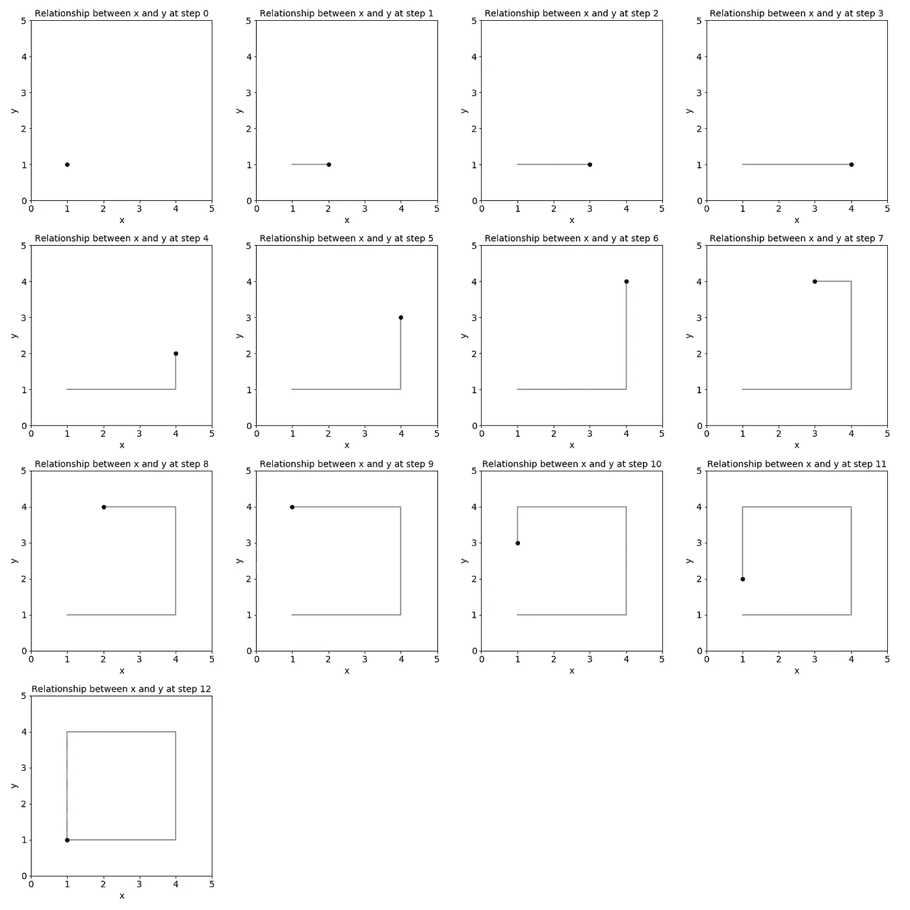
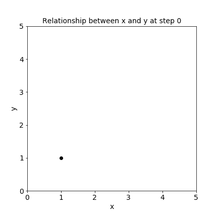
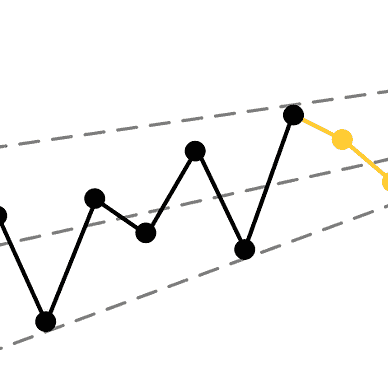

# 如何用 Python 从 Matplotlib 图创建 GIF

> 原文：<https://towardsdatascience.com/how-to-create-a-gif-from-matplotlib-plots-in-python-6bec6c0c952c>

## 基于 imageio 的二维时间序列数据可视化技术


用 Matplotlib 和 imageio 创建的 GIF(图片由作者提供)

我们都知道线图是可视化时间序列的最直观的方式。但是，如何可视化具有两个有关系的特征的时间序列，比如 x 和 y 坐标或经度和纬度？gif 是可视化二维时间序列数据的好方法。

> gif 是可视化二维时间序列数据的好方法。

让我们看看下面的例子。

```
x = [1, 2, 3, 4, 4, 4, 4, 3, 2, 1, 1, 1, 1]
y = [1, 1, 1, 1, 2, 3, 4, 4, 4, 4, 3, 2, 1]
time = [0, 1, 2, 3, 4, 5, 6, 7, 8, 9, 10, 11, 12
```

您可以首先用线图绘制一段时间内的每个要素。但是对于这种数据可视化，这两个特征之间的关系并不清楚。



两个独立时间序列的折线图(图片由作者提供)

接下来，你可以在 y 上绘制 x，这揭示了两个特征之间的关系。但是现在你错过了时间。



x 在 y 之上(图片由作者提供)

为了形象化两个特征和时间之间的关系，我们可以使用 GIF。

本教程将向你展示如何用 Python 通过三个简单的步骤快速创建 GIF。

# 如何用 Python 创建 GIF

你可以使用库 [Matplotlib](https://matplotlib.org/) 和 [imageio](https://imageio.readthedocs.io/en/stable/) 通过三个简单的步骤用 Python 创建 GIF:

1.  [创建一个函数，用](#7d88) [Matplotlib](https://matplotlib.org/) 绘制时间相关帧
2.  [绘制 GIF 的所有帧](#38ba)
3.  [用](#1cac)[图像](https://imageio.readthedocs.io/en/stable/)将这些帧组合成 GIF

对于本教程，我们将使用 [Matplotlib](https://matplotlib.org/) 来绘制 GIF 的单个帧，并使用 [imageio](https://imageio.readthedocs.io/en/stable/) 将单个帧组合成一个 GIF。

```
import matplotlib.pyplot as plt
import imageio
```

## 1.创建一个绘制时间相关帧的函数

首先，您将创建一个函数`create_frame(t)`,它在一个特定的时间戳绘制 GIF 的单个帧，并用一个惟一的名称保存它。

我建议设置参数`transparent = False`和`facecolor = 'white'`，以避免由于单个透明帧重叠而在 gif 中产生奇怪的效果。

```
def create_frame(t):
    fig = plt.figure(figsize=(6, 6)) plt.plot(x[:(t+1)], y[:(t+1)], color = 'grey' )
    plt.plot(x[t], y[t], color = 'black', marker = 'o' ) plt.xlim([0,5])
    plt.xlabel('x', fontsize = 14)
    plt.ylim([0,5])
    plt.ylabel('y', fontsize = 14)
    plt.title(f'Relationship between x and y at step {t}',
              fontsize=14) **plt.savefig(f'./img/img_{t}.png', 
                transparent = False,  
                facecolor = 'white'
               )** plt.close()
```

## 2.绘制 GIF 的所有框架

接下来，你要做的就是绘制 GIF 的所有帧。

```
for t in time:
    create_frame(t)
```



用 Matplotlib 绘制的 GIF 的所有单帧(图片由作者提供)

并将所有的单帧保存到一个名为`frames`的数组中。

```
frames = []for t in time:
    image = imageio.v2.imread(f'./img/img_{t}.png')
    frames.append(image)
```

## 3.将这些帧组合成一个 GIF

最后，您所要做的就是用`mimsave`方法将这些帧保存到 GIF 文件中。您可以使用`fps`参数调整 GIF 的每秒帧数(fps)。

```
imageio.mimsave('./example.gif', # output gif
                frames,          # array of input frames
                fps = 5)         # optional: frames per second
```

生成的 GIF 如下所示。


用 Matplotlib 和 imageio 创建的 GIF(图片由作者提供)

如果你想让 GIF 在最后一帧后停止，给`mimsave`方法添加参数`loop = 1`。

```
imageio.mimsave('./example.gif', 
                frames, 
                fps = 5, 
                **loop = 1**)
```



使用 Matplotlib 和 imageio 创建的 GIF，在最后一帧循环一次后停止(图片由作者提供)

# 结论

用线图可视化二维时间序列数据可能是无效的，因为它不能显示两个特征之间的关系。对于经度和纬度或 x 和 y 坐标这样的二维时间序列数据，使用 gif 是更好的数据可视化替代方法。

在这个简短的教程中，您学习了如何使用 Python 中的 [Matplotlib](https://matplotlib.org/) 和 [imageio](https://imageio.readthedocs.io/en/stable/) 创建 GIF，只需三个简单的步骤:

1.  [创建一个函数，用](#7d88) [Matplotlib](https://matplotlib.org/) 绘制时间相关帧
2.  [绘制 GIF 的所有帧](#38ba)
3.  [用](#1cac)[图像](https://imageio.readthedocs.io/en/stable/)将这些帧组合成 GIF

# 喜欢这个故事吗？

*这里收集了我的其他时间序列分析和预测文章:*


莉奥妮·莫尼加蒂

## 时间序列分析和预测

[View list](https://medium.com/@iamleonie/list/time-series-analysis-and-forecasting-ff223343e5b3?source=post_page-----6bec6c0c952c--------------------------------)6 stories

如果你想把我的新故事直接发到你的收件箱，请务必订阅[](https://medium.com/subscribe/@iamleonie)**！**

**成为媒介会员，阅读更多来自我和其他作家的故事。报名时可以用我的* [*推荐链接*](https://medium.com/@iamleonie/membership) *支持我。我将收取佣金，不需要你额外付费。**

*[](https://medium.com/@iamleonie/membership) [## 通过我的推荐链接加入 Medium—Leonie Monigatti

### 阅读 Leonie Monigatti(以及媒体上成千上万的其他作家)的每一个故事。您的会员费直接…

medium.com](https://medium.com/@iamleonie/membership) 

*在*[*Twitter*](https://twitter.com/helloiamleonie)*[*LinkedIn*](https://www.linkedin.com/in/804250ab/)*[*Kaggle*](https://www.kaggle.com/iamleonie)*！****