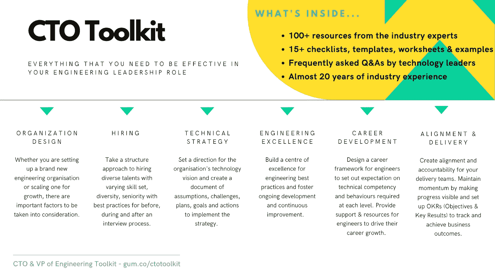

# 如何在科技公司创造学习文化

> 原文：<https://towardsdatascience.com/how-to-create-a-learning-culture-in-a-technology-company-801093837d50>

# 如何在科技公司创造学习文化

## 这里有三种建立学习型组织的有效方法

蒂姆·莫斯霍尔德在 [Unsplash](https://unsplash.com?utm_source=medium&utm_medium=referral) 上的照片

[HBR 强调](https://hbr.org/2021/09/who-is-driving-the-great-resignation)科技和医疗保健行业的辞职率最高，因为这些行业的员工在疫情期间经历了需求的极度增长，这可能会导致工作量增加和倦怠。

作为一个在过去 20 年里一直在科技行业工作的人，我当然可以看到近几个月来工作量、倦怠和辞职的趋势。另一方面，我看到许多员工调查强调，员工参与度和幸福感的提高与他们对自己职业发展的感受直接相关。

忘掉免费食物、乒乓球桌甚至在家工作的预算吧，你的员工真正想要的是他们的职业发展。因此，对于技术领导者和管理者来说，在他们的技术公司创造一种学习文化比以往任何时候都更加重要。在这篇文章中，我想和你分享三种建立学习型组织的有效方法:

1.  为经理提供工具和资源，帮助他们为直接下属制定个人发展计划
2.  在常规活动中整合学习机会，如冲刺规划、演示和一对一
3.  使用数据在整个公司范围内建立明确的投资和责任

# 1.为经理提供工具和资源，帮助他们为直接下属制定个人发展计划

虽然我非常相信个人要对自己的职业发展负责，但当他们的经理指导他们并支持他们的职业发展时，这总是有帮助的。这在个人和经理之间建立了信任关系，并增加了保留率。从[我的职业规划测试](https://eisabainyo.net/weblog/quiz/which-type-of-career-planner-are-you/)中，我知道一个事实，大多数软件工程师属于变色龙群体——那些不知道他们在职业生涯中想要什么的人。如果没有一个好的经理在职业生涯中辅导和指导他们，这些软件工程师最终只会因为对目前的工作感到厌倦和不满而跳槽。

[职业规划初学者工具包](https://gum.co/careerplanningkit)是工程经理可以得到的东西，以便开始采取行动，为他们的软件工程师提供职业发展机会。

如果您是一名工程经理，我希望您问问自己——在免费食物和乒乓球桌等办公室津贴不复存在的远程环境中，您如何让您的软件开发团队参与进来并保持高绩效？

嗯，答案很简单！投资于他们的职业发展。

如果你不确定从哪里开始，看看我为经理们制作的职业规划入门工具包。该入门套件包括—职业规划研讨会资料(如果您想为您的团队举办职业规划研讨会，还可提供额外的研讨会模板)和个人发展计划模板。

有了个人成长计划，每个员工都会知道他们需要获得什么技能，需要学习什么知识，需要进行什么活动。这反过来创造了一个学习型组织，因为每一个员工都在采取行动改善自己，造福公司。

# 2.在常规活动中整合学习机会，如冲刺规划、演示和一对一

我目睹的一个误解是，公司认为提供学习预算是创建学习型组织的解决方案。这与事实相去甚远，让我来解释一下原因。以我的经验，光靠学习预算是非常无效的。首先，一些人不知道它，因为这些信息没有被清楚地交流或重复共享。其次，许多人不使用它，因为他们不知道该学什么，或者他们在日常工作之外抽不出时间参加课程或培训。第三，那些利用学习预算来学习的人最终并没有为组织利用他们所学的东西。

那么，这里的解决方案是什么呢？公司停止提供学习预算了吗？绝对不行！解决方法是培养学习的应用。

作为一名工程经理，你可以通过在日常活动中整合学习机会来实现这一点，如冲刺规划、团队演示和一对一。让我们看一个实际的例子。在一家技术公司，有许多软件工程师，从毕业生到架构师都有。高级软件工程师和初级软件工程师的区别在于他们的影响力，更高的能力与更大的影响力相关。

常见的能力(按初级->高级的期望顺序排列)有:

*   专门技能
*   计划工作技能
*   评估技能
*   沟通技巧
*   利益相关者管理技能
*   影响技能
*   指导技能

让我们选择评估技能作为工程团队中少数软件工程师需要改进的技能。工程经理不应该要求软件工程师接受评估技能培训，而应该鼓励他们使用不同的评估技术。然后，在 sprint 回顾中，整个团队将对估计和实际花费的时间进行回顾，讨论如果它们相差很大，为什么会有差异，下次如何估计得更好，等等。每个人都在学习，但他们可能没有意识到，因为学习机会已经很好地融入了团队的常规活动中。

# 3.使用数据在整个公司范围内建立明确的投资和责任

一个组织要成为学习型组织，支持和承诺应该来自高层。为此，整个公司应该有明确的投资和责任。

对于一个学习型组织来说，有两种方法可以证明这种投资。首先，通过正式任命一个人或一组人来管理学习和发展计划，协调计划，并作为其角色的一部分拥有明确的责任和成功标准。

其次，围绕学习和发展设定 S.M.A.R.T(具体的、可衡量的、可实现的、现实的、有时限的)目标，并跟踪这些目标。实施与学习相关的部门级 OKRs(目标和关键结果)是跟踪进展的一个好方法。主要结果的几个例子是:

*   一年运送的实验数量
*   按年度使用的学习预算百分比
*   关于学习的季度调查问题的员工满意度得分。一个示例陈述可以是“我在上个季度学到了一些与我的职业目标一致的新东西”，并要求员工在 1-5 的范围内进行评分；1 是最不有利的，而 **5** 是最有利的。

基于数据的方法将确保对鼓励学习和发展的全公司计划进行投资，因为只有正确的计划才能帮助指标朝着正确的方向发展。

# 每个科技公司都应该体现一种学习文化

知识工作者，尤其是软件工程师，不仅仅是为了得到薪水而工作。他们来工作是为了很好地运用他们的技能，并接受智力挑战。对于软件工程师来说，没有比给他们有趣的问题来解决更好的智力挑战的方式了，通过与擅长他们工作的人一起工作来激励他们，最后但同样重要的是，给他们足够的机会来学习和发展他们的技能。

学习文化不仅会对员工的参与度和满意度产生积极影响，还会确保公司能够创新，并在这个不断变化和不断发展的技术环境中保持相关性。

## 首席技术官工具包——技术领导者的必备工具和资源

首席技术官工具包

你是一家科技公司的高级工程主管吗？你可能会对[的首席技术官工具包](https://gum.co/ctotoolkit)感兴趣。它包含面向以下领域的高级技术领导者的资源和工具:

📝技术战略
💡卓越工程
⛳️组织设计
👍招聘
☑️职业发展
🚀对准&交付

看看这个，我保证你会更有能力在你的科技公司建立学习文化。