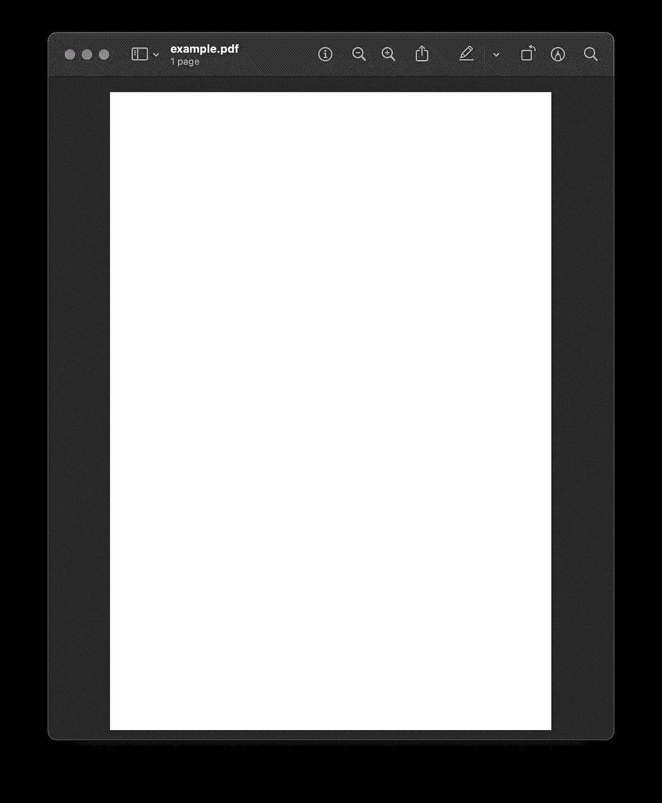
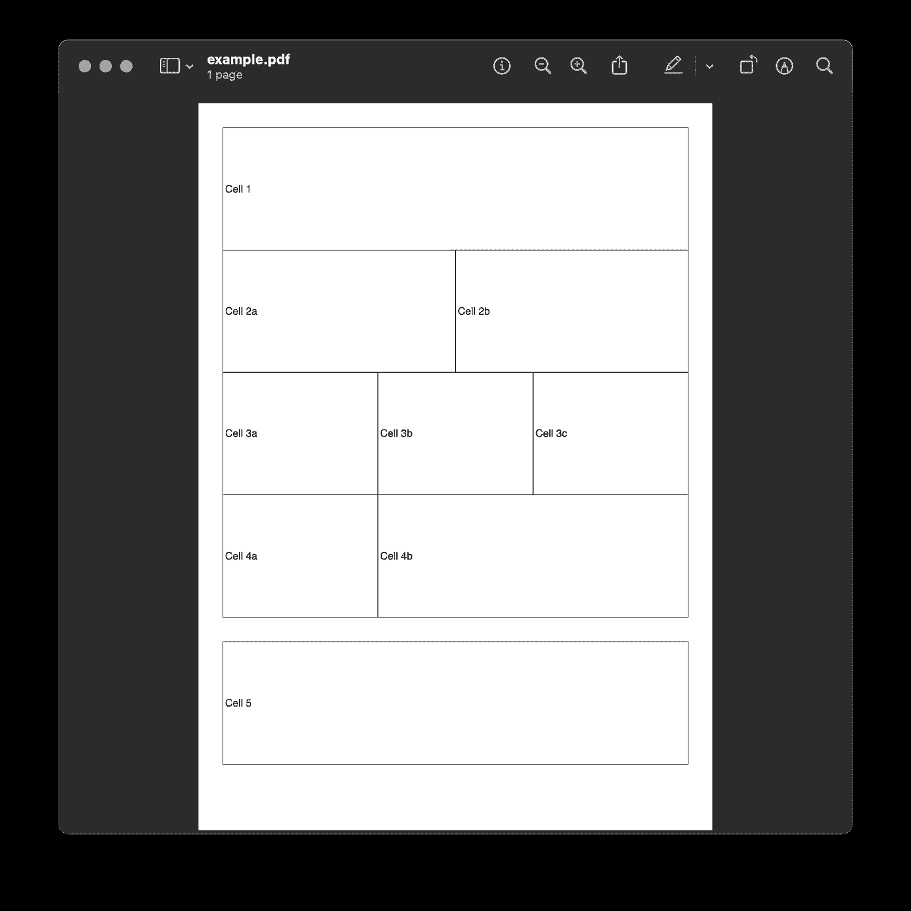
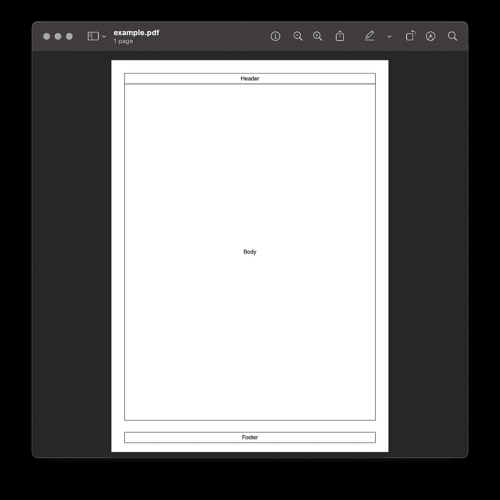
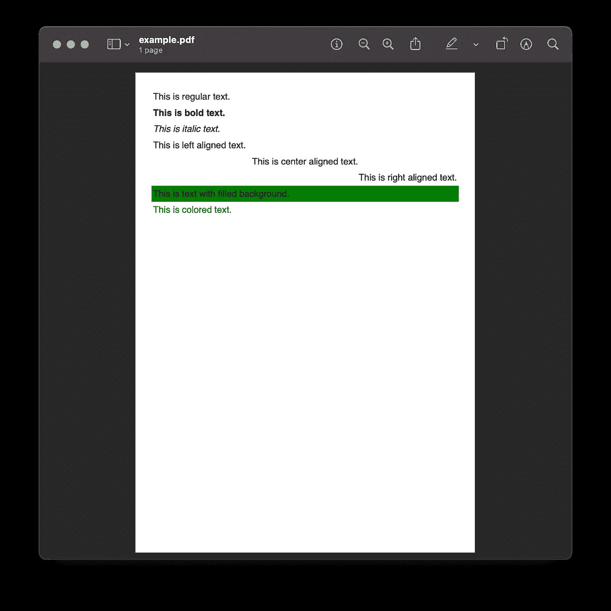
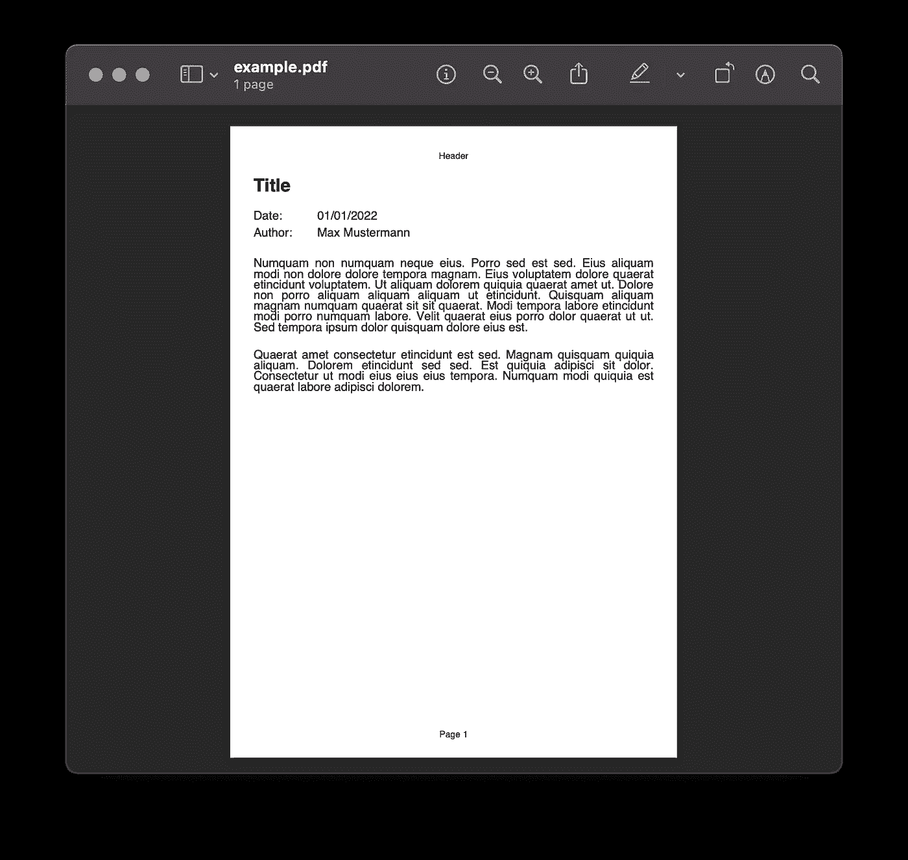
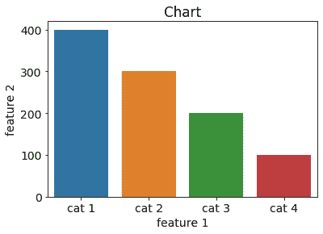
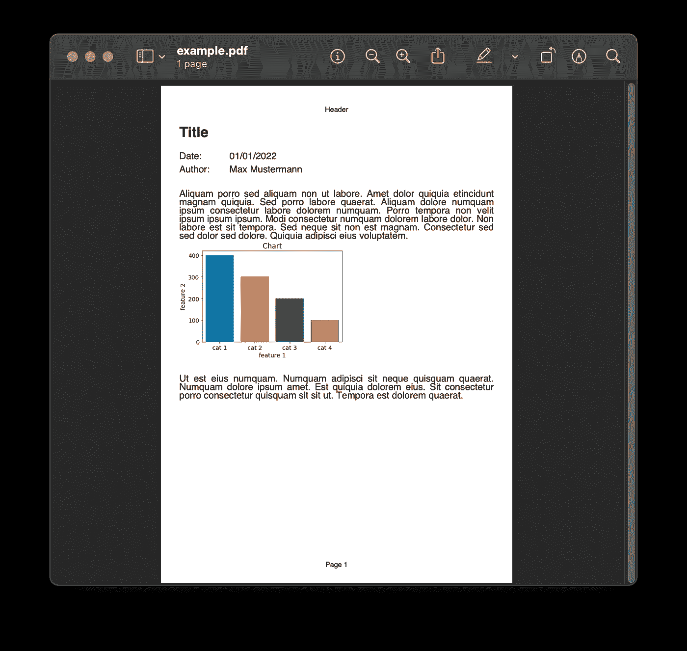

# 如何在 Python 中为您的数据分析创建 PDF 报告

> 原文：<https://towardsdatascience.com/how-to-create-a-pdf-report-for-your-data-analysis-in-python-2bea81133b>

## 作为数据分析的一部分，使用 FPDF 图书馆自动生成 PDF


使用 Python 和 FPDF 自动生成数据分析报告的 PDF(图片由作者提供)

一旦你完成了数据分析，你需要考虑如何传达结果。沟通一部分是决定您将以何种文件格式提供您的数据分析报告。我确信大多数利益相关者更喜欢 PDF 文件而不是 iPython 笔记本。

本文将讨论如何在数据分析工作流程中自动生成 PDF，包括:

*   [如何创建 PDF 文件](#2220) : [布局和放置文本](#9b3b)和[页眉页脚](#4aad)
*   [如何向 PDF 文件添加文本](#6619) : [样式文本](#607b)和[换行和分页符](#d470)
*   [如何将 Matplotlib 图作为图像添加到 PDF 文件中](#52e9)
*   [如何将熊猫数据帧作为表格添加到 PDF 文件中](#c1f8)

对于本教程，我们将使用`fpdf`库[1]。

```
from fpdf import FPDF
```

虽然**库没有被积极维护，并且自 2012 年** [1]以来没有更新过，但是它对于大多数用例来说都是简单易用的。如果您对 PDF 生成有更复杂的需求，您可以查看类似于 [PyPDF2](https://pypi.org/project/PyPDF2/) 、 [ReportLab](https://pypi.org/project/reportlab/) 或 [WeasyPrint](https://pypi.org/project/weasyprint/) 的替代方案。

# 如何创建 PDF 文件

用 Python 中的`fpdf`库[1]生成 PDF 非常简单。要创建一个空的 PDF 文档，您需要创建一个类`FPDF`的实例，添加一个空白页，并用下面三行代码保存它。

```
pdf = FPDF()
pdf.add_page()
pdf.output(f'./example.pdf', 'F')
```



用 Python FPDF 中的三行代码创建的空 PDF 文档(图片由作者提供)

**默认页面为纵向模式的 A4 格式，页边距为 1cm。**您可以使用`add_page()`方法的参数定义自定义页面配置。

## 布局和放置文本

接下来，让我们了解文档的布局。

您可以使用`cell()`方法添加文本单元格。为了展示最终的布局，我们将设置参数`border = 1`，它显示单元格的边框。当您实现所需的设计时，您可以将参数值设置回 0。

使用`w`和`h`参数，您可以定义文本单元格的宽度和高度。一个`w = 0`将产生一个横跨整个页面宽度的文本单元格。

`ln`参数定义了该单元格之后的位置:

*   0:在当前单元格的右侧
*   1:到下一行的开头
*   2:在当前单元格下方

要在单元格之间创建空间，可以使用`set_xy()`方法为下一个元素指定一个特定的位置，或者使用`ln()`方法创建垂直空间。

下面你可以看到一些单元格及其布局的例子。您可以通过单元格名称找到相应的代码。

```
# Margin
m = 10 
# Page width: Width of A4 is 210mm
pw = 210 - 2*MARGIN 
# Cell height
ch = 50pdf = FPDF()
pdf.add_page()
pdf.set_font('Arial', '', 12)pdf.cell(w=0, h=ch, txt=**"Cell 1"**, border=1, ln=1)pdf.cell(w=(pw/2), h=ch, txt=**"Cell 2a"**, border=1, ln=0)
pdf.cell(w=(pw/2), h=ch, txt=**"Cell 2b**", border=1, ln=1)pdf.cell(w=(pw/3), h=ch, txt=**"Cell 3a"**, border=1, ln=0)
pdf.cell(w=(pw/3), h=ch, txt=**"Cell 3b**", border=1, ln=0)
pdf.cell(w=(pw/3), h=ch, txt=**"Cell 3c"**, border=1, ln=1)pdf.cell(w=(pw/3), h=ch, txt=**"Cell 4a"**, border=1, ln=0)
pdf.cell(w=(pw/3)*2, h=ch, txt=**"Cell 4b"**, border=1, ln=1)pdf.set_xy(x=10, y= 220) # or use pdf.ln(50)
pdf.cell(w=0, h=ch, txt=**"Cell 5**", border=1, ln=1)pdf.output(f'./example.pdf', 'F')
```



创建包含单元格的 PDF 布局(图片由作者提供)

## 页眉和页脚

您还可以指定 PDF 文档中每页显示的页眉和页脚。为此，您需要在自定义类中覆盖`header()`和`footer()`方法。不要忘记使用自定义类的实例，而不是`FPDF`类。

```
# Custom class to overwrite the header and footer methods **class PDF(FPDF):**
    def __init__(self):
        super().__init__()
    **def header(self):**
        self.set_font('Arial', '', 12)
        self.cell(0, 10, 'Header', 1, 1, 'C')
    **def footer(self):**
        self.set_y(-15)
        self.set_font('Arial', '', 12)
        self.cell(0, 10, 'Footer', 1, 0, 'C')pdf = **PDF()** # Instance of custom class
pdf.add_page()
pdf.set_font('Arial', '', 12)
pdf.cell(w=0, h=255, txt = "Body", border = 1, ln = 1, align = 'C')pdf.output(f'./example.pdf', 'F')
```



用 Python 生成的 PDF 文档的页眉、正文和页脚(图片由作者提供)

# 如何向 PDF 文件添加文本

现在您已经了解了如何布局 PDF 文档，让我们用一些内容填充单元格。

## 样式文本

`fpdf`库为你提供了基本的文本样式:

*   使用`set_font()`方法，您可以设置字体、字体大小和强调(常规、粗体、斜体)。
*   在`cell`方法中，您可以用`align`参数定义文本对齐。
*   要填充单元格的背景，您需要用`set_fill_color()`方法定义一种颜色，并在`cell()`方法中定义`fill = True`。
*   要改变单元格文本的颜色，可以用`set_text_color()`方法定义一种颜色。

```
pdf = FPDF()
pdf.add_page()pdf.set_font('Arial', **''**, 16)
pdf.cell(w=0, h=10, txt="This is **regular** text.", ln=1)pdf.set_font('Arial', **'B'**, 16)
pdf.cell(w=0, h=10, txt="This is **bold** text.", ln=1)pdf.set_font('Arial', **'I'**, 16)
pdf.cell(w=0, h=10, txt="This is **italic** text.", ln=1)pdf.set_font('Arial', '', 16) # Reset text back to regularpdf.cell(w=0, h=10, txt="This is **left** aligned text.", ln=1,   
         **align='L'**)
pdf.cell(w=0, h=10, txt="This is **center** aligned text.", ln=1,
         **align='C'**)
pdf.cell(w=0, h=10, txt="This is **right** aligned text.", ln=1,
         **align='R'**)pdf.**set_fill_color**(r= 0, g= 128, b = 0)
pdf.cell(w=0, h=10, txt="This is text with **filled** background.", ln=1,
         **fill=True**)pdf.**set_text_color**(r= 0, g= 128, b = 0)
pdf.cell(w=0, h=10, txt="This is **colored** text.", ln=1)pdf.output(f'./example.pdf', 'F')
```



生成的 PDF 中不同样式的文本:左对齐、居中对齐、右对齐、粗体和斜体文本、字体和背景颜色(图片由作者提供)

## 分行符和分页符

如果你需要一段更长的文本，`cell()`方法是不够的，因为它不允许换行或分页，正如你在下面看到的。

为此，您应该使用`multi_cell()`方法，它可以处理换行符和分页符。

```
import lorem # Use this package to showcase long textspdf = FPDF()
pdf.add_page()
pdf.set_font('Arial', '', 16)pdf.cell(w=0, h=50, txt="This and the below cells are regular cells." , border=1, ln=1)pdf.cell(w=0, h=50, txt="Example: " + lorem.text(), border=1, ln=1)pdf.**multi_cell**(w=0, h=50, txt="This and the below cells are multi cells.", border=1, )pdf.**multi_cell**(w=0, h=5, txt="Example: " + lorem.text(), border=1, )pdf.output(f'./example.pdf', 'F')
```


对于带有换行符和分页符的较长文本，使用 multi_cells，而不是常规单元格(图片由作者提供)

## 模板

根据到目前为止您所学的一切，您现在可以创建一个简单的模板，如下所示。我们将在下面的例子中使用它。

```
# cell height
ch = 8class PDF(FPDF):
    def __init__(self):
        super().__init__()
    def header(self):
        self.set_font('Arial', '', 12)
        self.cell(0, 8, 'Header', 0, 1, 'C')
    def footer(self):
        self.set_y(-15)
        self.set_font('Arial', '', 12)
        self.cell(0, 8, f'Page {self.page_no()}', 0, 0, 'C')pdf = PDF()
pdf.add_page()
pdf.set_font('Arial', 'B', 24)
pdf.cell(w=0, h=20, txt="Title", ln=1)pdf.set_font('Arial', '', 16)
pdf.cell(w=30, h=ch, txt="Date: ", ln=0)
pdf.cell(w=30, h=ch, txt="01/01/2022", ln=1)
pdf.cell(w=30, h=ch, txt="Author: ", ln=0)
pdf.cell(w=30, h=ch, txt="Max Mustermann", ln=1)pdf.ln(ch)
pdf.multi_cell(w=0, h=5, txt=lorem.paragraph())pdf.ln(ch)
pdf.multi_cell(w=0, h=5, txt=lorem.paragraph())pdf.output(f'./example.pdf', 'F')
```



用 Python 生成的 PDF 模板(图片由作者提供)

对于下面的例子，我们将使用一个小的虚构数据集。

```
import pandas as pddf = pd.DataFrame(
          {'feature 1' : ['cat 1', 'cat 2', 'cat 3', 'cat 4'],
           'feature 2' : [400, 300, 200, 100]
          })
```


虚构数据集导入为熊猫数据帧(图片由作者提供)

# 如何将 Matplotlib 图作为图像添加到 PDF 文件中

除了文本，您可能需要在 PDF 报告中添加绘图。

要将图添加到 PDF 报告中，首先需要将 Matplotlib 图保存为图像(例如，PNG 文件)。

```
import matplotlib.pyplot as plt
import seaborn as snsfig, ax = plt.subplots(1,1, figsize = (6, 4))sns.barplot(data =  df, x = 'feature 1', y = 'feature 2')
plt.title("Chart")plt.**savefig**('./example_chart.png', 
           transparent=False,  
           facecolor='white', 
           bbox_inches="tight")
```



Matplotlib 绘图保存为 PNG 文件(图片由作者提供)

一旦您的 Matplotlib 绘图被保存为图像，您就可以使用`image()`方法将其添加到报告中。

```
pdf = PDF()
pdf.add_page()
pdf.set_font('Arial', 'B', 24)
pdf.cell(w=0, h=20, txt="Title", ln=1)pdf.set_font('Arial', '', 16)
pdf.cell(w=30, h=ch, txt="Date: ", ln=0)
pdf.cell(w=30, h=ch, txt="01/01/2022", ln=1)
pdf.cell(w=30, h=ch, txt="Author: ", ln=0)
pdf.cell(w=30, h=ch, txt="Max Mustermann", ln=1)pdf.ln(ch)
pdf.multi_cell(w=0, h=5, txt=lorem.paragraph())**pdf.image('./example_chart.png', 
          x = 10, y = None, w = 100, h = 0, type = 'PNG')**pdf.ln(ch)
pdf.multi_cell(w=0, h=5, txt=lorem.paragraph())pdf.output(f'./example.pdf', 'F')
```



用 Python 将 Matplotlib 绘图添加到 PDF 报告中(图片由作者提供)

# 如何将熊猫数据帧作为表格添加到 PDF 文件中

不幸的是，没有简单的方法可以用`FPDF`库将熊猫数据帧添加到 PDF 报告中。尽管将 pandas 数据帧作为表格添加到 PDF 报告需要一些简单的编码，但这也并不困难:通过使用带有`border=1`的`cell()`方法并有效利用`ln`参数，您可以迭代数据帧来创建表格。

```
pdf = PDF()
pdf.add_page()
pdf.set_font('Arial', 'B', 24)
pdf.cell(w=0, h=20, txt="Title", ln=1)pdf.set_font('Arial', '', 16)
pdf.cell(w=30, h=ch, txt="Date: ", ln=0)
pdf.cell(w=30, h=ch, txt="01/01/2022", ln=1)
pdf.cell(w=30, h=ch, txt="Author: ", ln=0)
pdf.cell(w=30, h=ch, txt="Max Mustermann", ln=1)pdf.ln(ch)
pdf.multi_cell(w=0, h=5, txt=lorem.paragraph())pdf.image('./example_chart.png', x = 10, y = None, w = 100, h = 0, type = 'PNG', link = '')pdf.ln(ch)
pdf.multi_cell(w=0, h=5, txt=lorem.paragraph())pdf.ln(ch)**# Table Header
pdf.set_font('Arial', 'B', 16)
pdf.cell(w=40, h=ch, txt='Feature 1', border=1, ln=0, align='C')
pdf.cell(w=40, h=ch, txt='Feature 2', border=1, ln=1, align='C')****# Table contents
pdf.set_font('Arial', '', 16)
for i in range(0, len(df)):
    pdf.cell(w=40, h=ch, 
             txt=df['feature 1'].iloc[i], 
             border=1, ln=0, align='C')
    pdf.cell(w=40, h=ch, 
             txt=df['feature 2'].iloc[i].astype(str), 
             border=1, ln=1, align='C')**pdf.output(f'./example.pdf', 'F')
```


熊猫数据框架作为 Python 中的表格添加到 PDF 报告中(图片由作者提供)

从技术上讲，你也可以[将你的 pandas DataFrame 转换成 Matplotlib 表格，将其保存为图像，并将该表格作为图像插入 PDF](https://stackoverflow.com/questions/33155776/export-pandas-dataframe-into-a-pdf-file-using-python) 。但我试过了，所以你不必这样做:它不是很漂亮。

# 结论

尽管批评家说有比`fpdf`库更好的选择，但它使用起来很简单。

本文向您展示了:

*   [如何创建 PDF 文件](#2220) : [布局和放置文本](#9b3b)和[页眉和页脚](#4aad)
*   [如何向 PDF 文件添加文本](#6619) : [样式文本](#607b)和[换行和分页符](#d470)
*   [如何将 Matplotlib 图作为图像添加到 PDF 文件中](#52e9)
*   [如何将熊猫数据帧作为表格添加到 PDF 文件中](#c1f8)

下面您可以复制生成以下 PDF 的模板代码，并根据您的需要进行调整。


# 喜欢这个故事吗？

*如果你想把我的新故事直接发到你的收件箱，* [*订阅*](https://medium.com/subscribe/@iamleonie) *！*

*成为媒介会员，阅读更多其他作家和我的故事。报名时可以用我的* [*推荐链接*](https://medium.com/@iamleonie/membership) *支持我。我将收取佣金，不需要你额外付费。*

[](https://medium.com/@iamleonie/membership) [## 通过我的推荐链接加入 Medium—Leonie Monigatti

### 阅读 Leonie Monigatti(以及媒体上成千上万的其他作家)的每一个故事。您的会员费直接…

medium.com](https://medium.com/@iamleonie/membership) 

*在* [*上找我*](https://twitter.com/helloiamleonie)*[*LinkedIn*](https://www.linkedin.com/in/804250ab/)*[*ka ggle*](https://www.kaggle.com/iamleonie)*！***

# **参考**

**[1]“Python 的 FPDF”，“[PyFPDF](https://pyfpdf.readthedocs.io/en/latest/index.html)”[https://pyfpdf.readthedocs.io/en/latest/](https://pyfpdf.readthedocs.io/en/latest/)(2022 年 10 月 22 日访问)**