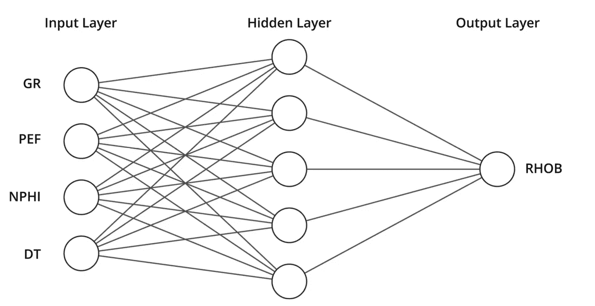
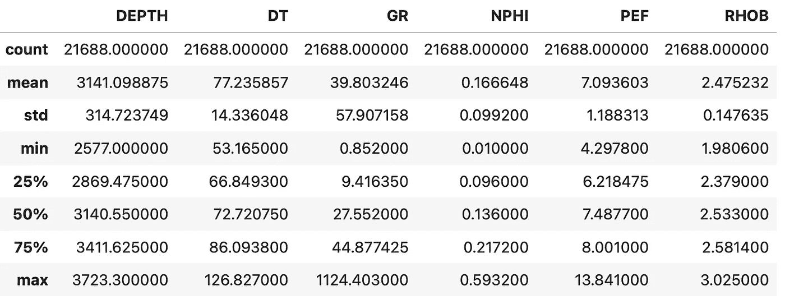
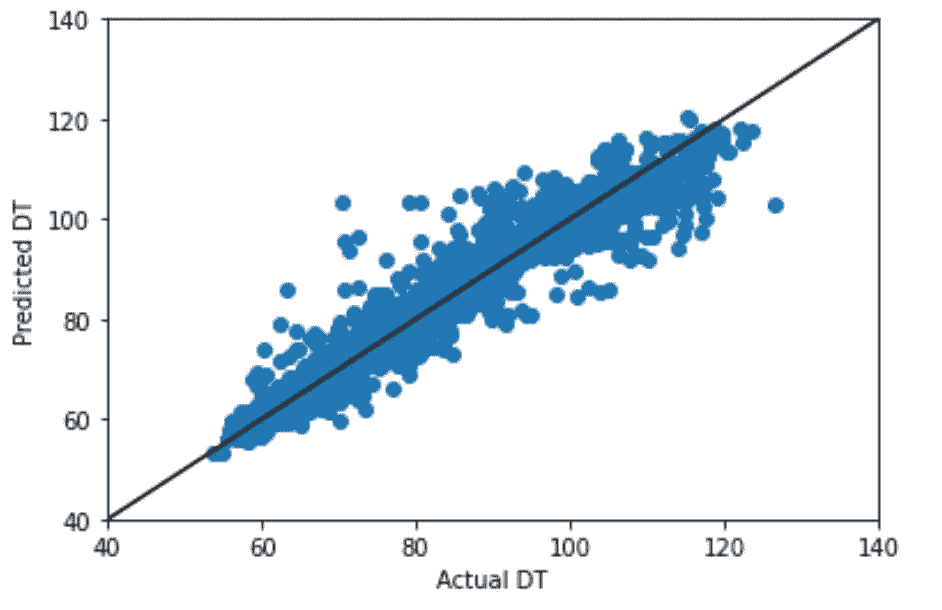
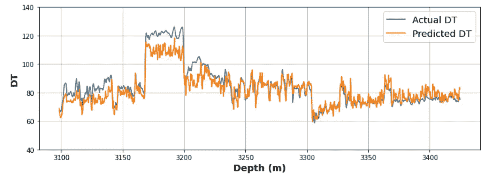

# 如何用 Python 创建一个简单的神经网络模型

> 原文：<https://towardsdatascience.com/how-to-create-a-simple-neural-network-model-in-python-70697967738f>

## 用 Scikit 建立一个简单的神经网络——学习预测测井测量


图片由[皮克斯拜](https://pixabay.com//?utm_source=link-attribution&utm_medium=referral&utm_campaign=image&utm_content=4430786)的 Gerd Altmann 提供

神经网络是一种流行的(大部分)监督机器学习算法。它们可以用于模拟各种复杂的任务，如图像处理、欺诈检测、语音处理等。这些算法可以应用于基于回归的问题以及基于分类的问题。

在岩石物理学和地球科学中，我们可以使用神经网络来预测缺失的测井测量值，创建合成曲线或从离散采样数据创建连续曲线。

在本文中，我将向您展示如何使用[**scit kit-learn**](https://scikit-learn.org/stable/index.html)创建一个简单的 [**人工神经网络模型**](https://scikit-learn.org/stable/modules/generated/sklearn.neural_network.MLPRegressor.html?highlight=mlpregressor#sklearn.neural_network.MLPRegressor) 。我们将把该模型应用于预测测井测量值的任务中，而测井测量值通常在油井测量值中不存在。

# 什么是人工神经网络？

神经网络，或有时被称为人工神经网络(ANN ),是由一系列功能形成的，这些功能是受人脑解决问题的方式的启发。

给定一个已知的目标变量和一系列已知的输入，它们“学习”，或者更确切地说，被训练来识别数据中的模式。人工神经网络由包含节点的多层组成。

通常有:

*   单个输入图层，其中包含模型接受训练和应用的要素
*   存在于输入层和输出层之间的多个隐藏层，可以是单层或多层
*   单一输出层，包含我们的目标变量



一种单层神经网络模型，采用多个测井测量值并预测单个连续目标变量。图片作者——麦克唐纳(2022)。

如果你想更多地了解人工神经网络是如何工作的，我建议你阅读下面的文章。

[](https://www.ibm.com/cloud/learn/neural-networks)  

# 使用 Scikit-Learn 在 Python 中实现人工神经网络

## 导入 Python 库

在我们开始我们的人工神经网络 python 教程之前，我们首先需要导入我们将要需要的库和模块。

*   [**熊猫**](https://pandas.pydata.org/) :用于从 CSV 文件加载数据
*   [**matplotlib**](https://matplotlib.org/) :用于创建数据的图形

然后，从 [**Scikit-Learn** ，](https://scikit-learn.org/stable/index.html)我们将导入以下模块:

*   [**train _ test _ split**](https://scikit-learn.org/stable/modules/generated/sklearn.model_selection.train_test_split.html)**from**model _ selection:**用于将我们的数据拆分成训练和验证数据集**
*   **[**来自**神经网络**的 MLPRegressor**](https://scikit-learn.org/stable/modules/generated/sklearn.neural_network.MLPRegressor.html?highlight=mlpregressor#sklearn.neural_network.MLPRegressor) :这是我们将要使用的神经网络算法**
*   **[**来自**预处理**的标准缩放器**](https://scikit-learn.org/stable/modules/generated/sklearn.preprocessing.StandardScaler.html?highlight=standard+scaler#sklearn.preprocessing.StandardScaler) :用于标准化我们的数据，使它们具有相似的缩放比例**
*   **[**指标**](https://scikit-learn.org/stable/modules/classes.html?highlight=metrics#module-sklearn.metrics) :用于评估我们的模型性能**

# **加载测井数据**

## **数据源**

**本教程中使用的数据是 Equinor 在 2018 年发布的 Volve 数据集的子集。数据集的全部细节，包括许可证可以在下面的链接中找到。**

**[](https://www.equinor.com/energy/volve-data-sharing)  

Volve 数据许可证基于 CC BY 4.0 许可证。许可协议的全部细节可以在这里找到:

[https://cdn . sanity . io/files/h 61 q 9 gi 9/global/de 6532 f 6134 b 9 a 953 f 6 c 41 BAC 47 a 0 c 055 a 3712d 3 . pdf？equinor-hrs-许可-数据-volve 的条款和条件. pdf](https://cdn.sanity.io/files/h61q9gi9/global/de6532f6134b9a953f6c41bac47a0c055a3712d3.pdf?equinor-hrs-terms-and-conditions-for-licence-to-data-volve.pdf)

## 使用 Pandas 加载测井数据

一旦库被导入，我们可以继续导入我们的数据。这是通过调用`pd.read_csv()`并传入原始数据文件的位置来完成的。

由于 CSV 文件包含许多列，我们可以将一个名称列表传递给`usecols`参数，因为我们只想在本教程中使用一小部分内容。

# 数据预处理

在通过机器学习算法运行数据之前，对数据进行预处理的工作流程会有所不同。在本教程中，我们将:

*   删除丢失的值
*   将数据分成训练、验证和测试数据集
*   标准化每次测量的数值范围

## 删除丢失的值

缺失数据是我们在处理真实世界数据时面临的最常见问题之一。它可能由于各种原因而丢失，包括:

*   传感器误差
*   人为误差
*   处理错误

有关识别和处理缺失数据的更多信息，您应该阅读以下文章:

[](/identifying-and-handling-missing-well-log-data-prior-to-machine-learning-5fa1a3d0eb73)  

对于本教程，我们将删除包含缺失值的行。这被称为列表式删除，是处理缺失值的最快方法。然而，这样做减少了可用数据集的大小，并且在进行机器学习模型之前，应该完全理解丢失值的原因和程度。

为了删除丢失的值，我们可以使用 pandas `dropna()`函数，并将其赋回给`df` (dataframe)变量。

## 将数据分为训练、测试和验证数据集

在进行机器学习时，我们经常将数据分成多个子集进行训练、验证和测试。

需要注意的一点是，测试和验证数据集的术语可能因文章、网站和视频而异。这里使用的定义说明如下:


将数据分为训练、验证和测试的示例。图片由作者提供，来自麦当劳，2021。

**训练数据集:**用于训练模型的数据

**验证数据集:**用于验证模型和调整参数的数据。

**测试数据集:**留出的数据，用于在看不见的数据上测试最终模型。这个子集使我们能够了解我们的模型能够多好地概括新数据。

对于本教程，我们的数据集包含 3 个独立的井。因此，我们将分离出一个(15/9-F-1 B)作为我们的测试数据集。这通常被称为盲试井。另外两口井将用于训练、验证和调整我们的模型。

一旦创建了这些列表，我们就可以为子集创建两个新的数据帧。这通过检查列表中的井是否在主数据框(`df`)内来实现。

一旦我们运行了上面的代码，我们就可以使用`describe()`方法查看子集的统计数据。

```
train_val_df.describe()
```



训练和验证子集的数据框架统计，包含来自 Volve 油田的两个井的数据。图片由作者提供。

我们可以看到，我们有 21，6888 行数据来训练和验证我们的模型。

我们可以用测试数据集重复这一过程:

```
test_df.describe()
```


包含 Volve 油田一口井数据的测试子集的数据框架统计。图片由作者提供。

## 创建训练和验证子集

下一步是将我们的`train_val_df`进一步细分为训练和验证子集。

为了做到这一点，我们首先将我们的数据分成我们将用于**训练(X)** 和我们的**目标特征(y)的特征。**然后我们调用`train_test_split()`函数来分割我们的数据。

在这个函数中，我们传递 X 和 y 变量，以及用于指示我们想要多大的测试数据集的参数。这是作为十进制值输入的，范围在 0 和 1 之间。

在这种情况下，我们使用 0.2，这意味着我们的测试数据集将是原始数据的 20%，我们的训练数据集将是原始数据的 80%。

## 标准化价值观

当使用不同比例和范围的测量时，标准化它们是很重要的。这有助于减少模型训练时间，并减少对依赖基于距离的计算的模型的影响。

标准化数据本质上包括计算特征的平均值，从每个数据点中减去它，然后除以特征的标准偏差。

在[**scikit-learn**](https://scikit-learn.org/stable/index.html)**中，我们可以使用[**standard scaler**](https://scikit-learn.org/stable/modules/generated/sklearn.preprocessing.StandardScaler.html)类来转换我们的数据。**

**首先，我们使用训练数据来拟合模型，然后使用`fit_transform`函数对其进行转换。**

**当涉及到验证数据时，我们不想让 StandardScaler 适应这些数据，因为我们已经这样做了。相反，我们只是想应用它。这是使用`transform`方法完成的。**

# **建立神经网络模型**

## **训练模型**

**为了开始神经网络训练过程，我们首先必须创建一个我们在开始时导入的`MLPRegressor`的实例。**

**当我们调用`MLPRegressor`时，我们可以指定许多参数。你可以在这里 **了解更多关于这些 [**的信息。**但是，在本教程中，我们将使用:](https://scikit-learn.org/stable/modules/generated/sklearn.neural_network.MLPRegressor.html?highlight=mlpregressor#sklearn.neural_network.MLPRegressor)****

*   ****hidden_layer_sizes** :控制网络的架构。**
*   ****激活**:隐藏层激活功能。**
*   ****random_state** :当使用整数时，这允许模型创建可重复的结果，并控制权重和偏差的随机数生成。**
*   ****max_iter** :控制如果事先不满足收敛性，模型将进行的最大迭代次数。**

**初始化模型后，我们可以使用`fit()`用训练数据训练我们的模型，然后使用`predict`方法进行预测**

## **验证模型结果**

**既然我们的模型已经被训练，我们可以开始在我们的验证数据集上评估模型的性能。**

**在这个阶段，我们可以调整和优化我们的模型。**

**我们可以使用多种统计方法来衡量模型的表现。在本教程中，我们将使用以下三个指标:**

****平均绝对误差(MAE):** 提供预测值和实际值之间绝对差异的测量。**

****

****均方根误差(RMSE):** 表示预测误差的大小。**

**要使用 scikit-learn 计算 RMSE，我们首先需要计算均方误差，然后求它的平方根，这可以通过将`mse`提高到 0.5 的幂来实现。**

****

****相关系数(R2):** 表示自变量和因变量之间的关系强度。值越接近 1，关系越强。**

**我们可以按如下方式计算上述指标:**

**当我们执行上面的代码时，我们得到下面的结果。根据这些数字，我们可以确定我们的模型是否表现良好，或者是否需要调整，**

****

**验证数据预测的度量值。图片由作者提供。**

## **超越度量标准**

**像上面这样的简单指标是查看模型表现的好方法，但是您应该总是检查实际数据。**

**一种方法是使用散点图，x 轴表示验证数据，y 轴表示预测数据。为了帮助观想，我们可以添加一条一对一的关系线。**

**完成这项工作的代码如下。**

**当我们运行上面的代码时，我们得到了下面的图，它显示了我们在实际测量和预测结果之间有一个相当好的趋势。**

****

**Volve 数据集的实际声波压缩慢度值与预测值。图片由作者提供。**

# **在看不见的数据上测试模型**

**一旦我们最终确定了我们的模型，我们就可以用我们为盲测留出的数据来测试它了。**

**首先，我们将创建用于应用模型的特征。然后，我们将应用我们之前创建的 StandardScaler 模型来标准化我们的价值观。**

**接下来，我们将为预测数据的数据框架分配一个新列。**

**预测完成后，我们可以查看与上面相同的散点图。**

**在岩石物理学和地球科学中，我们经常查看测井图上的数据，其中测量值是相对于深度绘制的。我们可以创建一个简单的预测结果和测试井内实际测量值的对数图，如下所示。**

**这将返回以下图。**

**我们可以看到，我们的模型在看不见的数据上表现很好，但是，有几个方面的结果与真实测量值不匹配。特别是在 3100 米和 3250 米之间**

**这告诉我们，我们的模型可能没有足够的涵盖这些区间的训练数据，因此，如果数据可用，我们可能需要获取更多的数据。**

****

**预测测量值与实际测量值的线图(对数图)。图片由作者提供。**

**如果您想了解该模型与随机森林模型的结果相比如何，请查看下面的文章:**

**[](/random-forest-regression-for-continuous-well-log-prediction-61d3ec1c683a)  

# 摘要

人工神经网络是一种流行的机器学习技术。在本教程中，我们介绍了一种非常快速简单的方法来实现预测声波压缩慢度的模型，从而产生合理的结果。我们还看到了如何验证和测试我们的模型，这是这个过程的一个重要部分。

在 Python 中建立神经网络还有许多其他方法，例如 Tensorflow 和 Keras，然而，Scitkit-learn 提供了一个快速且易于使用的工具来立即开始。** 

***感谢阅读。在你走之前，你一定要订阅我的内容，把我的文章放到你的收件箱里。* [***你可以在这里做！***](https://andymcdonaldgeo.medium.com/subscribe)**或者，您也可以* [***注册我的简讯***](https://fabulous-founder-2965.ck.page/2ca286e572) *免费将更多内容直接发送到您的收件箱。****

***其次，你可以通过注册成为会员来获得完整的媒介体验，并支持我和成千上万的其他作家。每月只需花费你 5 美元，你就可以接触到所有精彩的媒体文章，也有机会通过写作赚钱。如果你用 [***我的链接***](https://andymcdonaldgeo.medium.com/membership) ***，*** *报名，你直接用你的一部分费用支持我，不会多花你多少钱。如果你这样做了，非常感谢你的支持！****

# ***参考***

***McDonald，A. (2021)“岩石物理机器学习模型的数据质量考虑。”*岩石物理学*62(2021):585–613。https://doi.org/10.30632/PJV62N6-2021a1***

***McDonald，A. (2022)“缺失数据对基于岩石物理回归的机器学习模型性能的影响。”论文发表于 SPWLA 第 63 届年度测井研讨会，挪威斯塔万格，2022 年 6 月。https://doi.org/10.30632/SPWLA-2022-0125*****