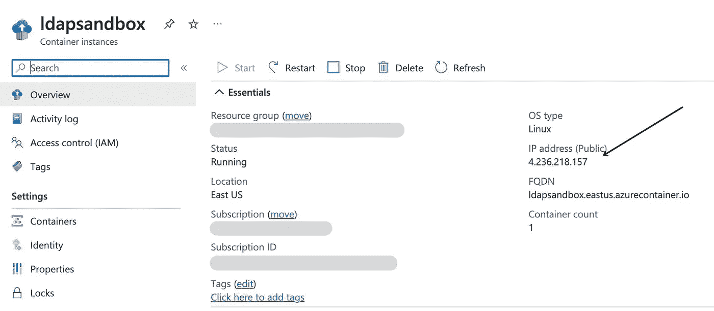
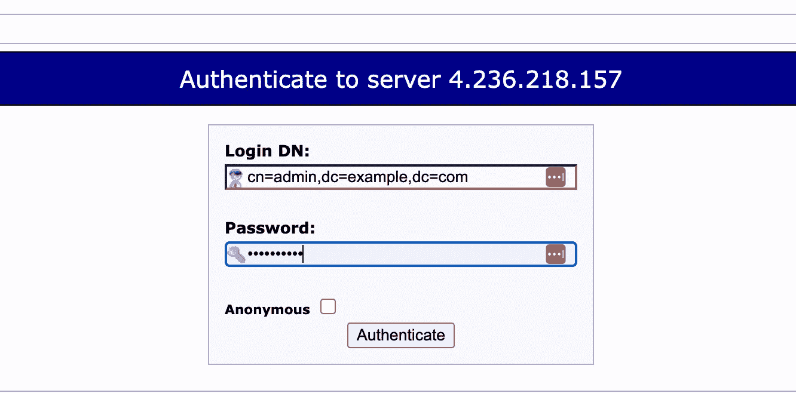
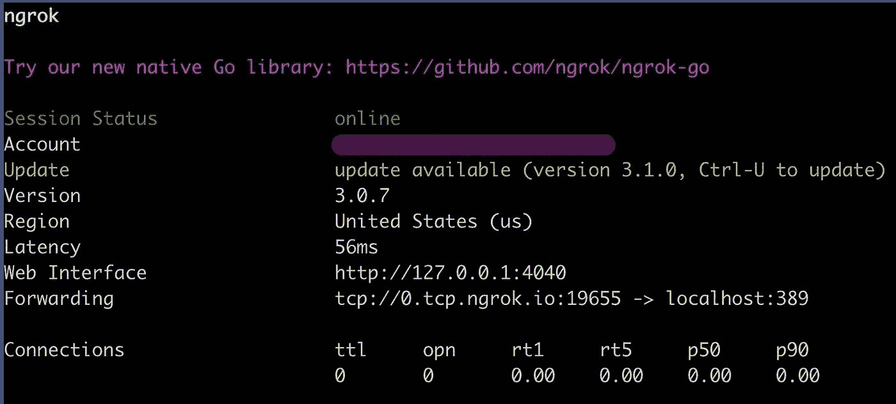
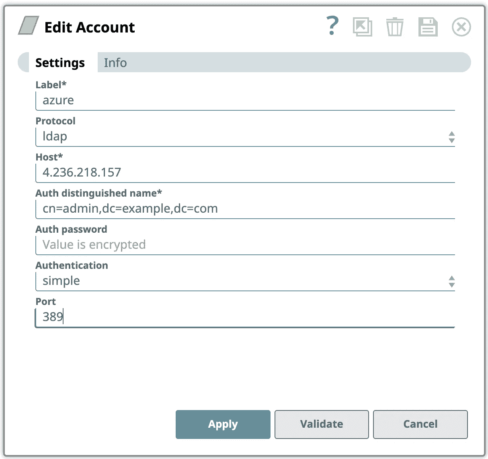

# 如何为管道测试创建 LDAP 沙箱

> 原文：<https://towardsdatascience.com/how-to-create-an-ldap-sandbox-for-pipeline-testing-644b01478dd>

## 在本地或云中使用 Docker 容器


劳拉·奥克尔在 [Unsplash](https://unsplash.com/s/photos/gears?utm_source=unsplash&utm_medium=referral&utm_content=creditCopyText) 上的照片

许多公司使用 LDAP 或轻量级目录访问协议来存储有关员工的信息，并允许员工根据他们各自的角色访问组织资源。微软的 Active Directory (AD)是使用这种协议的最著名的数据库。

在最近的一个数据工程项目中，一个客户需要创建一个管道，以便向其内部 AD 批量添加新员工，并根据各种独特的因素为这些新员工分配角色、用户名和其他属性。在进行项目时，我需要一些方法来测试我正在进行的工作。但是由于安全原因，客户端不允许访问 AD 服务器，即使他们可以，服务器也在使用中，不是一个好的测试平台。

为了创建这个管道的测试沙箱，我使用了:

*   Docker 和云服务，在我的例子中是 T4 Azure T5。除了云服务，我还可以对我的本地机器使用隧道服务。
*   与服务器交互的界面
*   一个管道集成平台，在我的例子中是 [SnapLogic](https://www.snaplogic.com/)

下面是我创建沙箱的步骤，显示了几个不同的选项。

# 从 Docker 映像创建 LDAP 服务器

[OpenLDAP](https://www.openldap.org/) 是 LDAP 的开源实现，我使用 [osixia/openldap](https://github.com/osixia/docker-openldap) docker 映像运行它。(查看文档的链接。)

## 选项 1:将其作为 Azure 容器实例运行

我首先需要一个 Azure 帐户，并在我的计算机上安装 Azure CLI。然后，我在终端中运行以下命令:

当创建容器时，它出现在资源组的容器实例中的 Azure 门户中。注意右栏中 Azure 是如何给容器分配一个公共 IP 地址的。



## 选项 2:在本地机器上运行容器

你可能没有订阅 Azure 或其他云服务，或者你可能更喜欢在本地运行容器。在我的 Mac 上安装了 docker 之后，我创建了一个 docker 容器，其中的命令与上面 Azure 的命令相同。

LDAP 服务器使用端口 389，因此需要包含在`-p`标志中。有时也使用端口 636。

# 将接口连接到 LDAP 服务器

## 选项 1:在 docker 容器中启动接口

根据其[主页](https://phpldapadmin.sourceforge.net/wiki/index.php/Main_Page)，“phpLDAPadmin 是一个基于 web 的 LDAP 客户端。它为您的 LDAP 服务器提供了简单、随处可访问的多语言管理。”和 OpenLDAP 服务器一样，这个客户机作为 docker 映像存在；它位于 [osixia/phpldapadmin](https://github.com/osixia/docker-phpLDAPadmin) 。

有了这个映像，我将在本地创建容器，但是我将把它连接到服务器的 Azure 实例。注意我是如何在环境变量中包含 Azure 为 LDAP 服务器容器创建的 IP 地址的。

客户机容器使用端口 443，映像文档说要将其映射到端口 6443。当它启动并运行时，我可以通过`localhost:6443`访问客户端。我看到一个登录页面。



我使用在 Azure 上为登录凭证创建服务器时定义的环境变量。然而，请注意，登录用户名不仅仅是`admin`。我需要管理员的识别名，在本例中是`cn=admin,dc=example,dc=com`，在一个环境变量中，我将密码定义为`pass_word`。

登录后，我可以创建示例用户帐户、组织单位和其他对象。

## 选项 2:创建一个到本地主机的隧道

如果我选择执行上面的选项 2，在本地机器上创建容器，我可以将本地服务器连接到本地客户机接口容器，但是请记住，最终我希望将 LDAP 服务器连接到数据集成平台，而该平台位于云中。为了让从云到我的本地机器上的服务器的连接工作，我必须弄清楚如何绕过防火墙，处理可能改变的 IP 地址，以及其他令人头痛的问题。

创建隧道更容易，一个名为 [ngrok](https://ngrok.com/) 的服务允许我这样做。当我注册时，我获得了一个免费的活动隧道，一旦 ngrok 代理安装到我的计算机上，我就可以运行:

```
ngrok tcp 389
```

这告诉 ngrok 创建一个到端口 389 的 TCP 连接，该连接在本地主机上映射到服务器容器。(你需要使用 TCP 协议而不是 HTTP，因为 LDAP 使用 TCP。)Ngrok 会在终端中生成一个类似这样的页面。



注意转发行，其中一个 URL 被转发到我的 localhost:389。该 URL 将在下一步中使用。

另一行需要注意的是 web 界面在 [http://127.0.0.1:4040](http://127.0.0.1:4040) 。Ngrok 允许您监视该地址的隧道，但是要使它工作，您还需要在创建容器时发布端口 4040。

同样，我需要一个接口来与 LDAP 服务器交互。我可以再次使用 phpLDAPadmin，但这一次为了展示另一种可能性，我将使用[Apache Directory Studio](https://directory.apache.org/studio/)LDAP 浏览器，它可以免费下载用于 Windows、Mac 和 Linux。

安装后，我可以转到“连接”窗格并创建一个新连接。在网络参数面板中，我输入由 ngrok 创建的 URL 及其相关的 ngrok 端口号(*而不是*端口 389)。


在 Authentication 面板中，我将输入与上面第一个选项相同的识别名和密码。当连接通过身份验证后，我可以开始向服务器添加条目。

# 将管道连接到 LDAP 服务器

如前所述，我将 SnapLogic 用于我的管道。为了与服务器交互，我必须在平台中使用正确的凭证添加我的帐户。

如果我使用运行在 Azure 容器上的服务器执行选项 1，我需要添加由 Azure 创建的 URL 以及标准 LDAP 端口 389 和管理员的识别名和密码。



如果我使用在我的机器上本地运行的服务器执行选项 2，我需要添加 ngrok 隧道的 URL、它的端口以及管理员的识别名和密码。


这应该可以了。我提供了几种不同的选择。无论我选择哪一个，我的沙盒都准备好了。

# 额外收获:添加自定义模式

OpenLDAP 带有标准的对象类，但是如果您需要带有自定义属性的对象类，您将不得不添加您自己的模式。

在这种情况下，我将展示如何在本地服务器上实现这一点。

首先，我创建一个扩展名为`.schema`的文本文件。在这里，我将其保存为`cs.schema`。以下是该文件的内容:

在这个文件中，我只在基于 inetOrgPerson 的名为“personnel”的新对象类中创建了两个新属性:“sAMAccountType”和“myadditionnalAttr”。第一个属性是 LDAP 的现有属性，第二个属性是该模式的虚构属性。有关 LDAP 模式结构、属性和代码的更多信息，请查看其他文档，如 [LDAP wiki](https://ldapwiki.com/wiki/Attribute) 。

下面是我用来创建一个新容器的 docker 命令，它与上面的类似，只是做了一些修改:

使用`--volume`标志，我将模式文件挂载到容器中的特定目录。此外，为了正确工作，我需要使用图像的`--copy-service`命令。

当容器启动并运行时，我可以再次使用 ngrok 创建一个到它的隧道，并继续执行上面的选项 2 步骤。

# 摘要

## 选项 1

*   在诸如 Azure 的云平台上创建一个服务器容器
*   在本地创建一个接口容器，并将其链接到云中的服务器
*   将管道链接到云中的服务器

## 选项 2

*   在本地创建服务器容器
*   创建到服务器的隧道
*   通过隧道将接口链接到服务器
*   通过隧道将管道连接到服务器