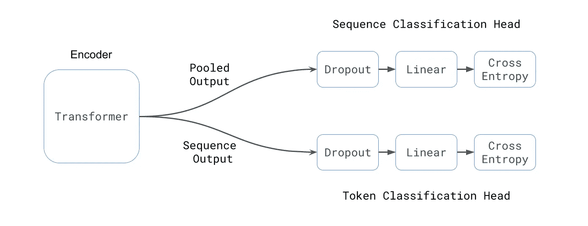
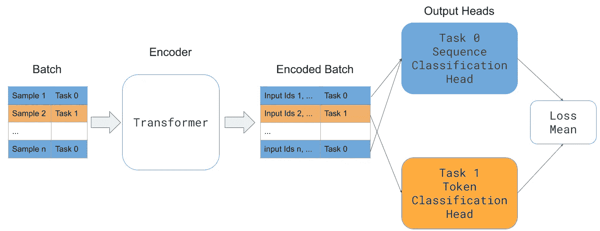

# 如何创建和训练多任务转换器模型

> 原文：<https://towardsdatascience.com/how-to-create-and-train-a-multi-task-transformer-model-18c54a146240>

# 如何创建和训练多任务转换器模型

## 关于如何使用 Huggingface Transformers 创建和训练多任务 transformer 模型的分步教程。

弗拉德·扎伊采夫在 [Unsplash](https://unsplash.com?utm_source=medium&utm_medium=referral) 上拍摄的照片

当我在做一个人工智能聊天机器人项目时，我对提供 NLP 模型服务的公司做了一个简短的回顾。我对一些提供商对基本意图分类模型收取的费用感到惊讶，甚至对那些既提供意图分类又提供令牌分类任务(例如部分速度标记)的提供商收取的费用更高。

在我看来，这些服务的唯一附加值就是部署和维护。因为开源的 [Huggingface Transformer 库](https://github.com/huggingface/transformers)(训练这种模型的当前标准)已经成熟，并且可以被任何没有广泛的 Transformer 模型知识的人使用。

我知道部署和维护是任何生产应用程序的关键方面(知道维护平均占任何软件成本的 70%)。然而，走这条路也有一些缺点:

*   你对引擎盖下使用的模型控制较少。您将模型视为通过 API 访问的黑盒。此外，您总是受到发布周期的约束，以获得最新的模型架构(如果它们被添加的话)。
*   对于纯云服务，您需要将您的数据发送给该第三方。
*   您受到任何服务限制。比如 API 访问方法(REST vs. gRPC)、延迟、特性等。

因此，如果您可以构建和训练您的模型，您只需要支付成本更低的部署服务，尤其是从建模的角度来看没有任何优势，因为数据的质量决定了您的模型的性能。

这篇文章是关于构建和训练多任务模型的分步教程，该模型执行序列分类(即意图分类)和标记分类(即命名实体识别)。然而，对于任何使用 [Huggingface Transformer 库](https://github.com/huggingface/transformers)的 MTL 模型来说，这也是一个很好的起点。最后，如果您必须为您的 NLP 服务选择一个外部提供者，至少您可以使用这个例子创建一个基线来比较不同提供者的性能。

# 多任务数据集

首先，我们将创建一个多任务数据集，它结合了来自两个任务的样本(即序列和标记分类)。

对于序列分类，我们将使用公开可用的 [MRPC](https://metatext.io/datasets/microsoft-research-paraphrase-corpus-(mrpc)) 数据集和 [Conll2013 数据集](https://www.clips.uantwerpen.be/conll2003/)来完成令牌分类任务。然而，在实际的用例中，您可能会将相同的数据标记为令牌和序列分类。

要创建多任务数据集，我们需要:

*   下载或加载每个数据集。
*   将每个数据集标记化。
*   组合标记化的集合。

## 令牌分类数据集

以下是加载令牌分类数据集的代码片段。这个片段的灵感来自 Huggingface 中的 [run_ner.py 示例](https://github.com/huggingface/transformers/blob/master/examples/pytorch/token-classification/run_ner.py)，并做了一些修改以处理多任务设置:

*   我们添加了一个名为`task_ids`的新列，包含每个样本的任务 id**(第 59 行)**。模型将使用任务 id 来正确处理来自每个任务的样本。
*   在标记化之后删除不使用的列，只保留模型**(第 70 行)**使用的特性。

我们使用了 Huggingface 数据集`load_dataset`函数**(第 79 行)**。但是，如果您有数据，您仍然可以使用相同的函数并提供文件路径而不是数据集名称。

`Task`数据类是一个助手，用来记录 MTL 模型所需的关于特定任务的所有信息。

*   `id`:唯一的任务 id。
*   `name`:任务名称。用于打印日志消息。
*   `type`:任务类型(`seq_classification`或`token_classification`)。
*   `num_labels`:标签的数量(如二进制分类为 2)。

## 序列分类数据集

以下是加载序列分类数据集的代码片段。它受 Huggingface 的 [run_glue.py 示例](https://github.com/huggingface/transformers/blob/master/examples/pytorch/text-classification/run_glue.py)的启发，并做了一些修改以处理多任务设置:

*   我们添加了类似于令牌分类数据集**(第 30 行)**的`task_ids`列。
*   将`label`列重命名为`labels`，以匹配令牌分类数据集**(第 29 行)**。
*   仅为训练数据集填充标签**(第 36 行)**。

为了理解我们为什么需要填充标签，让我们以下面的例子为例:“我想开一个账户。”

*   标签将是序列分类任务的类 id(单个整数)。
*   标签将是用于令牌分类任务的每个单词的标签列表，

因为我们需要在同一批中包装两种样品，所以标签的形状应该相同。我们只需要稍后为序列分类样本去除填充。

## 合并数据集

既然我们可以分别加载每个数据集，那么最后一步就是创建一个单独的数据集来提供给培训师。

*   `load_seq_classification_dataset`和`load_token_classification_dataset`是我们之前定义的函数。
*   为了合并训练数据集，我们使用 pandas 格式的原始数据来避免处理数据集库中的一些检查，因为这些数据集格式最初是不兼容的(我们添加的填充)**(第 14 行)**。
*   训练数据集被混洗，以便单个批次包含来自多个任务**(第 18 行)**的样本。
*   因为我们分别评估每个任务**(第 21 行)**，所以验证数据集被附加到一个列表中。

您可能会问自己，为什么验证集没有像训练集一样合并。由于计算性能指标和避免改变默认训练者的不同方式，在验证期间单独处理每个数据集(一个接一个)要容易得多。

# 多任务模型

## 概观

我们将使用硬参数共享多任务模型[1],因为这是最广泛使用的技术，也是最容易实现的。在硬参数共享中，所有的任务共享一组隐藏层，每个任务都有其输出层，通常称为输出头，如下图所示。在这种设置中，模型学习对所有任务建模的共享特征表示。

图片由作者提供。灵感来源于[1]。

## 多任务模型

对于我们的用例，共享层将是一个转换器(例如，BERT、RoBERTa 等。)，输出头将是线性层，有落差，如下图所示。

图片由作者提供。

创建多任务模型时有两个主要考虑事项:

*   模型应该是 Pytorch 模块。意味着一个从`torch.nn.Model`继承并实现`forward`方法的类。
*   `forward`方法应该处理输入参数并返回类似于任何 Huggingface 模型的输出。

**__init__ 方法**

下面的代码片段为每个任务创建了编码器和输出头。

*   使用`AutoModel`创建编码器，以使用任何变压器**(第 5 行)**。
*   `torch.nn.ModuleDict`中的输出标题帮助我们使用任务 id **(第 7–11 行)**访问每个标题。

**前进**前进**方法**

下图显示了 forward 方法的高级流程。如前所述，批次首先通过编码器。然后，使用任务 id 将每个样本重定向到适当的输出头。最后，我们计算平均损失。

图片由作者提供。

下面的代码片段是`forward`方法的实现。

*   `**kwargs` 参数用于避免声明未使用的参数**(第 23 行)**。
*   使用每个样本的任务 id 对编码器输出进行过滤，然后馈送到适当的解码器**(第 29–37 行)**。
*   总损失是批次中每个任务损失的平均值**(第 48 行)**。
*   与其他 huggingface 模型**(第 56–60 行)**类似，返回损耗、逻辑和编码器输出。

## 令牌分类头

正如上面概述中所讨论的，令牌分类是一个简单的线性层，与`BERTForTokenClassification`类似。

下面是这个输出头的代码片段。

## 序列分类头

序列分类头类似于令牌分类头，但有以下区别:

*   使用`pooled_output`代替`sequence_output` **(第 11 行)**。
*   在标记化过程中添加的填充被删除**(第 18 行)**。

# 韵律学

我们需要为每种任务类型定义指标。这里，我们使用 seqeval 进行标记分类，使用 accuracy 进行序列分类。

为了区分每个任务，我们在预测中使用维度的数量。

*   序列分类任务的维数是 2，因为整个序列只有一个标签**(第 4 行)**。
*   对于令牌分类任务，维数是 3，因为每个令牌都有一个标签**(第 8 行)**。

# 一起

下面的代码片段显示了一个训练循环的工作示例。

`model_args`、`data_args`和`training_args`是类似于 huggingface [run_glue.py 示例](https://github.com/huggingface/transformers/blob/master/examples/pytorch/text-classification/run_glue.py)中定义的数据类，只是`model_name_or_path`被重命名为`encoder_name_or_path`。

# 进一步的考虑

这篇文章的目的不是为你的用例提供一个现成的代码。它旨在通过一个简单的例子向您展示构建和训练 MTL 模型是多么容易。但是，如果您想要扩展这项工作，以下是您需要考虑的一些事项。

## **采样**

为了简化，我们对训练数据集进行了洗牌，以确保每一批都包含来自不同任务的样本。然而，如果数据集的大小不一致，低资源任务可能会饿死，这可能会导致灾难性的遗忘。你可能想检查其他 MTL 抽样技术，如 MTL 主动学习抽样[2]。

## **损失**

在这个例子中，我们选择平均每个任务的损失。如果损失不在同一个范围内，那么在这种情况下，一个单一的任务可以控制梯度下降。

# 结论

在这篇文章中，我用 huggingface Transformers 库演示了一个创建和训练多任务模型的例子。

尽管我简化了这个例子以便于理解，但它仍然是一个很好的开始例子。

## 在你走之前

在[推特](https://twitter.com/amine_elhattami)上关注我，在那里我定期发关于软件开发和机器学习的推特。

# 参考

*   [1]深度神经网络中的多任务学习概述，“CoRR，vol. abs/1706.05098，2017。【在线】。可用:[http://arxiv.org/abs/1706.05098](http://arxiv.org/abs/1706.05098)
*   [2] J. Pilault，A. E. hattami，C. Pal，“条件自适应多任务学习利用较少的参数和较少的数据改善 NLP 中的迁移学习”，2019，arXiv:2009.09139。【在线】。可用:[https://arxiv.org/abs/2009.09139](https://arxiv.org/abs/2009.09139)