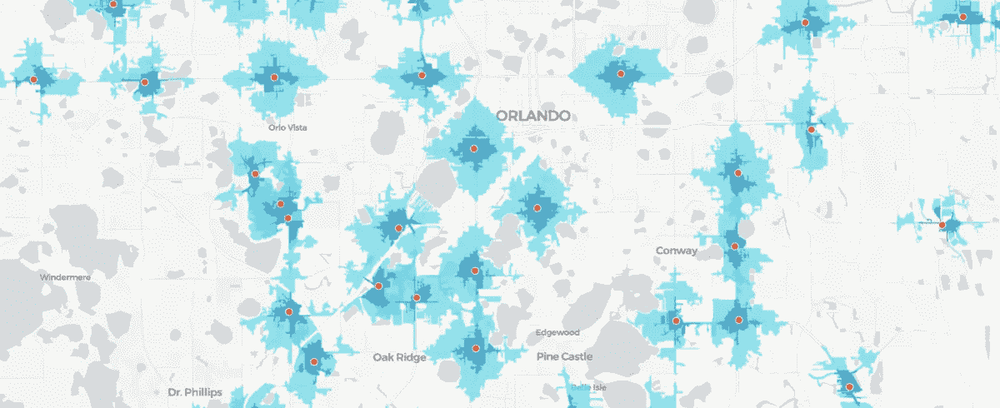
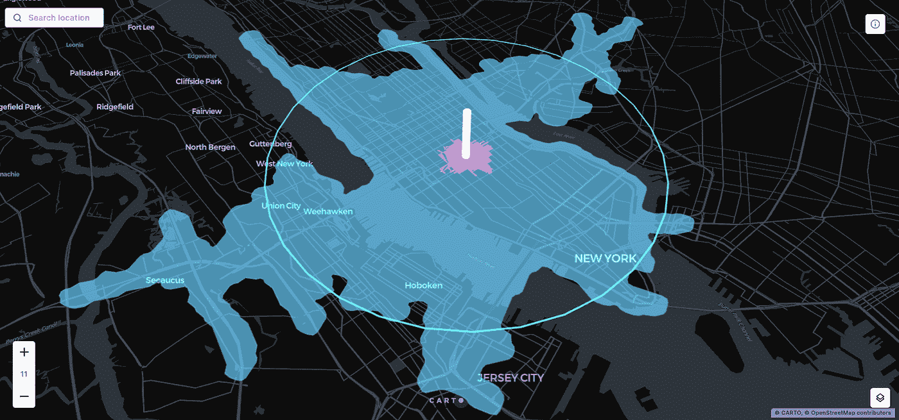
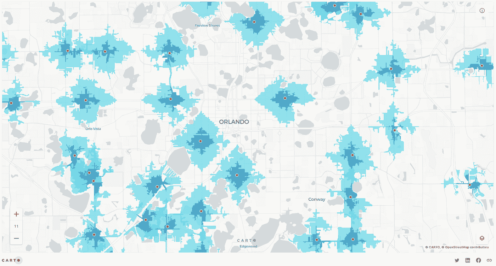
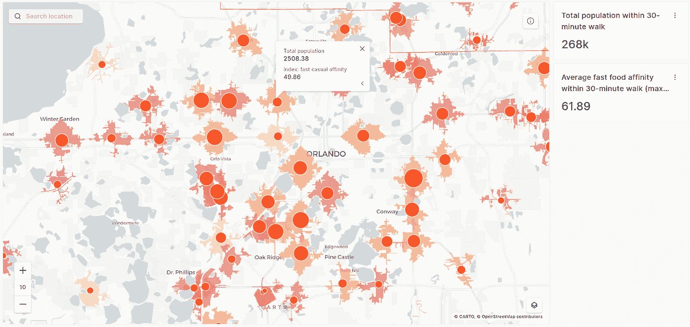
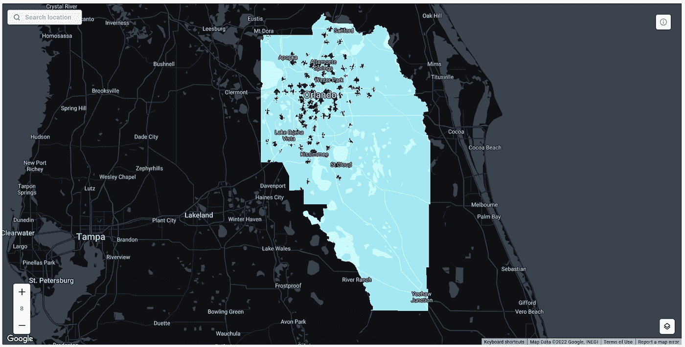
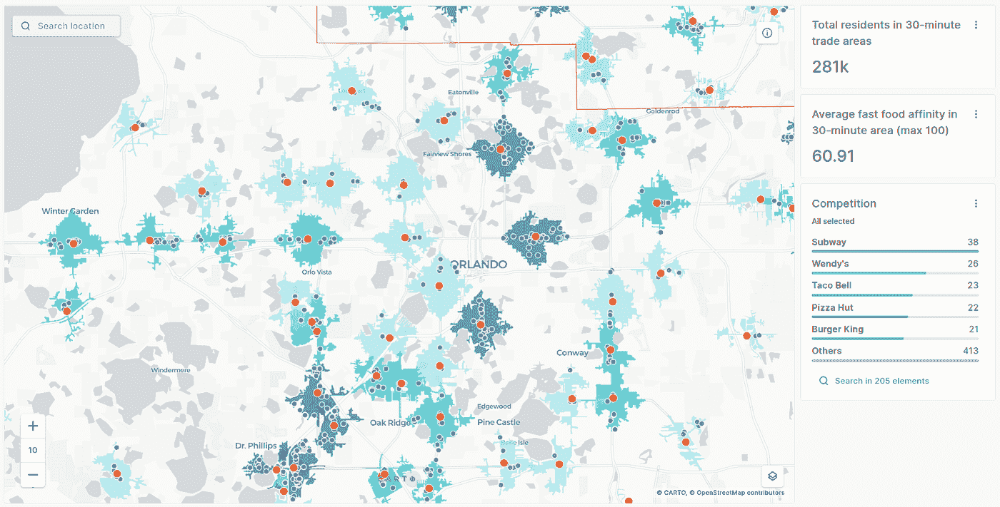

# 如何为汇流纵断面创建和使用等值线

> 原文：<https://towardsdatascience.com/how-to-create-and-use-isolines-to-understand-catchment-profiles-e8847bbdff68>

## 引入等值线-基于交通网络和行程时间的流域。



在 CARTO 中创建等值线——继续阅读，了解如何创建这些等值线！资料来源:CARTO

等值线对于数据科学家来说是一个非常强大的工具，它显示了可以轻松访问给定位置的区域。您可能也听说过这些被称为等时线、贸易区或行程时间集水区。不管他们的名字是什么，概念都是一样的——他们根据设定的距离或时间(如 1 英里或 20 分钟)来衡量一个站点可访问的区域。这些计算基于实际交通网络，包括高速公路和自行车道和人行道(如适用)。

在本指南中，我们将解释等值线和固定距离缓冲区之间的区别，分享如何轻松计算等值线，并最终分享如何从中获得见解。

这篇文章由 Helen McKenzie 撰写，她是 CARTO 的地理空间倡导者。

# 固定距离缓冲区与等值线



说明了等值线和固定距离缓冲区之间的差异。资料来源:CARTO。

固定距离缓冲区正是它听起来的样子。这些方法根据从某个位置到每个方向的固定距离来计算该位置的集水区。它没有考虑到是否有可能在所有这些方向上旅行。

您可以在上面的可视化图中看到这个概念——蓝色圆圈是固定距离的缓冲区。它没有考虑交通网络，并表明跨水旅行是可能的。

与几何形状更复杂的等值线相比，固定距离缓冲区具有计算速度更快、存储成本更低的优势。但是，固定距离缓冲区可能会被误解，因为它们假设该距离内的所有区域都可以被个人轻松访问。由于多种原因，情况可能并非如此，例如:

*   海岸线、河流或湖泊等自然屏障可能会阻碍旅行。
*   人为障碍，如私有土地，可能会阻止人们进入某些地区。
*   组成一个区域的街道网络和人行道(如果考虑活动出行模式)可能不允许集水区周围的无干扰出行。例如，街道可能是单行道或死胡同。

考虑到这一点，在任何情况下都应该使用固定距离缓冲区而不是等值线吗？绝对的！

其中一个例子是，如果您正在考虑为某个位置创建集水区，而您知道该位置周围的交通基础设施将经历重大改造。这方面的一个例子是计算新购物中心商店的销售区域(零售/房地产行业数据科学家的常见用例)。新购物中心周围的高速公路网络很可能会完全重新配置，基于当前网络的评估将完全不真实。在这种情况下，更具“指示性”的固定距离集水区更为合适。

其次，正如我们前面提到的，等值线的计算和存储成本比固定距离缓冲区更高。此外，等值线计算还利用了位置数据服务。

# 创建集水区:您首先需要了解的内容

在开始创建集水区之前(在本例中是使用 CARTO 创建[)，您需要确定几个参数。](https://carto.com/)

## 旅行方式

[分析工具箱](https://docs.carto.com/analytics-toolbox/about-the-analytics-toolbox/)允许你选择两种交通方式中的一种；汽车或行人。

选择“汽车”时，您的分析将仅限于允许车辆通行的运输网络部分。为了最好地模拟实际驾驶条件，集水区还将受每条街道的交通条件和限制(如单行道)的影响。

相反，在创建行人聚集区时，更多的交通网络将被开放，如人行道、自行车道和小路。这种分析也不会受到道路速度或限制的影响，但会避开被认为对行人不可用的主要高速公路，如州际公路和高速公路。

由于行人和骑自行车的人通常使用相同的基础设施，您可以将此转化为骑自行车的人的分析。骑自行车的人通常比行人行驶速度快 3.75 倍，该数字可用于适当缩放等值线，例如，30 分钟周期等时线可根据大约 2 小时的步行计算。

在下面的例子中，您可以看到源自纽约市中央公园东南角的汽车集水区和行人集水区之间的差异(白色圆盘)。绿色的 5 分钟步行集水区在各个方向都行驶了相同的距离，包括穿过中央公园。与之形成对比的是紫色的 3 分钟步行等时线，它既不能穿越公园，也不能违反单向限制，例如沿着南行的第五大道行驶。


驾驶时间与步行时间等时线。资料来源:CARTO

## 等时线与等值线

创建集水区时，有两种主要类型可供选择；等时线(基于行程时间的集水区，例如，我在 10 分钟内可以走多远？)或等值线(基于行程距离，例如，在 1 公里内，我可以沿交通网络行驶多远？).

当分析主动出行模式(即步行和骑自行车)时，选择哪种并不重要，因为旅行者通常会以相当恒定的速度移动。然而，如果你考虑的是车辆模式，这就很重要了，因为等时线会受到道路速度和交通状况的影响，而等值线则不会。

# 创建等值线:指南

现在我们准备等时线！这些功能目前在连接到 [Google BigQuery](https://cloud.google.com/bigquery) 或[雪花](https://www.snowflake.com/en/)数据仓库时可用，我们将从 SQL 控制台运行该分析。

## 带 SQL 的等值线

首先，确保您使用的是点表；如有必要，ST_CENTROID()可用于从线和面创建中心点。

对于 BigQuery 用户，基本语法如下。用户应该选择模式是汽车还是步行，以及他们是否想根据时间或距离来测量他们的贸易区。对于时间，使用的数字(整数格式)应该以秒为单位，对于距离，应该以米为单位。您需要引用位置数据服务(LDS) API URL 和令牌。这些都可以在 CARTO 工作区的 Developer 标签中找到。

```
CALL ‘carto-un’.carto.CREATE_ISOLINES(
 ‘input-query’,
 ‘my-schema.my-output-table’,
 ‘my_geom_column’,
 ‘car/walk’, number, ‘time/distance’,
 ‘my_lds_api_url’, ‘my_lds_token’
);
```

如果你是雪花用户，你可以点击这里查看我们的数据仓库等值线运行指南[。](https://docs.carto.com/analytics-toolbox-snowflake/sql-reference/lds/)

如果您的数据仓库不在美国地区，请确保用适当的前缀替换“carto-un”。

看看我们的例子！下面的地图显示了从佛罗里达州奥兰多的麦当劳步行 15 到 30 分钟范围内的区域。这个位置是通过我们的数据合作伙伴 Safegraph 的 [Places](https://carto.com/spatial-data-catalog/browser/dataset/sg_coreplaces_948d1168/) 数据集获得的。



15 分钟和 30 分钟步行等时线，源自奥兰多的麦当劳店。资料来源:CARTO。

# 等值线和空间洞察力

有时，创建贸易区可能是您分析的最终目标。然而，总的来说，这只是从您的分析中获得进一步见解的关键一步。

以下是通过创建等值线可以获得的洞察力类型的三个示例。

## 洞察力 1:贸易区人口统计

能够理解在一个贸易区内生活或工作的人的数量和特征是无价的。例如，零售分析师可以根据谁会真正光顾他们的商店来评估每个商店的潜在市场规模。他们可以更进一步，计算出有多少人可能步行、骑自行车或开车去他们的商店，并以此来规划停车设施或集中营销活动投资。

理解这一点的一个好方法是使用[浓缩工具](https://docs.carto.com/analytics-toolbox-bigquery/guides/data-enrichment-using-the-data-observatory/)。这些工具允许用户根据另一个数据集的属性快速、轻松地计算出某个区域的特征——无论是他们自己的数据集还是来自[第三方数据源](https://carto.com/spatial-data-catalog/)。

扩展我们在奥兰多的麦当劳的例子，我们已经丰富了我们的 30 分钟步行等值线与总人口(可通过美国社区调查[这里](https://carto.com/spatial-data-catalog/browser/?provider=usa_acs)免费获得)以及“快速休闲亲和力”指数。该指数可通过 Spatial.ai 的 [Geosocial Segments](https://carto.com/spatial-data-catalog/browser/dataset/spa_geosocial_s_d5dc42ae/) 数据集获得。它根据人们在社交媒体平台上分享的经历、个性和感受，根据 72 个指数给人们打分。



使用等时线了解商店集水区的人口统计资料。资料来源:CARTO。

## 洞察力 2:反向贸易区人口统计

在许多情况下，实际上你最感兴趣的并不是那些能够访问服务的人；是那些不知道的人。能够找出人们不容易进入商店或服务的地方是制定未来扩张战略的基础。在这些情况下，最感兴趣的是每个集水区之外的区域。

例如，在下面的地图中，浅蓝色区域突出显示了我们的研究区域(由佛罗里达州的奥兰治县、奥西奥拉县和塞米诺尔县组成)中距离麦当劳步行 30 分钟以上的所有地方。再次使用我们的丰富工具，我们可以计算出有 1，783，500 名居民居住在该地区，约占总人口的 84%!

这一数字有助于战略家决定该研究区域是否是增加额外地点的有力候选，因为它有如此大的未开发市场。下一步将是进一步探索研究区域内的哪个位置是新位置的最佳位置。



反向集水区-使用等时线来了解无法访问设施点的区域。资料来源:CARTO。

## 洞察力 3:可访问的服务评估

我们的最后一个 insight 示例是使用等值线来评估附近的配套或竞争设施。新住宅开发背后的规划者可能需要了解有多少相关服务(如学校、公交车站和诊所)可在其开发的旅行时间阈值内到达。物流公司可能希望将车队管理决策或配送中心位置建立在与供应链元素的实际接近程度上。

基于我们的示例用例，下面的地图显示了每家餐厅 30 分钟步行范围内的其他快速服务餐厅(qsr)的数量，以帮助评估当地的竞争。探索互动版[这里](https://gcp-us-east1.app.carto.com/map/bb111629-b976-4c75-9a7a-f9007200ba27)！



使用等值线了解竞争对手的分布。来源(CARTO)。

使用空间连接(关于这个[的更多细节，请点击](https://carto.com/blog/guide-to-spatial-joins-and-predicates-with-sql/))我们可以评估每个 30 分钟步行范围内的竞争对手品牌，还可以确定哪个位置有最多的竞争对手。这些信息对于推动市场营销和招聘等策略非常重要。

感谢阅读我们关于等值线的帖子！我们希望我们不仅向您展示了它们在帮助您理解网站的地理环境方面有多么强大，而且展示了它们是多么容易创建。