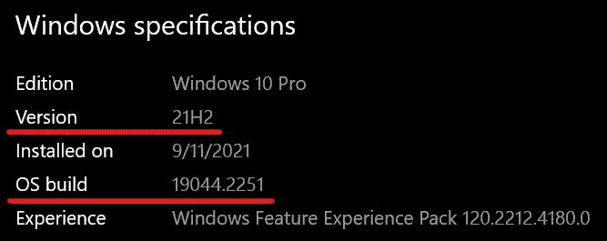
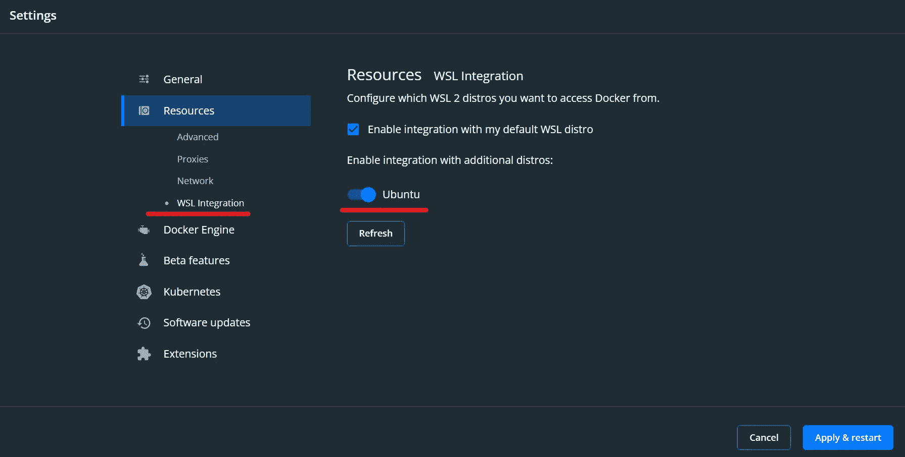
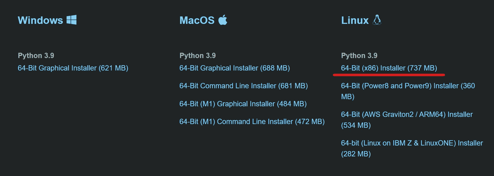
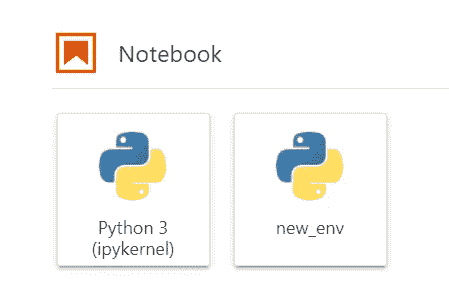
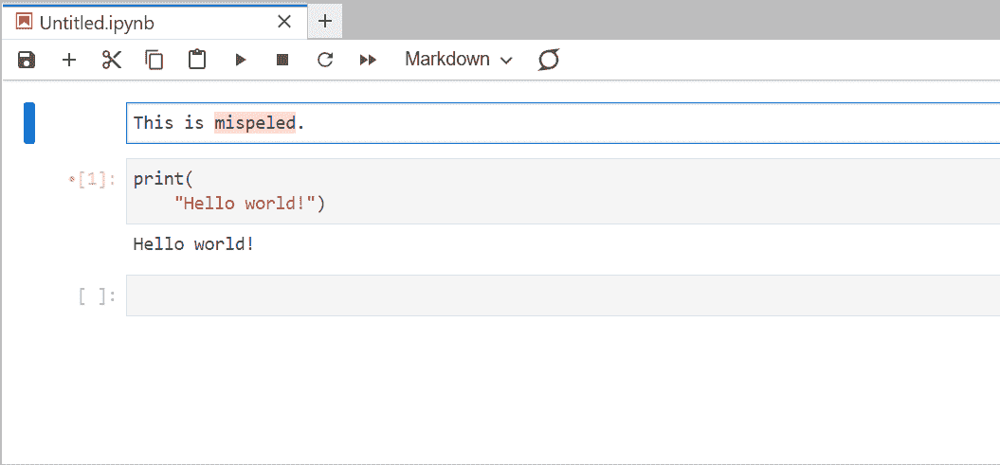
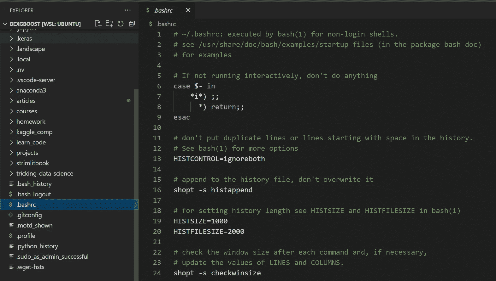

# 如何在 Windows 10/11 上用 WSL2 创建一个完美的机器学习开发环境

> 原文：<https://towardsdatascience.com/how-to-create-perfect-machine-learning-development-environment-with-wsl2-on-windows-10-11-2c80f8ea1f31>

## 一切包括:终端，Docker，Anaconda，Git，Jupyter 实验室，GPU 支持，…


来自 [Pexels](https://www.pexels.com/photo/lighted-city-during-night-1472612/?utm_content=attributionCopyText&utm_medium=referral&utm_source=pexels) 的 [Lina Mamone](https://www.pexels.com/@lina-mamone-661542?utm_content=attributionCopyText&utm_medium=referral&utm_source=pexels) 的照片

## 什么是 WSL，为什么需要它？

就是这样。我已经受够了。失败的安装，错误信息，取笑 Windows 的迷因，人们认为他们更酷，因为他们使用 Linux…

今天，在使用 Windows Subsystem For Linux 2 (WSL2)的所谓愚蠢的 Windows (10/11)之上，安装一个成熟的 Linux 开发环境就结束了。

WSL2 使您能够在 Windows 中运行完整的 Linux 环境。它有一个专用的文件系统和 Linux 终端，同时允许文件和服务与 Windows 代码编辑器和应用程序无缝共享。

作为机器学习工程师或数据科学家，您将从 Linux 环境中受益匪浅。您会发现安装和使用 TensorFlow、PyTorch 或 Docker 等技术要容易得多，因为 Linux 可以更顺畅地利用系统资源，尤其是 GPU。

在本教程结束时，您将拥有一个完全成熟的 Linux 环境，包括以下内容:

*   定制终端
*   VSCode 和 PyCharm 配置为使用 Windows 设置的 IDE
*   安装 Git、Anaconda、Python 和 Docker
*   Jupyter 实验室配置了最好的扩展
*   适用于 CUDA 和 cuDNN 的 NVIDIA GPU 驱动程序，因此您可以通过一条`pip`语句安装 GPU 库。

让我们开始吧！

[](https://ibexorigin.medium.com/membership)  

获得由强大的 AI-Alpha 信号选择和总结的最佳和最新的 ML 和 AI 论文:

[](https://alphasignal.ai/?referrer=Bex)  

## 1.卸载现有安装(可选)

即使您安装了 WSL，我也建议从头开始，因为您可能已经破坏了您的环境，这可能会阻止我们实现接下来的一些步骤。


作者图片

> 你的发行版可能会有不同的名字(Debian，Kali 等)。)

## 2.如果你还没有安装 Docker 桌面

请通过运行`docker --version`检查您是否在 Windows 上安装了 Docker Desktop。如果没有打印版本，请转到此 [Docker 安装页面](https://www.docker.com/products/docker-desktop/)并下载/运行可执行文件。


Docker 下载页面的屏幕截图

## 3.检查先决条件

WSL2 需要 Windows 10、OS build 19041 或更高版本或 Windows 11。请转到“设置”>“系统”>“关于”,然后向下滚动到“Windows 规格”,进行检查。



作者图片

## 4.如何安装 WSL2

如果满足先决条件，您需要一个命令来安装 WSL2:

```
wsl --install -d Ubuntu
```

请在以管理员权限打开的命令行(CMD)上运行上述命令(右键单击并选择“以管理员身份运行”)。

`wsl`命令的`-d`标签指定了 Ubuntu 发行版，这是最简单的开始。要检查安装是否成功，运行`wsl -l -v`命令查看版本。

```
$ wsl -l -v
  NAME                   STATE           VERSION
* Ubuntu                 Running         2
```

## 5.设置用户名和帐户

安装完成后，你会在开始菜单中看到一个 Ubuntu 应用程序。

当你第一次打开它时，它会要求你设置用户名和密码。我把我的用户名设为`bexgboost`，这和我的 Windows 用户名不同，以免混淆。

终端提到`sudo`命令，相当于以管理员身份运行应用。当您开始使用 Linux 终端时，您会发现在命令之前添加`sudo`命令可以解决许多错误。

在本教程的剩余部分，我们将同时使用 Windows 和 WSL2 终端。对于 Windows，我将它们称为“CMD ”,对于 WSL2，我将它们称为“终端”。

## 6.如何在 WSL2 上更新和升级软件包

在新的库安装或版本更改后，您应该定期更新 Linux 包。以下是执行此操作的命令:

`sudo apt update && sudo apt upgrade`

这些命令类似于 Windows Update，但速度更快。`update`命令下载新的库/包更改，而`upgrade`命令执行它们。

如果您对 Linux 完全陌生，请查看这些最常用的终端命令[以便更有效地理解本文的其余部分。](https://www.digitalocean.com/community/tutorials/linux-commands)

## 7.了解 WSL2 中的文件系统

操作系统由文件/应用程序和与之交互的图形用户界面组成。在 Windows 中，您同时使用了 CMD 和文件浏览器。在 WSL2 中，您将主要使用终端来与一切进行交互。

WSL2 不自带 GUI (Windows 11 现在自带 GUI，点此查看)。起初这似乎是一个限制，但是通过终端工作要快得多，提供了灵活性，并且使你看起来像一个黑客。

WSL2 可以被认为是安装在 Windows 之上的 Linux 文件系统。它的安装文件夹可以在网络路径`\\wsl$\Ubuntu`中找到。要在终端中打开它，请键入`cd /`。当你运行列出目录的`ls`时，你会看到很多目录。

我们只对其中两个感兴趣:`home`和`mnt`。`home`包含您的用户账户信息。现在，只有一个目录以你的 UNIX 用户名命名(我的是`/home/bexgboost`)。每次启动新的终端会话时，路径都设置为该文件夹。这就是为什么`/home/username`被称为主目录。

> 开头的正斜杠`/`很重要。

当你改变目录时，你可以不带参数地调用`cd`或者用`~`引用它。

`/mnt`文件夹包含 Windows 盘和 D 盘的链接。在 WSL 之前，我习惯于在桌面上存储我的项目和代码。下面是将它们复制到 home 中的命令:

```
cp /mnt/users/bex/Desktop/* .
```

> `cp`代表“复制”。`bex`是我的 windows 用户名。

尽管 WSL2 是一个 Linux 文件系统，但是您可以使用 Windows 资源管理器打开它的目录。在任何目录中，运行`explorer.exe .`命令。下面，我们正在打开主目录:


作者 GIF

## 8.如何为 WSL2 安装 Visual Studio 代码

如果您在 Windows 上安装了 VSCode，则可以使用它打开任何 WSL2 文件夹。你只需要安装[远程扩展开发包](https://marketplace.visualstudio.com/items?itemName=ms-vscode-remote.vscode-remote-extensionpack)扩展。


作者图片

然后，转到终端，更新/升级包。然后，切换到任意目录并运行`code .`打开该文件夹的 VSCode 项目。


作者 GIF

使用 Windows VSCode for WSL2 项目可以共享 VSCode 设置和主题。

## 9.如何为 WSL2 安装和设置 Git

`git`已经预装在 WSL2 中(如果没有，运行`sudo apt-get install git`)。

通过运行以下命令设置您的`git`凭证:

然后，在 CMD 上运行`git update-git-for-windows`。然后，在 Ubuntu 终端上，运行以下命令:

```
git config --global credential.helper "/mnt/c/Program\ Files/Git/mingw64/bin/git-credential-manager-core.exe"
```

这将设置 Git 凭证管理器(GCM ),以便您可以将提交无错误地推送到远程 repos。

## 10.如何为 WSL2 安装 Docker

这一步很简单，因为我们已经在一开始安装了 Docker。要将 Docker Desktop 链接到 WSL2，请进入 Docker Desktop >设置>资源> WSL 集成，并将 Ubuntu 按钮切换到“开”。然后，按应用并重新启动终端以使更改生效。



作者图片

之后，您应该可以在 WSL2 终端上成功运行`docker --version`。

[](https://ibexorigin.medium.com/membership)  

## 11.如何在 WSL2 上安装 Anaconda

对于 Python 版本和管理包，我更喜欢 Anaconda。(转到这一步的末尾，查看不带 Anaconda 的常规 Python 安装)。

第一步是进入[https://www.anaconda.com/products/distribution](https://www.anaconda.com/products/distribution)页面。



作者图片

Linux 文件不像 Windows `.exe`可执行文件。如果你点击下载链接，你会发现它们的扩展名是`.sh`。

因为我们说过 Linux 没有 GUI 来安装应用程序，所以我们将使用终端来下载并安装适用于 Linux 的 Anaconda 可执行文件。首先复制下载链接，到终端。

键入`wget`并将下载链接粘贴到它旁边(在主目录中执行此步骤)。下面是我复制的下载链接的样子:

```
$ wget https://repo.anaconda.com/archive/Anaconda3-2022.10-Linux-x86_64.sh
```

是一款优秀的 CLI 工具，可以下载任何带有 URL 的文件。上面的命令将下载一个名为`Anaconda3-2022.10-Linux-x86_64.sh`的文件。

要安装该文件，请使用带有文件名的`bash`命令，并按照说明操作:

```
$ bash Anaconda3-2022.10-Linux-x86_64.sh
```

要检查安装，您可以运行`conda --version`或`which python`:

```
$ conda --version
conda 22.9.0

$ which python
/home/bexgboost/anaconda3/bin/python
```

输出显示 Anaconda 安装在主目录的`anaconda3`目录下。所有未来的环境和包都将存储在那里。

安装完成后，删除 Anaconda 可执行文件:

```
$ rm -rf Anaconda3-2022.10-Linux-x86_64.sh
```

如果您不想使用 Anaconda，下面是如何安装 Python、pip 和 venv:

```
$ sudo apt update && upgrade
$ sudo apt install python3 python3-pip python3-venv ipython3
```

## 12.如何在 WSL2 上安装 Jupyter Lab

现在，最好的部分——安装 Jupyter 实验室，它是数据科学家 ide 皇冠上的宝石。在基础环境中，运行`pip install jupyterlab`。

在基础环境中安装 Jupyter Lab 及其扩展将使其可用于所有未来的 conda 环境，并且不需要单独的设置。

要打开 Jupyter 实验室会话，请在所需目录中运行`jupyter lab --no-browser`。要在浏览器中打开会话，您必须复制底部带有令牌的会话链接。


作者图片

当您启动 Jupyter Lab 时，您将会看到您的 conda 环境在启动程序中是不可用的。要将现有的(或新的)conda envs 添加到 Jupyter Lab，请使用以下命令:

```
# Create a new env
$ conda create -n new_env -y

# Install ipykernel and add the env
$ pip install ipykernel
$ ipython kernel install --user --name=new_env
```

一旦您重新启动 Jupyter 实验室会话，env 将出现在启动器中。



作者图片

要从 Jupyter Lab 中删除 conda 环境，您可以运行以下命令:

```
$ jupyter kernelspec uninstall env_name
```

## 13.如何为 Jupyter Lab 安装拼写检查器和代码格式化程序(可选)

我最喜欢的两个 Jupyter 实验室扩展是拼写检查器和代码格式化器。要安装它们，请在基本环境中运行以下命令:

```
pip install jupyterlab-spellchecker
pip install jupyterlab-code-formatter
pip install black isort
```

安装后，Markdown 单元格中拼写错误的单词将被标记为红色，一个新图标将格式化代码。您可以在高级设置编辑器中将这两个扩展配置为每次保存时运行。



作者 GIF

## 14.如何格式化 WSL2 终端(可选)

现在，Ubuntu 终端看起来很丑:


作者图片

你的可能比我的更糟，因为我已经做了一些修补。要格式化终端提示符，通过键入`code ~`打开带有 VSCode 的主目录，并打开名为`.bashrc`的文件。



作者图片

向下滚动到文件的末尾，粘贴这个[要点](https://gist.github.com/BexTuychiev/65dc419af0efa723fc78e269a286ec52)中的代码。在第 1 行，用你想要的窗口标题替换`WSL2 Bash`，在第 4 行，用你的用户名替换`bexgboost`。

保存/关闭文件并关闭 VSCode。要应用更改，运行根目录中的`source .bashrc`:


作者图片

如您所见，新的提示符看起来更好。它用不同的颜色显示路径、提示名和 git 分支名，并且总是以新的一行开始提示。

在要点的末尾，您会看到我为最常用的命令添加了几个别名。例如，`g`是`git`的简称，`jl`是`jupyter lab --no-browser`，`gcb`创建一个新的分支并将其检出，等等。您可以随时编辑`.bashrc`文件来添加您自己的别名。

要改变提示的格式或理解其背后的代码，可以阅读[这本](https://phoenixnap.com/kb/change-bash-prompt-linux)优秀指南。

## 15.如何将 WSL2 Linux 终端添加为 PyCharm 内置终端(可选)

我心爱的 IDE 在 Jupyter Lab 之后就是 PyCharm Professional。由于 PyCharm 只安装在 Windows 上，所以它的内置终端链接到 CMD 或 Git Bash。

要使用 WSL2 Ubuntu 终端，进入设置>工具>终端>外壳路径并粘贴`wsl.exe --distribution Ubuntu`。然后，关闭所有终端标签并重新打开它们，使 Ubuntu 终端链接到 PyCharm。

然后，要将任何 WSL2 文件夹作为 PyCharm 项目打开，使用`explorer.exe .`打开该文件夹，并从上下文菜单中选择“将文件夹作为 PyCharm 项目打开”选项。PyCharm 默认支持 Windows 上的 WSL2，并将识别其文件夹。


作者 GIF

## 16.如何在 WSL2 上安装 NVIDIA CUDA 和 cuDNN 驱动程序(100%有效)

最后也是最具挑战性的一步是为 WSL2 安装 GPU 支持。要完成这一步，您应该已经为您的 NVIDIA GPU 安装了 CUDA 和 cuDNN 驱动程序，并且应该能够在 GPU 支持下运行 TensorFlow 等库，而不会出现任何错误。

如果你不能在 Windows 上运行带 GPU 的 TensorFlow，首先，按照我写的这篇文章安装带 GPU 支持的 TensorFlow:

[](/how-to-finally-install-tensorflow-gpu-on-windows-10-63527910f255)  

该指南将教您在 Windows 系统上安装 CUDA 11.2 和 cuDNN 8.1 驱动程序/库。我们为 CUDA 和 cuDNN 选择 11.2 和 8.1 版本，因为 TensorFlow v. 2.6+需要这些版本。按照教程操作后，打开 Ubuntu 终端并更新/升级:

```
$ sudo apt update && sudo apt upgrade
```

然后，极其小心地在根路径中一个接一个地运行下面的命令，因为如果你弄乱了它们，它可能会破坏你的整个 WSL2 安装，你可能不得不从头开始。

这些命令需要一些时间来安装 CUDA 驱动程序。现在，关于 cuDNN 车手:

```
$ sudo apt-get install libcudnn8
$ sudo apt-get install libcudnn8-dev
$ sudo apt-get update && sudo apt-get upgrade
```

最后，运行以下命令来清理根目录，因为我们下载了一些文件:

```
$ rm -rf cuda-keyring_1.0-1_all.deb
$ rm -rf cuda-repo-wsl-ubuntu-11-2-local_11.2.0-1_amd64.deb
$ rm -rf cuda_11.2.0_460.27.04_linux.run
```

要检查 GPU 支持是否正常工作，请在新的 conda env 中安装 TensorFlow 2.10。以下是命令:

```
$ conda create -n tf python=3.9 -y
$ conda activate tf
$ pip install tensorflow==2.10
$ python -c "import tensorflow as tf; print(tf.config.list_physical_devices('GPU'))"
```

如果你得到了`[PhysicalDevice(name='/physical_device:GPU:0', device_type='GPU')]`，输出，恭喜你！您拥有一个有 GPU 支持的成熟的 Linux 环境！

## 结论

如果你过去想在 Windows 中运行 Linux，你必须使用复杂的技术，如 VirtualMachine 或 vagger，这会让你讨厌 Linux 和 Windows，并最终迫使你购买昂贵的 Mac 电脑(他们说，这可能是值得的)。现在，您可以使用 Windows 子系统 Linux (WSL2)的一个命令获得 Windows 和 Linux 的双重优势。

感谢您的阅读！

[](https://ibexorigin.medium.com/membership)  

有用的资源:

*   [site point 的另一个完整的 WSL2 教程](https://www.sitepoint.com/wsl2/)
*   [完成 WSL2 的 VSCode 指南](https://code.visualstudio.com/docs/remote/wsl-tutorial)
*   [为 Windows 11 运行 Linux GUI 应用](https://docs.microsoft.com/en-us/windows/wsl/tutorials/gui-apps)

## 我的更多故事

[](/how-to-boost-pandas-speed-and-process-10m-row-datasets-in-milliseconds-48d5468e269)  [](/a-complete-shap-tutorial-how-to-explain-any-black-box-ml-model-in-python-7538d11fae94)  [](/3-step-feature-selection-guide-in-sklearn-to-superchage-your-models-e994aa50c6d2) 