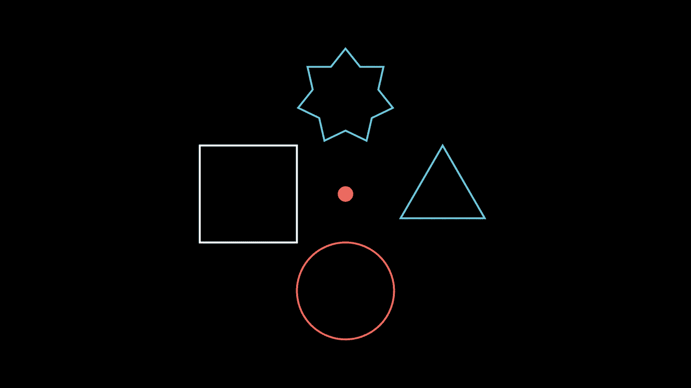

# 如何用 Python 创建像 3Blue1Brown 这样流畅的数学动画

> 原文：<https://towardsdatascience.com/how-to-create-slick-math-animations-like-3blue1brown-in-python-457f74701f68>

## 学习将你对数学和编程的热爱结合起来的最佳方式


**除特别注明外，所有图片均为作者所有。**

你知道创建 3Blue1Brown 的线性代数系列的本质用了多少行代码吗？


这个系列有 16 个视频，频道总共有+100 个视频，这些数字充分说明了数学界对格兰特·桑德森的感激之情。

尽管这个频道看似专注于数学，但它是他为了练习编程技巧而创建的图形库的副产品。他称之为 *Manim，*，它成为了将一些最复杂的数学和计算机科学主题可视化和动画化的先驱工具。

目前，他关于神经网络、微积分、拓扑学和纯数学的视频被认为是 YouTube 上的瑰宝。

如果你能创造出与他的作品有一点相似的东西，那不是很酷吗？本 Manim 教程结束时，你不仅能够创建自己的精彩动画，还能了解格兰特·桑德森在视频中使用的一些签名转换的秘密。

[](https://ibexorigin.medium.com/membership) [## 通过我的推荐链接加入 Medium-BEXGBoost

### 获得独家访问我的所有⚡premium⚡内容和所有媒体没有限制。支持我的工作，给我买一个…

ibexorigin.medium.com](https://ibexorigin.medium.com/membership) 

获得由强大的 AI-Alpha 信号选择和总结的最佳和最新的 ML 和 AI 论文:

[](https://alphasignal.ai/?referrer=Bex) [## 阿尔法信号|机器学习的极品。艾总结的。

### 留在循环中，不用花无数时间浏览下一个突破；我们的算法识别…

alphasignal.ai](https://alphasignal.ai/?referrer=Bex) 

# 什么是曼尼姆？

Manim 代表*数学动画*引擎，由 Grant Sanderson 创建，用于制作高精度的数学动画视频。3B1B 频道和这个 Python 库的主要目标是用视觉直觉来补充传统的基于教科书的数学学习。

目前，Manim 有两个版本:[Grant 创建的原始库](https://github.com/3b1b/manim)和[Manim 社区维护的分叉版本](https://github.com/ManimCommunity/manim)。我们将在本帖中使用社区版本，因为它得到了更好的维护、测试，最重要的是，得到了适当的记录。

有许多安装选项，我认为使用 Docker 镜像是与库交互的最省事的方式。请参考[本页](https://hub.docker.com/r/manimcommunity/manim)中的文档化安装说明，或[本页](https://docs.manim.community/en/stable/installation.html)中的其他选项，以便您可以遵循。

或者，你可以留下来享受内容，因为会有一些很棒的动画！

> 请注意，这篇文章包含几个动画，如 gif 和视频，这可能会降低它们的显示速度。你可以从 [my GitHub repo](https://github.com/BexTuychiev/medium_stories/tree/master/2021/august/4_manim_basics) 下载文章的源代码。这篇文章还提到了几个可能会让初学者感到困惑的 Python OOP 概念。如果在任何时候你发现自己在挣扎，看看我的 OOP 系列。

# 对 Manim 如何工作的更高层次的概述

Manim 是作为 [FFmpeg 视频编码引擎](https://en.wikipedia.org/wiki/FFmpeg)和 Python 之间的桥梁而创建的。由于不能将内置的 Python 数据结构传递给 FFmpeg，Manim 实现了几个数学对象表示和动画类。

这些类一般分为三类:`Scene`、`Mobject`、`Animation`。为了更清楚地解释这些概念，让我们创建我们的第一个动画:

在安装了 Manim 并将上面的代码保存在类似`scenes.py`的脚本中之后，运行下面的命令:

```
manim -pqh scenes.py MyFirstAnimation
```

您应该得到这样的输出:


恭喜你！你刚刚制作了你的第一部动画！

下面是这个 CLI 命令的分解——将`-p`添加到`manim`将使您能够在视频编译后立即播放。和`qh`结合起来就是高质量渲染。随着渲染时间的增加，有四种分辨率-低(`l`)、中(`m`)、高(`h`)和 4k ( `k`)。

如果想要 GIF 版本的动画，在`-pqh`后面加上`-i`。这里是 manim CLI 命令的完整列表。

# 分解基本的 Manim API

让我们通过逐行分析代码来理解上面的动画。

在第一行中导入所有 manim 内容后，我们用一个 construct 方法定义一个场景类:

```
class MyFirstAnimation(Scene):
    def construct(self):
        ...
```

这是创建单个动画的通用公式——您定义一个从`[Scene](https://docs.manim.community/en/stable/reference/manim.scene.scene.Scene.html)`类继承并具有`construct`方法的自定义类。`Scene`类是 Manim 的更高级的构建块，它将所有相关的动画和对象连接成一个单一的结构。

接下来，我们创建两个属于`Mobject`类(数学对象)的对象(一个星形和一个圆形)。这个`[Mobject](https://docs.manim.community/en/stable/reference_index/mobjects.html)`类是许多内置移动对象的基础数据结构，如几何形状、向量、坐标系等。基本上所有不是场景和动画的都是一个`Mobject`。

然后，我们有了`[Animation](https://docs.manim.community/en/stable/reference_index/animations.html)`类。在上面的例子中，我们使用了其中的 3 个- `FadeIn`、`Transform`和`FadeOut`。manim 中所有内置的`Animation`类都接受 mobjects 作为参数，并对它们应用各种效果。例如，`Transform`接受两个移动对象，并播放一个平滑的动画，将第一个对象转换为另一个对象。

每次你创建一个动画，你都必须把它包装在`play`函数中，这样它们才能在屏幕上呈现。

最后，我们有类似于`RED`、`BLUE`、`YELLOW`、`PI`、`TAU`等的常量。这些是 Manim 的`[constants](https://docs.manim.community/en/stable/reference/manim.constants.html)`模块的一部分，将常用值编码为变量，并在代码片段的第一行导入:

# 控制移动对象及其位置

默认情况下，所有添加到屏幕上的移动对象都会显示在`ORIGIN`中:

```
>>> ORIGINarray([0., 0., 0.])
```

Manim 使用 numpy 数组在`x`、`y`、`z`坐标中表示屏幕。`z`只要您在 2D 空间中制作动画，就会保持 0。要将对象向`x`或`y`方向移动一个单位，可以使用常量`LEFT`、`RIGHT`、`UP`和`DOWN`:

例如，我们将在屏幕上的不同位置绘制四个移动对象，并在原点放置一个点作为参考:



自`LEFT`、`RIGHT`等。变量是 Numpy 数组，它们允许数值运算，允许像上面那样缩放它们。还有其他内置的位置变量，如`UL`(向上+向左)、`DR`(向下+向右)等。：

在上面的代码片段中，我们通过传递移动对象的新坐标位置来使用移动对象的`shift`方法。由于`shift`只是一个函数，实际的换档并没有动画效果。为了显示没有动画的移动对象，我们使用了`add`方法。

如果我们想制作移动的动画会怎么样？嗯，你可以像这样在`animate`函数后链接`shift`:


事实上，使用`animate`方法，您可以将几乎任何类型的变化制作成动画。例如，mobjects 有几个以`set_*`开头的方法可以改变它们的属性。这里有一个例子:


# 动画功能

让我们更认真一点，学习如何绘制函数并制作动画。从现在开始，我将使用 JupyterLab 和它的`%%manim`细胞魔术来渲染 manim 输出。语法与 CLI 界面相同。


要像在 Matplotlib 中一样绘制 2D 轴，调用带有所需参数的`[Axes](https://docs.manim.community/en/stable/reference/manim.mobject.coordinate_systems.Axes.html)`类。

接下来，我们使用`[get_graph](https://docs.manim.community/en/stable/reference/manim.mobject.coordinate_systems.CoordinateSystem.html#manim.mobject.coordinate_systems.CoordinateSystem.get_graph)`方法，传递我们想要绘制的函数。这个内置方法只接受返回`x`和`y`之间一对一映射的单变量函数。在上面的例子中，我们画出了 ***sin(1/x)*** 的图形。

或者，您可以使用`get_graph_label`将函数的标签放置在特定位置:

最后，我们正在使用`[VGroup](https://docs.manim.community/en/stable/reference/manim.mobject.types.vectorized_mobject.VGroup.html?highlight=vgroup)`类创建一组移动对象。它允许在多个移动对象上同时进行动画和变换。

另外，不要忘记画出你创建的每个对象。要么用`Create` / `Write`之类的动画功能，要么用`self.add`。

# 更多很酷的例子

你不会以为我不放几个 3B1B 的招牌动画就走了吧？

我是从他的《线性代数的本质》系列中了解到 3B1B 的，看到一个空间的线性变换完全让我意乱情迷。疯狂的是，用 Manim 制作动画非常简单:

类似地，看到用 3D 绘制的函数令人大开眼界，因为我们都习惯于在 XY 平面上绘制函数。当你看到下面的函数时，你会意识到数学是多么美好:

嘿，那些非线性变换怎么样？

还有比这更好的吗？当然可以！

虽然已经很酷了，但是你今天学到的只是 manim 所能做的很小一部分。以上动画只是格兰特·桑德森在他简单的开场场景中使用的。

当您想要超越内置的移动对象和动画类时，该库有一个陡峭的学习曲线。实现自定义类可能会非常冗长，对于较长的视频，通常需要数千行代码。

然而，如果你真的热爱数学，并以新颖和创造性的方式向他人解释它，这不应该阻止你。

# 离别赠言

我很抱歉把这篇文章变成了一篇“如何做”的帖子。这只是我根深蒂固的过度解释事情的倾向。

然而，我觉得适当的解释是必要的，因为互联网上充满了过时的教程和视频。除此之外，当您不小心在一个项目中使用了不同版本的 manim 时，就会产生混淆。

如果你想成为一名铁杆 manim 动画师，我强烈建议你仔细阅读社区版的[文档的每一页。我也建议你去看看像](https://docs.manim.community/en/stable/)[这种](https://www.youtube.com/channel/UCK8XIGR5kRidIw2fWqwyHRA)使用 Manim 的频道，并阅读他们的源代码。

[](https://ibexorigin.medium.com/membership) [## 通过我的推荐链接加入 Medium-Bex t。

### 作为一个媒体会员，你的会员费的一部分会给你阅读的作家，你可以完全接触到每一个故事…

ibexorigin.medium.com](https://ibexorigin.medium.com/membership) [](https://ibexorigin.medium.com/subscribe) [## 每当 Bex T .发布时收到电子邮件。

### 每当 Bex T .发布时收到电子邮件。注册后，如果您还没有中型帐户，您将创建一个…

ibexorigin.medium.com](https://ibexorigin.medium.com/subscribe) 

我的更多故事:

[](/matplotlib-vs-plotly-lets-decide-once-and-for-all-dc3eca9aa011) [## Matplotlib vs. Plotly:让我们决定一劳永逸

### 从 7 个关键方面进行深入快速的比较

towardsdatascience.com](/matplotlib-vs-plotly-lets-decide-once-and-for-all-dc3eca9aa011) [](https://ibexorigin.medium.com/yes-these-unbelievable-masterpieces-are-created-with-matplotlib-b62e0ff2d1a8) [## 是的，这些令人难以置信的杰作是用 Matplotlib 创作的

### 它们让我的作品看起来像孩子画的树

ibexorigin.medium.com](https://ibexorigin.medium.com/yes-these-unbelievable-masterpieces-are-created-with-matplotlib-b62e0ff2d1a8) [](/an-in-depth-tutorial-to-python-decorators-that-you-can-actually-use-1e34d3d2d305) [## 一个深入的 Python 装饰者教程，你可以实际使用

### 深入 Python 的内部

towardsdatascience.com](/an-in-depth-tutorial-to-python-decorators-that-you-can-actually-use-1e34d3d2d305) [](https://ibexorigin.medium.com/how-to-use-matplotlib-annotations-like-you-know-what-you-are-doing-da61e397cce3) [## 如何像知道自己在做什么一样使用 Matplotlib 注释

### 了解如何将文本放置在绘图上的任意位置并绘制箭头

ibexorigin.medium.com](https://ibexorigin.medium.com/how-to-use-matplotlib-annotations-like-you-know-what-you-are-doing-da61e397cce3) [](/the-easiest-way-to-deploy-your-ml-dl-models-in-2022-streamlit-bentoml-dagshub-ccf29c901dac) [## 2022 年部署你的机器学习模型最简单的方法:Streamlit + BentoML + DagsHub

### 将模型部署为具有用户友好界面的轻量级 API

towardsdatascience.com](/the-easiest-way-to-deploy-your-ml-dl-models-in-2022-streamlit-bentoml-dagshub-ccf29c901dac)