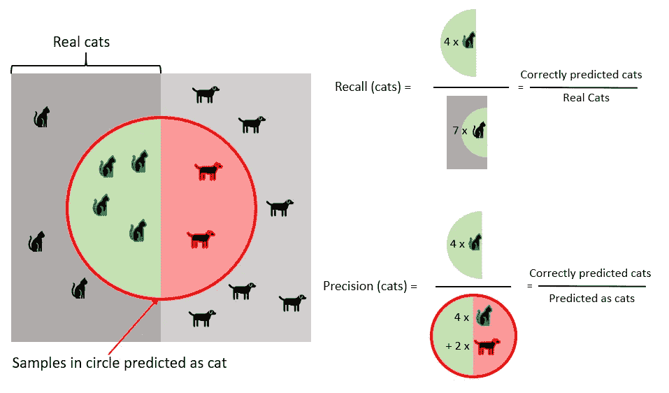
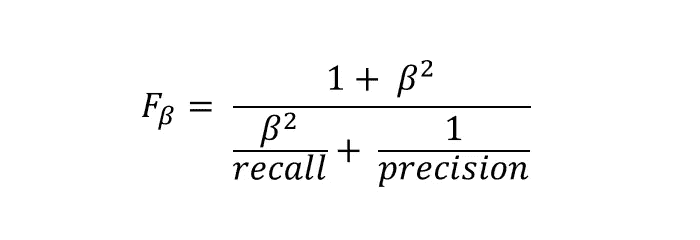
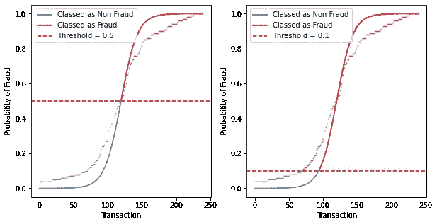
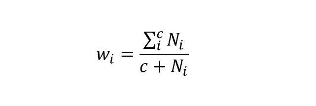
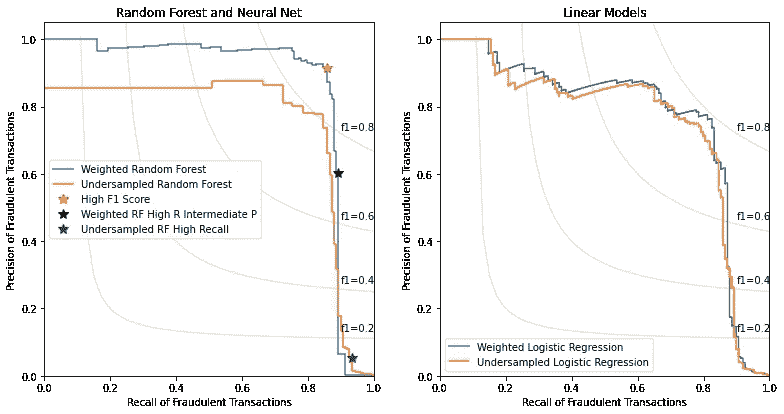
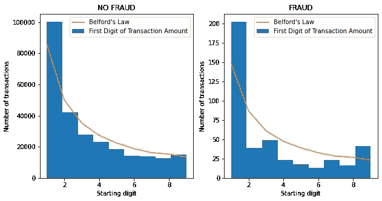

# 使用人工智能检测欺诈

> 原文：<https://towardsdatascience.com/how-to-deal-with-unbalanced-data-d1d5bad79e72>

## 机器学习应用

## 什么是精确和召回，你如何使用它？

马克斯·弗莱施曼在 [Unsplash](https://unsplash.com?utm_source=medium&utm_medium=referral) 拍摄的照片

在机器学习中处理不平衡数据是困难的。我使用精确度、召回率、F-beta 分数和阈值，通过应用基本的机器学习理论训练一个分类器来检测欺诈数据。

# 介绍

我的文章通常是关于机器学习理论，而不是它的应用。在这篇文章中，我想深入一个迷你项目，在这个过程中教给你一些理论，但最重要的是讨论在将机器学习应用于不平衡数据集时的良好实践方法。

不平衡的数据可能很难处理。在本文中，我将训练一个分类器来识别交易数据中的欺诈，并介绍一些可能在其他不平衡数据应用程序中派上用场的方法。

## 什么是不平衡数据？

不平衡数据由目标变量与其他类相比具有非常不同的观察值数量的数据集组成。在不平衡问题中，目标变量通常是样本最少的变量，这意味着包含目标变量类的观测值不多。在我们的欺诈交易数据示例中，大多数数据都是非欺诈性的，相比之下，欺诈交易的数量非常少。

## 数据

在这个项目中，我使用了 [Kaggle 的信用卡欺诈检测数据集](https://www.kaggle.com/mlg-ulb/creditcardfraud)。这个数据集是开源的。该数据集包含 284，807 笔交易，其中只有 492 笔是欺诈性的。即**所有交易中只有 0.172%** 是欺诈！这个数据集非常不平衡，因此训练模型对欺诈进行分类将是一个挑战。

# 不平衡数据的度量

在我进入机器学习之前，我想阐述一些重要的理论。我要讲的第一件事是用于分类器的不同度量(我们如何知道它们是否表现良好)。第二是如何使用阈值来偏置分类器。这两个概念在处理不平衡数据分类时超级有用。

## 精确度与召回率

当在不平衡数据上训练分类器时，准确度根本不是有用的度量。在我们的数据集中，如果我们的分类器将每笔交易都归类为非欺诈性的，它将达到 99.98%的准确率。尽管如此，该模型将是完全无用的，因为它不会发现任何欺诈交易。

因此，我们需要更好的指标来衡量模型的性能:

图 1:猫和狗分类器的精确度和召回率

在上图中，我已经形象化了什么是精确度和召回率。我选择了猫和狗，而不是欺诈和无欺诈，因为它们更容易被形象化，但概念是一样的。图片左边是猫狗的空间，分类器已经对样本进行了分类。**圆圈内的样本归类为猫，所有其他样本归类为狗**。这些分类有些是对的，有些是错的。

召回率:给定类别的召回率是该类别的正确分类样本量除以该类别的样本总量。

精度:给定类别的精度是正确分类的样本量除以预测为该类别的样本总数。

在上图中，有 4 只正确分类的猫和 7 只猫，这意味着召回率是 4/7。分类器将 6 个数据点分类为猫，意味着精度是 2/3。

在欺诈示例中，回忆是我们设法检测到的欺诈交易的百分比，而精确是我们归类为欺诈的交易实际上是欺诈的交易的百分比。**在对欺诈进行分类时，我们主要关心欺诈类别**的召回，也就是说，我们希望尽可能多地对欺诈交易进行正确分类。我们仍然关心精确度，只是不如回忆。

## F-beta 分数

你们很多人可能听说过 F-1 乐谱。F-1 分数是回忆和精确的结合，它经常被用在文学作品中。

F-1 分数是召回率和精确度的调和平均值。调和平均值是倒数的算术平均值的倒数。精确度和召回率的调和平均值用于 F-1 分数，而不是算术平均值，因为调和平均值对较小的值惩罚更多。因此，如果你的回忆很高，但你的精确度很低，你的 F-1 分数可能很低。

等式 1: F- Beta 分数(作者)

F-1 是 F-beta 分数的一个特例，其中 beta = 1。 **F-1 可能不是不平衡数据集的最佳指标，因为它同等地权衡了精确度和召回率**。相反，我们可以将 beta 设置为更高的值，以便更加重视回忆。根据您的问题，对您来说，召回率或精确度可能更重要，您必须调整 beta 来满足您的需求。

## 阈值

现在，我们知道了如何根据上面讨论的指标来衡量模型的性能。正如我提到的，我们对回忆感兴趣。但是我们如何使我们的模型产生最高的召回率呢？

分类器的输出通常是 s 形的(扩展到 Softmax 用于多类分类问题)。模型的输出可以解释为类成员的概率。在欺诈的情况下，模型输出交易是欺诈的概率。

一般来说，如果概率高于 50%，我们称之为欺诈交易，如果低于 50%，我们称之为非欺诈交易。

图 2:示例 sigmoid 的阈值偏置(图片由作者提供)

我们可以更改此阈值，将所有具有较低值(例如 10%)的样本归类为欺诈性样本。这将大大增加我们标记为欺诈的样本数量，但也会降低我们对预测准确性的信心。

让我们回到我们已经看到的精度和召回。通过降低阈值，我们自然会牺牲精确度来提高召回率。我们猜测更多的交易是欺诈性的，特别是我们认为非欺诈性的交易比欺诈性的交易更有可能。通过这样做，我们可以增加我们正确分类为欺诈的数量，但我们也会增加我们错过的非欺诈样本的数量-分类为欺诈。

回顾 F-beta 分数，左边的案例可能比右边的案例有更高的 F1 分数。这是因为 F-1 权衡精确性和回忆平等性。然而，右边的情况可能比左边的情况具有更高的 F-10 分数，因为右边的情况可能具有回忆的增加，这抵消了精确度的降低，足以增加 F-10 分数。

通过改变我们的模型的阈值，我们可以迫使模型预测更多的样本是欺诈性的，这降低了我们的精确度，但提高了召回率。我们可以对每一个可能的阈值都这样做，并映射得到的精度和召回率来选择最佳模型。

# 应用:欺诈检测

我已经讨论了衡量不平衡数据分类器性能的指标。现在我想讨论如何训练模型，以及如何使用这些指标来产生最佳模型。

## 探索性数据分析

在开始任何项目之前，我喜欢做好探索性数据分析(EDA)。确保正确理解数据可以在以后编码时节省大量时间。在未来的一篇文章中，我将更一般和详细地谈论 EDA。

*我一直探索的一些关键事物:*

*   属性:大小、类型(不一致？)，分布参数，如平均值、标准偏差、最小值、最大值
*   重复:是否有重复的行，我应该删除它们吗？
*   唯一性(对于分类值)
*   缺失值(如果您正在编写报告，可以绘制热图或条形图)

对于此数据集，没有重复、唯一或缺失的值。

除了探索这些初始属性，我还希望使用箱线图、直方图和成对散点图来可视化数据的分布。我也检查线性相关性。我不想在这里讨论这个问题，因为它不是很有趣。

## 机器学习模型

在不平衡的数据上训练机器学习模型可能是一个挑战。开箱即用的机器学习模型很难在不平衡的数据集中表现良好。在欺诈性交易分类的情况下，将所有交易分类为欺诈性交易已经产生了非常小的损失，因此当优化时，比如说使用基于梯度的优化器，梯度将非常小。

因此，我们必须以不同的方式对待不平衡数据分类。在本文中，我将讨论两种方法，但请记住，还有更多方法。这两种方法是**欠采样**和**加权分类**。

**欠采样:**欠采样简单地说就是我们随机地将样本最多的类下采样到样本最少的类的同样大小。在欺诈交易的情况下，训练集总共有 343 个欺诈交易和近 200，000 个非欺诈交易。我对非欺诈性交易进行了降采样，使其与欺诈性交易的规模相同。由于欠采样，我浪费了大部分数据，因此这通常不是最好的方法。

**加权分类:**加权分类是在属于样本最少的类别的样本上训练一个权重较大的分类器。为了选择合适的权重，我对每个类别使用了以下等式:

等式 2:每个类别的平衡权重，c 是类别的数量，Ni 是每个类别中的样本数量

通过选择这些权重，我平衡了每类样本数量的差异。对于欺诈交易数据集，非欺诈交易的权重为 0.5，欺诈交易的权重为 289。

## 结果

我使用欠采样和加权分类训练了一个随机森林模型和一个逻辑回归模型。随机森林模型似乎做得更好。通过改变阈值，我可以绘制下面的图表，权衡每个模型的精度和召回率。

图 3:为分类欺诈交易而训练的机器学习模型的精度和召回率

在上面的图中，每一行都代表了当我改变分类阈值时，模型在精确度和召回率上的折衷。模型越靠近右上角，其 F1 分数越高。我挑选了 3 个模型进行分析(红色、黑色和绿色)。红色模型具有最高的 F1 分数，黑色模型具有更高的召回率和仍然良好的精确度，绿色模型在 3 个模型中具有最高的召回率和最低的精确度。

图 4:图 3 中选择的三个模型的混淆矩阵。左上角是真阳性，右下角是真阴性，右上角是假阳性，左下角是假阴性。

图 4 显示了我选择的 3 个模型的混淆矩阵。红色模型具有最高的 F1 分数，因此假阴性和假阳性的总和最小。错误分类的样本数量很少。然而，该模型将 21/149 欺诈交易分类错误。如果我们牺牲一些精度，我们可以减少这个数字。

如果你看黑色的模型，它错误地分类了 16/149 欺诈交易。绿色的只错分了 10/149。然而，假阴性的减少伴随着假阳性的大量增加。黑色模型预测 88 个非欺诈样本为欺诈样本，绿色模型预测 2492 个！

根据使用情况，红色、黑色或绿色型号可能是最好的。为了提高欺诈性交易的检测率，您可能不介意对欺诈性交易进行错误分类。每个用例都是不同的，由数据科学家来决定每个场景中的最佳模型。

## 加分内容:本福德定律

图 5:欺诈和非欺诈交易的贝尔福德法则(图片由作者提供)

作为对那些好奇者的额外奖励，我想快速地讲一下贝尔福德定律。

贝尔福德定律就是这条出现在数学中的曲线。它出现在斐波那契数列和柯拉茨猜想中。如果你取非欺诈交易的第一位数，你可以看到第一位数的分布遵循橙色曲线。如果你试图对欺诈性数据做同样的事情，它根本不符合贝尔福德定律。人们可以在他们的模型中实现这一点，例如，通过交易开始时的数字对交易进行加权，但我将把这留给您去探索！

# 结论

本文向您展示了几种处理不平衡数据(一个类的样本少于其他类的数据)的方法。我先教你什么是回忆和精确。有了精度和召回率，量化机器学习模型在应用于不平衡数据时有多好就变得更容易了。我谈到了阈值，以及如何利用这些阈值使模型偏向更高的回忆。通过这个，我训练了一个模型，它能够在测试集中识别超过 93%的欺诈交易。

## 支持我👏

希望这对你有所帮助，如果你喜欢，你可以 [**关注我！**](https://medium.com/@diegounzuetaruedas)

你也可以成为 [**中级会员**](https://diegounzuetaruedas.medium.com/membership) 使用我的推荐链接，获得我所有的文章和更多:[https://diegounzuetaruedas.medium.com/membership](https://diegounzuetaruedas.medium.com/membership)

## 你可能喜欢的其他文章

[信息论应用于 Wordle](/information-theory-applied-to-wordle-b63b34a6538e)

[强化学习:简介](/reinforcement-learning-an-introduction-a8783f9ea993)

## 额外的改进点

披露这不是你能训练的最好的欺诈交易分类器。通过考虑一年中的时间、一周中的某一天，并寻找欺诈交易的周期性，您肯定可以改进这个模型。你也可以使用贝尔福德定律，你可以训练更深层次的模型。您还应该将数据分成一个验证集，选择您的阈值，并对验证集进行评估。