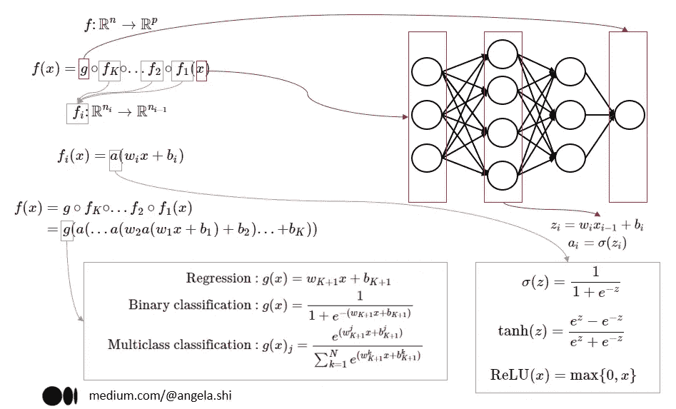
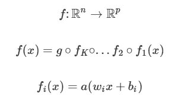
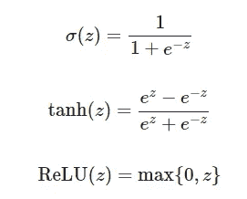
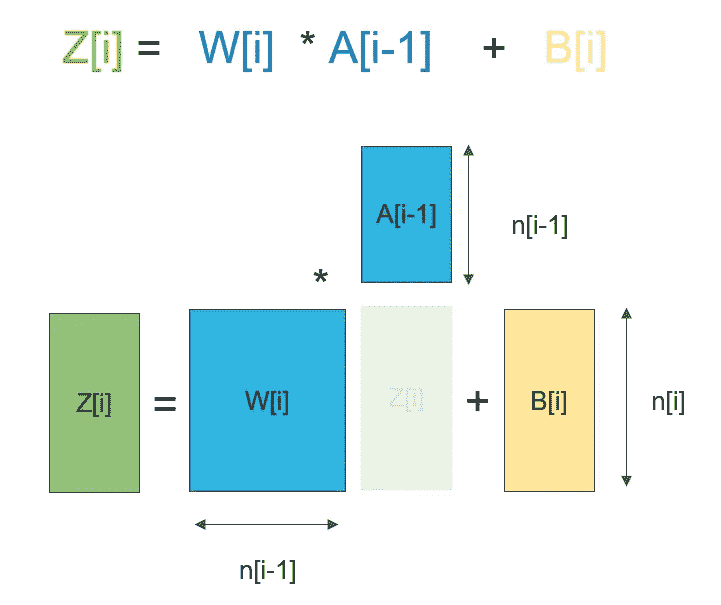
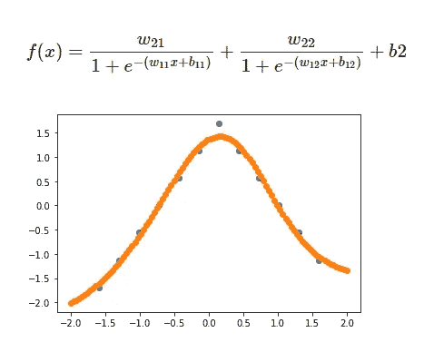
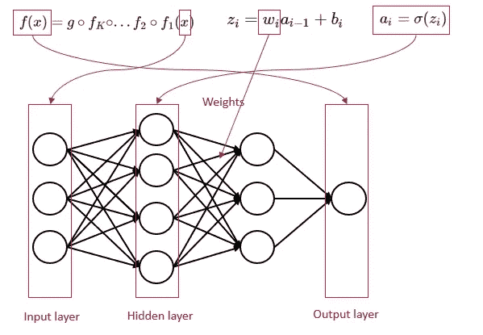

# 如何将神经网络定义为数学函数

> 原文：<https://towardsdatascience.com/how-to-define-a-neural-network-as-a-mathematical-function-f7b820cde3f>

## 一个**多层神经网络**几乎总是被表示为一个带有**神经元网络**的图表，人们可能会忘记它只是一个**数学函数**。

为了提醒神经网络的基本原理，让我们在没有 *神经元、节点、突触、轴突、边缘、隐藏层、感知器*的情况下，硬定义它们**…**

作者图片

# 全局函数

一个 **k 层**神经网络是一个数学函数 f，它是一个**多元**函数的**组合**:f1，f2，…，fk，g，定义为:

> f : Rn→ Rp
> 
> f=g∘fk∘…∘f2∘f1

在哪里

*   **n** 是输入 **x** 的尺寸
*   **p** 是输出的尺寸 **y**
*   g 是**输出**函数(根据输出变量的不同，它可以采取不同的形式)
*   每个函数 f_i 本身是一个由多元函数组成的

> **f_i(x)=a(w_i x+b_i)**

****

**作者图片**

# **中介函数 f_i**

**每个函数 f_i 是由函数组成的复合函数**

*   ****wx+b** a **输入 **x** 的线性组合**及其系数 **w** ，加上一个偏置 **b** 。**
*   ****一个被称为**激活函数**的**(对于每个中间函数 f_i 都是一样的)**

**激活函数可以采取各种形式，例如 sigmoid、tanh、Relu 等。在[维基百科页面](https://en.wikipedia.org/wiki/Activation_function)上，有一个激活列表，如果你想看更多的话。我们可以用它们的数学公式来提醒一些最常见的:**

****

**作者图片**

**让我们通过引入权重 **w** 和偏差 **b** 来开发全局函数。**

****

**作者图片**

## **结构域和共结构域的维数**

**每个函数 f_i 将其在 Rn(i-1)(维数 n(i-1))中的输入映射到余域 Rni(维数 ni)，Rni 的维数可以由数学家选择(它是神经网络的超参数之一)。**

> **f_i : Rn(i-1)→ Rni**

**我们有一个特殊的情况:对于 i=1，函数 f1 的输入是全局输入 x。所以维数是 n。**

**对于每个中间函数 f_i，激活函数是相同的。对于矩阵形式，所有与维度相关的复杂性都发生在线性 **w_ix+b_i** 中**

*   ****x** 的尺寸为 **n(i-1)****
*   ****w** 是一个矩阵，它的维数是 **ni × n(i-1)****
*   ****b_i** 的尺寸为 **ni****

****

**作者图片**

**激活函数应用于尺寸为 **ni** 的矢量 **zi** 。**

# **输出函数 g**

**所有的中间函数 f_i 都在函数的嵌套复合中。输出函数 g 也是一个复合函数**

*   ****wx+b** a **输入 **x** 的线性组合**及其系数 **w** ，加上一个偏置**b****
*   ****答**激活函数取决于目标变量的性质。**

****

**作者图片**

*   **对于一个**回归**任务，输出激活函数是**身份函数**。所以我们只有线性组合。函数的共域是 r。**
*   **对于一个**二元分类**任务，输出激活函数为 **sigmoid** 。输出的值将在 0 和 1 之间。**
*   **对于**多类分类**任务，使用 **softmax 函数**。值得注意的是，输出是多元的。维数 N 是类的数量。对于每个类，计算 0 和 1 之间的输出。**

**我们可以通过引入权重和偏差来开发函数 **g** 的公式:**

****

**作者图片**

# **一些特殊情况**

**为了更好地形象化整个函数，让我们看一些简单的例子。**

## **无中介功能**

**如果没有中间函数，那么神经网络就相当于输出函数:**

*   **无隐含层和**连续目标变量**的神经网络为**线性回归****
*   **无隐含层和**二元目标变量**的神经网络为**逻辑回归****
*   **一个无隐含层的神经网络和一个多项目标变量**

****

**作者图片**

## **一个中介功能**

**如果只有一个中间函数，中间输入的维数是 2(好吧，就说它吧，2 个神经元)，那么我们就可以写下完整的函数及其图形。**

**用于回归**

****

**作者图片**

**对于二元分类**

****

**作者图片**

# **性感的词汇和图表**

**现在，你看到，用这种硬方法，完整的函数变得非常难以阅读。所以神经元网络的表示可以提高可读性。**

*   **神经元的**输入层**或**节点**代表输入 x，神经元的数量是输入 x 的维数**
*   ****输出层**代表输出 y，神经元的数量取决于目标变量的性质。对于**回归**和**二元分类**，只有 1。对于**多类分类**，神经元的数量就是类的数量。**
*   ****隐藏层**表示中间函数 f_i 的结果**
*   ****链接或突触**代表权重**和**的值。所以两层之间的所有链接一起代表一个矩阵。链接数为 **ni × n(i-1)** ，作为矩阵的维数 **wi。****

****

**作者图片**

# **结论**

**在某种程度上，数学家是很好的营销者。人工智能、神经网络无疑吸引了大众更多的关注。但是作为机器学习的初学者，不被这些术语愚弄也是有风险的。**

**我还想到了其他可以非性感方式定义的算法:**支持向量机，Ridge，Lasso，Elastic Net** 等。**

**你怎么想呢?**

**要获得监督机器学习算法的完整概述，您可以阅读以下文章:**

** [## 监督机器学习算法综述

### 大图如何通过连接点给我们洞察力和对 ML 的更好理解

towardsdatascience.com](/overview-of-supervised-machine-learning-algorithms-a5107d036296)** 

**为了更好地理解神经网络是如何工作的，有必要了解如何从头开始实现它。如果你懂一门编程语言，比如 **Python** ，你可以用编程的方式来做。如果没有，也可以在 **Excel** 中实现。你可以看看我下面的文章:**

** [## 想象一下神经网络是如何从头开始工作的

### 通过可视化每一步的结果，您可以更好地理解神经网络的工作原理

towardsdatascience.com](/visualize-how-a-neural-network-works-from-scratch-3c04918a278)  [## Excel 中从头开始的神经网络

### 为了更好地理解反向传播的工作原理

towardsdatascience.com](/neural-network-from-scratch-in-excel-4774f6131cdb) 

我写关于机器学习算法的文章，请通过下面的链接关注我，并完全访问我的文章:

 [## 通过我的推荐链接加入 Medium-Angela Shi

### 作为一个媒体会员，你的会员费的一部分会给你阅读的作家，你可以完全接触到每一个故事…

medium.com](https://medium.com/@angela.shi/membership)**