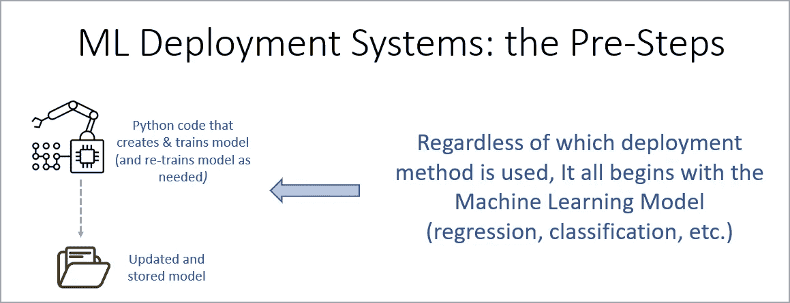
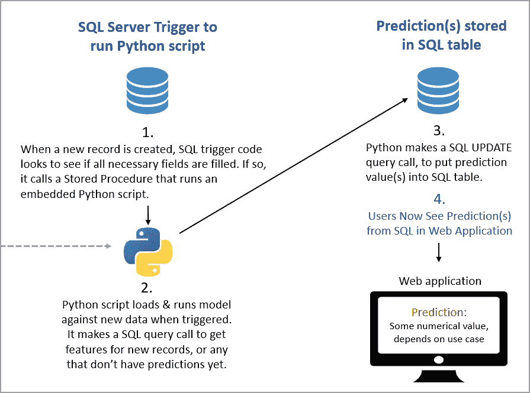

# 如何部署您的机器学习项目

> 原文：<https://towardsdatascience.com/how-to-deploy-your-machine-learning-project-dfc0cf1fba36>

## 将模型投入生产的三种方法的高级视图

# 需求—机器学习模型部署:

对于任何机器学习预测分析项目，结果(预测、预报等。)将不会到达预期的受众，除非采用一种方法来部署机器学习模型，以便它可以在新记录出现时或成批地对其进行“评分”。我听说，高达 99%的机器学习项目永远无法进入生产阶段。我相信阻止他们的是数据科学家没有学会如何部署他们的通用模型。

通常，生产中的模型会在 web 应用程序中显示其结果。本文旨在向您提供将模型投入生产的三种不同方法的高级视图，而不是提供这些方法的具体细节的“操作指南”。对于这三个示例，我将使用 Microsoft SQL Server，但是在另一个数据库系统中应该可以做类似的事情，除了第三个部署选项在 SQL 存储过程中使用嵌入式 Python 代码。那个只能在 Microsoft SQL Server 上运行。

# 期望的结果:

假设我们有一个向用户显示信息的 web 应用程序，包括一些表示预测的数值。这可能是为了二进制分类，其中我们想要知道记录被分类为“是”而不是“否”的概率是多少(用从 0 到 1 的百分比表示)。贷款申请是使用分类模型的一个例子。或者，我们可能希望显示日期和时间，或者 X 发生之前的分钟数或小时数，例如当车间中的机器预计将发生故障时，这将提示用户在该事件发生之前进行一些预防性维护。

我将展示三种部署机器学习模型的方法，以便用户可以在 web 应用程序中看到预测的结果。这些方法在创建、设置、部署和维护的复杂程度上会有所不同。对于所有这三种情况，我们都从模型训练代码开始，运行并存储一个模型，供以后在评分中使用。

**图一。**构建、训练和存储预测模型的 Python 代码

作者图片

# ML 部署系统#1: API 和容器

第一个部署选项包括以下步骤:

**1。**创建一个新记录评分 API。

**2。**让 web 应用程序在后台调用 API(服务器端)，提供一些关于记录的细节，以便…

**3。**API 中的代码可以构建并运行 SQL 查询，该查询创建并填充 ML 模型评分所需的所有特性。

**4。**让 API 代码在数据库表中存储每个新记录的预测值，并…

**5。**让 web 应用程序显示结果，例如“是”的概率(分类模型示例)、“估计到达时间”(回归模型示例)等。，针对每个打开的记录。

在图 2 中，我们看到已经创建了一个 API，并存储在 Docker 容器中。该 API 将位于一个正在运行的 web 服务器上，并将等待向它发出的请求。

**图二。**嵌入在 Docker 容器中的 Python API 具有可移植性和可靠性

作者图片

在下一张图(图 3)中，执行了一整套步骤。注意**步骤 7** 可以有两个目的(存储结果和显示结果)，同时做以下事情:

**a)**web 应用程序从 API 获得结果后，会将这些结果存储在危险的数据库表中。

**b)** 在向用户显示屏幕之前，web 应用程序会填充数据库表中的字段，包括预测结果。

**c)** 然后，web 应用程序显示每条记录的所有数据，包括预测值。如果我们跳过上面的步骤 a)和 b ),我们可能仍然能够在网页上显示结果，但是我们还没有将它们存储在数据库中，这是我们通常想要做的事情。

**图 3。**API&容器部署方法的完整示意图

图片作者和[icon-library.com](https://icon-library.com/icon/docker-container-icon-26.html)

## API 和容器方法的优点和挑战

这个系统有许多部分，数据科学家和/或开发人员必须掌握这些技能。但是这个系统也有一些优点。

## 正面

*   任何需要进行预测的 web 或控制台应用程序都可以调用 API。
*   将 API(以及潜在的调用它的 web 应用程序)放入 Docker 容器是封装和保护代码及其依赖项(例如特定的 Python 包版本)的一种极好的方式。
*   Docker 容器可以在本地托管，也可以放入您使用的云平台，无论是 AWS、GCP 还是 Azure。

## 挑战

*   创建一个 API 需要时间，因为它不仅仅是一个 Python 脚本。
*   托管一个 API(或者包含它的容器)需要与保持它运行的资源进行协调。
*   Docker 容器有一个学习曲线。
*   开发者需要获得 Docker 桌面的批准才能使用 Docker 容器。

# ML 部署系统#2: SQL 触发器调用 Python 文件进行评分

虽然 API & Containers 方法(系统#1)可能是健壮和可靠的，但它并不简单。事实上，必须为需要运行的容器和 Streamlit web 应用程序和 API 管理服务器，这使得它变得相当复杂。还有其他更简单的系统也能满足需求。

第一个系统可能是最简单的，但也有其自身的挑战。理想情况下，我们将在 SQL Server 的本地驱动器中创建一个 Python 虚拟环境(因为用于其他目的的 Python 文件可能同样需要由其作者运行)，位于包含我们的 Python 评分脚本的文件夹下。这确保了我们计划为其他预测模型运行的其他 Python 文件也可以安全地驻留在该驱动器中，并且不会由于基本 Python 环境中的包的变化而失败。图 4 中的步骤 2 将让 SQL 使用 xp_cmdshell 调用运行 Python 脚本的批处理文件。这里的可以找到一个例子[。](https://www.mssqltips.com/sqlservertip/7083/run-python-scripts-sql-server-agent-job/)

**图四。**SQL 和外部 Python 方法

作者图片

## SQL 和外部 Python 方法的优点和挑战

这项工作部分发生在数据库内部，部分发生在 SQL“计分”脚本中。

## 正面

*   只有三个主要部分— (1)调用批处理文件的 SQL 触发器代码，(2)调用 Python 脚本文件的批处理文件，以及(3)对记录进行评分并将其更新回 SQL 表的 Python 代码。
*   大多数数据科学家已经用 Python 编码了。
*   这与 MS SQL Server(可能是其他 RDBMS)配合得很好。

## 挑战

*   模型文件(pickle 或一些其他压缩文件)和评分脚本需要驻留在 SQL Server 实例的计算机上，或者可能驻留在该计算机的驱动器盘符下的目录中(C:，L:，K:，等等)。).
*   服务器需要为评分脚本设置正确的 Python 虚拟环境。
*   必须在服务器上创建并定位一个批处理文件，SQL 调用该文件并运行 Python 脚本。
*   要将信息写回 SQL 表，必须在 Python 脚本中使用 SQL 数据库的凭据。

# ML 部署系统#3: SQL 触发器代码运行嵌入式 Python

该系统还使用 SQL Server 触发器，以及作为 NVARCHAR 字符串嵌入到存储过程中的 Python 脚本。这就是微软现在所说的“ [SQL Server 机器学习服务](https://docs.microsoft.com/en-us/sql/machine-learning/sql-server-machine-learning-services?view=sql-server-ver15) (Python 和 R)”。这种方法存在一些挑战。尽管如此，它远没有 API &容器系统复杂，但它要求开发人员知道如何创建 SQL 触发器，并要求 SQL Server 调用嵌入式脚本。它还需要对 SQL 数据库的更新权限，以便 Python 脚本可以在字段中输入值来保存预测。图 5 显示了在用新的预测值更新表格之前的第一部分。

**图 5。**新记录插入表中，触发 SQL 代码，运行 Python 代码对新记录评分。

作者图片

在 Python 脚本对新记录进行评分后，它将向数据库发送一个 SQL UPDATE 查询调用(图 6 ),并将新的预测值放入保存记录的 SQL 表的一个字段中。该字段可以是一个表示概率的浮点值(用于分类)或 X 发生前的估计分钟数，甚至可以是一个日期/时间值，通过将估计分钟数添加到该记录的开始日期/时间来创建(用于回归)。存储的内容取决于模型的用途。

**图 6。**危险预测存储在 SQL Server 表中。

作者图片

图 7 显示了部署系统#2 的完整步骤。很明显，它的“活动部件”比系统 1 少。

假设我们的 web 应用程序每 15 秒刷新一次显示的记录。一旦向表中添加了一条记录，就应该足够快地完成并记录预测，以便下次刷新页面时显示预测值以及该记录的其他字段。如果 Python 脚本和模型存储在 SQL Server 表中，那么从触发到更新的整个过程应该只需要几秒钟就可以运行。下次页面刷新时，新记录的预测值将与该记录的其他字段一起出现。

**图七。**整个 SQL 触发器部署系统，从开始到结束

作者图片

## SQL 触发器和嵌入式 Python 方法的优点和挑战

## 正面

*   评分发生在存储过程中，任何网页中的触发器或代码都可以调用该存储过程。
*   不需要创建 API。
*   不需要设置码头集装箱。
*   Python(或 R)代码运行在与所使用的表相同的 SQL Server 上，运行速度非常快。

## 挑战

*   它需要在 SQL Server 实例上启用 Python 的外部脚本执行。
*   学习将 Python 脚本嵌入存储过程的正确方法需要时间和练习。
*   SQL Server 需要安装代码所需的所有 Python 包。
*   在 SQL Server 机器上创建 Python 虚拟环境可能更难。
*   不能使用特定于 python 脚本(用于封装和保护 Python 代码)的虚拟环境，因为脚本完全嵌入在 SQL 存储过程中。它只能使用基本的 Python 环境。
*   脚本所需的包必须安装在基本 Python 环境中的 SQL Server 上，否则必须修改嵌入式脚本以仅使用标准 Python 包，这些包是安装在 SQL Server 上的机器学习服务的一部分。

# 摘要

本文的核心是三种部署方法的三个不同图像。我将在下面一起重复它们，以帮助您在开始充实您将如何部署您的机器学习项目的细节之前评估这些差异。

图片作者和[icon-library.com](https://icon-library.com/icon/docker-container-icon-26.html)

作者图片

作者图片

希望这篇文章对你有所帮助。在接下来的几个月里，我会写更多关于我作为数据科学家所学到的东西。

关注我或订阅(带有信封图标的按钮)很容易获得新文章的通知…只需**点击页面侧面或底部的绿色按钮**。