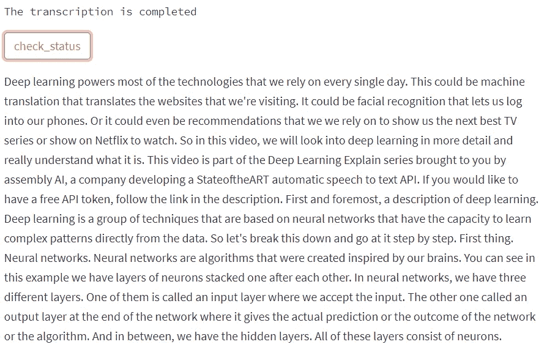

# 如何使用 Python 部署您自己优化的语音转文本 Web 应用程序

> 原文：<https://towardsdatascience.com/how-to-deploy-your-own-optimized-speech-to-text-web-app-with-python-c956c7838ec8>

## 关于如何构建自己的语音转文本 web 应用程序以最佳方式将音频转换为文本格式的详细指南


伊恩·哈勃在 [Unsplash](https://unsplash.com?utm_source=medium&utm_medium=referral) 上拍摄的照片

语音是人类使用的最有效的交流方式之一。有声读物和播客在过去几年越来越受欢迎，尤其是在现代快节奏的生活方式下。然而，阅读一直是我们生活中至关重要的一个方面，也是获取信息的最受欢迎的方法。阅读这篇文章的读者就是最好的例子。

因此，将普通音频数据转换成可读的文本格式以达到广泛的受众的需求是至关重要的。无论是电影中的字幕还是有声读物到书面材料的转换，从可用语音中提取文本数据都是一个重要的应用。通过正确的深度学习技术，可以获得高度优化的语音到文本的转换。

在本文中，我们将了解如何构建一个最佳的方法来将音频数据转换成文本。我们将利用 [AssemblyAI](https://www.assemblyai.com/) 平台，使我们能够以最有效的方式转录和理解音频。现在让我们着手开始这个项目的建设吧！

# 构建语音转文本 Web 应用程序:

在这一节中，我们将构建语音到文本的 web 应用程序来转录视频。我们将利用 AssemblyAI 的 API token 中的一种易于使用的技术来高效率地转录音频文件。我们还将在 streamlit 中使用一个交互式 web 框架来部署我们的项目。首先，让我们获得成功运行这个项目所需的所有组件。

## 安装所有必需的依赖项:

用户需要安装的两个主要需求是用于部署项目的 streamlit web 开发框架和 youtube-dl 库，该库将帮助我们从 youtube 和其他类似的视频网站下载视频。这两个库都可以通过简单的 pip 安装命令下载，如下所示。

```
pip install streamlit
pip install youtube_dl
```

可以在命令提示符下键入这些命令，如上所示。至于最后一个依赖项，我们需要安装 FFmpeg。这是一个免费的开源软件项目，它将使我们能够以最有效的方式处理音频文件、视频内容、流和其他多媒体文件。因此，从下面的[链接](https://ffbinaries.com/downloads)下载需求，并通过进入 Windows 平台中的环境变量将它们直接添加到您的路径中。

您可以安装一个 FFmpeg，并提供其 bin 文件的路径，也可以从提供的链接下载 Windows 64 的所有要求。如果你想继续我所做的，那么你可以下载 ffmpeg，ffprobe 和 ffplay 到一个名为 Paths 的文件夹中，并把它添加到你的环境变量中，如下图所示。


作者图片


作者图片

既然我们已经获得了所有必需的库需求，我们可以继续创建一个新的 Python 文件并相应地导入它们。我将把这个 Python 文件命名为 final_app.py。这个 Python 文件将包含我们项目的所有主要代码内容。

```
import streamlit as st
import youtube_dl
import requests
from config import API_Key
```

值得注意的是，我们现在已经有了所有必要的导入，包括请求库，它将允许我们轻松地访问任何网站的 URL 链接。然而，有人可能想知道配置导入是什么，我们将在下一节中弄清楚它是什么。

## 创建配置文件:

在我们继续编码过程之前，我们将访问 [AssemblyAI](https://www.assemblyai.com/) 平台，在那里我们可以免费创建一个帐户，并获得一个 API 密钥，我们可以利用它来轻松理解和转录音频。一旦您登录到您的帐户，您就可以在屏幕右侧复制您的 API 密钥。

在下一步中，我们将创建另一个 Python 文件，该文件将存储从 AssemblyAI 平台生成的 API 密钥。确保将创建的 Python 文件标记为 config.py，在这里我们可以创建一个名为 API_Key 的变量，该变量将存储我们之前从 AssemblyAI 平台复制的 API 地址。代码片段如下所示。

```
API_Key = "Enter Your Key Here"
```

## 添加所有必要的参数:

一旦您完成了配置文件的创建，项目的其余部分将在 final_app.py 部分进行编码。首先，我们将添加下载视频所需的基本参数，并设置 AssemblyAI 网站的适当位置。在理解这些参数的解释之前，让我们先看看下面的代码块。

```
ydl_opts = {
   'format': 'bestaudio/best',
   'postprocessors': [{
       'key': 'FFmpegExtractAudio',
       'preferredcodec': 'mp3',
       'preferredquality': '192',
   }],
   'ffmpeg-location': './',
   'outtmpl': "./%(id)s.%(ext)s",
}
```

在上面的代码块中，我们只是定义了 YouTube downloader 所需的一些基本约束。我们将以最佳音频的形式下载视频，并以 mp3 格式保存在我们的本地驱动器中。在下一个代码片段中，我们将为 AssemblyAI 平台定义参数。

```
transcript_endpoint = "[https://api.assemblyai.com/v2/transcript](https://api.assemblyai.com/v2/transcript)"
upload_endpoint = '[https://api.assemblyai.com/v2/upload'](https://api.assemblyai.com/v2/upload')headers_auth_only = {'authorization': API_Key}
headers = {
   "authorization": API_Key,
   "content-type": "application/json"
}
CHUNK_SIZE = 5242880
```

我们正在描述我们将上传音频文件的端点，以及该文件的转录将发生的端点。最后，我们还将设置指向我们之前获得的 API 键的头。块大小变量将帮助我们把较大的音频文件分成较小的块。让我们转到下一部分，我们将转录视频。

## 使用 AssemblyAI 转录 YouTube 视频:

在本节中，我们将创建一个函数来帮助我们转录整个音频数据。首先，我们将从 streamlit 调用一个缓存函数，该函数将存储以前的数据，并且只有在函数的参数发生变化时才会执行新的操作。转录链接是计算所有必要动作的主要功能。确保本节中的所有其他语句和函数都是在 register _ from _ link()函数下定义的。

```
[@st](http://twitter.com/st).cache
def transcribe_from_link(link, categories: bool):
```

在 regulate _ from _ link()下的第一个函数中，我们将利用 youtube-dl 导入，并使用视频 ID 将音频内容下载到我们想要的保存位置。我们现在将创建另一个函数来读取下载文件的内容，并将其上传到 AssemblyAI 网站。下面是以下功能的代码片段。

```
_id = link.strip()def get_vid(_id):
  with youtube_dl.YoutubeDL(ydl_opts) as ydl:
   return ydl.extract_info(_id)# download the audio of the YouTube video locally
 meta = get_vid(_id)
 save_location = meta['id'] + ".mp3"print('Saved mp3 to', save_location)def read_file(filename):
  with open(filename, 'rb') as _file:
   while True:
    data = _file.read(CHUNK_SIZE)
    if not data:
     break
    yield data
```

在本节的最后一段代码中，我们将使用 requests 库将下载的音频文件上传到 AssemblyAI 平台。一旦上传了音频文件，我们就可以通过发送另一个执行以下操作的请求来开始转录过程。最后，我们可以访问音频文件的转录及其各自的 ID，并将其存储在轮询端点，包含我们的最终结果。

```
# upload audio file to AssemblyAI
 upload_response = requests.post(
  upload_endpoint,
  headers=headers_auth_only, data=read_file(save_location)
 )audio_url = upload_response.json()['upload_url']
 print('Uploaded to', audio_url)# start the transcription of the audio file
 transcript_request = {
  'audio_url': audio_url,
  'iab_categories': 'True' if categories else 'False',
 }transcript_response = requests.post(transcript_endpoint, json=transcript_request, headers=headers)# this is the id of the file that is being transcribed in the AssemblyAI servers
 # we will use this id to access the completed transcription
 transcript_id = transcript_response.json()['id']
 polling_endpoint = transcript_endpoint + "/" + transcript_idprint("Transcribing at", polling_endpoint)return polling_endpoint
```

> **注意:**请查看完整的代码部分，以便更好地复制粘贴上述代码。上述代码块中所有剩余的函数和语句都必须在 register _ from _ link()函数下定义。

## 构建 web 应用程序:

在本节中，我们将使用 streamlit 框架开发 web 应用程序。首先，我们将定义一些我们将在网站布局中使用的功能。web 应用程序可能需要一些时间来完成上传音频文件和接收转换后的文本数据的执行。为了监控所用的时间，我们将使用 get_status 和 refresh_state 函数，这将使我们能够接收响应并检查网站是否在工作。

然后，我们可以继续添加标题和文本框，这将允许用户添加一个链接，通过它可以下载 YouTube 视频的音频并相应地进行转录。我们还将添加一个按钮，允许用户点击并检查转录过程的状态。web 开发的代码如下面的代码片段所示。

```
if 'status' not in st.session_state:
    st.session_state['status'] = 'submitted'def get_status(polling_endpoint):
 polling_response = requests.get(polling_endpoint, headers=headers)
 st.session_state['status'] = polling_response.json()['status']def refresh_state():
 st.session_state['status'] = 'submitted'st.title('Easily transcribe YouTube videos')link = st.text_input('Enter your YouTube video link', '[https://youtu.be/dccdadl90vs'](https://youtu.be/dccdadl90vs'), on_change=refresh_state)
st.video(link)st.text("The transcription is " + st.session_state['status'])polling_endpoint = transcribe_from_link(link, False)st.button('check_status', on_click=get_status, args=(polling_endpoint,))transcript=''
if st.session_state['status']=='completed':
 polling_response = requests.get(polling_endpoint, headers=headers)
 transcript = polling_response.json()['text']st.markdown(transcript)
```

## 完整代码:


作者图片



作者图片

最后，让我们以 GitHub embed 的形式探索一下这个项目的全部代码，看看它是什么样子的。观众可以选择复制粘贴下面的代码来执行他们的项目，并立即尝试对这个项目的各种解释。

完成代码设置后，使用下面的命令运行程序。

```
streamlit run final_app.py
```

如果观众正在寻找关于这个主题的视频教程，我强烈建议查看下面的[链接](https://www.youtube.com/watch?v=CrLmgrGiVVY),以获得关于如何以两部分系列的形式执行以下项目的简明解释。

# 结论:


照片由[以色列总统府](https://unsplash.com/@othentikisra?utm_source=medium&utm_medium=referral)在 [Unsplash](https://unsplash.com?utm_source=medium&utm_medium=referral) 拍摄

随着自然语言处理领域的不断发展，深度学习模型在处理与其相关的任务时变得更加高效。正如本文所讨论的，通过利用现代人工智能技术，我们能够在语音到文本转换的任务上取得非常先进的结果。我们将在以后的文章中涵盖更多这样有趣的项目！

在本文中，我们详细探讨了如何在 streamlit 和 AssemblyAI 平台的帮助下，轻松构建自己的 web 应用程序，成功地将音频数据转换为文本形式。如果你对这篇文章中提到的各点有任何疑问，请在下面的评论中告诉我。我会尽快给你回复。

如果你想在我的文章发表后第一时间得到通知，请点击下面的[链接](https://bharath-k1297.medium.com/membership)订阅邮件推荐。如果你希望支持其他作者和我，请订阅下面的链接。

[](https://bharath-k1297.medium.com/membership) [## 通过我的推荐链接加入媒体

### 作为一个媒体会员，你的会员费的一部分会给你阅读的作家，你可以完全接触到每一个故事…

bharath-k1297.medium.com](https://bharath-k1297.medium.com/membership) 

看看我的一些与本文主题相关的文章，你可能也会喜欢阅读！

[](/develop-your-weather-application-with-python-in-less-than-10-lines-6d092c6dcbc9) [## 用 Python 开发不到 10 行的天气应用程序

### 使用 Python 构建我们的天气电视广播应用程序，以接收所需位置的更新

towardsdatascience.com](/develop-your-weather-application-with-python-in-less-than-10-lines-6d092c6dcbc9) [](/develop-your-own-calendar-to-track-important-dates-with-python-c1af9e98ffc3) [## 使用 Python 开发您自己的日历来跟踪重要日期

### 开发一个日历 GUI 界面来管理您 2022 年及以后的计划

towardsdatascience.com](/develop-your-own-calendar-to-track-important-dates-with-python-c1af9e98ffc3) [](/complete-python-starter-guide-for-data-science-for-2022-c1f880fa249d) [## 2022 年数据科学完整 Python 入门指南

### 涵盖了用代码启动数据科学所需的所有 Python 基础和基本概念…

towardsdatascience.com](/complete-python-starter-guide-for-data-science-for-2022-c1f880fa249d) 

谢谢你们坚持到最后。我希望你们都喜欢这篇文章。祝大家有美好的一天！