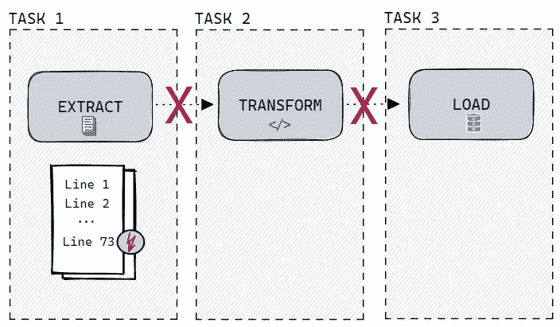

# 如何在 Apache 气流中设计更好的 Dag

> 原文：<https://towardsdatascience.com/how-to-design-better-dags-in-apache-airflow-494f5cb0c9ab>

## 数据工程

## 设计工作流时需要知道的两个最重要的属性

[活动发起人](https://unsplash.com/@campaign_creators?utm_source=medium&utm_medium=referral)在 [Unsplash](https://unsplash.com?utm_source=medium&utm_medium=referral) 上的照片

[**上周**](/setting-up-apache-airflow-with-docker-compose-in-5-minutes-56a1110f4122) ，我们学习了如何快速搭建 Apache Airflow 的开发环境。

这太棒了。

然而，我们还需要学习如何设计一个高效的工作流程。不幸的是，仅仅在我们的指尖有一个伟大的工具并不能单独解决问题。

虽然 Apache Airflow 在为我们做大部分繁重的工作方面做得很好，但是我们仍然需要**确保每个 Airflow 任务的某些关键属性**，以便获得正确和一致的结果。

幸运的是，存在许多最佳实践。

今天，我们从普遍适用于所有工作流的两个最重要的概念开始。

今天，我们学习**原子性**和**幂等性**。

# 全有或全无:原子性

通常在数据库系统的上下文中使用，原子性是 ACID 属性之一，被认为是一系列不可分割、不可约的操作，因此要么全部发生，要么什么都不发生。要么完全执行，要么根本不执行。

就 Apache Airflow 而言，这意味着任务应该以这样一种方式定义，即**允许成功**和适当的结果**或者完全失败**，而不影响系统的状态。

让我们想象一下，我们必须从 CSV 文件中提取数据，对其进行一些转换，并将结果写入数据库。

很简单，对吧？

一个不好的，**非原子方法**如下。

我们逐行提取数据，立即应用转换，并将结果立即上传到数据库。**都在同一个任务**内。

非原子方法[图片由作者提供]

现在，如果一些行被破坏，任务中途失败，我们只剩下期望结果的一部分。一些行已经被处理和插入——一些根本不存在。在避免重复的同时调试和重新运行这项任务将是一场噩梦。

一个改进的，**原子工作流**可以这样定义。

原子任务的更好方法[图片由作者提供]

所以要记住的一般经验是**将操作**分成不同的任务。一个操作等于一个单一任务——想想[单一责任原则](https://en.wikipedia.org/wiki/Single-responsibility_principle)。

> 不幸的是，这个简单的规则不能每次都适用。

一些操作是如此的**紧密耦合**，以至于最好**将它们保持在一个** **一致的工作单元**。例如，在执行请求之前对 API 进行身份验证。

幸运的是，大多数**气流操作器都是以原子方式**设计的，可以直接使用。然而，对于更灵活的操作符类型，如 Bash 或 Python 操作符，我们在设计工作流时必须更加小心谨慎。

创建原子气流任务允许**从失败中恢复**的能力，并且只重新运行失败的和下游的任务。原子性提供了更容易维护和**透明的工作流**，没有隐藏的依赖性和副作用。

# 开始、停止、倒带:等幂

幂等性的概念与原子性的概念密切相关，并描述了数学和计算机科学中某些运算的属性。因此操作可以**多次应用，而不改变初始应用之外的结果**。

把按下控制面板上的“on-button”想象成一种操作。多次按下此按钮与只按一次效果相同。

> 那么这在阿帕奇气流的上下文中意味着什么呢？

使用相同的输入多次调用相同的任务没有额外的效果。换句话说，如果**在不改变输入** **的情况下重新运行一个任务产生了** **相同的输出**，则可以认为它是幂等的。

幂等性允许**减少故障恢复时间**，并且**减少数据丢失**。

现在，假设我们的工作是从数据库中获取特定日期的数据，并将结果写入 CSV 文件。在同一天重新运行该任务应该会覆盖现有文件，并且每次执行时**都会产生相同的输出**。

每次都产生相同输出的幂等任务[图片由作者提供]

假设，我们以不同的方式设计我们的任务，在每次重新运行时，我们简单地将记录附加到一个现有的文件中。

现在，我们**违背了** **幂等**的概念。任务的每次重新运行都会产生不同的结果，其中包含重复的记录。

产生重复结果的非等幂任务[图片由作者提供]

一般来说，写的任务应该**检查现有记录**，**覆盖**或者使用**上插**操作，以符合等幂规则。

然而，对于更一般的应用，我们必须仔细考虑所有可能的副作用。

# 结论:

在本文中，我们讨论了在 Apache Airflow 中设计 Dag 时的两个最重要的原则:**原子性**和**幂等性**。

记住这些概念使我们能够**创建更好的工作流**，这些工作流是可恢复的、可重新运行的、容错的、一致的、可维护的、透明的，并且更容易理解。

然而，在编码和创建下一个工作流时，有更多的[最佳实践](https://www.astronomer.io/guides/dag-best-practices/)需要遵循和考虑。

但这是改天的话题…

  

*喜欢这篇文章吗？成为* [*中等会员*](https://medium.com/@marvinlanhenke/membership) *继续无限学习。如果你使用下面的链接，我会收到你的一部分会员费，不需要你额外付费。*

  

**参考资料/更多资料:**

*   [1][https://en . Wikipedia . org/wiki/Atomicity _(database _ systems)](https://en.wikipedia.org/wiki/Atomicity_(database_systems))
*   [https://www.webopedia.com/definitions/atomic-operation/](https://www.webopedia.com/definitions/atomic-operation/)
*   [https://en.wikipedia.org/wiki/Idempotence](https://en.wikipedia.org/wiki/Idempotence)
*   [https://en.wikipedia.org/wiki/ACID](https://en.wikipedia.org/wiki/ACID)
*   [https://en . Wikipedia . org/wiki/Single-respons ibility _ principal](https://en.wikipedia.org/wiki/Single-responsibility_principle)
*   [https://www.astronomer.io/guides/dag-best-practices/](https://www.astronomer.io/guides/dag-best-practices/)
*   朱利安.德.鲁特.巴斯.哈伦斯克。阿帕奇气流的数据管道。纽约:曼宁，2021。