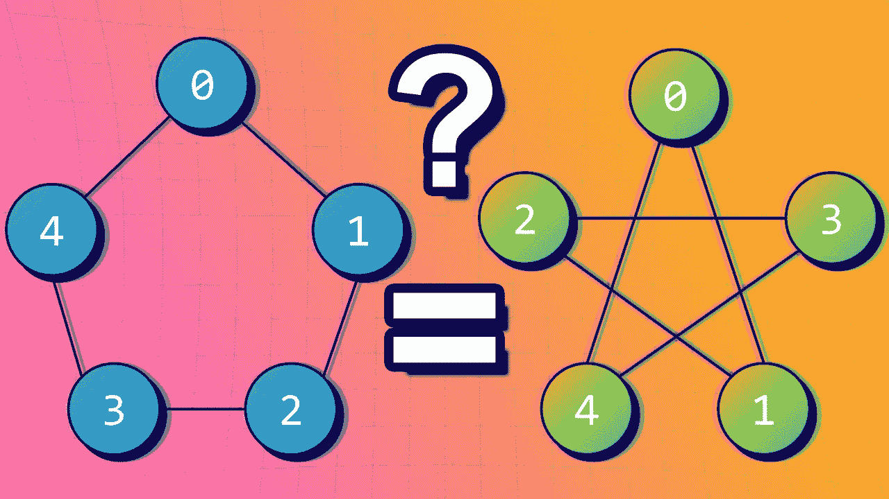
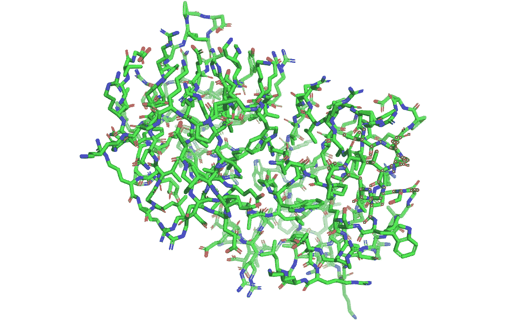
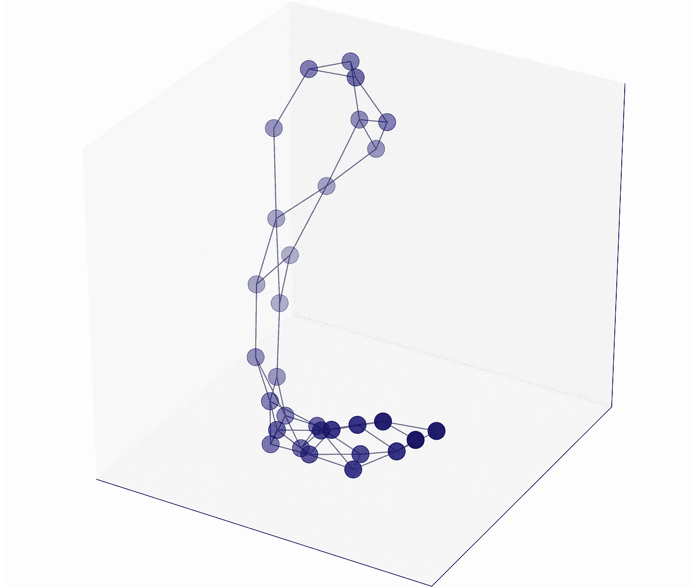
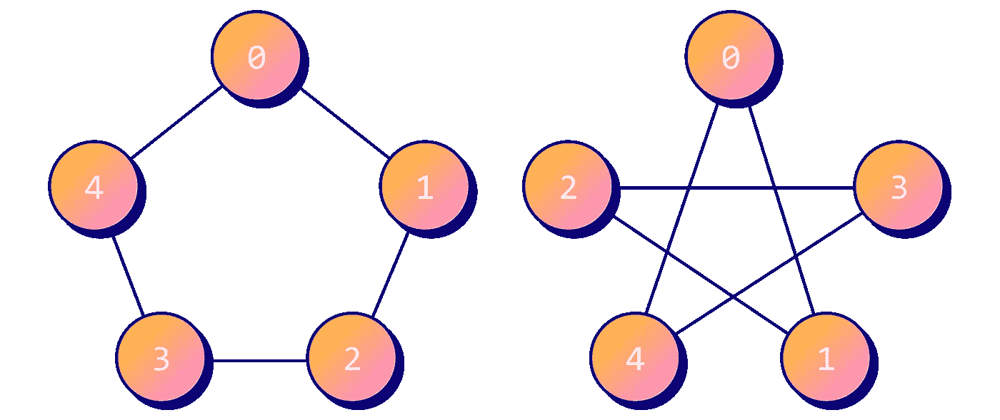
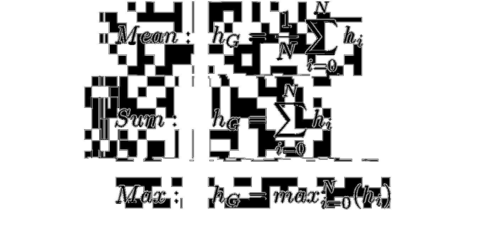
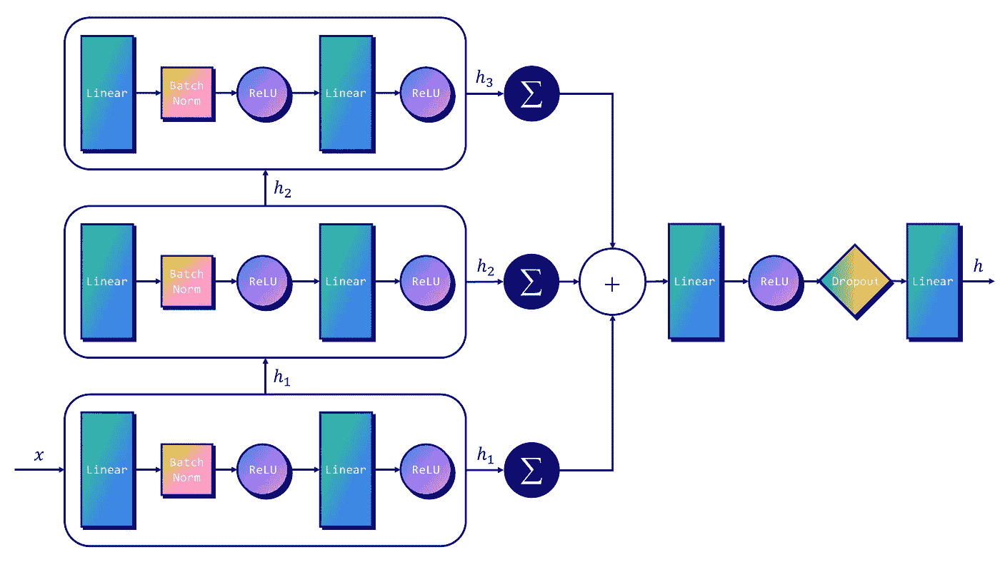
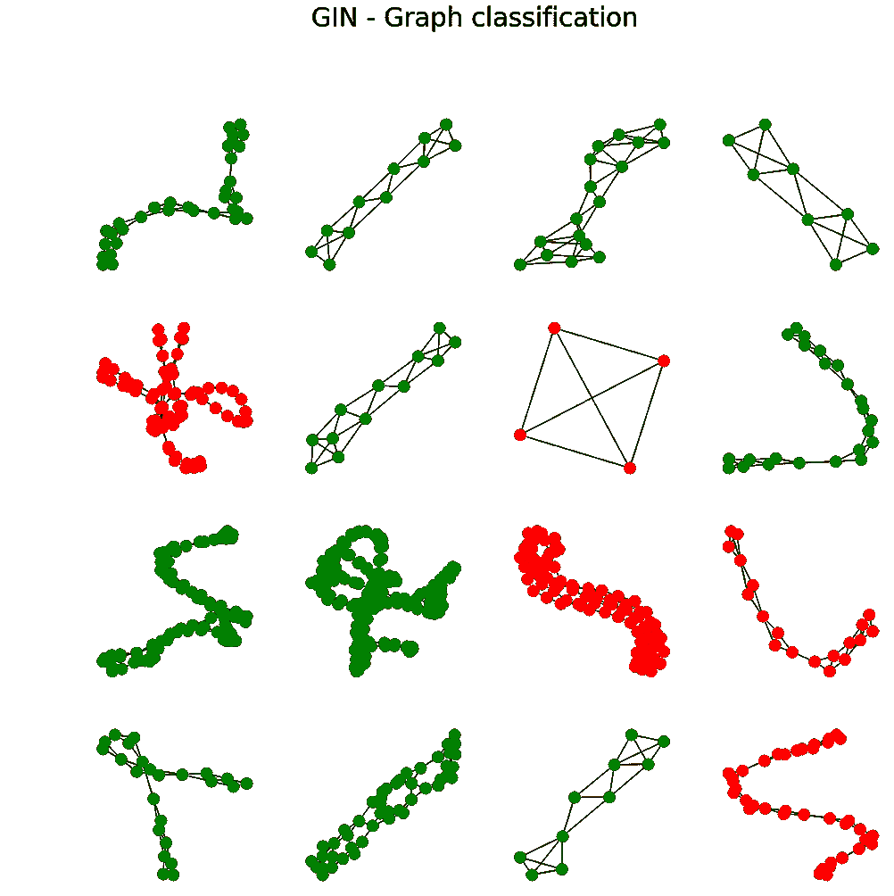

# GIN:如何设计最强大的图形神经网络

> 原文：<https://towardsdatascience.com/how-to-design-the-most-powerful-graph-neural-network-3d18b07a6e66>

## 基于图同构网络的图分类



作者图片

图形神经网络不限于对节点进行分类。

最流行的应用之一是**图分类**。这是处理分子时的一项常见任务:它们被表示为图形，每个原子(节点)的特征可用于预测整个分子的行为。

然而，GNNs 只学习节点嵌入。如何将它们组合起来，以产生一个完整的嵌入的**图？在本文中，我们将:**

*   看到一种新型的层，叫做“**全局池**”，来组合节点嵌入；
*   介绍一种叫做**图同构网络** (GIN)的新架构，由[徐等人](https://arxiv.org/abs/1810.00826v3)于 2018 年设计。

我们将详细说明与 GCN 或 GraphSAGE 相比，GIN 在辨别能力方面的优势，以及它与 Weisfeiler-Lehman 测试的联系。除了它强大的聚合器，GIN 还带来了关于 GNNs 的令人兴奋的收获。

可以用下面的 [Google Colab 笔记本](https://colab.research.google.com/drive/1b6SWugNKnxsI0L9auX1zwszlXf3rRZyS?usp=sharing)运行代码。

# 🌐一.蛋白质数据集



蛋白质的 3D 图(图片由作者提供)

[蛋白质](https://chrsmrrs.github.io/datasets/docs/datasets/)是生物信息学中的一个流行数据集。它是代表蛋白质的 1113 个图的集合，其中节点是氨基酸。两个节点足够近的时候用一条边连接(< 0.6 纳米)。目标是将每种蛋白质归类为**酶**或**而非**。

酶是一种特殊类型的蛋白质，作为催化剂加速细胞中的化学反应。它们对消化(如脂肪酶)、呼吸(如氧化酶)和人体的其他重要功能至关重要。它们也用于商业应用，如抗生素的生产。

该数据集也可在 TUDataset 上获得，并在 PyTorch Geometric 中实现。

```
**Dataset: PROTEINS(1113)** ----------------------
Number of graphs: 1113
Number of nodes: 23
Number of features: 3
Number of classes: 2
```

我不是生物化学家，所以我对这些蛋白质很好奇。让我们绘制一个图表，看看它看起来像什么:



使用 matplotlib 绘制蛋白质的 3D 图(图片由作者提供)

先前的 3D 结构是**随机生成的**:获得正确的 3D 表示是一个非常困难的问题，这是 [AlphaFold](https://alphafold.ebi.ac.uk/) 的全部要点。

图形不是表示分子的唯一方式。简化的分子输入行输入系统(**微笑** ) 是另一种流行的方法，它使用行(串)符号。它是通过打印在稍微修改的分子图的深度优先树遍历中遇到的节点而获得的。

研究人员在研究分子或化合物时经常使用这种表示法。对我们来说幸运的是，蛋白质数据集已经以图表的形式进行了编码。否则，我们可能不得不将微笑字符串转换成`networkx`图形。

这并不意味着我们将直接向 GNN 提供蛋白质数据集。如果说 [GraphSAGE](https://mlabonne.github.io/blog/graphsage/) 教会了我们什么的话，那就是**迷你批处理非常高效**。现在，每当我们实施 GNN 时，它都是不可或缺的工具。

```
**Training set**   = 890 graphs (14 subgraphs)
**Validation set** = 111 graphs (2 subgraphs)
**Test set**       = 112 graphs (2 subgraphs)
```

蛋白质并不是一个庞大的数据集，但是小批量将会加快训练的速度。我们可以使用 GCN 或 GAT，但是我想介绍一种新的架构:图同构网络。

# 🍾二。图形同构网络

杜松子酒是由研究人员设计的，他们试图最大限度地发挥 GNN 的代表性(或辨别力)。但是你如何定义“代表力”？

# A.魏斯费勒-雷曼试验

表征 GNN 的“能力”的一种方式是使用魏斯费勒-雷曼(WL)图同构测试。[同构的图](https://en.wikipedia.org/wiki/Graph_isomorphism)意味着它们具有**相同的结构**:相同的连接但是节点有排列。WL 测试能够判断两个图是否同构，但不能保证它们同构。



两个同构的图(图片作者)

这可能看起来不多，但是要区分两个大图是非常困难的。其实这个问题不是已知的在多项式时间内可解，也不是 NP 完全的。它甚至可能介于两者之间，处于计算复杂性类别[NP-中级](https://en.wikipedia.org/wiki/Graph_isomorphism_problem)(如果它只存在的话)。

好吧，但这和 GNNs 有什么关系？一些图形学习的研究人员注意到**这个测试和 GNNs 学习的方式奇怪地相似**。在 WL 测试中，

1.  每个节点都以**相同的标号**开始；
2.  来自相邻节点的标签被聚集并且**被散列**以产生新的标签；
3.  重复上述步骤，直到标签**停止变化**。

如果你对 WL 测试感兴趣，我会推荐[这篇大卫·比伯的博客文章](https://davidbieber.com/post/2019-05-10-weisfeiler-lehman-isomorphism-test/)和[这篇迈克尔·布朗斯坦的文章](/expressive-power-of-graph-neural-networks-and-the-weisefeiler-lehman-test-b883db3c7c49)。

这个测试不仅类似于 GNNs 中如何聚集特征向量，而且它区分图形的能力使它比许多架构更强大，包括 GCNs 和 GraphSAGE。这启发了[徐等人](https://arxiv.org/abs/1810.00826v3)设计了一种新的聚合器，他们证明这种聚合器与测试一样好。

# B.一个聚合器来管理它们

为了和 WL 测试一样好，这个新的聚合器在处理非同构图形时必须产生不同的节点嵌入。

我们将跳过这篇论文的数学部分，但是他们找到的解决方案是使用两个内射函数。哪些？我们不知道，我们可以用 MLP 学习它们！

*   对于 GATs，我们使用神经网络来学习给定任务的**最佳加权因子**；
*   有了 GINs，由于[通用逼近定理](https://en.wikipedia.org/wiki/Universal_approximation_theorem)，我们现在学习两个内射函数的**逼近。**

下面是如何用 GIN 计算特定节点 *i* 的隐藏向量:


在这个公式中，ɛ确定了目标节点相对于其邻居的**重要性(如果ɛ = 0，它具有相同的重要性)。它可以是可学习的参数，也可以是固定的标量。**

请注意，我们谈论 MLP 是为了强调存在不止一层的事实。根据作者的说法，一层对于一般的图形学习来说是不够的。

# C.全球统筹

全局池或图形级读出包括使用由 GNN 计算的节点嵌入产生一个**图形嵌入**。

获得图嵌入的一个简单方法是使用嵌入 *hᵢ* 的每个节点的**平均值**、**总和**、**、**或**最大值**:



作者提出了关于图形级读出的两个要点:

*   为了考虑所有的结构信息，有必要**保持来自先前层的嵌入**；
*   sum 运算符令人惊讶地比均值和最大值更有表现力。

根据这些观察，他们提出了以下全球统筹方法:


对于每一层，节点嵌入被**求和**，并且结果被**连接**。该解决方案将 sum 运算符的表达能力与串联中先前迭代的记忆结合起来。

# 🧠三世。PyTorch 几何形状的杜松子酒

看到原始设计和它的实现之间的差异总是很有趣的。

PyTorch 几何图形中有一个不同参数的`GINConv`层:

*   `nn`:用于逼近我们两个内射函数的**MLP**；
*   `eps`:ɛ的初始值，默认为**0**；
*   `train_eps`:判断ɛ是否可训练的真/假语句，默认为**假**。

您可以看到，在这个实现中，ɛ被默认地完全删除了:它是一个我们可以调优的超参数，但可能不是一个必需的参数。

PyTorch 几何里有一个**二轧棉层**，叫`GINEConv`。它来自于 GIN 的[本文的实现](https://arxiv.org/pdf/1905.12265.pdf)，它将一个 *ReLU* 函数应用于邻居的特征。我们不会在本教程中使用它，因为它的好处还不清楚。

我们仍然需要为`GINConv`层设计一个 MLP。以下是我们将实施的设计，灵感来自原始文件:


MLP 用于轧棉层(图片由作者提供)

这张纸叠了 5 层，但我们会用 3 层来代替。这是整个架构的样子:



我们的杜松子酒建筑(作者图片)

我找不到任何带有图嵌入**连接**的 GIN 实现，所以这里是我的版本(它平均提高了 1%的精度)。让我们将其与具有简单平均池(且没有串联)的 GCN 进行比较。

```
**GCN** test accuracy = **59.38%**
**GIN** test accuracy= **73.70%**
```

这一次，没有竞争！

GIN 架构的完全胜过 GCN。这种差距(平均 10%的准确度)是由几个原因造成的:

*   GIN 的聚合器是专门设计来**鉴别 GCN 的聚合器不能鉴别的图形**；
*   来自每一层的图形隐藏向量被**连接，而不是仅考虑最后一层的**；
*   求和算子**优于均值算子**(至少在理论上)。

让我们想象一下我们用 GCN 和杜松子酒分类的蛋白质。



作者图片

有趣的是，这两个模型犯了**不同的错误**。当不同的算法应用于同一问题时，这是机器学习中的一个常见结果。

我们可以通过创建一个**合奏**来利用这种行为。有许多方法可以组合我们的图形嵌入。最简单的方法是取归一化输出向量的平均值。

```
**GCN** test accuracy     = **59.38%**
**GIN** test accuracy    = **73.70%**
**GCN+GIN** test accuracy= **75.00%**
```

这一次，我们很幸运地看到**精度提高了**。

显然，并不总是这样。更复杂的方法包括为分类建立一个完全不同的 ML 算法，比如随机森林。该分类器将图嵌入作为输入，并输出最终的分类。

# 结论

图同构网络是理解 GNNs 的重要一步。

它们不仅提高了几个基准测试的准确度，还提供了一个理论框架来解释为什么一个架构比另一个更好。在这篇文章中，

*   我们看到了一个带有**图分类**的新任务，使用全局池执行；
*   我们介绍了 **WL 测试**及其与新 GIN 层的联系；
*   我们实现了一个杜松子酒和一个 GCN，并用它们的分类做了一个简单的合奏。

尽管 GINs 取得了很好的性能，特别是在社交图方面，但它们的理论优势在现实世界中并不总是很好。其他[“可证明强大的”架构](https://arxiv.org/pdf/2003.00982.pdf)也是如此，它们在实践中往往**表现不佳**，比如 3WLGNN。

如果你喜欢这篇文章，请在推特上关注我，获取更多的图片内容。📣

# 参考

[1]克里斯多夫·莫利斯和尼尔斯·m·克里格和弗兰卡·鲍斯和克里斯蒂安·克尔斯汀和佩特拉·穆策尔和马里恩·诺依曼。TUDataset:一个用于图形学习的基准数据集集合。在 *ICML 2020 年关于图形表示学习和超越的研讨会*。

[2]徐、柯玉禄、胡、、莱斯科维克、朱雷、杰格尔卡、。图形神经网络有多强大？在 *ICLR 2019* 。

# 相关文章

[](/introduction-to-graphsage-in-python-a9e7f9ecf9d7)  [](/graph-attention-networks-in-python-975736ac5c0c) 