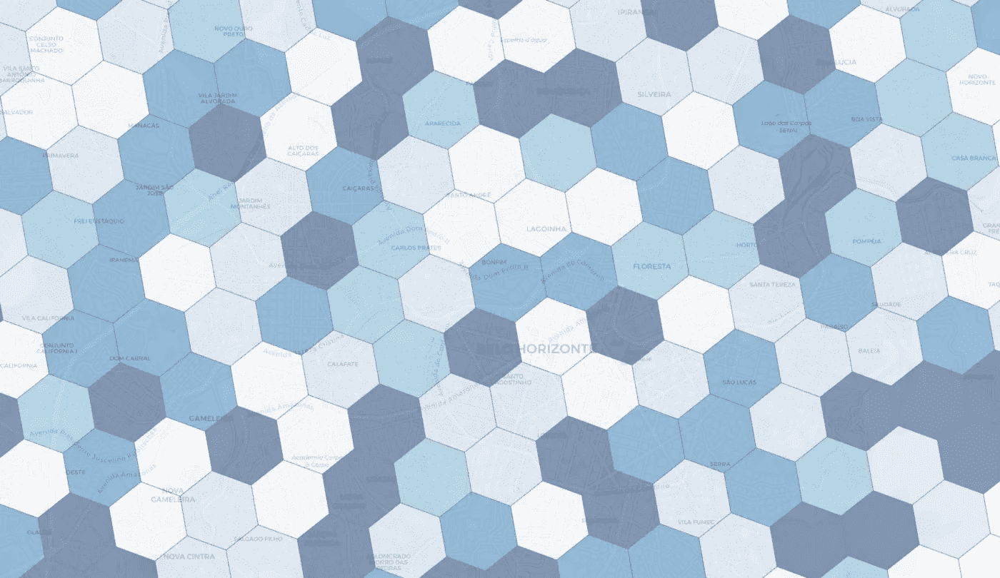
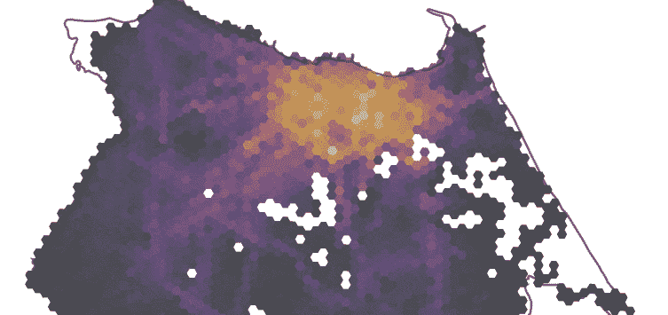
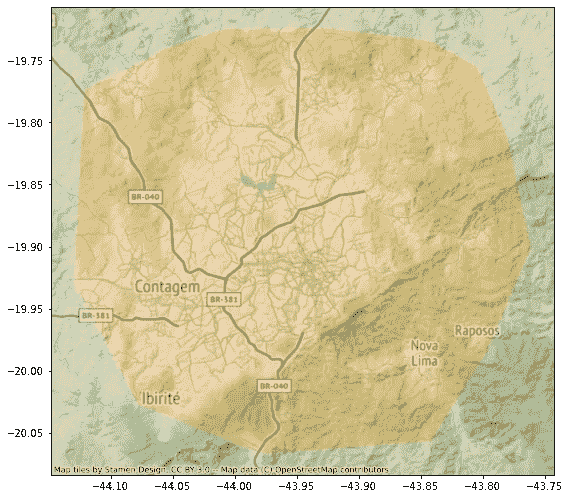
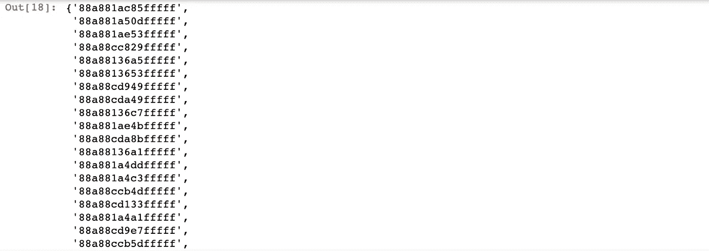
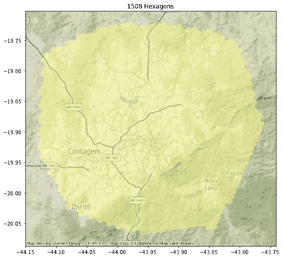

# 如何用 Python 下载优步的六角网格

> 原文：<https://towardsdatascience.com/how-to-download-ubers-hexagonal-grid-with-python-3140fe95e19a>

## 一篇关于使用 python API 访问优步 H3 六边形索引的实践短文

图片作者。

优步开放其 H3 电网已经四年了。该公司最初开发了用于乘坐优化的索引系统，但事实证明它对所有涉及可视化和探索空间数据的任务都很有用。

虽然优步不得不提出这些六边形层次索引来设置动态价格，但地理空间领域的研究人员和从业人员很长时间以来一直在使用网格系统将事件存储到单元中。六边形在模型中最广为人知的用途之一是克里斯塔勒的中心位置理论，这是一种在[城市地理学](https://www.thoughtco.com/overview-of-urban-geography-1435803)中的理论，试图解释世界各地城市和城镇的分布模式、规模和数量背后的原因。该理论提供了一个六边形网格框架，通过该框架可以研究区域的位置模式。

克里斯塔勒的中心位置理论。改编自克里斯塔勒。来源:[韦塞拉，2015 年](https://www.researchgate.net/publication/262666158_Microeconomics_Approaches_in_the_Christaller%27s_Central_Places_Theory)

六边形形状在这里是理想的，因为它允许由中心位置顶点形成的三角形连接，并允许每个单元以相同的方式与其他六个单元接触(例如，潜在地连接并建立流)。

虽然六边形的变形不太明显，但它们不能完全细分，也不能与街道对齐。所有这些限制都可以通过聚类的偏向性来解决，聚类的细胞反过来模拟对分析更有用的形状。

# 全球标准化电网的潜力

H3 系统在全世界范围内提供了具有可比较形状和大小的细胞。这为建立一个标准提供了可能性，通过该标准可以将任何空间数据集设置为。这意味着越多的空间研究使用这种网格，数据集就越容易互换和相互比较。

以蒙特利尔的 [Anagraph](https://anagraph.io/) 的加拿大人口数据集为例，该数据集使用了不同的来源——其中包括加拿大 2021 年人口普查——来模拟使用 H3 指数的[人口六边形网格数据集](https://geometric-data-viewer.anagraph.io/?zoom=8.40&lat=45.6239&long=-73.8094&layer=LocalPop-2016)。

人口网格图。来源: [Anagraph 几何查看器](https://geometric-data-viewer.anagraph.io/?zoom=8.40&lat=45.6239&long=-73.8094&layer=LocalPop-2016)。作者截屏。

有影响力的流动性研究员 [Rafael Pereira](https://twitter.com/UrbanDemog) 也是如此，他的[关于在巴西获得机会的研究](https://www.ipea.gov.br/acessooportunidades/en/)很好地利用了 H3 指数，以更好地捕捉涉及移动路径或连通性的现象的空间动态。

IPEA 获得机会项目。改编自 IPEA。图片作者。

# 那你是怎么得到它的呢？

如果您使用空间数据，您可能希望能够获得一个链接来下载某处的 shapefile。在这里不会是这样的。

为了得到它，我们需要使用 [H3 API](https://uber.github.io/h3-py/api_reference.html) 。如果你想知道，一个**应用程序编程接口** ( **API** )设置了可以用来调用(即访问)保存我们需要的数据的服务器的工具。基本上，这意味着我们可以通过向系统发送某些消息，使用一组预定义的规则来与该应用程序及其数据进行交互。

记住这一点，让我们使用 [H3 API 文档](https://uber.github.io/h3-py/api_reference.html)中描述的方法提取与感兴趣区域相交的所有多边形。第一步是利用 geopandas 吸收上述区域。

图片作者。

既然我们已经获得了一个包含要提取六边形的区域的地理数据框架，让我们开始使用实际的 H3 图书馆。我们将从使用 h3 的 polyfill 方法开始，该函数将从地理数据框架和比例中获取第一个也是唯一一个要素的几何-因为 H3 系统是多比例的，所以我们可以提取多种大小的六边形-这里将是 8，最细的级别。

hexs 变量将返回一个非常简单的列表，其中包含与所提供区域相交的第 8 层所有六边形的 id。

图片作者。

接下来，我们将使用该列表向 H3 API 请求与它们对应的实际几何图形。为此，我们将创建一个 [lambda 函数](https://www.w3schools.com/python/python_lambda.asp)，它将一个输入(十六进制 ID)传递给 *h3_to_geo_boundary* 方法，并将响应转换为 shapely 的多边形。

然后，我们将使用 python 的 map 方法将 id 列表(hexs 变量)传递给 polygonise 函数。这又被转换成将填充 geoseries 的多边形列表(或 geopanda 的空间类型列表)。

图片作者。

这看起来与我们要找的一模一样，所以剩下的工作就是创建一个包含结果的地理数据框架，并将其导出到地理包(或者 shapefile，如果您是守旧派的话)。

# 那是一个包裹

就是这个！我们仅用几行代码就成功地提取了我们感兴趣区域的 h3 六边形。

如果你有问题或建议，不要犹豫，随时给我写信。如果你喜欢这篇文章，考虑给我买一杯咖啡，这样我就可以继续写更多的文章了！

*如果你还不是一个媒体成员，并且想支持像我这样的作家，请随时通过我的推荐链接注册:*

 