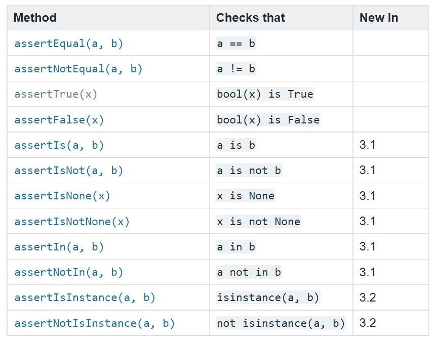

# 如何轻松自信地用 Python 实现单元测试

> 原文：<https://towardsdatascience.com/how-to-easily-and-confidently-implement-unit-tests-in-python-cad48d91ab74>

## 知道你的代码不会被破坏，你想晚上睡得更好吗？那么这篇文章就送给你了。


布雷特·乔丹在 [Unsplash](https://unsplash.com/s/photos/error?utm_source=unsplash&utm_medium=referral&utm_content=creditCopyText) 上的照片

什么是单元测试，为什么单元测试很重要，单元测试的最佳实践是什么，我如何用 Python 实现单元测试？如果你想知道这些问题的答案，请继续阅读。

# 什么是测试？

测试是一个简单而直观的概念。您编写与您的主要代码并行的测试，以确保它按照您期望的方式工作。每个人都以这样或那样的方式测试他们的代码——但是这样做有更好和更坏的方法。

大多数人会在终端中运行快速测试，或者混合使用 assert 语句和 print 语句。我不是说不要这样做，但是有更有效的方法来测试你的代码，我很快就会解释。但是首先，让我让你相信测试你的代码是必要的。

# 为什么要使用测试？

首先，如果你在编写代码的同时编写测试，这会让你在更深的层次上思考你的代码。它会让你更多地考虑你正在编写的代码的输入、输出和目标。这将鼓励你从一开始就编写更高效的代码。

它可以为您节省大量的调试时间。将编写测试视为对时间(和压力水平)的投资。当你写代码的时候，你同时也写了测试。如果事情变得不可收拾，你对这些测试的投入将会给你一个指向问题的大箭头。当涉及到长而复杂的函数时尤其如此。

测试也是可复制的。就像您将一个函数从一个项目复制并粘贴到另一个项目一样，您也可以对测试进行同样的操作。你的功能和测试就像蝙蝠侠和罗宾。

您甚至可以在函数之前编写测试！有一个思想流派叫做测试驱动开发(TDD ),它建议你应该在测试之前编写函数。这是否是一个好主意是一个非常有争议的辩论，我不打算卷入其中。

# 如何使用测试？

## 单元五集成测试

首先，我们需要讨论两种主要的测试类型。您将遇到的主要测试类型是**单元测试。**这是对特定单元或组件的测试——通常是一项功能。**集成测试**是测试所有这些组件如何组合在一起。下面的例子将集中于单元测试。

所以，让我们从一个独立单元测试的基本例子开始。假设我们有下面的函数:

```
def add(x,y):
   return x + y
```

对此进行单元测试的一个例子是:

```
assert add(2,4) == 6, "Should be 6"
```

关键字`assert`让你测试代码中的条件是否返回 True，如果不是，程序将抛出 AssertionError。小心这里的括号，因为[断言](https://docs.python.org/3/reference/simple_stmts.html#assert)是一个语句。

如果您在 Python 终端中运行这个，什么也不会发生，因为 2 + 4 实际上等于 6。再试一次，将 6 改为 7，正如所承诺的，您将得到一个 AssertionError。


由作者创建。

如您所见，它显示了 assert 语句后面的错误消息。

不过，我们可以通过测试提高效率和组织性。

# 测试用例、测试套件和测试运行程序

我给你介绍几个概念。

首先，**测试用例。**测试用例是对一个案例或一个响应的具体测试。assert 语句是测试用例的一个例子。我们正在检查，在输入 2 + 4 的情况下，我们会收到 6 的答案。

如果我们将许多测试用例组合在一起，我们得到一个**测试套件。**通常，将许多相似的案例加在一起是有意义的。

当我们运行我们的测试用例以及测试套件时，我们需要一种有组织的、高效的方式来完成它。这就是我们使用**测试转轮的地方。测试运行人员协调测试的执行，让我们的生活变得更加轻松。**

有许多测试运行程序，但是我最喜欢的和内置到 python 中的是 **Unittest** 。这就是我们今天要做的。

# 使用单元测试

Unittest 有一些你必须遵守的规则。一旦你了解了它，它简单、优雅且易于使用。

首先，你必须将所有的测试作为方法放入类中。一旦这样做了，就可以用从 unittest 继承的特殊断言方法替换 assert 关键字。测试用例类。

这是一个例子，用的是我们已经看过的例子。我在那里创建了一个名为“tests.py”的新文件，这是一个标准约定。我将 add 函数存储在一个名为 functions 的文件夹中，与 test.py 在同一层。


由作者创建。

```
import unittestimport functions class TestAdd(unittest.TestCase): def test_add(self): self.assertEqual(functions.add(2, 4), 6) if __name__ == '__main__':
    unittest.main() 
```

1.  首先，我们必须导入`unittest`作为标准。
2.  创建一个名为`TestAdd`的类，它继承自`TestCase`类。
3.  将测试函数转换成方法。
4.  更改断言以使用`TestCase`类中的`self.assertEqual()`方法。下面是可用方法的完整列表。
5.  将命令行入口点改为 call `unittest.main()`



unittest 断言方法的完整列表—【https://docs.python.org/3/library/unittest.html#unittest. TestCase.assertTrue

现在，如果您在终端中运行 test.py，您应该会看到这个。


由作者创建。

虚线上方的每个点代表一个已经运行的测试。如果这个测试抛出了一个错误，它将被一个 E 或 F 代替。

所以如果我们用 7 代替 6，我们会得到这个:


由作者创建


由作者创建

当然，我们这里只有一个测试，所以我们已经知道它在哪里失败了。如果我们有更多的数据，就很容易看出哪里出了问题，因为它非常具体。

# 如何写出好的测试？

## 清楚地命名您的测试——不要忘记称它们为测试。

这个测试不会运行。

```
class TestAdd(unittest.TestCase): def add_test(self): self.assertEqual(functions.add(4, 2), 7)
```

测试方法必须以“测试”开始。“测试-添加”将运行，但“添加测试”不会运行。如果你定义了一个不以' test '开头的方法，它会自动通过测试--因为它从来没有运行过。所以还不如根本不存在。实际上，有一个你认为已经通过的测试比一个不存在的测试要糟糕得多。它会影响你的 bug 修复。还有，不要怕名字长，要具体。这使得查找 bug 变得容易多了。

## 从简单直观的测试开始，逐步建立

从首先想到的测试开始。这些应该确保你的职能的主要目标是正确的。一旦这些测试通过，那么你就可以考虑更复杂的测试了。在确保基本功能正确之前，不要变得复杂。

## 边缘案例和越界

我喜欢开始思考边缘案例。让我们以处理数字为例。如果我们输入负数会发生什么？还是花车？或者像零这样的边界数。零爱打破代码，所以有一个测试总是好的。让我们再举一些例子。

```
class TestAdd(unittest.TestCase): def test_add(self): self.assertEqual(functions.add(4, 2), 7) self.assertEqual(functions.add(-1, 1), 0) self.assertEqual(functions.add(-1, -1), -2) self.assertEqual(functions.add(0, -1), -1)
```

瞧，我们的代码看起来不错:


## 每个测试都应该是独立的

测试不应该互相依赖。Unittest 有内置的[功能](https://docs.python.org/3/library/unittest.html)来防止你这样做。`[setUp()](https://docs.python.org/3/library/unittest.html#unittest.TestCase.setUp)`和`[tearDown()](https://docs.python.org/3/library/unittest.html#unittest.TestCase.tearDown)`方法允许您定义将在每个测试方法之前和之后执行的指令。我说这是因为 Unittest 不能保证您的测试会按照您指定的顺序运行。

## 避免使用 Assert。伊斯特鲁

它只是没有给你足够的信息。它只会告诉你这个值是真还是假。如果你像我们之前一样使用 assertEqual 方法，你会得到更多的信息。

```
AssertionError: 6 != 7
```

比以下方式更容易调试:

```
Expected True, but the actual result was False
```

# 有时候你的测试仍然会遗漏一些东西——没关系。

只要回去添加一个新的测试，这样你下次就不会错过了。

让我们来看看这个将一个数四舍五入并加 10 的函数的例子。没什么疯狂的。

```
def round_plus_ten(x): x = round(x) + 10 return x
```

这个测试套件。

```
class TestRound(unittest.TestCase): def test_round(self): self.assertEqual(functions.round_plus_ten(4.3), 14) self.assertEqual(functions.round_plus_ten(4.7), 15) self.assertEqual(functions.round_plus_ten(4.5), 15)
```

从这个角度来看(如果你还不知道 round 方法的来龙去脉)，你会认为所有的测试都通过了。他们没有。


由作者创建


由作者创建

您可以在这里看到(感谢测试运行器的有用性),舍入 4.5 不等于 5。因此，当我们加上 10 时，它不等于 14。round 方法在边距处向下舍入，而不是向上舍入。这些小错误有时会破坏整个程序，正如我在开始时所说的，你甚至不会想到它们。

这个例子强调了两件事。

1 —你永远不会想到你的程序可能失败的所有方式，但是测试增加了你的机会。

2-如果您遗漏了一些东西，回到您的测试文件，为这种情况编写一个新的断言。这意味着您在将来不会再错过它(包括您将函数和测试文件复制到的任何其他项目)。

一个好的测试类在未来和一个好的函数一样有用。

感谢阅读，我希望这能帮助你。

```
If I’ve inspired you to join medium I would be really grateful if you did it through this [link](https://jamesasher4994.medium.com/membership) — it will help to support me to write better content in the future.If you want to learn more about data science, become a certified data scientist, or land a job in data science, then checkout [365 data science](https://365datascience.pxf.io/c/3458822/791349/11148) through my [affiliate link.](https://365datascience.pxf.io/c/3458822/791349/11148)
```

这是我写的其他一些东西:

[](/econometrics-is-the-original-data-science-6725d3f0d843) [## 计量经济学是原始的数据科学

### 这就是你应该多了解它的原因

towardsdatascience.com](/econometrics-is-the-original-data-science-6725d3f0d843) [](/how-to-easily-show-your-matplotlib-plots-and-pandas-dataframes-dynamically-on-your-website-a9613eff7ae3) [## 如何轻松地在你的网站上动态显示你的 Matplotlib 图和 Pandas 数据框。

### 这是一种令人惊讶的简单方法，可以在线向全世界展示您的图表和数据框架，而且不到…

towardsdatascience.com](/how-to-easily-show-your-matplotlib-plots-and-pandas-dataframes-dynamically-on-your-website-a9613eff7ae3) [](/how-to-easily-run-python-scripts-on-website-inputs-d5167bd4eb4b) [## 如何在网站输入上轻松运行 Python 脚本

### 这是我建立的一个网站的演示，它将动态分析文本情感

towardsdatascience.com](/how-to-easily-run-python-scripts-on-website-inputs-d5167bd4eb4b)