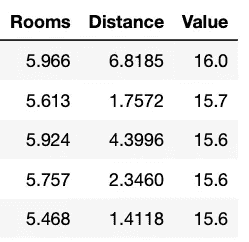
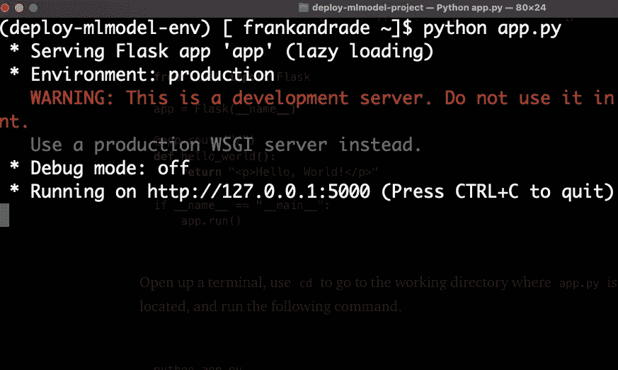
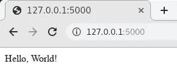
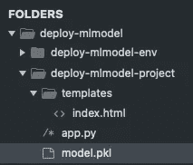

# 如何用 Python 轻松构建第一个机器学习 Web 应用

> 原文：<https://towardsdatascience.com/how-to-easily-build-your-first-machine-learning-web-app-in-python-c3d6c0f0a01c>

## 使用 Python 中的 Flask 创建 ML web 应用程序的分步指南


用[格式](https://www.pexels.com/@format-380633)在[像素](https://www.pexels.com/photo/photo-of-imac-near-macbook-1029757/)上拍照

构建机器学习模型最酷的部分之一是与他人分享我们构建的模型。

不管你建立了多少模型，如果它们离线，只有很少的人能够看到你的成就。这就是为什么我们应该部署我们的模型，这样任何人都可以通过一个漂亮的 UI 来使用它们。

在本文中，我们将从头开始使用 Flask 部署一个线性回归模型。Flask 是一个 Python 框架，让我们可以轻松开发 web 应用程序。遵循本指南后，您将能够在浏览器中使用简单的机器学习模型，如下图 gif 所示。


作者图片

本指南分为两部分。在第 1 节中，我们将快速构建我们的模型，在第 2 节中，我们将从头开始构建 web 应用程序。本指南的主要目的是构建一个 ML web 应用程序，所以你可以去我的 [Github](https://github.com/ifrankandrade/ml-web-app.git) 下载在第一部分创建的模型(model.pkl)并跳到第二部分。

```
**Table of Contents** 1\. [Building a Simple Machine Learning Model](#7113)
 - [First things first — Libraries and Dataset](#a1b9)
 - [The dependent and independent variable](#b886)
 - [Fitting and saving the model](#6bad)
2\. [Building The Web App with Flask](#e14b)
 - [Setting up a new virtual environment](#17b3)
 - [Installing Flask and quick setup](#e0d6)
 - [Loading the model, building the home function and front end](#4a1e)
 - [Building the form and predict function](#0f0a)
```

*不想看书？你可以看我的视频！*

# 1.构建一个简单的机器学习模型

最简单的机器学习算法之一是线性回归。在本节中，我们将构建一个预测房价的多元线性回归。在这一节的最后，我们的模型将保存在 pickle 中，在下一节，我们将使用 Flask 部署我们的机器学习模型。

## 先做最重要的事—库和数据集

对于这一部分，我们必须安装 scikit-learn 和 pandas:

```
pip install scikit-learn
pip install pandas
```

此外，我们将使用包含 3 列的数据集:值(以 1000 美元为单位)、房间数(每个住所的房间数)和距离(到就业中心的加权距离)。你可以在 [Github](https://github.com/ifrankandrade/ml-web-app.git) 或者 [Google Drive](https://drive.google.com/file/d/1tWpwUG56-7mBLmyETzf7ZtrcuzNMNjul/view?usp=sharing) 上找到这个用 Excel 生成的随机数据。

让我们用熊猫来看看这个数据集。

```
**import pandas as pd**
df = pd.read_csv('prices.csv')
```



作者图片

我们的线性回归模型的目标是根据房屋的房间数量和到就业中心的距离来预测房屋价值。

## 因变量和自变量

为了建立我们的线性回归模型，我们必须定义因变量(结果)和自变量(预测)。

这是我们的因变量和自变量。

*   因变量:“值”
*   自变量:“房间”和“距离”

下面是设置这两个变量的代码

```
y = df['Value'] 
X = df[['Rooms', 'Distance']]
```

## 拟合和保存模型

通常，您需要争论数据、训练和验证结果，但是为了简单起见，我们将只关注模型的拟合和部署。

为了构建我们的回归模型，我们需要从`sklearn`导入`linear_model`。

```
**from** sklearn **import** linear_modellm = linear_model.LinearRegression()
lm.fit(X, y)
```

一旦我们建立了`lm`模型，我们就可以预测给定`rooms`和`distance`的`value`。

```
lm.predict([[15, 61]]
```

如果运行上面的代码，预测值将被打印出来。

那好吧！但是现在我们想把所有这些部署在一个网站上，这样任何人都可以玩我们的模型。在下一节中，我们将用 Flask 将所有内容从后端发送到前端，但在此之前，让我们用 pickle 保存我们的`lm`模型。

```
**import** pickle
pickle.dump(lm, open('model.pkl','wb')) 
```

注意；如前例所示，`lm.predict()`接受数据帧格式的输入`[[]]`。在下一节中，请记住这一点。

# 2.用 Flask 构建 Web 应用程序

Python 为构建 web 应用程序提供了不同的选项。烧瓶是最简单的选择之一。

对于本节，建议创建一个新环境。使用不同的环境将有助于我们更好地管理构建模型和部署 web 应用程序所需的不同资源。

## 设置新的虚拟环境

在本节中，我将创建一个名为`deploy-mlmodel-env` 的虚拟环境，在终端上运行以下命令。

```
python3 -m venv deploy-mlmodel-env
```

我将创建一些其他文件夹来更好地组织我的目录。这是它的样子。


图片 bu 作者

您可以随意组织您的目录，但是要确保我们在上一节中保存的`model.pkl`在 web app(我们将要构建的)所在的同一个文件夹中。

## 安装烧瓶和快速设置

要安装 Flask，请在终端上运行以下命令。

```
pip install flask
```

现在，要检查一切工作正常，请遵循以下步骤。

创建一个新文件——我将命名为 mine`app.py`——并粘贴以下代码(这是从 [Flask 文档](https://flask.palletsprojects.com/en/2.0.x/quickstart/)中提取的一个最小的应用程序示例)

```
**from** flask **import** Flask

app = Flask**(**__name__**)**

@app.route**(**"/"**)**
**def** hello_world**():**
    **return** "<p>Hello, World!</p>"if __name__ == "__main__":
    app.run()
```

打开一个终端，使用`cd`进入`app.py`所在的工作目录，运行以下命令。

```
python app.py
```

应该会弹出以下消息。



最后一行有一个格式为`127.0.0.1:port`的链接。指示我们的应用程序运行的位置。复制链接(我的是`http://127.0.0.1:5000`)粘贴到你的网页浏览器。如果在按下 enter 键后，您看到消息“你好，世界！”一切都设置正确。



来源:文献

现在让我给你解释一下这个小脚本是做什么的。

*   `app = Flask**(**__name__**):**` 创建 Flask 类的一个实例。`__name__` 是一个代表应用程序模块名称的变量(这有助于 Flask 知道在哪里寻找资源，比如我们稍后将使用的“模板”)
*   `@app.route**(**"/"**): @**`代表装饰者(他们修改函数或类的行为)。装饰器告诉 Flask 哪个 URL 应该触发我们的函数。在我们的例子中，主页(/)应该触发`hello_world()`函数。
*   `def hello_world**():**` 该函数返回将在浏览器中显示的消息。

## 加载模型，构建主页功能和前端

现在是时候开始在我们之前创建的`app.py`文件中构建我们的 web 应用程序了。首先，我们导入`Flask`、`request`和`render_template`。

然后，我们加载之前用 pickle 保存的线性回归模型`model.pkl`。

此外，我们将把`hello_world`函数重命名为`home`。每当我们访问主页`(‘/’)`时，这个函数将呈现一个名为`index.html`的 HTML 文件。

`index.html`文件将包含网站的前端(导航栏、按钮、图片等。).构建前端通常需要一些 JavaScript 和 CSS 的知识。也就是说，我们仍然可以只使用 Bootstrap 和基本 HTML 来构建很酷的 web 应用程序。

要构建前端，首先在你的 app 所在的文件夹中创建一个名为“templates”(不能使用任何其他名称)的文件夹。在这个“模板”文件夹中创建一个 HTML 文件。我把这个文件命名为`index.html`，但是你可以随意命名。

您的目录应该如下所示。



打开 HTML 文件，写下`doc`或`html`，然后按 tab 键。如果幸运的话，您的 IDE 将生成一个基本的 HTML 模板。如果没有，复制并粘贴以下模板。

现在添加引导程序，进入这个[网站](https://getbootstrap.com/docs/5.1/getting-started/introduction/)，将 CSS 部分的代码复制/粘贴到`index.html`的`<head>`部分。这将加载他们的 CSS。

如果您找不到它，下面是要复制/粘贴的代码:

```
<link href="https://cdn.jsdelivr.net/npm/bootstrap@5.1.3/dist/css/bootstrap.min.css" rel="stylesheet" integrity="sha384-1BmE4kWBq78iYhFldvKuhfTAU6auU8tT94WrHftjDbrCEXSU1oBoqyl2QvZ6jIW3" crossorigin="anonymous">
```

为了好玩，我们还会添加一个导航栏(我们实际上并不需要它，但它会帮助你习惯于引导程序)，所以去网站的[导航栏](https://getbootstrap.com/docs/5.1/components/navbar/)部分，复制代码并粘贴到`<head>`部分(就在 CSS 下面)

我们的`index.html`文件应该是这样的(我知道看起来很吓人，但这只是我们复制的代码！)

在运行脚本之前，我将把第一行代码中的`light`元素改为`dark`，从而把导航条改为深色(如果保持不变，它将是浅色)。

```
<nav class=”navbar navbar-expand-lg navbar-**dark** bg-**dark**”>
```

此外，在正文部分，我将添加一个“Hello World！”：

```
<body>

  <h1>"Hello World!"</h1></body>
```

现在要看到所有这些变化，首先，按 CTRL + C 退出终端上运行的当前进程。在此之后，再次运行命令`python app.py`。

如果你去 [http://127.0.0.1:5000](http://127.0.0.1:5000) ，你应该会看到以下内容。


作者图片

太好了！有标题、导航条和信息。现在，让我们构建实际的应用程序来处理预测。

## 构建表单和预测函数

预测功能将使用我们的机器学习模型进行预测。为此，首先，最终用户需要在表单中引入两个输入(房间和距离)。

我们将在`index.html`文件的`<body>`部分构建这个表单。

首先，我们创建一个`<form>`标签。这将包含最终用户需要引入的输入。

```
<form action="{{url_for('predict')}}" method=”post”></form>
```

参数`action` 中的 URL 表示提交表单时将表单数据发送到哪里。

在这种情况下，我们会将它发送到“/predict”(我们网站的一个新部分)。我们可以编写“/predict”或者使用`url_for()` 函数来构建一个特定函数的 URL。

然后，在表单部分，我们创建 2 个`<input>`标签和 1 个`<button>`。它们背后的代码很简单，所以我不会深入研究。

重要的是要知道输入标签包含房间和距离变量，为了进行预测，用户需要点击“预测值！”按钮

这是我们目前掌握的代码。

请注意，我包含了添加空格的`<br>`标签和带有说明的`<p>`标签。此外，我将所有这些都放在一个带有`login`类的`<div>`中。

现在让我们构建预测函数！

在`app.py`文件中，我们用 URL“/predict”创建一个装饰器，它触发一个预测函数并呈现`index.html`文件。

```
@app.route('/predict',methods=['POST'])
**def** predict(): **return** render_template('index.html')
```

现在我们需要从`flask`导入`request`来访问终端用户在表单中引入的值。

表单中的值以字典形状返回，因此我们必须使用方括号来获取每个值。一旦我们有了值，我们就把它们放在双方括号`[[ ]]`中进行预测(这是我们的`model.pkl`接受的格式)

这是我们正在构建的预测函数。

注意，`render_template`方法有一个名为`prediction_text`的新参数。该参数包含用户单击预测按钮后将弹出的消息。

这个消息现在在后端。要将其发送到前端，请在`index.html`文件的`<body>`中添加`prediction_text` 变量。

```
<body>
 <div class="login">
   ...
  <b> {{ prediction_text }} </b>
 </div>
</body>
```

最后的`index.html`是这样的:

而最后的`app.py`看起来是这样的:

就是这样！现在用 CTRL+C 退出当前进程，在终端运行命令`python app.py`并转到 [http://127.0.0.1:5000](http://127.0.0.1:5000) 。

您现在应该可以在浏览器中玩您的模型了！


作者图片

[**加入我的电子邮件列表，与 10k 以上的人一起获取我在所有教程中使用的 Python for Data Science 备忘单(免费 PDF)**](https://frankandrade.ck.page/bd063ff2d3)

如果你喜欢阅读这样的故事，并想支持我成为一名作家，可以考虑报名成为一名媒体成员。每月 5 美元，让您可以无限制地访问数以千计的 Python 指南和数据科学文章。如果你使用[我的链接](https://frank-andrade.medium.com/membership)注册，我会赚一小笔佣金，不需要你额外付费。

[](https://frank-andrade.medium.com/membership) 