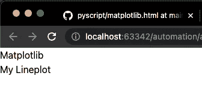
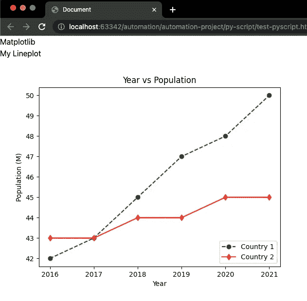
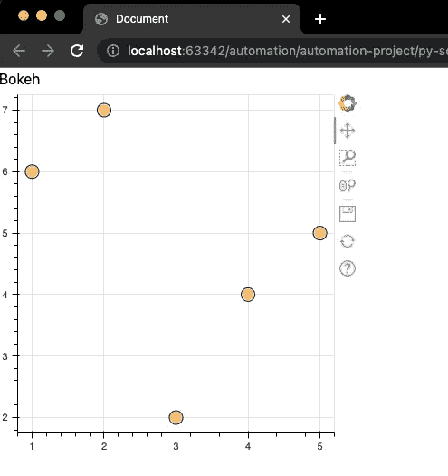

# 如何使用 PyScript 在 Web 浏览器上轻松运行 Python 可视化

> 原文：<https://towardsdatascience.com/how-to-easily-run-python-visualizations-on-a-web-browser-with-pyscript-4b287ef991cd>

## 使用 PyScript 在 web 浏览器上运行 matplotlib 和 bokeh 可视化的分步指南


[Firmbee](https://unsplash.com/@firmbee) 在 [Unsplash](https://unsplash.com/photos/ir5lIkVFqC4) 上拍摄的照片

在 PyCon US 2022 中，Anaconda 的 CEO 宣布了一项名为 PyScript 的新技术，允许用户在浏览器中编写 Python 代码。

我们只需要用 HTML 编写并运行 Python 代码来构建 web 应用程序。这意味着我们不需要担心部署，但一切都将发生在我们的 web 浏览器中。

你可以在你的网络浏览器上构建的最酷最简单的东西之一就是 Python 可视化，在本指南中，我将向你展示如何使用 PyScript 在你的网络浏览器上显示 matplotlib 和 bokeh 可视化。

此后，您甚至可以构建仪表板并共享 HTML 文件，这样其他人就可以在他们的 web 浏览器中看到它。

*不想看书？你可以看我的视频！*

# 先做最重要的事情—将 PyScript 添加到 HTML 模板中

要设置 PyScript，我们首先需要一个基本的 HTML 模板。

大多数文本编辑器和 ide 都有一个你可以使用的 HTML 模板。你只需要创建一个 HTML 文件，然后输入`doc`或`html`并按回车键。

在 Pycharm 中，我可以在写完`doc`后得到模板。万一你没有得到它，这里有一个模板你可以使用。

现在要使用 PyScript，将下面几行添加到 HTML 模板的`<head>`部分。

```
<link rel="stylesheet" href="https://pyscript.net/alpha/pyscript.css" />
<script defer src="https://pyscript.net/alpha/pyscript.js"></script>
```

这些台词摘自 [PyScript](https://pyscript.net/) 网站。我会把它们粘贴在`<title>`标签下面。

你应该有这样的东西。

太好了！到目前为止，我们已经成功地设置了 PyScript。现在让我们在网络浏览器上绘制一些可视化图形。

# 1.使用 PyScript 在您的 Web 浏览器上绘制 Matplotlib

在我们的 web 浏览器上用 matplotlib 和 bokeh 绘制可视化的步骤有点不同。

让我们首先用 matplotlib 绘制一个线图，并在我们的 web 浏览器中显示它。

## 正在加载 matplotlib

为了绘制线图，首先，我们必须在 HTML 文件中加载 matplotlib。我们在下面的代码片段中使用了`<py-env>`标签。

同样，在`<body>`部分，我使用`<py-script>`标签为我们的图添加了一个标题。在该标记中，我使用 Python 代码打印了单词“My Lineplot”。

要查看结果，我们必须在 web 浏览器中打开这个 HTML 文件。在 Pycharm 上，我可以通过点击右上角的 Chrome 图标轻松做到这一点。


作者图片

您也可以在浏览器上打开 HTML 文件，方法是右键单击该文件，选择“打开方式”，然后选择 Chrome/Safari/Firefox。

选择浏览器后，将会打开一个新的选项卡。你应该看看这个。



作者图片

太好了！到目前为止，我们已经在浏览器中显示了标题。现在让我们做线图。

## 在网络浏览器上显示折线图

在我们编写 Python 代码来创建一个线图之前，我们必须在`<body>`部分创建一个`<div>`，它将包含这个图的`id`。id 将是“线图”

```
<div id="lineplot"></div>
```

然后我们使用`<py-script>`标签创建线图。这里我们使用了`output`属性，并将其设置为我们之前定义的 id。

```
<py-script output="lineplot">
   # Python Code Goes Here ...
</py-script>
```

下面是绘制线条的 Python 代码(您应该将它放在`py-script`标记内)

太好了！如果将所有元素放在一起，您应该会在浏览器中看到下面的线图(加载可能需要几秒钟)。



作者图片

如果你有困难把这些碎片拼在一起，你可以在我的 Github 上找到完整的代码。

# 2.使用 PyScript 在 Web 浏览器上绘制散景

与 Matplotlib 不同，Bokeh 需要在`<head>`部分添加几行额外的代码。

让我们看一看。

代码是从 [PyScrpt Github](https://github.com/pyscript/pyscript/blob/main/pyscriptjs/examples/bokeh.html) 中提取的，除了我们之前从 PyScript 网站复制的两行代码之外，还包括了 Javascript 元素(第 8-17 行)之类的东西。

现在让我们在`<body>`部分添加一个`<div>`和`<py-script>`标签来显示我们的散景图。

如果您将这两个片段放在一起并刷新您的浏览器，您应该会看到下图。



作者图片

就是这样！现在，您已经知道如何使用 Python 和 HTML 在 web 浏览器上运行可视化。

用 Python 学习数据科学？ [**通过加入我的 10k+人电子邮件列表，获取我的免费 Python for Data Science 备忘单。**](https://frankandrade.ck.page/26b76e9130)

如果你喜欢阅读这样的故事，并想支持我成为一名作家，可以考虑报名成为一名媒体成员。每月 5 美元，让您可以无限制地访问数以千计的 Python 指南和数据科学文章。如果你使用[我的链接](https://frank-andrade.medium.com/membership)注册，我会赚一小笔佣金，不需要你额外付费。

[](https://frank-andrade.medium.com/membership) 