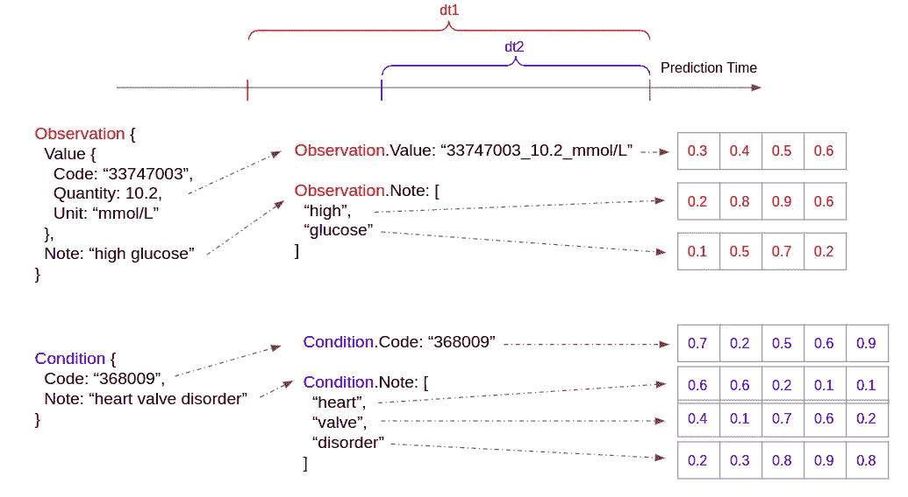

# 深度学习如何对病历进行编码

> 原文：<https://towardsdatascience.com/how-to-encode-medical-records-for-deep-learning-fcd690630e8b>

基于 Google Brain 的*[*可扩展、精准的深度学习与电子健康记录*](https://nature.com/articles/s41746-018-0029-1)*及其补充材料的简化图解。**

****

**图片来源:pixabay.com**

> ****背景****

**十多年前，医疗保健行业开始系统地数字化医疗保健数据。希望有一天，我们能够协调来自不同来源的数据，形成患者的“纵向视图”，其中包括关于患者健康的一切，从门诊、住院和用药史到免疫记录、家族史和生活方式观察。人们普遍认为，一旦掌握了患者医疗保健数据的丰富性和完整性，我们就可以大大提高医疗质量、降低运营成本并推进医疗/药物研究。**

**如果你关注医疗保健技术领域的最新趋势，你会发现这一希望正在变成现实。在一些受控环境中，医疗保健提供商、支付者和研究人员开始从特殊的上游系统中收集越来越多的数据，以构建全面的患者记录。随着这一令人兴奋的发展，现在出现了一个价值百万美元的问题:我们如何真正去利用这些数据记录的力量？**

**虽然数据分析或机器学习模型开发通常会吸引更多的注意力，但不应忽视数据工程的重要性。这篇博文有一个非常具体的重点。它研究了如何对病历进行编码，并使其适合深度学习，特别是时间序列学习。用简化的例子和可视化的图形说明了 Google Brain 的“ [*利用电子健康记录进行可扩展的、精确的深度学习*](https://nature.com/articles/s41746-018-0029-1) ”及其补充材料中提出的方法。如果你不想阅读原本 30+页的深奥内容，这篇博文对你来说是个不错的替代。事不宜迟，我们开始吧。**

****学习任务的设置****

**学习任务的设置是为重症监护室(ICU)病人做预测。谷歌大脑和许多其他研究人员选择 ICU 设置，因为与其他医疗保健数据相比，ICU 的数据通常是最完整的，可供研究使用。我们可以预测很多事情。我们可以预测临床结果——在这种情况下，死亡事件。我们可以预测资源利用率，在这种情况下，停留时间超过 7 天。我们可以预测护理质量，在这种情况下，出院后 30 天再入院。**

**传统方法/模型依赖于在预测时评估的精选特征变量。这篇博文最后总结了一些流行的 ICU 分析模型。然而，谷歌大脑团队假设，通过考虑所有可用的患者数据，并执行时间序列分析，可以实现对所有上述结果的更准确预测，这在数据验证中证明是成功的。这里的意义在于**

*   **它不需要手动选择特征-模型将学习权衡和组合特征**
*   **并且使用患者的所有历史数据，这与仅使用当前快照的其他流行的非深度学习模型相反。**

**现在，学习任务的设置已经清楚了，让我们深入编码过程，看看病历是如何为学习任务转换的。**

> ****编码程序****

**谷歌大脑团队首先将他们从合作医院获得的 ICU 数据转换为一种开放的医疗保健数据标准，称为 FHIR。要完全解释 FHIR，还需要另外 10 篇博文。但它的核心思想并不难理解。出于这篇博文的目的，我们可以把它想象成 JSON 数据。每个医疗保健概念都有一个 JSON 数据模式— `Patient`、`Observation`、`Condition`、`MedicationRequest`等等，它们都是医疗保健概念。JSON 数据模式将各个医疗保健概念的字段形式化。比如`Patient`有一个`name`，一个`birthday`；`Observation`有`value`等。从专有医疗保健数据到我们需要的 JSON 数据的转换相对简单，因为大多数专有医疗保健系统也基于公共医疗保健概念对其数据进行建模。**

**这里要注意的一件重要事情是，虽然结构转换是可以实现的，但医疗保健中的语义翻译极具挑战性。因为医疗保健数据采用各种(有时是专有的)编码系统。`"Heart failure"`在一个编码系统中可能是`"123"`，在另一个编码系统中可能是`"1a2b3c"`。不同的编码系统有不同的粒度和层次。将所有东西整合到一个单一的编码系统中是一项艰巨的任务。谷歌大脑团队的方法**不需要** **编码系统协调，这是一个至高无上的优势。正如我们将在后面看到的，他们可以做到这一点，因为他们将数据内容视为令牌，并将令牌转换为嵌入。因此，只要医疗数据集使用一套一致的编码系统(具体是什么并不重要)，就应该没问题。下面我们来看看具体步骤。****

****步骤 1:标记化****

**第一步是标记所有医疗保健概念中的所有字段。如果它是一个文本字段，我们就用空格来分隔它。比如`"high glucose"`变成了`["high", "glucose"]`。对于数值型字段，仅仅把普通的数字当作一个令牌是没有意义的。所以我们需要编码更多的上下文。我们将名称(通常是编码值、数量和单位)连接在一起，形成一个令牌。比如`{code:"33747003",quantity:10.2,unit:"mmol/L"}`变成了`"33747003_10.2_mmol/L"`。参见图 1 中的图解。可选地，我们可以量化数量以减少令牌的稀疏性。在步骤 1 之后，我们得到的是医疗保健概念的实例，其中每个实例的所有字段都进行了标记。我们将每个实例的时间戳计算为相对于预定义预测时间(图 1 中的`dt1`和`dt2`)的以秒为单位的增量时间。预测时间通常是入院后 24 小时或出院时。**

****

**图 1:标记化+嵌入。图片作者。**

****第二步:嵌入****

**对于每个医疗保健概念中的每个领域，我们都建立了一个预定义大小的词汇表。我们不使用全球词汇，因为不同的领域有不同的医疗保健语义。将来自所有概念的所有标记甚至来自一个概念中所有领域的所有标记混合起来构建词汇表是没有意义的。然后，我们为每个令牌训练一个嵌入。嵌入是与预测任务一起学习的。请注意，我们特意为给定医疗保健概念中的所有字段选择相同的嵌入维度。正如我们将在后面看到的，它使聚合变得更加容易。**

**在步骤 2 之后，我们得到的类似于图 2。它开始类似于典型的自然语言处理输入，其中你有一系列嵌入，你可以馈送到递归神经网络(RNN)。然而，目前的格式有三个问题:**

1.  **每个实例都是一个训练示例。ICU 设置中有数百甚至数千个数据点。我们知道 RNN 不擅长长序列。**
2.  **训练示例具有可变的维度，这由所讨论的概念和实例中的标记数量来确定。RNN 不能处理可变长度的嵌入。**
3.  **实例/训练示例的时间戳不是均匀分布的。特定事件何时发生具有重要的临床意义。嵌入没有捕捉到。**

**步骤 3 将解决所有 3 个问题。**

****

**图 2:一系列嵌入。图片作者。**

****第三步:聚合****

**长序列的第一个问题很容易解决。我们只需要将数据点分成均匀的时间步长。时间步长可以是 1 小时或几小时，可以作为超参数进行调整。我们将在给定的时间步长内聚合所有数据点，以形成单个训练示例。**

**请记住，给定医疗保健概念中的所有字段共享相同的嵌入维度。因此，我们可以取一个实例中所有字段嵌入的平均值，以形成该实例的聚合嵌入。如果一个概念有多个实例，我们可以进一步平均实例嵌入来形成这个概念的嵌入。由于医疗保健概念是一个预定义的枚举列表，我们可以将概念嵌入连接在一起，形成一个固定大小的示例。如果一个概念没有出现在时间步长中，我们只需将其嵌入设置为全 0。变维的第二个问题现在没有了。注意，我们使用 average throughout 进行聚合，但是您可以想象使用其他聚合方案。**

**为了解决时间戳含义的最后一个问题，我们取时间戳中所有实例的时间戳的平均值，并将其附加到我们通过字段->实例和实例->概念聚合获得的固定大小嵌入的末尾。这样，时间戳信号也在训练示例中进行了编码。**

**最终编码结果的图示见图 3。我们现在有了一个不太长的固定大小的嵌入序列，它考虑了事件时间戳。我们现在可以把它喂给 RNN 了。**

****

**图 3:RNN 的最终输入。图片作者。**

> ****结论****

**在这篇博客文章中，我们一步一步地演示了如何为 RNN 模型编码医疗记录。它首先将从合作伙伴组织接收的专有数据格式转换成开放的标准 JSON 格式。这使我们能够从结构上理解源数据集。然后，它将每个 JSON 字段中的内容标记化，并为每个标记构建一个嵌入。最后，它在合理的时间范围内聚合令牌嵌入，以创建适合 RNN 模型输入的合理长的固定大小嵌入序列。**

**上述数据处理的意义是双重的:**

1.  **它不需要将病历整合到一个全球编码系统中，从而节省了大量的人工工作。**
2.  **它以一种同质的方式对整个患者历史中的所有记录进行编码，以便在模型训练期间可以考虑所有这些记录。**

> ****附录:其他常见的非深度学习 ICU 数据分析模型****

**早期预警评分(EWS)通常在入院后 24 小时计算，以预测死亡的可能性。它使用呼吸频率、氧饱和度、温度、血压、心率和意识等级作为变量。每个变量都有一个由普通医学知识确定的正常范围。基于查找表计算得分，以表征变量离其正常范围有多远。如果所有分数的总和超过一个阈值，这意味着死亡的可能性很高。**

**再入院的医院评分通常在出院时计算。它考虑了血红蛋白水平、钠水平、入院类型、先前入院次数、住院时间、住院时间是否与癌症相关，以及住院期间是否进行了医疗程序。与上述 EWS 类似，基于已有的医学知识，每个因素的值被转化为风险分值，风险分值的总和描述了再入院的总体风险。**

**住院时间长的刘评分一般在入院后 24 小时计算。逻辑回归模型(使用适当的正则化技术)将年龄、性别、病情类别、诊断代码、接受的医院服务和生命体征的实验室测试等变量考虑在内，以产生长期住院的概率数字。**