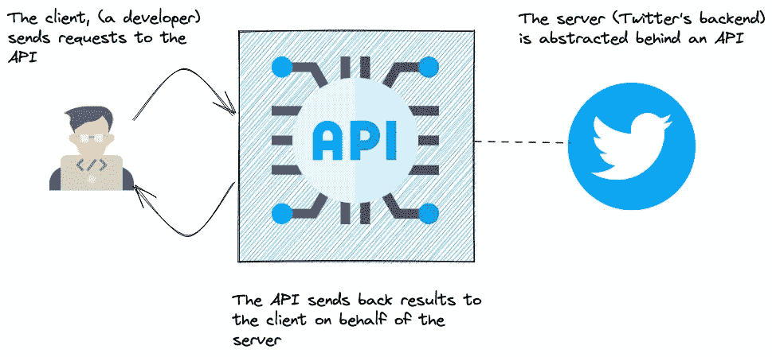
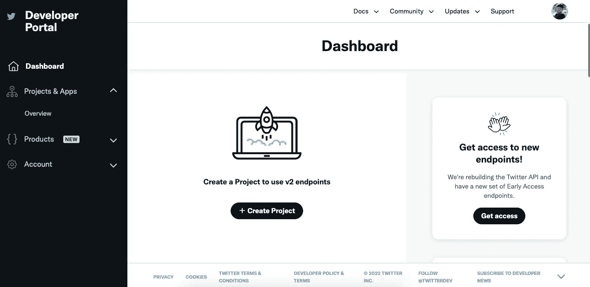
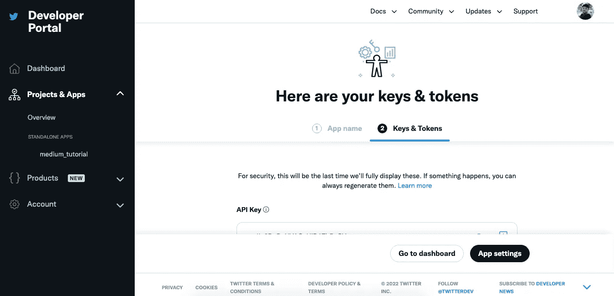
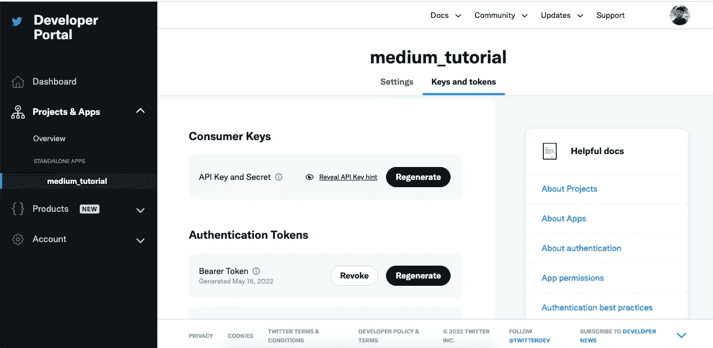
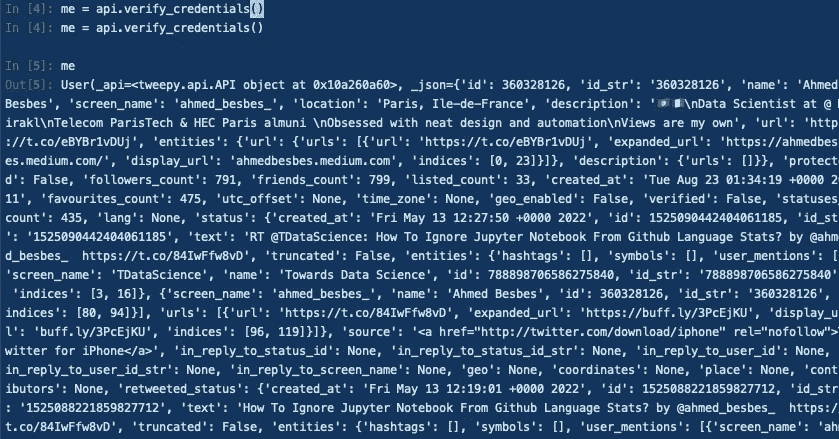
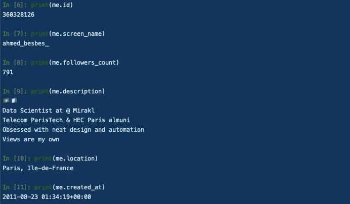
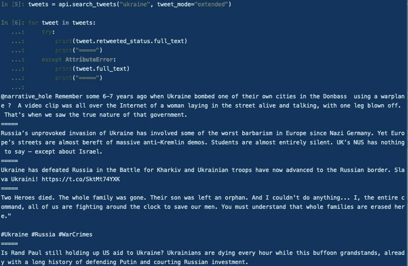

# 如何使用 Python 从 Twitter API 中提取数据

> 原文：<https://towardsdatascience.com/how-to-extract-data-from-the-twitter-api-using-python-b6fbd7129a33>

## Tweepy 最新版本概述


卢克·切瑟在 [Unsplash](https://unsplash.com?utm_source=medium&utm_medium=referral) 上的照片

在许多情况下，从 Twitter 等社交网络获取外部数据是有价值的。

无论你是大公司还是个人，这都有助于进行和丰富特定主题的分析，监控竞争，评估特定产品的社会声誉，分析客户评论，跟踪对最近事件的反应等。

几年前，从 Twitter 和其他社交网络中提取数据是一场噩梦:没有 API，没有清晰的文档，没有库，并且您必须手动构建复杂的网络爬虫来从底层 HTML 代码中收集数据。

不用说，这是痛苦和笨拙的😰。

希望，事情已经挂起了很多。

> *在这篇文章中，我将向你展示如何从 Twitter 中提取有用且可操作的数据。为此，我们将使用一个名为* ***Tweepy*** *的 Python 包，它将与 Twitter API 交互以获取不同类型的元数据并自动执行任务。*

希望你都准备好了。让我们看一看🔍

# 我们为什么需要 Twitter API？

想象一下:你是一名 web 开发人员，想要提取一个给定帐户的 tweets，以便将它们嵌入到你的应用程序中。您还想每天获取并更新这些推文，以获得最新的推文。

> 你会怎么做？

为了消费 Twitter 数据，你不需要访问 Twitter 的内部服务器和数据库。你也不需要理解 Twitter 是如何编码的。

您所需要的只是您和 Twitter 后端之间的一个中介，一个您可以请求(通过一些参数)以获得一些数据或与 Twitter 服务交互的中介。

简单地说，API 就是这样:它只是两个相互通信的独立应用程序之间的连接点。



作者图片

作为一种抽象，Twitter API**简化了与第三方(开发者、应用、其他 API 等)的集成。).**

下面是您可以用 Twitter API 做的事情:

*   基于标签、关键词、地理位置等以编程方式搜索推文。
*   构建自动转发预定义账户列表的 Twitter 机器人
*   基于一系列过滤器实时传输推文
*   自动关注用户列表
*   等等。

该 API 允许您以编程方式执行您从界面中手动执行的任何操作。

看起来很有趣:现在让我们看看 Python 如何与 Twitter API 交互。

# 创建一个 Twitter 应用程序并设置凭证

*为了能够重现以下步骤，你需要一个 Twitter 账户。*

为了使用 Twitter API，你首先必须在开发者的[网站](https://developer.twitter.com/en)上注册成为 Twitter 开发者。

注册后，您需要创建一个 Twitter 应用程序，该应用程序将设置一系列凭证:这些凭证稍后将由 Tweepy 库使用，以便对您进行身份验证。

首先，进入开发者的[仪表盘](https://developer.twitter.com/en/portal/dashboard)。



作者截图

点击左侧边栏中的**概述**并点击**创建应用**按钮。


作者截图

为您的应用程序命名。


作者截图

这将生成以下凭据。这是私人物品，不要和任何人分享。



作者截图

如果您在第一次看到凭据时没有进行复制粘贴，则需要重新生成凭据。为此，从左侧边栏访问您的应用程序，点击**键和令牌**边栏。

点击每个**重新生成**按钮，并将以下凭证保存在某处:

*   **API_KEY**
*   **API_KEY_SECRET**
*   **访问 _ 令牌**
*   **访问 _ 令牌 _ 秘密**
*   **不记名 _ 令牌**



作者截图

您现在已经准备好使用 API 了。

# 连接到 Twitter API

为了能够使用 Python 与 Twitter API 进行交互，我们将使用一个名为 [Tweepy](https://github.com/tweepy/tweepy/) 的库。

为了能够从源代码中隐藏凭证并将它们作为环境变量加载，我们将使用 [python-dotenv](https://github.com/theskumar/python-dotenv) 。

```
pip install tweepy
pip install python-dotenv
```

首先，创建一个`.env`文件来保存您的凭证。


作者截图

在包含`.env`文件的同一个目录中打开一个 jupyter 笔记本或 python 交互式 shell。

我们可以使用下面的脚本对 Twitter API 进行认证。

让我们检查一下发起这个连接的 Twitter 用户是不是我。


作者截图

为此，我们调用`verifiy_credentials`方法，该方法返回包含我的个人资料数据的用户对象。



作者截图

这个对象是一个包含大量元数据的 blob。我们可以将其中一些作为对象属性来访问，并将它们打印在屏幕上。



作者截图

这个用户肯定是我。您可以在我的[档案](https://twitter.com/ahmed_besbes_)中清楚地看到这些数据。

# 搜索和提取推文

Twitter API 的第一个应用是能够基于多种类型的过滤器以编程方式搜索推文。

> *例如，让我们搜索一些提到乌克兰🇺🇦.的推文*

在设置了认证之后，我们将使用`search_tweets`方法，遍历提取的 tweets 并打印它们的文本。

下面是运行代码片段后发生的情况。



作者截图

👉在这个例子中，我们没有指定任何过滤器，但是您可以通过设置一些参数来定制搜索，例如您想要的推文数量(`count`)、语言(`lang`)、位置(`geocode`)、停止日期(`until`)等。
你可以在这里了解全部参数[。](https://docs.tweepy.org/en/stable/api.html#search-tweets)

👉您还可以使用更高级的搜索查询，直接在其中嵌入一些过滤器。
例如，如果您想要提取非转发的关于新冠肺炎的英语推文，您可以编写以下查询:`covid-19 lang:en -is:retweet`


作者截图

要了解更多关于 Twitter 搜索运营商的信息，请参考这个[链接](https://developer.twitter.com/en/docs/twitter-api/v1/rules-and-filtering/search-operators)。

# 使用分页搜索大量的推文

在前面的例子中，我们只提取了 15 条左右的 tweets:这是因为 Twitter 有分页机制，我们只得到第一页的结果。

为了循环多个结果页面/tweet，我们需要使用包装了`search_tweets`方法的光标[类](https://docs.tweepy.org/en/stable/v1_pagination.html)。

Cursor 类的每个实例都支持两种方法，这取决于您想要迭代的内容:

*   `items`:要迭代的最大项数
*   `pages`:迭代的最大页数

让我们使用`items`方法提取 250 条推文。

使用`items`方法时，我怀疑`count`参数没有作用。


作者截图

类似地，我们可以使用`pages`方法获得相同数量的 tweet:我们告诉 Cursor 对象迭代 5 个页面，并为每个页面提取 50 条 tweet。

⚠️如果您积极地使用搜索 API，您可能会遇到 429 错误代码，这表明您已经达到了特定端点的速率限制。

👉例如，`/search/tweets/`端点上的速率限制是每 15 分钟 180 次。这意味着，在这种限制下，您每 15 分钟最多可以获得 180 * `count`条推文(`count`是您在`search_tweets`方法中指定的参数)

你可以在这里了解更多关于 Twitter 费率限制[的信息。](https://developer.twitter.com/en/docs/twitter-api/v1/rate-limits)

# 搜索特定账户的推文

假设你想分析埃隆·马斯克的推文:这相当简单。

你所需要做的就是在你的查询前面加上`from`关键字。
如果你想收集关于特斯拉的推文，你可以这样写:

```
tesla from:elonmusk lang:en -is:retweet
```


作者截图

# 流式实时推文

Twitter API 的一个有趣的功能是能够传输实时推文的样本。这尤其有助于跟踪现场事件并收集相关数据。

为了能够使用 API 的流功能，您首先需要授予**对您的 Twitter 应用程序**的写访问权限，然后**将它移动到一个项目中。**

然后，您需要重新生成凭证。

为了能够使用 Tweepy 获取流媒体 tweets，您必须定义一个自定义类，它是`StreamingClient`类的子类。

这个类需要覆盖一个名为`on_tweet`的方法，该方法在每次收到 tweet 时执行:为了简单起见，我们告诉这个方法打印 tweet 的 id 和文本。

为了从这个类中实例化一个定制的流，我们需要将无记名令牌传递给构造函数。

然后，我们需要附加一些规则来定义我们想要搜索的内容(注意 tweepy 允许在一个列表中有多个规则，但是在这个例子中我们只设置一个)。

最后，调用`filter`方法打开流，并对每个传入的 tweet 运行`on_tweet`方法。

下面的 GIF 说明了流打开后会发生什么。


作者 GIF

要了解更多关于 Tweepy 流的信息，请查看此[文档](https://docs.tweepy.org/en/v4.9.0/streaming.html)。

# 参考

*   [https://developer.twitter.com/](https://developer.twitter.com/)
*   [https://medium . com/forward-data-science/how-to-access-data-from-the-Twitter-API-using-tweepy-python-e 2d 9 E4 d 54978](https://medium.com/towards-data-science/how-to-access-data-from-the-twitter-api-using-tweepy-python-e2d9e4d54978)
*   [https://docs.tweepy.org/en/latest/getting_started.html](https://docs.tweepy.org/en/latest/getting_started.html)

# 结论

这篇文章简单介绍了 tweepy 和 Twitter API。它让我们有机会从离线到流媒体模式以各种方式提取推文和元数据。

如果你是一名数据科学家，将 tweepy 添加到你的技能中肯定会给你带来竞争优势，并帮助你用外部数据丰富你的分析。

但是我们只是触及了表面:显然还有更多要学的。如果你想更深入地挖掘，我鼓励你看看 API 文档，一如既往地实验，实验，实验。(3 次不够说)。

今天就这些了。直到下一次更多的编程技巧和教程。👋

# 新到中？你可以每月订阅 5 美元，并解锁各种主题的无限文章(技术、设计、创业……)你可以通过点击我的推荐[链接](https://ahmedbesbes.medium.com/membership)来支持我

<https://ahmedbesbes.medium.com/membership>  

照片由 [charlesdeluvio](https://unsplash.com/@charlesdeluvio?utm_source=medium&utm_medium=referral) 在 [Unsplash](https://unsplash.com?utm_source=medium&utm_medium=referral) 上拍摄