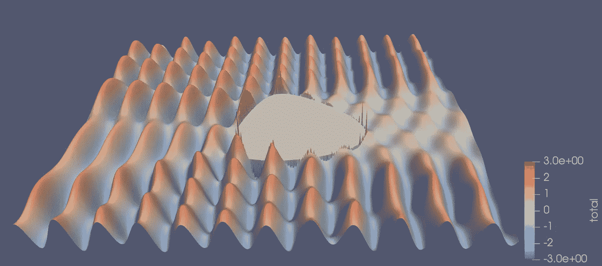
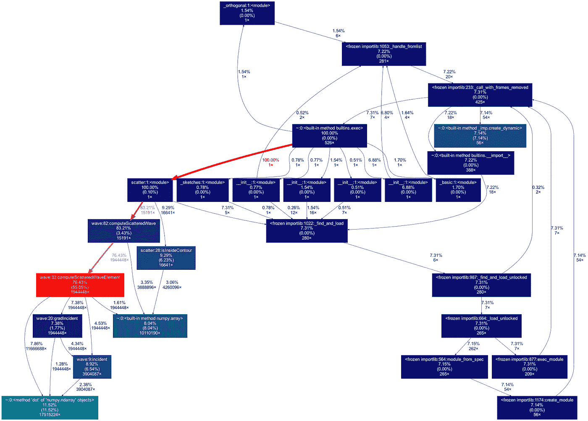
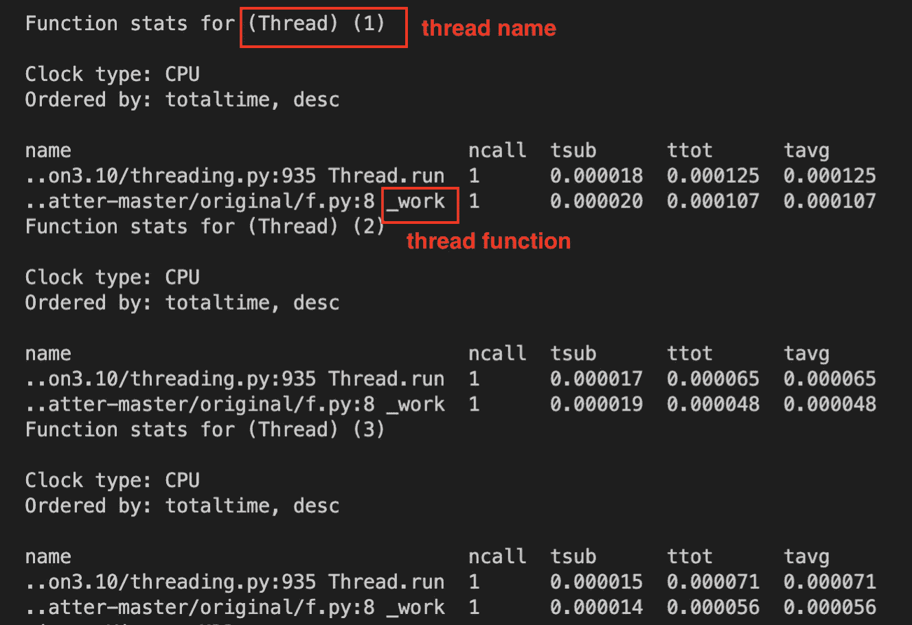
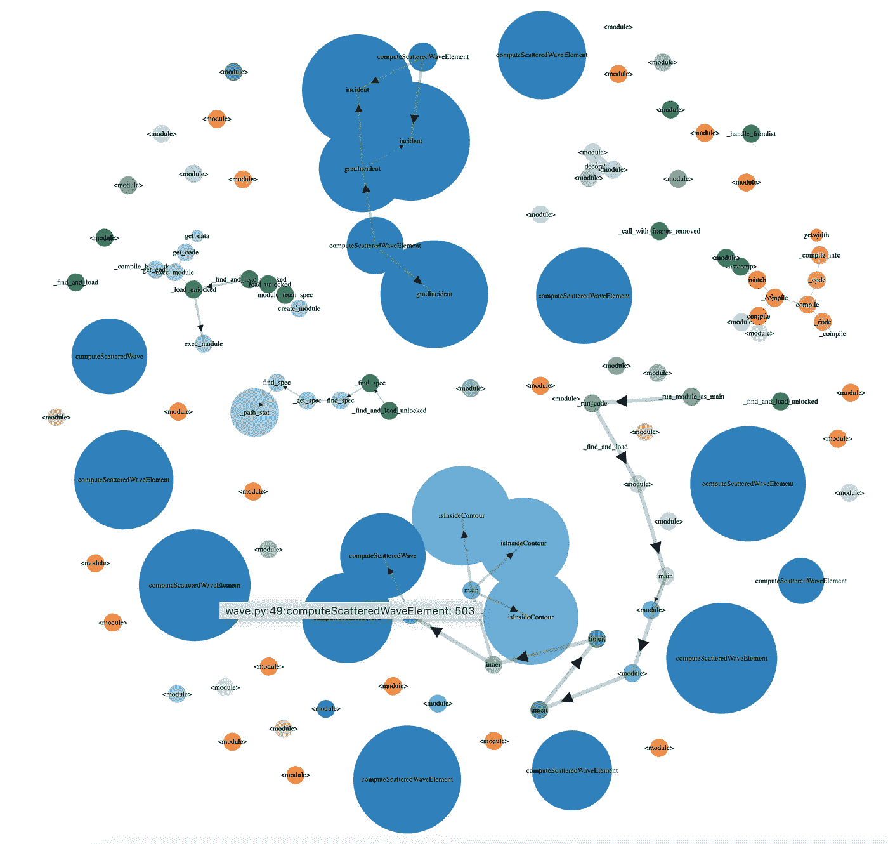

# 如何找出我的 Python 代码的瓶颈

> 原文：<https://towardsdatascience.com/how-to-find-out-the-bottleneck-of-my-python-code-46383d8ef9f>

## 以战略性的方式调试性能问题


照片由 Unsplash 的 makariostang 拍摄

M 通常情况下，开发人员需要优化代码以使其性能更好。这听起来像是正确的做法，但并不总是如此。代码优化是一个模糊的术语。没有明确的目标，很容易掉进兔子洞，浪费时间。在本文中，我想告诉你一个找到代码瓶颈的战略方法——从理解你是否应该优化你的代码到找出哪个函数导致了性能问题。

## 应该优化什么，什么时候优化？

我们所说的代码优化是指重写代码，以便程序执行得更快，并使用更少的内存、CPU、磁盘空间或网络带宽。那么，是不是每个程序都需要偶尔优化一下呢？不会。通常，只有少数几类程序需要优化。

**实时应用**

成熟的实时应用如 Apache Kafka 和 RabbitMQ 以其高吞吐量和低延迟而闻名。许多公司已经在自己的环境中安装了它们。由于设置不同，性能可能会有所不同。

有几个[基准](https://engineering.linkedin.com/kafka/benchmarking-apache-kafka-2-million-writes-second-three-cheap-machines)可以帮助您评估性能。如果您发现与基准测试相比速度不够快，您可以微调配置或纵向或横向扩展硬件。

**具有 SLA 的应用**

另一种类型的程序是具有严格服务水平协议(SLA)的程序。换句话说，程序必须在一定的时间限制内交付结果，否则，它可能会影响业务。很明显，SLA 是一个硬门槛，但是不要等到它过线了，那就来不及了。预防措施之一是监控流程，如果发现增长趋势或偏差模式，则发出警报。

**其他行为异常的应用**

做代码优化的原因不是因为开发者的神感(虽然有帮助)，而是数字和事实。在这种情况下，监测起着至关重要的作用。它帮助开发人员理解程序在晴天如何运行，并从那里发现雨天。例如，资源(CPU/内存/磁盘)使用率呈上升趋势、峰值时间、可疑日志等。根本原因可能是多方面的——资源不足、代码中的错误、来自外部的高负载等等。

经验法则是，如果程序与期望的速度相比不够快，就应该优化代码，无论是基准测试、SLA 还是过去的平均性能。通过监控和警报，可以了解系统的健康状况，并帮助开发人员了解使用或行为的趋势，以便采取预先措施。

## 优化什么？—硬件

当你对数字感到失望时，下一步就是采取行动。开发人员很容易被各种解决方案淹没。大多数性能问题都与运行太慢或使用太多内存有关。

一个潜在的解决方案是拥有更好的硬件。借助云计算，添加更多内核或内存可以在几秒钟内完成。但像任何解决方案一样，它也有利弊。添加更多资源是一种简单快捷的解决方案，可以有效地解决紧急生产问题。但是如果这是您解决性能问题的唯一解决方案，那么您的程序将会非常昂贵。横向扩展会导致成本倍增，而纵向扩展可能会达到云提供商为单台机器所能提供的极限。根据程序的设计，这可能需要从单台机器到分布式系统的代码重构。

不要假设硬件是唯一的解决方案，在对代码进行并行化之前，一定要先在只有一个 CPU 和有限内存的机器上优化代码。在很多情况下，花时间在代码优化上是值得的。比如算法优化——将时间复杂度从 O(n)提高到 O(nlogn)或 O(n)，语言切换——使用基于 CPython 的库或使用缓存减少繁重的 I/O 操作量等。

下一个问题是——我如何知道应该优化代码的哪一部分，因为重写整个代码肯定不是一个明智的决定。在下一节中，我将介绍 Python 中的程序概要分析，它可以帮助开发人员快速找到繁重的操作，并从那里进行改进。

## 优化什么？—软件

为了找出生产应用中的性能瓶颈，开发人员需要可操作的洞察力。一种现代的方法是应用分析，突出最慢的代码，即消耗大部分资源(如 CPU 和内存)的区域。剖析可以是生产(或类似生产的环境)中的**一次性操作**或**持续过程**。不同的分析器使用不同的方法收集信息，因此具有不同的运行时开销。为您的用例选择正确的分析器非常重要。

在这一节中，我将介绍两种不同的分析方法和几种可视化结果的方式。

**举例**

在本文中，我们将剖析这个 [repo](https://github.com/pletzer/scatter) 的代码——一个计算入射波在 2D 物体上散射的简单程序。



来源:[https://nesi . github . io/perf-training/python-scatter/introduction](https://nesi.github.io/perf-training/python-scatter/introduction)

**确定性分析器**

您可能听说过 cProfile，这是 Python 中的一个内置分析器。cProfile 是一个[确定性分析器](https://docs.python.org/3/library/profile.html#what-is-deterministic-profiling)，它反映了所有*函数调用*、*函数返回*和*异常*事件都被监控，并且这些事件之间的时间间隔被精确计时。

这种类型的剖析器可以收集高分辨率的剖析信息，但有一个主要缺点:**高开销**。可以想象，如果应用程序有大量的函数调用，那么分析器将会收集太多的记录。如果函数很小，那么由于分析器本身的开销，结果可能不准确。

然而，下面是如何在这个例子中使用 cProfile。cProfile 的总执行时间是 89.03 秒。

```
python -m cProfile scatter.py
```

> 如果没有 cProfile，这个程序需要 80.50 秒，快了 10%。因此，不建议在生产执行期间使用。

cProfile 的输出如下所示，其中每一行都是执行过程中的一个函数调用。它记录了调用的次数、在该函数中花费的总时间，以及在该函数和所有子函数中花费的累计时间等。


cProfile 的输出由[高](https://medium.com/u/2adc5a07e772?source=post_page-----46383d8ef9f--------------------------------)

但是这个表对人类来说很难解释，因为它包含了太多我们并不真正关心的信息，比如 Python 的内部函数。此外，我们不知道每个函数如何与其他函数相关，也不知道较慢的函数的输入是什么。如果一个函数被多个函数调用，就很难找出哪个路径和相应的输入导致了缓慢。

一种解决方案是将结果可视化为图形，以了解函数之间的关系。由于 cProfile 不提供任何可视化，我们需要使用像`[snakeviz](https://jiffyclub.github.io/snakeviz/)`和`[gprof2dot](https://github.com/jrfonseca/gprof2dot)`这样的库来实现。

snakeviz

我们将在命令行使用 cProfile 来创建一个配置文件，并使用 snakeviz 来解释结果。Snakeviz 有两种可视化风格——冰柱和旭日。在一个函数中花费的时间由矩形的宽度或弧的角度范围来表示。

```
python -m cProfile -o scatter.prof scatter.py 
# Execution time : 86.27 sec
snakeviz scatter.prof
```


蛇语(冰柱作者:高 T5)


蛇语(旭日东升[高](https://medium.com/u/2adc5a07e772?source=post_page-----46383d8ef9f--------------------------------))

*gprof2dot*

gprof2dot 创建了另一种可视化类型——点状图。我更喜欢这种类型的图表，因为它清楚地显示了功能之间的关系，颜色对比更容易发现重要的功能。

```
gprof2dot --colour-nodes-by-selftime -f pstats output.pstats | \
    dot -Tpng -o output.png
```



`gprof2dot (by @Xiaoxu Gao)`的输出

**统计分析器**

如果我们只想在本地笔记本电脑上开发和调试应用程序的过程中大致了解一下性能，那么 cProfile 是可以的。但是不建议在生产中使用它，因为可能会有明显的性能影响。这就是统计剖析器的用处。

它通过定期对执行状态进行采样来测量应用程序的性能。这种方法不如确定性分析准确，但是它的开销也较小。由于开销较小，它可用于监控生产中正在进行的过程。对于某些应用程序，分析必须是生产中的一个连续过程，在其他环境中很难发现性能问题。

我将列出一些最流行的统计分析器。他们中的大多数都有一个内置的可视化解决方案，所以我们不需要额外的软件包。

[*pyinstrument*](https://github.com/joerick/pyinstrument)

`pyinstrument`是一个统计 python 分析器，它每 1 ms 记录一次调用堆栈，而不是记录整个跟踪。您可以从命令行直接调用`pyinstrument`:

```
pyinstrument scatter.py
```

您还可以生成交互式网页:

```
pyinstrument -r html -o output.html scatter.py
```

与 cProfile 的原始输出不同，`pyinstrument`给出了一个突出显示的函数调用树，这更容易理解。它花费的时间也比 cProfile 少。


pyinstrument 的输出(由[高](https://medium.com/u/2adc5a07e772?source=post_page-----46383d8ef9f--------------------------------)

从树中可以明显看出`computerScatteredWaveElement`函数是瓶颈。我非常喜欢`pyinstrument`的简单性，它已经成为我的首选 Python 分析器。

`[pyinstrument](https://pyinstrument.readthedocs.io/en/latest/guide.html#profile-a-specific-chunk-of-code)` [提供了一个 Python 接口](https://pyinstrument.readthedocs.io/en/latest/guide.html#profile-a-specific-chunk-of-code)来剖析你的一大块代码。它帮助开发者只关注最有趣的部分。

```
**from** **pyinstrument** **import** Profiler

profiler = Profiler()
profiler.start()

computerScatteredWaveElement()

profiler.stop()
profiler.print()
```

根据[文件](https://pyinstrument.readthedocs.io/en/latest/how-it-works.html#async-profiling)，`pyinstrument`可以配置`async`功能。例如，我有一个简单的`asyc`函数:

```
import asyncio
from pyinstrument import Profilerasync def main():
  p = Profiler()
  with p:
    await asyncio.sleep(5)
  p.print()asyncio.run(main())
```

输出如下所示。它通过跟踪主线程来工作。任何花费在主线程之外的时间都归于`await`。


pyinstrument 异步仿形的输出(由[高](https://medium.com/u/2adc5a07e772?source=post_page-----46383d8ef9f--------------------------------))

`pyinstrument`的一个缺点是它只能分析主线程，所以不能在多线程应用程序中使用。例如，我有一个简单的多线程代码:

```
def thread_function(name):
  time.sleep(2)if __name__ == "__main__":
  with concurrent.futures.ThreadPoolExecutor(max_workers=3) as executor:
    executor.map(thread_function, range(3))
```

如您所见，输出忽略了其他两个线程。


在多线程代码上使用 pyinstrument 的输出(作者:[高](https://medium.com/u/2adc5a07e772?source=post_page-----46383d8ef9f--------------------------------)

[*yappi*](https://github.com/sumerc/yappi)

yappi 代表另一种 python 分析器。它支持多线程、asyncio 和 gevent 代码的分析。因为它是用 C 语言设计的，所以与用 Python 设计的分析器相比，它运行得更快。它还支持对代码的特定部分进行分析。

下面是多线程应用程序的分析输出。您可以通过`yappi.get_thread_stats()`检查每个线程的性能。

```
threads = yappi.get_thread_stats()
for thread in threads:
  yappi.get_func_stats(ctx_id=thread.id).print_all()
```



雅皮的产量(作者:高)

[py-spy](https://github.com/benfred/py-spy)

`py-spy`是另一个统计剖析器。一个重要的特性是，您可以将探查器附加到现有的进程上。**这使得它非常适合长期运行的生产应用程序。**

`py-spy`获取应用程序的 PID 或想要运行的 python 程序的命令行。它从不同的 python 进程中读取内存，出于安全原因，这可能是不允许的。在某些操作系统中，您需要作为根用户运行它。

```
sudo py-spy record -o profile.svg -- python scatter.py
# Execution time : 78.78 sec
# Or
sudo py-spy record -o profile.svg --pid <pid>
```

输出是一个冰柱图，类似于 snakeviz。


py-spy 的输出(作者:高 T5)

*其他剖析器*

在这里，我列出了一些其他选项供您探索和尝试。

*扑通:一个低开销的分析器*

扑通是一个低开销的分析器，自 2019 年以来一直没有开发。它具有网络风格的可视化，其中圆圈的大小基于函数所花费的时间。箭头粗细表示函数被调用的频率。

```
python -m plop.collector scatter.py
# Execution time : 73.72 sec
# profile output saved to profiles/scatter.py-20220418-1013-32.plop
# overhead was 1.1695748642208658e-05 per sample
# (0.0011695748642208657%)
python -m plop.viewer --datadir=profiles/
```



扑通的输出(由[高](https://medium.com/u/2adc5a07e772?source=post_page-----46383d8ef9f--------------------------------))

**内存分析器**

除了分析 CPU 时间，有时了解内存使用情况也很重要。 [memory-profiler](https://github.com/pythonprofilers/memory_profiler) 是一个 python 模块，用于监控进程的内存消耗以及逐行分析内存消耗。它提供了一个装饰器接口，所以它不会创建太多的样板代码。

输出显示每一行的内存使用和增量。


内存分析器的输出(作者:[高](https://medium.com/u/2adc5a07e772?source=post_page-----46383d8ef9f--------------------------------)

## 结论

希望这篇文章对你有用！我们已经讨论了何时(不)优化我们的应用程序，以及在必要时如何做。一个快速的解决方案是改进硬件，但这不是一个可持续的解决方案，因为它最终会达到硬件的极限。另一种选择是分析应用程序，并重构导致性能问题的代码部分。

有几种类型的分析器。请务必了解每种分析器的优缺点，并选择适合您的用例的分析器。如果您有任何意见或想法，请告诉我。调试愉快！干杯！

## 参考

[](https://granulate.io/introduction-to-continuous-profiling/) [## 粒状博客——连续应用程序剖析:概述

### 通常，开发人员需要调查生产应用程序中的性能瓶颈，并…

grate . io](https://granulate.io/introduction-to-continuous-profiling/) [](https://pythonspeed.com/articles/do-you-need-cluster-or-multiprocessing/) [## 优化代码不同于并行化代码

### 你正在用 Python 处理大量的数据，这种处理似乎很容易并行化——而且速度很慢…

pythonspeed.com](https://pythonspeed.com/articles/do-you-need-cluster-or-multiprocessing/)