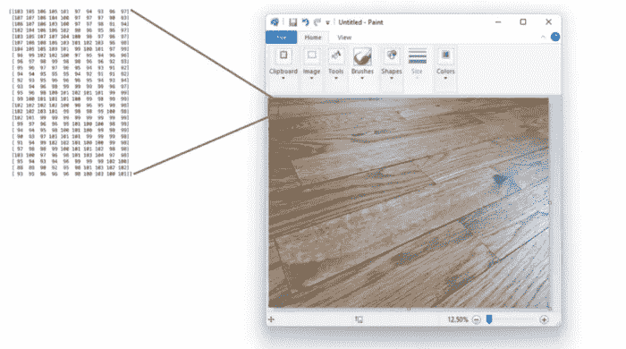
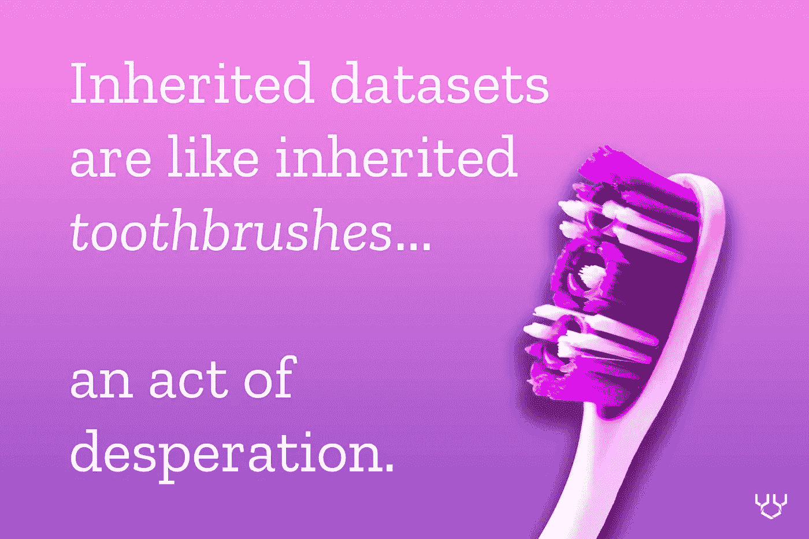

# 如何形成对数据的现实预期

> 原文：<https://towardsdatascience.com/how-to-form-realistic-expectations-about-data-622e85ab62cb>

## 成为“真正的”数据分析师的旅程

业余分析师和专业分析师之间有很大的区别。在我之前的文章[【1】](http://bit.ly/quaesita_realanalyst)[【2】](http://bit.ly/quaesita_jedianalyst)中，我们已经详细讨论了前 6 个，现在我们将深入讨论一个大问题: ***现实的期望*** 。

## 专业数据与业余数据的差异#7 —对数据的现实预期

如果你是专业分析师，你知道数据不欠你什么。对你的麻烦来说连像样的质量都没有。

> 宇宙不会因为你掌握了一些数字就欠你可靠的结论。

不幸的是，如果你曾经上过与数据相关的课程，你可能会学到相反的东西。

学生们习惯于期待每一次对数据的探索都能产生真正的见解……因为每一次家庭作业都埋藏着宝藏。这不是偶然的。

很少有教授忍心让你白费力气(为了你好！)而且开放式作业很难评分，所以作为学生你通常接触不到足够多的开放式作业。

优秀的教师希望你对数据职业感到兴奋，所以他们会额外努力为你寻找有趣的数据。[在之前的一篇文章](http://bit.ly/quaesita_mspaint)中，我给你看了一个数据集，结果是我无聊的木地板的照片(下图)。我内心的表演者在尖叫——我可以向你展示几乎任何其他数据集，它会更有吸引力，但我违背了初衷(是的),提醒你对数据的探索并不总是会带来惊天动地的启示。有时候会，但大多数时候不会。这是工作的一部分。

专业人士对这一点的理解，只能从苦难中诞生。

> 数据不欠你什么。对你的麻烦来说连像样的质量都没有。

更糟糕的是，分析师的工作性质意味着你更有可能承担探索二手数据的任务——也称为 ***继承数据***——而不是一手数据。

对使用继承数据的指南感兴趣吗？我给你做了一个[在这里](http://bit.ly/quaesita_notyours)。图片由作者提供。

如果你(或你所在的团队)直接从现实世界中收集了[的观察结果](http://bit.ly/quaesita_vocab)，那么你就在使用*的原始数据。换句话说，您可以控制如何记录和存储这些测量结果。*

*相反的是什么？ ***继承(次级)数据*** 是你从别人那里获得的那些数据。(例如，您可以在这里获得超过 2000 万个数据集[。)](http://bit.ly/quaesita_datasearch)*

*统计学家和机器学习工程师享受使用定制的原始数据集的快乐的原因是，分析师已经做了探索性的工作，以找出哪些问题值得为之创建数据。*

**

*其他数据专业人士在分析师为他们标出这些 x 之前，不会知道去哪里挖掘。照片由 [N.](https://unsplash.com/@ellladee?utm_source=medium&utm_medium=referral) 在 [Unsplash](https://unsplash.com?utm_source=medium&utm_medium=referral) 上拍摄*

*统计学家和[机器学习](http://bit.ly/quaesita_simplest)工程师是狭窄而深入的工作者，所以让他们指出值得努力的问题真的很重要。如果你的专家正在小心翼翼地解决错误的问题，那么任何对数据科学的投资都将遭受低回报。为了确保你的组织能够很好地利用窄而深的专家，你要么需要确定你已经有了正确的问题，要么你需要一个宽而浅的方法来找到一个。这正是分析的目的。*

*分析师是怎么做的？在各种杂乱的数据中漫游，而这些数据在设计时并没有考虑到他们的需求。专业分析师经常发现自己在与[耗尽的数据](http://bit.ly/quaesita_notyours)、记录不良的公共数据、令人困惑的供应商数据、错误百出的表格、老板收集的名称类似 *temp1.xlsx* 的电子表格以及混合数据(弗兰肯斯坦对不完全符合你需求的多个来源的合并)作战。*

**

*照片由 [Unsplash](https://unsplash.com?utm_source=medium&utm_medium=referral) 上的 [Haziq JB](https://unsplash.com/@haziq_jb1?utm_source=medium&utm_medium=referral)*

*当然，分析师也会分析原始数据。他们当然知道。但这不会占用他们太多时间。如果你自己制作了数据，分析它会快得多，因为你大概知道从中可以期待什么…这意味着用不了多久你就可以自由地回到分析二手数据的混乱中去。这就是为什么分析师的大部分时间可能花在继承的数据上。*

> *分析师的大部分时间可能花在继承的数据上。*

*即使你确切地知道你想解决哪个问题，也不要一头扎进数据收集中。在你的团队探索一些相关数据之前，设计你的数据集合是非常罕见的(通常是不明智的)。这就像在没有观察你的目标受众如何与原型和相关产品互动的情况下尝试 UX 设计。是啊，别那么做。*

> *你经常需要从不好的数据开始，来弄清楚如何做出更好的数据。*

*虽然所有数据专业人士都知道坏数据不会带来好结果——垃圾进垃圾出*——但分析师们痛苦地意识到，你通常需要从坏数据开始，以找出如何制造更好的数据。对分析师来说，糟糕的数据是一个职业现实。这是使他们的工作如此艰难和重要的另一个因素；我希望我们能更多地信任分析师。**

*换句话说，所有的路径都指向分析，通常是杂乱的数据。这意味着专业分析师受益于:*

*   ***领域知识**帮助他们理解混乱，并指导他们判断如何花费时间和精力。*
*   ***数据设计技能**根据他们的发现，帮助他们了解数据收集工作。*
*   ***协作技能**帮助他们知道当他们力不从心时可以依靠哪些专家，例如当实验设计问题变得棘手时可以依靠统计学家，当领域技术性很强时可以依靠科学家。*
*   ***实用主义**帮助他们沉默内心的完美主义，尽最大努力从不完美的数据中提取价值。*
*   ***沟通技巧**帮助他们平息利益相关者内心的完美主义，设定合理的预期。*
*   ***主动的好奇心**帮助他们提出棘手的问题，并找到更多的数据来源进行询问。*
*   ***韧性**帮助他们在应对他人糟糕的数据收集选择的挫败感中生存下来。*
*   ***克制**帮助他们避免从不可信的数据中妄下结论。松散地持有你的观点，并小心你的[假设](http://bit.ly/quaesita_saddest)是你如何避免与你的原始故事对你不透明的数据打交道的许多陷阱。*
*   ***谦逊**帮助他们避免把自己和他们的分析看得太重。*
*   *[**幽默感。**](https://twitter.com/quaesita/status/1283787303886954498)*

*保持对数据的热情，同时仍然能够冷静地分析数据，这并不容易。当业余爱好者的数据集被证明不足以进行令人尊敬的分析时，他们会变得情绪化。但这就是生活。专业人士接受了这个事实。(如果你正在寻找一些对数据新手的严厉的爱，你会发现[这篇文章](http://bit.ly/quaesita_jupimoon)美味暴躁。)*

*专业人士知道，仅仅因为你有一个充满数字的电子表格，并不保证你能从中获得任何有用的东西。但是他们会站出来帮助你设计一种方法，让你下次做得更好。*

**

*由 [Alexander Sinn](https://unsplash.com/@swimstaralex?utm_source=medium&utm_medium=referral) 在 [Unsplash](https://unsplash.com/?utm_source=medium&utm_medium=referral) 上拍摄*

*本文到此为止。在[下一篇](https://bit.ly/quaesita_valueanalyst)中，我们将解决业余分析师和专业分析师之间的最后三个差异: **专业数据分析师与业余分析师的差异# 8——知道如何增加价值
专业数据分析师与业余分析师的差异# 9——对时间的不同思考
专业数据分析师与业余分析师的差异# 10——细微的卓越观***

*让我知道你是否喜欢这个话题，不要忘记与你的社区分享你最喜欢的见解！*

## *专业数据与业余数据的差异#1-#3*

*软件技能；轻松处理大量数据；不受数据科学偏见的影响。包含在第 1 部分的[中。](http://bit.ly/quaesita_realanalyst)*

*  

## 专业数据与业余数据的差异# 4 –# 6

了解职业；拒绝成为数据江湖骗子；对确认偏差的抵抗力。包含在[第 2 部分](http://bit.ly/quaesita_jedianalyst)中。

  

## 专业数据与业余数据的差异#7

哇，你错过了？向上滚动！

## 专业数据与业余数据的差异# 8-# 10

  

# 感谢阅读！喜欢作者？

让我们做朋友吧！你可以在 [Twitter](https://twitter.com/quaesita) 、 [YouTube](https://www.youtube.com/channel/UCbOX--VOebPe-MMRkatFRxw) 、 [Substack](http://decision.substack.com) 和 [LinkedIn](https://www.linkedin.com/in/kozyrkov/) 上找到我。有兴趣让我在你的活动上发言吗？使用[表格](http://bit.ly/makecassietalk)联系。*