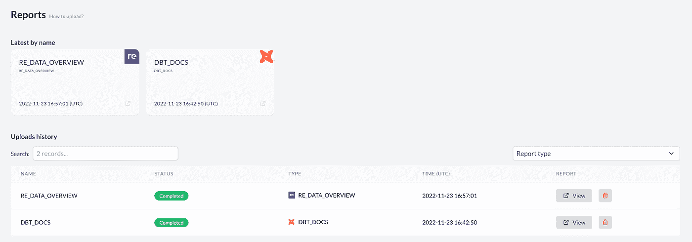

# 如何生成免费的数据质量报告

> 原文：<https://towardsdatascience.com/how-to-generate-free-data-quality-reports-cdf5cf3fc56b>

## 使用最新的开源工具 re_cloud


照片由[张秀坤在](https://unsplash.com/@dodancs?utm_source=unsplash&utm_medium=referral&utm_content=creditCopyText) [Unsplash](https://unsplash.com/s/photos/clouds?utm_source=unsplash&utm_medium=referral&utm_content=creditCopyText) 上跳舞

人们如此频繁地谈论数据质量是有原因的——它很重要！如果你没有高质量的数据，你的矿也没有任何数据。您的数据质量直接决定了您对业务洞察的质量。

在实施数据质量计划时，您应该始终关注您的源数据。当您在源处关注数据时，您可以在问题进入下游数据模型之前捕捉到它们。这确保了业务团队看到的是已经测试过的数据，知道他们在使用这些数据时是可靠的。

数据质量的很大一部分也是为了确保这个源数据及其下游数据模型按预期更新。业务团队需要知道他们什么时候会得到他们需要的数据，以及他们需要的节奏。数据必须是新的，见解才能准确。

[re_data](https://www.getre.io/) 是一款开源工具，可以轻松测量数据质量。它允许您设置不同的警报，以便在数据出现异常时通知您。我最喜欢跟踪的一些指标是新鲜度、方差和数据量。re_data 还允许您轻松地设置 Slack 和电子邮件提醒，以便您在最常用的地方得到通知。

我最近了解到 re_data 也有一个云产品，可以帮助您在一个地方收集所有的数据质量报告。让我们更深入地探讨一下这个问题！

# re_cloud 是什么？

[re_cloud](https://medium.com/r?url=https%3A%2F%2Fcloud.getre.io%2F%23%2Fregister) 是一个用户界面，允许您存储和协作来自 re_data、其他开源工具和定制数据工具的数据质量报告。它将您所有最重要的信息整合在一个位置，让您能够全面了解您的数据。您只需下载由外部工具生成的 HTML 报告，或者从您的本地环境生成报告，并将它们上传到云中的一个中心位置。

re_cloud 集成了许多数据工具，如[远大前程](https://greatexpectations.io/)、[熊猫](https://pandas.pydata.org/)和 [Trino](https://trino.io/) ，以及 Postgres、Redshift、Bigquery 和 Snowflake 等数据仓库。在本教程中，我将带您在 re_cloud 中集中 re_data 报告和 dbt 文档。

# 将您的报告放在一个地方的好处

在我们进入教程之前，让我们来讨论一下为什么你想要所有的数据质量报告都在一个地方。我希望你考虑一下你的云数据平台。这充当了您的**单一真实来源**——从您所有不同数据源获取数据的位置。数据团队和业务利益相关者知道，他们可以依靠这个云数据平台来获得最准确、最新的数据。

这与为您的数据源和 [dbt](https://medium.com/towards-data-science/is-dbt-the-future-of-analytics-d6ff93cbb20c) 模型上最重要的数据质量信息提供一个中心位置的想法是一样的。数据团队不必检查单个工具中的仪表板和指标，也不知道该依赖哪一个，而是可以导航到一个真实的来源。在这里，他们可以获得从接收到编排的整个数据生态系统的整体视图。

re_cloud takes 还将 dbt 文档与这些质量报告一起部署。将您的文档放在这些报告旁边可以节省您在两个 ui 之间切换的时间和精力。因为文档是在产品中构建的，所以您可以很容易地将预期与您的数据管道中正在发生的事情进行比较。

查看 dbt 模型沿袭是 dbt docs 和 re_data 一起部署的一个特性，它允许您测量质量警报对下游数据模型的影响。看到写在一个列上的 dbt 测试可以让你理解什么样的列值*应该和什么样的列值*进行比较。当试图解决一个严重的生产问题时，像这样的小事可以节省大量时间。

我开始使用 re_data 的原因之一是因为它使查看*全貌*变得非常容易。我看到了我想看到的信息，而且仅仅是这些，因为该工具使我能够轻松地将警报发送到我想要的位置。现在，他们更进一步，不仅允许你查看他们的提醒，还允许你查看来自其他工具的提醒。

# 如何设置云

请记住，re_data 假设您是 dbt 用户。云产品直接与 dbt 项目和可选的 re_data 一起工作。首先，你需要安装 re_cloud Python 包。

```
pip install re_cloud
```

接下来，你需要在 re_cloud 平台上生成一个 API key。请确保首先创建一个帐户，然后您可以导航到右上角的您的用户资料。单击“帐户设置”，然后单击“Api 密钥”。这里将有一个访问密钥，您可以复制。


作者图片

我们将把它输入到你已经设置了 re_data 的 YAML 文件中。如果还没有为 re_data 创建文件，我建议将它放在一个单独的 re_data.yml 文件中。带有 api 键的 re_cloud 块应该如下所示:


作者图片

一定要将这个 yaml 文件保存在~/中。re_data/ directory。这将确保 re_data 在正确的位置查找。

# 在 re_cloud 中生成报告

现在我们已经准备好开始生成一些报告了！

## **dbt 文档**

让我们从生成 dbt 文档开始。如果您还不知道，dbt 有一个[特性](https://www.getdbt.com/blog/using-dbt-docs/)，您可以在一个格式良好的 UI 中填充 YAML 文件中定义的信息。这充当了一个干净的数据目录，数据团队甚至业务团队的用户可以查看关于源或模型的更多细节。它还显示模型沿袭和应用于不同数据资产的测试。要生成这些文档，您可以运行以下命令:

```
dbt docs generate
```

然后，要将它们上传到 re_cloud，请运行以下命令:

```
re_cloud upload dbt-docs
```

请记住，您需要在这里安装 dbt-core。由于某种原因，我没有，这个命令失败了。您可以通过运行以下命令来安装 dbt-core:

```
pip install dbt-core 
```

运行这个命令并再次运行 re_data 命令后，我得到一条消息，表明我的 dbt 文档已经成功上传到 re_cloud。


作者图片

如果您导航到 re_cloud，您应该会看到您的报告已上传。


作者图片

如果您单击顶部块，dbt 文档将在一个单独的选项卡中打开。现在，您可以进一步探索您的 dbt 项目、表、列定义等等！


作者图片

**re_data**

现在让我们为 re_data 包生成一个报告。我使用 re_data 测试我的大多数关键指标，如数据量和新鲜度，所以这对我上传到 re_cloud 非常重要。首先，要生成报告，请运行以下命令:

```
re_data overview generate 
```

然后，要将报告上传到 UI，请运行:

```
re_cloud upload re-data
```

您应该得到另一个状态代码 200，这意味着成功，就像您对 dbt 文档所做的那样。


作者图片

当您导航到 UI 时，现在应该看到两个块——一个用于 dbt_docs，另一个用于 re_data_overview。



作者图片

单击 re_data_overview 块后，您将看到 re_data 的主要特性，如警报、沿袭、测试、表格和指标。这为您提供了友好、直观的数据质量信息。


作者图片

# 计划您的云报告(_ u)

我建议创建一个系统，让您团队中的某个人每周生成 re_cloud 报告，并将它们上传到 re_cloud。更好的是，您可以自动执行这些命令，直接在您的数据管道中运行，确保 re_cloud 每天更新。

就我个人而言，我使用[提督](https://medium.com/towards-data-science/tired-of-airflow-try-this-c51ec26cd29d)来编排我的数据管道。使用这个工具可以很容易地设置任务之间的依赖关系。当我的模型每天早上运行完毕时，我已经使用 Prefect 触发了我的日常 re_data 测试。为此，我在我的提督流中运行以下命令:

```
dbt_task(command=’dbt run -m re_data’, task_args={“name”: “re_data monitoring”})
```

为了在 re_cloud 中生成和上传报告，我们将使用在本地 CLI 上运行的相同命令。但是，这一次我们将把它们包含在 Prefect 流的 dbt_task 中。

这看起来像这样:

```
Generate_re_data = trigger_dbt_cli_command(
        "re_data overview generate"
    )

Generate_dbt_docs = trigger_dbt_cli_command(
        "dbt docs generate"
    )

Upload_re_to_re_cloud = trigger_dbt_cli_command(
        "re_cloud upload re-data"
    )

Upload_docs_to_re_cloud = trigger_dbt_cli_command(
        "re_cloud upload dbt-docs"
    )
```

这里，我在两个独立的任务中生成 re_data 报告和 dbt 文档。然后我用两个不同的命令上传它们，我已经把它们分配给了两个变量 `upload_re_to_re_cloud`和`upload_docs_to_re_cloud`。

请记住，在 Prefect 等编排工具中设置依赖关系非常重要。您不希望在生成报告之前运行 re_cloud upload 命令，因此可以将这两个生成任务设置为上游依赖项。

使用 Prefect 为该任务设置上游依赖项如下所示:

```
Re_data_upload = Upload_re_to_re_cloud(wait_for=[generate_re_data])

dbt_docs_upload = Upload_docs_to_re_cloud(wait_for=[generate_dbt_docs])
```

当您直接在数据管道中实现这些命令时，一切都会无缝运行。您知道，当您的管道每天早上运行时，re_cloud 中也会有更新的数据质量报告等着您。

# 结论

拥有一个像 re_cloud 这样的中心位置是跟踪整个数据堆栈的数据质量的一个很好的方法，不管使用什么工具。一个中心位置可以让您全面了解数据的状态，让您可以轻松地比较不同的报告，并找出任何低标准的原因。

使用像 [re_cloud](https://cloud.getre.io/#/register) 这样的工具在你的公司内建立透明的文化；每个人都可以了解数据质量，而不仅仅是数据团队。像这样的工具让非技术人员更容易理解他们每天使用的数据。这是一个强大的工具，可以将数据和业务团队团结在一个共同的目标上。

更多关于产生高质量数据的信息，请查看我的免费每周[时事通讯](https://madisonmae.substack.com/)关于分析工程。