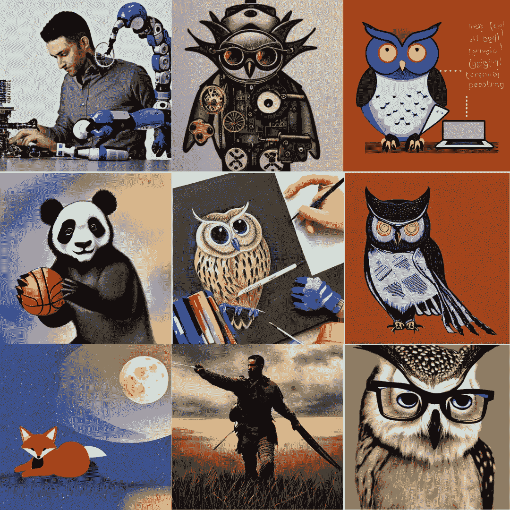
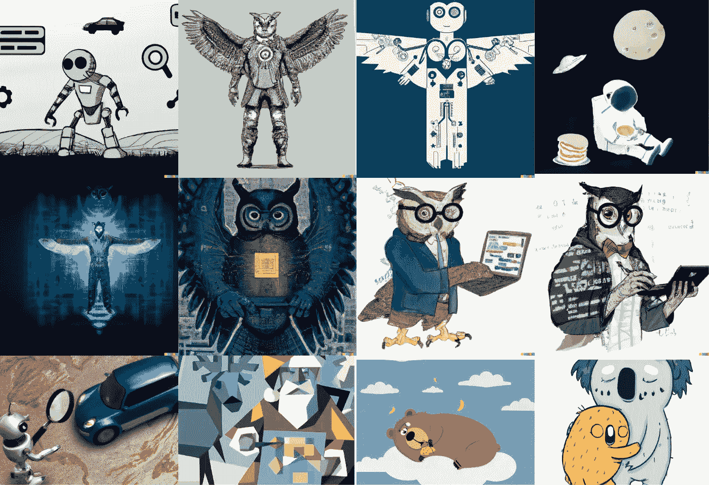

# 如何用稳定的扩散模型从文本生成图像

> 原文：<https://towardsdatascience.com/how-to-generate-images-from-text-with-stable-diffusion-models-ea9d1cb92f9b>



图片由作者提供。[由拥抱脸创作的 colab 笔记本代码生成。](https://colab.research.google.com/github/huggingface/notebooks/blob/main/diffusers/stable_diffusion.ipynb#scrollTo=yEErJFjlrSWS)

## 快速介绍使用拥抱脸的扩散包文本到图像的生成

***在这篇文章中，我将向你展示如何使用 Hugging Face 的扩散器包，使用稳定的扩散模型开始文本到图像的生成。***

# 从 DALLE 到稳定扩散

不久前，我获得了 OpenAI 的 [DALLE-2 模型，它允许你从文本中创建令人惊叹的图像。所以，我开始摆弄它，并产生了一些相当惊人的图像。](https://openai.com/dall-e-2/)



图片由作者提供。用 [DALL-E 2](https://openai.com/dall-e-2/) 生成。

然而，我的学分用完了，所以我决定寻找替代品，并通过拥抱脸看到了这篇不可思议的文章，

[](https://huggingface.co/blog/stable_diffusion)  

这解释了如何使用他们的`diffusers`包运行稳定的扩散模型。

因此，让我们深入研究如何使用`diffusers`从文本生成图像！

# 用稳定的扩散管道从文本生成图像

先说第一件事， ***步骤用*** `***diffusers***` ***包从文本中生成图片有:***

1.  **确保你有 GPU 访问权限**
2.  **安装要求**
3.  **在 Google Colab 上启用外部小部件(适用于 Colab 笔记本)**
4.  **使用您的用户令牌登录拥抱脸**
5.  **初始化**
6.  **将管线移动到 GPU**
7.  **用 Pytorch 的** `**autocast**` **模块**运行推理

因此，对于这个项目，由于我或多或少地通过拥抱脸 ***来跟随 [colab 笔记本，我们将假设您可以访问具有 GPU 启用](https://colab.research.google.com/github/huggingface/notebooks/blob/main/diffusers/stable_diffusion.ipynb#scrollTo=zHkHsdtnry57)*** 的 colab 笔记本。我们开始吧！

## 1.确保您有 GPU 访问权限

```
!nvidia-smi# My Output
```


图片由作者提供。

好的，太好了！现在我们知道我们可以访问 GPU，让我们设置这个项目的要求。

## 2.安装要求

本项目有 5 个主要要求:

*   `diffusers==0.2.4` —运行管道的主要软件包
*   `transformers` —拥抱 Face 的套装中有许多预先训练好的文本、音频和视频模型
*   `scipy` —科学计算的 Python 包
*   `ftfy` —用于处理 unicode 问题的 Python 包
*   `ipywidgets>=7,<8` —用于在笔记本上构建小部件的包
*   `torch` — Pytorch 包(在 colab 不用安装)
*   `pillow` —用于处理图像的 Python 包(如果您在 colab 中，则无需安装)

要在 Google Colab 中安装您实际需要的所有东西，只需运行:

```
!pip install diffusers==0.2.4!pip install transformers scipy ftfy!pip install "ipywidgets>=7,<8"
```

## 3.在 Google Colab 上启用外部小部件(适用于 Colab 笔记本电脑)

```
# enabling widgets (to be able to login to hugging face)from google.colab import outputoutput.enable_custom_widget_manager()
```

## 4.使用您的用户令牌登录拥抱脸

```
# login to huggin face (get an access token etc...)from huggingface_hub import notebook_loginnotebook_login()
```

您应该会看到一个小部件，您将从拥抱脸输入您的[访问令牌。输入之后，您应该会看到类似这样的内容:](https://huggingface.co/docs/hub/security-tokens)

```
# Expected OutputLogin successful Your token has been saved to /root/.huggingface/token **Authenticated through git-credential store but this isn't the helper defined on your machine. You might have to re-authenticate when pushing to the Hugging Face Hub. Run the following command in your terminal in case you want to set this credential helper as the default  git config --global credential.helper store**
```

## 5.初始化`StableDiffusionPipeline`

```
import torchfrom diffusers import StableDiffusionPipelinepipe = StableDiffusionPipeline.from_pretrained("CompVis/stable-diffusion-v1-4", revision="fp16", torch_dtype=torch.float16, use_auth_token=True)
```

在这里，就像在他们的 colab 笔记本中一样，我们使用`v1-4`模型，我们将为其下载权重。一旦完成，我们就可以进入下一步。请随意试用其他型号进行比较！

## 6.将管道移动到 GPU

```
pipe = pipe.to("cuda")
```

## 7.使用 Pytorch 的`autocast`模块运行推理

```
from torch import autocastprompt = "photo of a panda surfing"with autocast("cuda"):
  image = pipe(prompt)["sample"][0] image.save(f"panda_surfer.png")image
```

***输出***


图片由作者提供。[由拥抱脸创作的 colab 笔记本代码生成。](https://colab.research.google.com/github/huggingface/notebooks/blob/main/diffusers/stable_diffusion.ipynb#scrollTo=yEErJFjlrSWS)

我们可以清楚地看到，结果令人难以置信。显然你会发现你得到的结果有一些可变性，但是 ***有一些参数你可以调整，比如*** `***guidance_scale***` ***、步数和设置随机种子*** (用于确定性输出)，这将帮助你得到更一致的结果。

# 最后的想法和建议

在官方 [colab 笔记本 by 抱脸](https://colab.research.google.com/github/huggingface/notebooks/blob/main/diffusers/stable_diffusion.ipynb#scrollTo=yEErJFjlrSWS)，(本文主要来源)他们有关于稳定扩散的清晰而简单的解释，以及让你更深入了解这个话题的资源，所以我推荐你去看看！我会给出一些额外的建议，看看这些资源:

*   [超赞扩散模型](https://github.com/heejkoo/Awesome-Diffusion-Models)
*   [Ari Seff 关于扩散模型的精彩介绍视频](https://www.youtube.com/watch?v=fbLgFrlTnGU&list=LL&index=3)
*   [论文:*理解扩散模型:统一视角*](https://arxiv.org/abs/2208.11970)

如果你喜欢视频形式，请点击这里查看我的 Youtube 视频:

如果你喜欢这篇文章，[加入媒体](https://lucas-soares.medium.com/membership)，[关注](https://lucas-soares.medium.com/)，[订阅我的时事通讯](https://lucas-soares.medium.com/subscribe)。还有，订阅我的 [youtube 频道](https://www.youtube.com/channel/UCu8WF59Scx9f3H1N_FgZUwQ)在 [Tiktok](https://www.tiktok.com/@enkrateialucca?lang=en) 、[推特](https://twitter.com/LucasEnkrateia)、 [LinkedIn](https://www.linkedin.com/in/lucas-soares-969044167/) 、 [Instagram](https://www.instagram.com/theaugmentedself/) 上和我联系！谢谢，下次再见！:)

# 参考

*   [https://openai.com/dall-e-2/](https://openai.com/dall-e-2/)
*   [https://huggingface.co/blog/stable_diffusion](https://huggingface.co/blog/stable_diffusion)
*   [https://colab . research . Google . com/github/hugging face/notebooks/blob/main/diffusers/stable _ diffusion . ipynb # scroll to = zhkhhsdtnry 57](https://colab.research.google.com/github/huggingface/notebooks/blob/main/diffusers/stable_diffusion.ipynb#scrollTo=zHkHsdtnry57)
*   https://github.com/heejkoo/Awesome-Diffusion-Models
*   【https://huggingface.co/docs/hub/security-tokens 