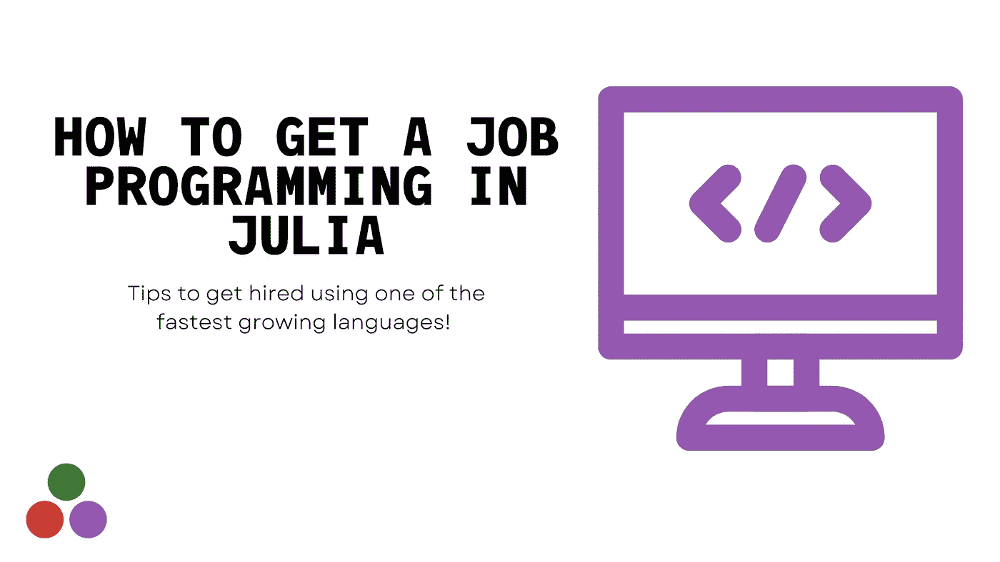

# 如何找工作用 Julia(发展最快的语言)编程

> 原文：<https://towardsdatascience.com/how-to-get-a-job-programming-in-julia-7f24a2ee563f>

作者图片

我通过电子邮件和直接信息收到的最常见的问题之一是:“嘿，我真的很喜欢用 Julia 编程，我如何才能找到一份全职做这个的工作？”

在本帖中，我们将讨论如果你是 Julia 社区的一员(即使你昨天才开始使用这种语言)，并且你想全职使用 Julia 找一份工作，你应该做的一些事情。我们将讨论三个要点:

*   建立你的茱莉亚网络🕸
*   创建内容🎥 📝
*   做出技术贡献📦

如果你有兴趣听到招聘 Julia 开发者的公司的消息，请收听 Twitter Spaces 的录音，并查看本文的结尾，我将在这里列出一些在 Julia 生态系统中招聘的公司:

我还想补充一个简短的声明，这里提出的想法只是可能方法的一小部分。使用 Julia 找工作真的有很多不同的方法，所以我希望这篇文章可以对一种可能的方法提供独特的视角。如果你有不同的做法，请分享！让我们帮助人们找到工作。

*编辑:我和我的合著者很高兴地告诉大家，我们的新书《茱莉亚速成班》已经开始预售了:*

<https://logankilpatrick.gumroad.com/l/juliacrashcourse>  

# 为什么是朱莉娅·⁉️

在我们深入了解使用 Julia 找工作的技巧之前，有必要从高层次了解一下为什么 Julia 是一个有助于你找到工作的技术主题。首先，公司通常对雇佣能带来新观点的人感兴趣。朱莉娅可以是那个新鲜的视角！此外，在 Julia 生态系统中有如此多的机会做出你在其他地方可能找不到的重大贡献，这可能会带来许多你可能没有的机会。最后，朱莉娅最适合解决的问题是在未来几年将有巨大就业潜力增长的领域。所有这些都是为了说，在我看来，如果你想让自己与众不同，Julia 是最好的学习和贡献语言(即使你没有被 all Julia 公司聘用或只使用 Julia)。

# 建立你的茱莉亚网络🕸

就像在任何领域找工作一样，你认识的人越多，你就越有可能遇到一个惊人的机会。朱莉娅社区也是如此。但是你如何开始建立你的人际网络呢？根据我的经验，最简单的方法是对语言和社区做出高质量的贡献。人们尊重那些进来并提供价值的人(这不仅仅适用于 Julia 社区)。

在本文的后半部分，我们将更多地讨论对社区做出贡献的具体方式，但是让我们继续关注这里的网络部分。每年最好的社交机会就是 JuliaCon。由于正在进行的疫情，JuliaCon 在线，这意味着你有机会与成千上万的用户和开发者免费交流！JuliaCon 以社交活动和各种技术讲座为特色。要记住的重要事情是参加技术讲座，并试图理解人们使用 Julia 的目的。没有什么比问一个有趣的、经过深思熟虑的问题更能告诉别人你关心他们的工作了。如果你很害羞，没有必要做直播，你可以随时给别人发消息或在话语上发帖。

看看上面的视频，了解一下 JuliaCon 是什么样的，以及你为什么想参加。

除了与 JuliaCon 网站上的 Julia 社区联系之外，你还可以在 Slack、Zulip、Discord、Twitter、Discourse 等网站上闲逛。你可以在 JuliaLang 网站上找到所有的社区论坛:[https://julialang.org/community/](https://julialang.org/community/)。同样，要记住的重要事情是在这些平台上的对话中提供价值。一旦你做到了这一点，花一分钟和别人打招呼并介绍自己就变得容易多了，因为你们已经建立了关系。

# 创建内容🎥 📝

在今天的情况下，你可以为一个问题创造一些真正有趣的技术解决方案，但是如果没有人发现它，它最终不会提供任何价值。这说明开发者越来越需要创造技术内容，分享他们创造或学习的酷东西。我会注意到，你不需要从头开始构建一些东西来共享它。我开始在所有地方的堆栈溢出上“创建内容”。我会去搜索最流行的 Python 标记的问题，并在 Julia 的上下文中问同样的问题。如果我能找到答案，我会张贴出来，否则，我会张贴问题的链接，并试图获得帮助。这不仅让我学到了很多东西，还建立了我在社区中的信誉。

人们喜欢好的博客文章，Julia 社区也不例外。同样，你不需要创造一些新的技术解决方案来写一篇文章。我最近为初学者写了一篇关于 5 个 Julia 项目的文章:

</5-julia-projects-for-beginners-easy-ideas-to-get-started-coding-in-julia-938b823a0a08>  

这篇文章同样没有介绍任何突破性的东西，但仍然有望为刚刚加入社区的人提供价值。分享这些文章的最佳地点是 Twitter 上的 JuliaLang 标签和官方账户的标签。

更广泛地说，为什么创作这样的内容能帮助你找到工作？一个最大的原因是它增加了你作为贡献者的知名度。这使得社区中的其他人更加了解你所做的工作，并且当机会来临的时候，有可能代表你提出建议。最重要的是，就像开源一样，这种类型的内容会给你一个公开的跟踪记录。当你参加 xyz 公司招聘 Julia developers 的面试时，你可以指出你的开源工作以及技术内容，在许多情况下，它们比编码更好地展示了你的思维过程。

创建技术内容的另一个地方是 YouTube。Julia Language 运营着一个拥有数百个视频的社区频道。如果你举办一个关于 Julia 的研讨会，或者想要录制一个关于使用软件包的视频教程，这个频道是一个发布内容的好地方。如果你对此感兴趣，请联系我。有人在自己的频道上这样做的一个很好的例子是:

<https://www.youtube.com/c/juliafortalentedamateurs>  

你可以创造的另一种有影响力的内容是朱莉娅的书。现在还没有足够多写得好的书，但是作为写书的人可以在很多年里获得回报。你不需要使用 Julia 年，甚至不需要有博士学位。其中一个非常成功的例子是 Ahan Sengupta 的书《Julia 算法小书:培养 Julia 编程流畅性的练习册》,这本书是在 Ahan 上高中时出版的:

<https://www.amazon.com/Little-Book-Julia-Algorithms-programming/dp/1838173609/ref=sr_1_1?crid=161EFXY9Y23PK&keywords=little+book+of+julia+algorithms&qid=1642512816&sprefix=little+book+of+julia+algorthms%2Caps%2C131&sr=8-1>  

当我读这本书的时候，我被它的质量震惊了，也对阿汉所做的工作印象深刻。有如此多的机会在邻近领域写书，这为 Julia 社区提供了真正的价值，也为你作为作者打开了许多机会。

关于这个主题，我要注意的最后一件事是，写作和教程创建过程也会给你的技术工作带来好处，因为文档在开源领域至关重要，你写得越好，你的文档就越好，越多的人会从中受益。

# 做出技术贡献📦

虽然这可能是最直接、最有据可查的方法，但我把它作为最后一个主要想法，以强调这样一个事实:你不需要在 Julia 社区做出很深的技术贡献就能找到工作。我个人在自己的生活中遇到了很多很酷的机会，我不是这门语言的核心贡献者，也没有编写过像 DataFrames.jl 这样的基础 Julia 包。

尽管如此，你所做的技术工作仍然应该提供价值并建立你的记录。创建 Julia 包是最好的方法之一。生态系统中仍然有相对较少(但不断增长)的软件包，因此有许多空白需要填补。如果您想了解如何创建包，请查看本教程:

虽然这个视频有点过时，但它介绍了创建第一个 Julia 包所需的所有机制。但是你不需要从头创建一个，为现有的项目做贡献是非常有价值的。朝这个方向开始的最佳方式是尝试在您感兴趣的领域中找到软件包。对我来说，这往往是机器学习，所以我总是在寻找帮助 Flux.jl 的地方。

如果你知道一个你想帮忙的包，但是不知道从哪里开始，找一个有贡献的指南。如果没有，这可能是一个很好的机会来帮助创造一个！你也可以在 GitHub 上的回购网址后添加“/contribute”来查看适合新贡献者的问题:[https://github.com/FluxML/Flux.jl/contribute](https://github.com/FluxML/Flux.jl/contribute)请注意，这可能是一个小的子集，但希望它仍然会给你提供你可能能够帮助的地方的类型的背景。

如果你已经有了一个 Julia 包，建立你的声誉和技术技能的一个方法是指导一个谷歌代码暑期班的学生。这样做有很多好处，如果你能成功地帮助一个学生，它真的能突出你的技术理解。如果你想了解更多这方面的知识和成为优秀导师的方法，请查看:

还有这篇关于话语参与的帖子:[https://Discourse . Julia lang . org/t/seeking-Julia-mentors-and-projects-for-gsoc-2022/74328](https://discourse.julialang.org/t/seeking-julia-mentors-and-projects-for-gsoc-2022/74328)

在 JuliaLang 网站上，我们刚刚完成了生态系统贡献指南的第一版。本页讨论了许多你可以在 Julia 社区产生影响的技术和非技术方法。查看页面了解更多:【https://julialang.org/contribute/ 

# 我能在哪里工作？🧐

现在你知道了获得这份工作需要知道的东西，下一个问题是去哪里申请？以下是招聘 Julia developers 的地点的非详尽列表:

*   [https://jobs.juliacomputing.com/jobs](https://jobs.juliacomputing.com/jobs)
*   https://jobs.lever.co/invenia
*   【https://pumas.ai/company/careers/ 
*   [https://beacon.bio/careers](https://beacon.bio/careers)
*   [https://boards.greenhouse.io/relationalai](https://boards.greenhouse.io/relationalai)
*   [https://zapata.bamboohr.com/jobs/](https://zapata.bamboohr.com/jobs/)
*   [日产研究](https://www.linkedin.com/jobs/view/2868828299/?alternateChannel=search&refId=eF9dQfgv7FnxMp0b8Z09Gg%3D%3D&trackingId=GN3xksP1b6uEwuHo7UdVUg%3D%3D)
*   [亚马逊量子计算](https://www.linkedin.com/jobs/view/2872396321)
*   [LinkedIn 上的许多其他公司](https://www.linkedin.com/jobs/search/?currentJobId=2879779716&keywords=julia)

如果我错过了一个，请评论下面公司的链接！