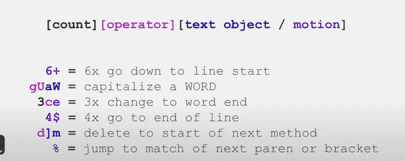

# 如何更快更高效地进行编程—机器学习—数据分析

> 原文：<https://towardsdatascience.com/how-to-get-faster-in-programming-machine-learning-data-analysis-ce141910d52c>

# 如何更快更高效地进行编程—机器学习—数据分析

## 步伐是提高数据科学家工作效率的关键因素

菲尔·里德在 [Unsplash](https://unsplash.com?utm_source=medium&utm_medium=referral) 上的照片

# 作为一名数据科学家，你为什么应该加快编程速度？

数据分析技术上是一个搜索问题。你的速度越快，你可以探索的数据就越多，这样你找到有价值的东西的机会就越大。对于机器学习模型开发，我们也可以说同样的话。我们在技术上搜索几乎无限的模型空间，以找出预处理步骤、预测器、超参数等的最佳组合。这两项任务有一个巨大的共同点——编程！

# 那么如何提高编码速度呢？

我们可以将编码任务分解成 4 个子部分；

1.  打字
2.  文本编辑
3.  研究
4.  设计代码逻辑——就此结束吧，除了花数百个小时学习算法和数据结构之外，我没有太多的建议来提高这个项目的速度。

# 打字

这个不一定是代码相关的，但是如果你每天打字几个小时，那么你最好开始学习触摸打字，如果你还没有做的话。特别是，如果你的打字速度低于 50 字/分钟——这对一个每天花很多时间打字的人来说确实是一个很低的数字——我建议开始每天练习 30 分钟——事实证明一致性是关键，就像所有需要肌肉记忆的事情一样。开始的时候会有点痛，但是大概需要 10-15 天才能达到现在的速度。

几年前我用过 www.typingclub.com T2，对它的界面和功能非常满意。它不是完全免费的，尽管有很多免费网站可供你搜索。

# 文本编辑

在我看来，这是编写代码时的一项关键任务，因为在编写代码时，你并不是真的在做常规的打字工作——至少你不应该这样做。我们正在做的是在文件中上下移动，复制一些东西，粘贴到一些东西上面，改变一些参数等等。与写帖子或文章相比，它涉及更多的重复性任务。因此，我们可以在重复的任务中使用快捷方式。

## 代码完成工具

开始使用 Kite 或 Jedi 或其他代码完成工具(由于某些原因，Kite 目前不允许新的下载)。如果你一直没有这样做，你可能会想从手动挡汽车转向自动挡汽车。根据我的经验，Kite 似乎工作得很好。它还有一个“跟随光标”选项，可以自动显示您正在使用的功能的文档。

## Vim & IdeaVim

IdeaVim 是 IDEs 的一个插件，我发现将 IdeaVim 集成到我的工作流程中有很大的好处。根据我的经验，我认为它使我的编码速度至少提高了 10%,尽管我认为自己是中级 vim 用户。

vim 的问题在于陡峭的学习曲线。这需要一点时间来适应，但绝对让我觉得更喜欢用键盘说话，而不是打字。因此，这无疑使开发体验变得更加有趣！

我在下面附上我的 vim 备忘单。这不是一个详尽的列表，尽管它包含了最常见的命令。对于那些对 Vim 一点都不熟悉的人，我建议将它作为一种语言来使用，首先理解操作符、动作、文本对象等概念，以及如何将它们组合起来与编辑器进行交流。

## 我的 Vim 备忘单

**模式**
`Esc` —开始命令模式
`i` —开始插入模式
`v` —开始视觉模式

**运算符** `y` —复制(猛拉)
`x` —剪切
`d` —删除
`D` —删除不包括新行字符
`c` —更改(删除&开始插入模式)
`p` —粘贴
`~` —交换小写&`>`—缩进
`gu` —转换为小写
`gU` —转换为大写
**自定义运算符—环绕** `ys` —添加环绕
`cs` —更改环绕
`ds` —删除环绕
`S` —以可视方式添加环绕
**自定义运算符—注释 **自定义操作符—ReplaceWithRegister** `gr` —Go replace
**自定义操作符— Exchange** `cx` —在第一次使用时，定义要交换的第一个{motion}。 在第二次使用时，定义第二个{运动}并执行交换。
`cxx` —选择当前行作为交换元素之一
`X` —视觉模式的 CX
`cxc`—清除任何等待交换的动作**

## **运动**

`e` —转到当前单词的末尾，包括最后一个字符。
`w` —转到下一个单词的开头，包括其第一个字符。
`W` —转到下一个单词的开头，单词仅由空格分隔，标点符号被视为单词的一部分。
`b` —转到当前单词的开头
`^` —转到当前行的第一个非空白字符
`0` —转到当前行的开头
`$` —转到当前行的结尾，包括最后一个字符。
`f` —转到字符
`F` —转到后面的字符
`t` —转到字符 T 前一位—转到后面的字符前一位
`H` —转到顶行
`M` —转到中间行
`L` —转到最低行
`%` —转到下一个括号/大括号
`zt`的匹配项—滚动页面使光标停留在页面顶部
`zz` —如此滚动页面 在页面中间
`zb` —滚动页面使光标停留在页面底部
`<ctrl-o>` —转到光标的上一个位置
`<ctrl-i>` —按 ctrl + o
`<ctrl-B>`后转到光标的下一个位置—上一整页
`<ctrl-F>` —下一整页
`<ctrl-U>` —上半页
`<ctrl-D>` —下半页

## 文本对象

`aw` —一字
`iw` —内字
`aW` —一字
`iW` —内字
`ap` —一段
`ip` —内段
`ab` —一个括号
`iv` —内括号
`at` —一个标签
`it` —内标签
**自定义文本对象— Argtextobj** `aa` —一个函数的自变量
`ia` — `ai` —缩进(包括上面一行)
`ii` —内缩进
`aI` —缩进(包括上面和下面一行)

下面是来自[乐仁昌演讲](https://www.youtube.com/watch?v=E-ZbrtoSuzw)的一个简单的如何说维姆语的例子

Vim 语法结构

> PS:请将您的 caps lock 键映射到 ESC。你不会后悔的。—建议 Microsoft PowerToys for Windows 用户将其映射到操作系统级别。

# 研究

这可能会耗费大量的时间，尤其是如果你对你所使用的语言的基本操作不太熟悉的话。我主要使用 Python，并且肯定会建议对以下操作非常熟悉，如果你需要对这些操作进行谷歌搜索，那么你可能会浪费一些时间，因为几乎可以肯定的是，每个数据分析、机器学习任务都需要至少执行以下一些任务。

**需要掌握的 Python 基本操作/功能**

*   列表理解
*   词典理解
*   过滤数据帧
*   分组依据、聚合、自定义聚合和任何类型的汇总计算
*   日期、时间、日期时间和时区对象以及如何操作它们
*   转换数据帧列的数据类型
*   在不同的数据类型之间转换，例如从 2 个单独的列表转换为元组列表等。Ex: [1，2，3]，[“a”，“b”，“c”]→[(1，“a”)，(2，“b”)，(3，“c”)]
*   融合和旋转数据框
*   函数式编程类型操作—映射、应用、应用映射函数
*   编写交叉验证循环
*   几个小提示。
    -保留分类的、数字的列名和/或概念上相似的列名的单独列表，这样你就不必每次都去选择列并试图过滤相似的列。
    -给你的列命名，不要加空格，用“.”来访问它们符号，因为它比 df["column"]符号方便得多。

**记录更高级的操作** 为你在堆栈溢出等情况下搜索的任务创建一个非常简单的例子。花了你 10 多分钟。将它们保存在一个地方—概念、OneNote 等。几乎可以肯定的是，你将来还会需要这些代码，用一个简单的例子把它们写下来，下次会更容易记住，如果你不记得了，去记笔记找出答案会比去网上容易得多。比如说；下面是我笔记中的一段代码示例，用于将函数作为多线程操作运行。

**快速访问文档&函数签名** ide 通常有一个快捷方式来调出文档或函数签名——py charm 有`<ctrl-q>`和`<ctrl-p>`，jupyter notebooks 有`<ctrl-shift>`——我建议熟悉这些快捷方式，如果你记不住参数名称等，可以先试一试。而不是直接进行谷歌搜索。

# 设计代码逻辑

正如我上面提到的，除了学习算法和数据结构，阅读和理解 GitHub、Kaggle 等其他人写的代码，我真的没有太多建议。这可以帮助你找到更好的代码设计方法。

# 结论

在我看来，在这四个要素(打字—代码编辑—研究—代码设计)上做得更好，一定会让你成为一个更有能力、更有生产力的数据科学家。大约两年前，我开始在这些元素上投入时间，并认为这完全值得花时间和精力。如果你还有什么要补充的，我很乐意听到并尝试一下。