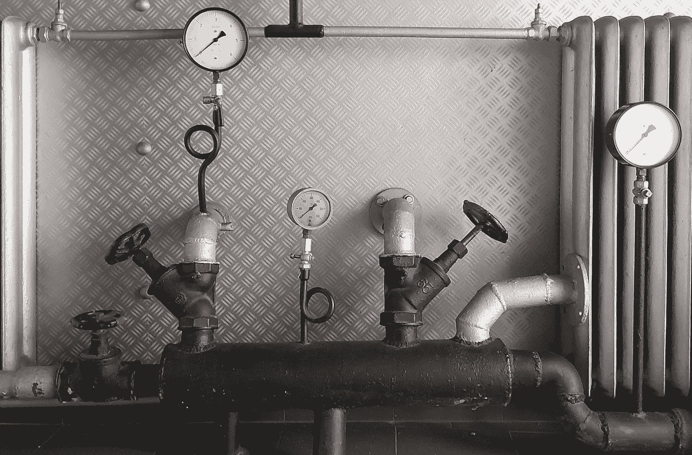
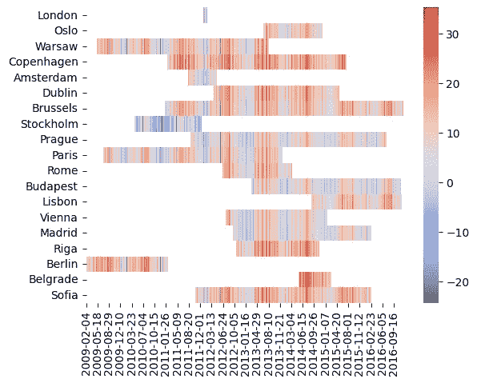

# 如何处理多个时间序列的自回归模型

> 原文：<https://towardsdatascience.com/how-to-handle-autoregressive-model-over-multiple-time-series-4604fdd96e2b>

## 使用工厂模式设计代码，避免数据泄露



管道有时会变得复杂。波兰 2022。(作者供图)。

# 介绍

当涉及到**数据准备**时，自回归模型是“更难”实现的模型之一。由于模型预计会产生每日或每小时的预测，数据集本身预计会随着每个新的观察结果而增长和扩展，这需要模型进行定期的再训练。因此，处理数据成为一个高度动态的过程，必须格外小心，以确保在任何给定的时间点都不会出现*数据泄漏*。

令人惊讶的是，但不幸的是，大多数关于自回归的教程更多地强调模型和算法，而不是太关注数据准备方面的事情。由于他们的目标是解释自回归概念(他们做得很好，例如:[机器学习大师](https://machinelearningmastery.com/autoregression-models-time%20series-forecasting-python/)或[第 1 篇](/time series-from-scratch-autoregression-theory-and-implementation-f8c614f738f2)，[第 2 篇](/deep-autoregressive-models-41b21c8a140c)来自《走向数据科学》)，数据准备的处理仅限于单变量或多变量时间序列。[Tensorflow.org](https://www.tensorflow.org/tutorials/structured_data/time_series)提供了更广泛的解释，尽管他们的方法不容易扩展到 ***多个多变量*** 时间序列的情况。

在本文中，我将向您展示如何利用[工厂模式](https://realpython.com/factory-method-python/)来封装不同抽象层次的逻辑，而又不丧失代码的灵活性。为了演示，我将使用与 Tensorflow 教程中使用的相同的数据集( [Jena Climate Dataset](https://storage.googleapis.com/tensorflow/tf-keras-datasets/jena_climate_2009_2016.csv.zip) )由 [Max Planck Institute](https://www.bgc-jena.mpg.de/wetter/) 提供。然而，为了使事情变得复杂一点，我将创建一些带有随机扰动的数据副本，以模拟我们的模型的任务是预测几个地理位置的天气的情况。此外，包含随机间隔“来来去去”的观察值的时间序列数据集并不少见。为了从数据集中获得尽可能多的训练示例，我还将考虑这一事实。

# 让数据更真实一点…

为简单起见，我将跳过处理特征生成的部分，集中在`T (degC)`栏。假设我们的模型的任务是在给定`first`、`last`、`min`和`max`温度的情况下预测几个城市的`mean`温度。当然，您可以将相同的推理扩展到数据集中的所有列，或者选择不同的目标(例如，从过去的平均温度预测平均温度)。一切都取决于你。然而，我在这里关注的是**从多个多维系列**中构建训练示例，特别注意**避免数据泄露**和“类似生产”的性质，新的观察结果每天都会出现。

# 获取数据

让我们从获取数据并按每天的时间间隔重新采样开始。

```
import numpy as np
import pandas as pd
import tensorflow as tf

zip_path = tf.keras.utils.get_file(
    origin="https://storage.googleapis.com/tensorflow/tf-keras-datasets/jena_climate_2009_2016.csv.zip",
    fname="jena_climate_2009_2016.csv.zip",
    extract=True,
)
csv_path, _ = os.path.splitext(zip_path)

df = pd.read_csv(csv_path) \
    .assign(date=lambda x: pd.to_datetime(x["Date Time"])) \
    .set_index("date") \
    .get(["T (degC)"]) \
    .resample("D") \
    .aggregate(["first", "last", "min", "max", "mean"])

df.columns = [c[1] for c in df.columns]
```

创建了`[first, last, min, max]`列之后，让我们使用烛台来显示数据。


图一。蜡烛代表温度的每日变化。蓝线描绘了平均温度，这是我们的目标。(图片由作者提供)。

# 嘲笑这个案子

现在，是时候模拟一个更现实的场景了，在这个场景中，数据可用性并不理想。

```
np.random.seed(42)

CITIES = [
    "London", "Oslo", "Warsaw", "Copenhagen", "Amsterdam", "Dublin",
    "Brussels", "Stockholm", "Prague", "Paris", "Rome", "Budapest",
    "Lisbon", "Vienna", "Madrid", "Riga", "Berlin", "Belgrade", "Sofia",
]

series = {}
for city in CITIES:
    X = df.copy()
    X += 0.75 * X.std() * np.random.randn()

    bounds = np.random.randint(0, len(X), size=2)
    bounds = sorted(bounds)
    slc = slice(*bounds)
    X = X.iloc[slc]

    series[city] = X
```

经过这…修改后，我们的数据如下所示:



图二。热图显示目标值，即平均温度。(图片由作者提供)。

这不就是数据在现实中的表现吗？如您所见，根据城市的不同，我们的可用性也有所不同。尤其是在伦敦，我们对序列长度的选择可能是有限的。

# 生成样本

在自回归中，一种常见的方法是使用滚动窗口，该窗口将沿时间维度滑动，并将其分为*历史*和*未来*子序列。随着窗口向前移动(这里，步长为一天)，每次获得一个新的`(X, y)`对。然后将这些对输入模型进行训练。

定义窗口时，需要考虑两个因素。首先，窗口的*历史*部分决不能进入不应该观察数据的时间区域。否则，数据泄漏是超过保证！反之，窗口的*未来*部分可以进入其中。但是，对于训练、验证和测试子集，我们应该确保数据存在，以便可以将预测值与真实值进行比较。在推断过程中，它是不同的。从技术上讲，今天不可能观察明天的数字。但是当太阳再次升起的时候，我们可以比较这些预测。

其次，时间“地平线”将不断向前移动。对于模型的训练来说，这意味着我们的历史数据集在增长，时间范围也应该推至未来。

正如你所看到的，整个形势相当活跃。除非设计合理，否则代码会很快失去透明性并导致错误。

# 解决办法

解决问题的关键是把责任分配给不同的阶层。例如，将系列分成训练和测试部分不应该是滚动窗口逻辑的一部分。类似地，一旦窗口滚动，它应该只生成数据样本，而不需要关心日期。

想一想，可以辨析一下下面的责任链。

1.  首先，有一些存储参数的*配置*文件是有用的。通常，我会有两个独立的文件，比如`development.ini`和`production.ini`以及一个`get_config`函数。
2.  一旦加载了常量，让我们使用一个`TimeSplitter`类来计算时间间隔并给出边界日期。这些日期将定义培训、测试和验证部分的开始和结束。
3.  日期实际上告诉了滚动窗口应该在哪里运行。然而，如前所述，我们不希望他们管理时间。滚动窗口只会生成样本，这就是*工厂模式*的用武之地。让我们用一个`WindowFactory`类来消费边界并创建`Window`对象。
4.  最后，根据需要，我们可以构造不同种类的`Window`(例如，有或没有步长、平均窗口等。).尽管如此，一旦工厂类将日期转换成索引，每个`Window`将只被给予一个时间序列块来翻转并生成`(X, y)`对。

# 常数

开始之前，让我们就几个参数达成一致。

## development.ini

```
[constants]
horizon = 2022-02-28
test_split_days = 30
val_split_days = 90
history_days = 21
future_days = 7
```

为了澄清约定:`horizon`定义了数据集的最终“盲化”。它应该是“今天”，除此之外还不存在任何观察。在生产中，该参数预计每天更新。然后，分别在区间[-inf，h-91]、[h-90，h-31]和[h-30，h]上定义训练集、验证集和测试集。最后，在这个场景中，`Window`需要支持在已知过去 21 天的情况下，对未来 7 天进行预测的模型。

我将离开实施`get_config`...一旦我们读取了数据，下一步就是:

# 时间分离器

```
from typing import Optional, Text, Tuple, TypeVar

import pandas as pd

TS = TypeVar("TS")

class TimeSplitter:
    def __init__(
        self,
        horizon: Text,
        val_split_days: int,
        test_split_days: int,
        history_days: int,
        future_days: int,
    ) -> TS:
        self.horizon = pd.Timestamp(horizon)
        self.val_split_days = pd.Timedelta(val_split_days, unit="days")
        self.test_split_days = pd.Timedelta(test_split_days, unit="days")
        self.history_days = pd.Timedelta(history_days, unit="days")
        self.future_days = pd.Timedelta(future_days, unit="days")

        # here you can put additional assertion logic such as non-negative days, etc.

    @property
    def _test_upto(self) -> pd.Timestamp:
        return self.horizon

    @property
    def _test_from(self) -> pd.Timestamp:
        return self.horizon - self.test_split_days - self.history_days

    @property
    def _validation_upto(self) -> pd.Timestamp:
        return self.horizon - self.test_split_days - pd.Timedelta(1, unit="days")

    @property
    def _validation_from(self) -> pd.Timestamp:
        return self.horizon - self.val_split_days - self.history_days

    @property
    def _train_upto(self) -> pd.Timestamp:
        return self.horizon - self.val_split_days - pd.Timedelta(1, unit="days")

    @property
    def _train_from(self) -> None:
        return None  # defined only for consistency

    def get_boundaries(self, subset: Optional[Text] = "training") -> Tuple[pd.Timestamp]:
        if subset == "training":
            return self._train_from, self.train_upto
        elif subset == "validation":
            return self._validation_from, self._validation_upto
        elif subset == "test":
            return self._test_from, self._test_upto
        else:
            raise NotImplementedError(f"Requested subset '{subset}' is not supported.")
```

如前所述，`TimeSplitter`的唯一目标是找出界限。通过额外的逻辑，我们可以针对导致病态结果的情况引入断言、警告或错误。此外，我们可以用一个`Enum`类替换`if-else`语句，将选择限制在几个预定义的选项中。这可能会超出本文的范围，所以让我们继续实现工厂类。

# 窗户工厂

现在，该上工厂课了。一旦计算出日期时间界限，我们希望该类使用这些信息来修剪序列并生成窗口。

```
class WindowFactory:
    def __init__(
        self,
        history_days: int,
        future_days: int,
        first_allowed_date: Optional[pd.Timestamp] = None,
        last_allowed_date: Optional[pd.Timestamp] = None,
    ) -> WF:
        self.hdays = history_days
        self.fdays = future_days
        self.lower_date = first_allowed_date
        self.upper_date = last_allowed_date

    def __repr__(self) -> Text:
        lower = self.lower_date or "-inf"
        upper = self.upper_date or "+inf"
        interval = f"['{lower}':'{upper}']"
        shape = f"({self.hdays}, {self.fdays})"
        name = self.__class__.__name__

        return f"{name}(interval={interval}, shape={shape})"

    def create(self, df: pd.DataFrame) -> Optional[W]:
        t0 = self.lower_date if self.lower_date is pd.NaT else None
        t1 = self.upper_date if self.upper_date is pd.NaT else None
        slc = slice(t0, t1)
        chunk = df.loc[slc]

        if (width := self.hdays + self.fdays) > len(chunk):
            print(f"Not possible to spawn a window of width={width}.")
            return None

        return Window(
            chunk,
            history_days=self.hdays,
            future_days=self.fdays,
        )
```

有几种方法可以实现该类。核心功能由`.create`方法提供。它期望一个时间序列作为一个`pd.DataFrame`，它的目标是正确地分割输入数据。这里，我们利用了数据帧中的索引是`pd.DateTimeIndex`对象的事实。然而，如果我们使用 plain numpy，想法将是相同的。

如果需要，该方法还可以扩展到支持不同种类的窗口。在我们的版本中，我们只使用一种类型的`Window`，所以不需要其他输入参数。

最后，我们引入`__repr__`方法来显示工厂在时间间隔和窗口形状方面的“能力”。纯粹是为了调试和可读性。

# 窗户

那么如何定义`Window`？毕竟，日期时间和索引管理已经完成，我们需要的只是一个产生样本的对象。

```
W = TypeVar("W")

class Window:
    def __init__(
        self,
        chunk: pd.DataFrame,
        history_days: int,
        future_days: int,
    ) -> W:
        self.X = chunk.to_numpy()
        self.hdays = history_days
        self.fdays = future_days

    @property
    def width(self) -> int:
        return self.hdays + self.fdays

    def __len__(self) -> int:
        return len(self.X) - self.width + 1

    def __repr__(self) -> Text:
        name = self.__class__.__name__
        iters = f"iters: {len(iters)}"

        return f"{name}[{iters}]({self.hdays, self.fdays})"

    def get_generator(self) -> Generator[np.ndarray, None, None]:
        for idx in range(len(self)):
            slc = slice(idx, idx + self.width)

            yield self.X[slc]
```

`.get_generator`方法是不言自明的。它通过以一天为步长在时间维度上滚动来给出时间序列的片段。这里，`__len__`方法用于表示`Window`将产生的样本数。例如，如果序列包含 5 条记录，窗口的宽度是 2，它应该滚动 4 次(因此最后是`+ 1`)。

但是等等！

生成器不会产生`(X, y)`对，对吗？正确。

不过，形成对子很容易。稍加修改，我们可以重新定义生成器方法:

```
def get_sample_pairs(self) -> Generator[np.ndarray, None, None]:
    for idx in range(len(self)):
        slc_X = slice(idx, idx + self.hdays)
        slc_y = slice(idx + self.hdays, idx + self.width)

        yield (self.X[slc_X, :4], self.X[slc_y, -1])
```

# tf.data 版本

但是，如果您选择使用 Keras，您可能会发现用包含对的`tf.data.Dataset`对象替换生成器并将其传递到模型中是很有用的。为了实现这一点，让我们通过再添加一个方法来使`Window`对象可调用。

```
 def __call__(self) -> tf.data.Dataset:
        generator = lambda: self.get_generator()
        signature = tf.TensorSpec(
            shape=(self.width, 5),
            dtype=tf.float32,
            name=self.__class__.__name__,
        )
        ds = tf.data.Dataset.from_generator(
            generator,
            output_signature=signature,
        )
        ds = ds.map(lambda tensor: [
            tensor[:self.hdays, :4],
            tensor[self.hdays:self.width, -1:],
        ])

        return ds
```

使用这种方法的缺点是，我们创建了一个惰性加载机制，只是为了急切地消耗数据。另一方面，使用`tf.data`为我们提供了很多有用的函数(如`prefetch`、`shuffle`、`batch`或`concatenate`)，使得数据在后期的处理更加容易。

# 整个流程

让我们重新审视我们的解决方案，并借助实现的逻辑创建完整的训练、测试和验证数据集。

```
# from config...
horizon = "2014-01-01"
test_split_days = 30
val_split_days = 90
history_days = 21
future_days = 7

def get_window_factory(splitter, name):
    bounds = splitter.get_boundaries(name)

    return WindowFactory(
        history_days=history_days,
        future_days=future_days,
        first_allowed_observation_date=bounds[0],
        last_allowed_observation_date=bounds[1],
    )

def get_dataset(factory, series):
    windows = {}
    for city, X in series.items():
        window = factory.create(X)
        if window is None:
            print("City skipped:", city)
            continue

        windows[city] = window

    _, window = windows.popitem()
    ds = window()
    for window in windows.values():
        _ds = window()
        ds = ds.concatenate(_ds)

    return ds

if __name__ == "__main__":
    splitter = TimeSplitter(
        horizon=horizon,
        test_split_days=test_split_days,
        val_split_days=val_split_days,
        history_days=21,
        future_days=7,
    )

    training_factory = get_window_factory(splitter, "training")
    validation_factory = get_window_factory(splitter, "validation")
    test_factory = get_window_factory(splitter, "test")

    ds_train = get_dataset(training_factory, series)
    df_val = get_dataset(validation_factory, series)
    df_test = get_dataset(test_factory, series)
```

# 结论

这就是了！一旦我们加载了常量并使用`TimeSplitter`分割了日期，我们就分别为每个数据集创建了三个工厂。然后使用`tf.data.Datasets`对象生成并收集样本。然而，我们选择参数化代码，过程保持不变，尽管如果数据集太窄(或`Window`的宽度太大)，我们可能最终只有几个样本。

为了验证这种方法，您可以断言样本总数。

```
count_1 = len([x for x in ds.as_numpy_iterator()])
count_2 = sum([len(w) for w in windows.values()])

assert count_1 == count_2
```

这段代码当然可以改进。然而，正如您所看到的，这种方法使用起来很简单，代码应该很容易维护。它也适用于任何一般的多变量 T2 时间序列。这完全取决于你如何想象`(X, y)`-对的样子(例如标量，向量，张量，...)?尽管如此，通过应用这个简单的模式，您几乎可以将数据准备代码从实际模型中完全分离出来，允许您快速迭代您的想法，而不用担心数据泄漏会在您的结果中出现。

*本文使用了马克斯·普朗克研究所在 [Creative Common License 下的数据集。](https://www.bgc-jena.mpg.de/wetter/weather_data.html)

*原载于*[](https://zerowithdot.com/multi-time-series-data-generator/)**。**