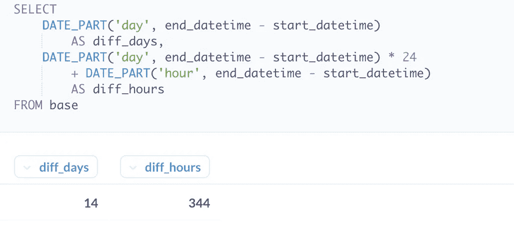
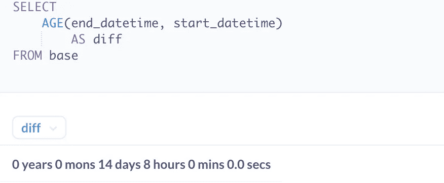
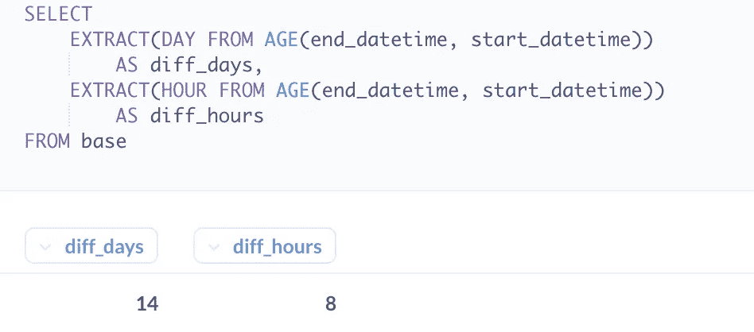
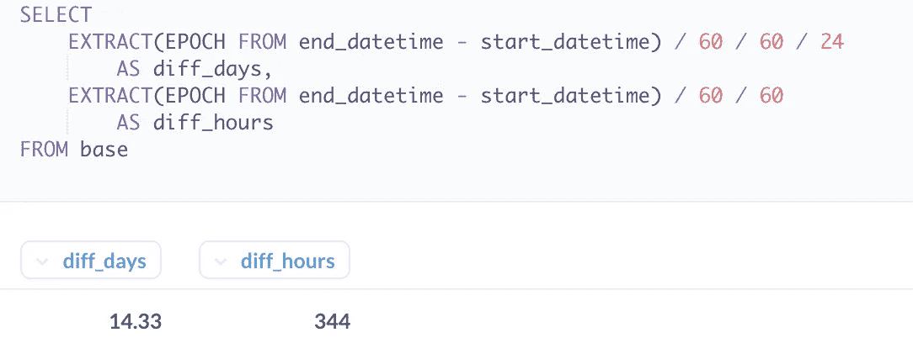

# 如何处理 PostgreSQL 中的日期和时间差异

> 原文：<https://towardsdatascience.com/how-to-handle-date-and-time-difference-in-postgresql-615f26ba0b84>

## SQL 提示

## 当没有 DATE_DIFF()函数可用时，让您的生活更轻松的 3 个技巧

乔恩·泰森在 [Unsplash](https://unsplash.com/?utm_source=unsplash&utm_medium=referral&utm_content=creditCopyText) 上的照片

> 潜在客户 A 于 2022 年 1 月 20 日上午 8 点注册了贵公司的服务。她在 2022 年 2 月 3 日下午 4 点取消了订阅。她成为你们公司的客户多久了？

要回答这个问题，你需要计算两个时间点之间的差异。不考虑这种特定情况下最相关的时间尺度(差异是否应该用周来表示？几天内？几个小时？)，必须有一个函数来帮助您**轻松地找到两个事件之间过去了多长时间——在本例中，是潜在客户注册和取消订阅之间的时间。**

在我以前的工作经验中，我曾经通过使用直接连接到我们数据库的 Google BigQuery 控制台来获得这类问题的答案。在 Google BigQuery 中，查询是用标准 SQL 编写的。足够方便的是，有一个**易于实现的公式来计算两个时间点的差值** : [DATE_DIFF()](https://cloud.google.com/bigquery/docs/reference/standard-sql/date_functions#date_diff) 。

但是，**在 PostgreSQL 中没有与 DATE_DIFF()** 直接等价的。因此，我们必须找到现有功能的正确组合，以获得我们真正需要的输出。关于这个话题， [PostgreSQL 的文档](https://www.postgresql.org/docs/current/functions-datetime.html)非常广泛，但是我必须承认我对列出的所有公式有些困惑。

摘自 [PostgreSQL 文档](https://www.postgresql.org/docs/current/functions-datetime.html)

看似简单的事情结果比我想象的稍微复杂一些，所以我想我可以和你分享以下 3 个正确处理 PostgreSQL 日期差异的技巧。

让我们通过引言中提到的例子来详细研究它们。在这个例子中，假设我们定义了两个输入变量**:start _ date 和 end_date。我们想要得到的**输出是这两个日期时间的差值**:**

*   以天为单位
*   以小时计

作者举例

# #1 —避免一连串的 DATE_PART()函数

我曾经遇到的第一个技巧来自 [SQLines](https://www.sqlines.com/postgresql/how-to/datediff) :

从 [SQLines](https://www.sqlines.com/postgresql/how-to/datediff) 中提取

他们建议创建一个用户定义的函数，或者，如果您只有编写一些声明性 SQL ( `SELECT...`)的权限或技能，建议的解决方案是使用一系列的 DATE_PART()函数。在我们的示例中，我们将编写以下代码来获取天数和小时数的差异:

这将导致以下输出:

提示#1 的输出—作者的代码和屏幕截图

计算是正确的，并且输出是容易解释的。然而，我认为这种方法有两个缺点。

首先，**所需的那段代码不紧凑**。为了获得更好的代码可读性，必须确保代码正确缩进，以便读者理解哪个“日期部分”对应于计算的哪个部分。在我们的例子中，我们只进行到小时刻度，但是如果我们想计算秒的差异，我们将添加两个额外的 DATE_PART 函数。

第二，多次调用函数 DATE_PART()会导致**在执行**段代码时可能会损失性能。当对相同的输出实现各种选项时，必须确保比较两个查询在应用于相同数据集时的性能。

# #2—从年龄开始()

在 PostgreSQL 中，函数 AGE()将为您的问题提供详细的答案:这两个事件之间经过了多长时间？**输出以文本行**的形式显示两个时间点之间的差异。

输出将如下所示:

技巧#2 的输出—作者的代码和屏幕截图

根据您的数据输入和您正在处理的用例，您可能会对这种方法感到满意。特别是，如果您用函数 AGE()给出的输出来回答最终用户的需求，可能就没有必要使输出过于复杂。

# #3 —使用 EXTRACT(EPOCH FROM())提升级别

如果您确定所有值都包含在给定的日期和时间范围内，请保持简单。只要坚持使用 **AGE()函数，并结合 EXTRACT()** 即可。这适用于以下以天数表示的差异。但是仔细看看以小时为单位的输出差异:

提示#2 的不当使用输出—作者的代码和屏幕截图

正如您可能注意到的，第二个查询的问题是，我们试图返回两天之间的时间差异。在这里，AGE()函数并不合适:**它返回以小时为单位的差值…不考虑日期！**

在这种情况下——无论如何，如果您有疑问——您应该使用 EXTRACT()函数和 EPOCH 参数的组合**。让我们最后一次以我们的例子来证明:**

输出将如下所示:

技巧#3 的输出—作者的代码和屏幕截图

**成功了！**与使用选项#1 编写的代码相比，有两个优点:

1.  代码更加简洁
2.  天数的差异以更详细的级别表示(默认情况下，有两位小数)

# 结论

> 在适用的地方保持简单
> 
> 在相关的地方使它变得复杂

本文的目的是收集有用的技巧来处理 PostgreSQL 中的日期和时间差异。您无需一次应用所有这些功能——只需**选择最适合您自己的用例**即可。

在 PostgreSQL 中使用其他函数来轻松处理日期和时间吗？我很乐意听到他们，并在评论区分享我们的最佳实践！

你喜欢读这篇文章吗？ [*成为会员*](https://marie-lefevre.medium.com/membership) *加入一个不断成长的充满好奇心的社区吧！*

 [## 通过我的推荐链接加入媒体-玛丽·勒菲弗尔

### 作为一个媒体会员，你的会员费的一部分会给你阅读的作家，你可以完全接触到每一个故事…

marie-lefevre.medium.com](https://marie-lefevre.medium.com/membership)