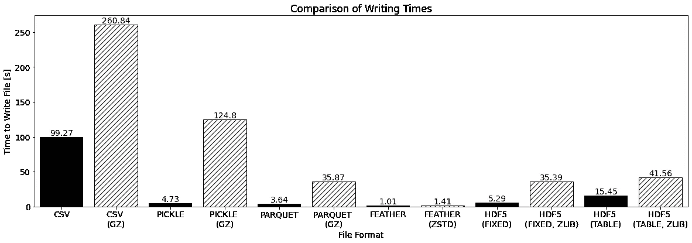
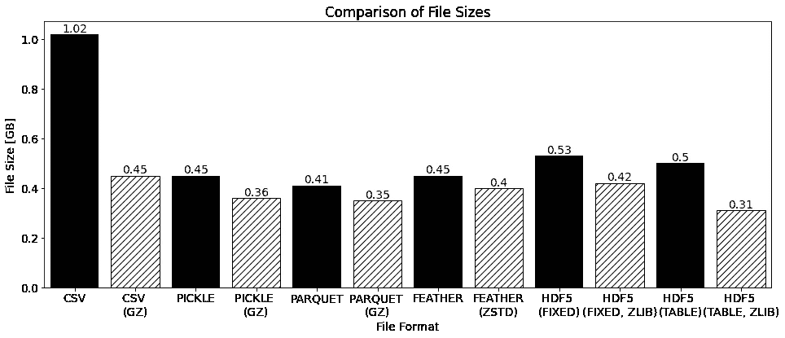
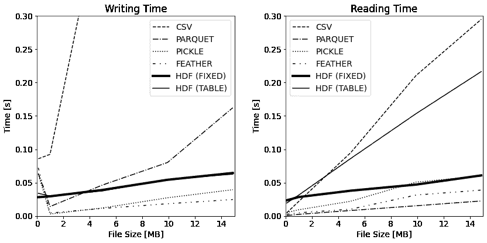
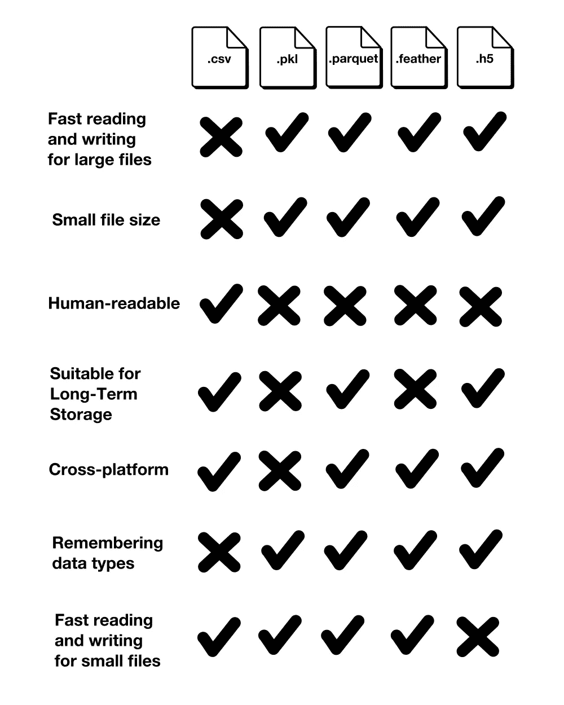

# 如何在 Python 中处理大型数据集

> 原文：<https://towardsdatascience.com/how-to-handle-large-datasets-in-python-1f077a7e7ecf>

## CSV、Pickle、Parquet、Feather 和 HDF5 的比较


图片由作者提供。

经过这么长时间，当 Kaggle 最终推出[一个新的表格数据竞赛](https://www.kaggle.com/competitions/amex-default-prediction)时，起初，每个人都很兴奋。直到他们不在了。当 Kagglers 发现数据集有 50 GB 大时，社区开始讨论如何处理这样大的数据集[4]。

> CSV 文件格式需要很长时间来读写大型数据集，并且除非明确告知，否则不会记住数据类型。

除了通过减少数据类型来减少所需的磁盘空间，问题是在工作会话之间以何种格式保存修改的数据集[4]。CSV 文件格式需要很长时间来读写大型数据集，并且除非明确告知，否则不会记住列的数据类型。**本文探讨了处理大型数据集的 CSV 文件格式的四种替代方案:Pickle、Feather、Parquet 和 HDF5。此外，我们将看看这些压缩文件格式。**

本文探索了 pandas 库的可选文件格式。现在，你可能会想**“在处理大型数据集时，为什么还要使用熊猫呢？”这是一个合理的问题。虽然像 Datatable 这样的 pandas 的替代品在读取和写入 CSV 文件时会更快，但 pandas 的优势在于它为数据处理提供了很大的灵活性。此外，pandas 支持开箱即用地读写许多文件格式。同样，像 Datatables 这样的替代方法只支持 CSV、Jay、XLSX 和纯文本格式[3]。**

你可以在我的 [Kaggle 笔记本](https://www.kaggle.com/iamleonie/how-to-handle-large-datasets-in-python)里找到代码。

# 基准设置

出于基准测试的目的，我们将创建一个虚构的数据集。这个虚构的数据集包含每种数据类型的一列，但有以下例外:本例中省略了数据类型为`float16`和`categorical`的列，因为 parquet 不支持`float16`，而带有`format = "table"`的 HDF5 不支持`categorical`。为了减少时间噪声以提高可比性，这个虚构的数据集包含 10，000，000 行，并且**几乎有 1GB** **大**如[8]所示。


用于基准测试的虚构数据集的头(图片由作者通过 [Kaggle](https://www.kaggle.com/iamleonie/how-to-handle-large-datasets-in-python) 提供)

数据的特征会影响读写时间，例如数据类型、数据帧的宽度(列数)与长度(行数)。但是，这超出了本文的范围。对于进一步的阅读，我推荐以下资源:

[](/the-best-format-to-save-pandas-data-414dca023e0d)  [](https://www.architecture-performance.fr/ap_blog/loading-data-into-a-pandas-dataframe-a-performance-study/)  

# 文件格式概述

在这一节中，我们将简要介绍每种文件格式的一些关键特征:简短描述、文件扩展名、使用的压缩和 pandas 读写方法。

## *逗号分隔值* (CSV)

使用逗号分隔值的文本文件。文件扩展名为`.csv`。

在本文中，我们将使用 gzip 压缩。

```
# Reading
df = pd.read_csv(file_name, 
                 dtype = {...})# Writing
df.to_csv(file_name, 
          index = False,
          compression = ...) # None or "gzip" 
```

## 泡菜

> `[pickle](https://docs.python.org/3/library/pickle.html#module-pickle)`模块实现了用于序列化和反序列化 Python 对象结构的二进制协议。[7]

文件扩展名是`.pkl`。

在本文中，我们将使用 gzip 压缩。

```
# Reading
df = pd.read_pickle(file_name)# Writing
df.to_pickle(file_name, 
             compression = ...) # None or "gzip"
```

## 镶木地板

> Apache Parquet 是一种列存储格式，适用于 Hadoop 生态系统中的任何项目，无论选择的是数据处理框架、数据模型还是编程语言。[2]

文件扩展名为`.parquet`。

在本文中，我们将使用 [pyarrow](https://arrow.apache.org/docs/python/) 引擎和 gzip 压缩。

```
# Reading
df = pd.read_parquet(file_name)# Writing
df.to_parquet(file_name, 
              engine = "pyarrow", 
              compression = ...) # None or "gzip"
```

## 羽毛

> Feather 是一种用于存储箭头表或数据框(来自 Python 或 R 等语言)的可移植文件格式，它在内部利用了[箭头 IPC 格式](https://arrow.apache.org/docs/python/ipc.html#ipc)。Feather 是在 Arrow 项目早期创建的，作为 Python (pandas)和 r[1]的快速、语言无关的数据帧存储的概念证明

文件扩展名是`.feather`。

由于 gzip 压缩不适用于 feather 格式，我们将使用 zstd 压缩。

```
# Reading
df = pd.read_feather(file_name)# Writing
df.to_feather(file_name, 
              compression = ...) # None or "zstd"
```

## 分层数据格式(HDF5)

> HDF5 是一种用于存储和管理数据的数据模型、库和文件格式。它支持无限多种数据类型，专为灵活高效的 I/O 以及大量复杂数据而设计。HDF5 具有可移植性和可扩展性，允许应用在使用 HDF5 的过程中不断发展。[5]

文件扩展名为`.h5`。

HDF5 有两种格式选项:

*   `"fixed"`，哪个写字快【6】
*   `"table"`，速度较慢，但提供了“灵活的操作，如搜索/选择数据子集”[6]

为了读写 HDF5 文件，你需要安装`tables`。

由于 gzip 压缩不适用于 feather 格式，我们将使用 zlib 压缩。

```
# Reading
df = pd.read_hdf(file_name)# Writing
df.to_hdf(file_name, 
          key = "df", 
          format = ..., # "fixed" or "table"
          complib = ..., # None or "zlib"
          complevel = 9)
```

# 比较

本节根据写入时间、文件大小、读取时间和各种特征(如可读性、一致性、预期存储时间和可移植性以及在小型数据集上的性能)来比较这五种文件格式。

## 写作时代

下面，您可以看到为每种文件格式编写文件所需的时间。实心黑条表示未压缩文件的写入时间，而散列条表示压缩文件的写入时间。



不同文件格式的写入时间比较(图片由作者通过 [Kaggle](https://www.kaggle.com/iamleonie/how-to-handle-large-datasets-in-python) 提供)

首先，让我们解决房间里的大象:**压缩增加了任何文件格式的写入时间**。但这并不奇怪，因为数据压缩是写入过程中的一项额外任务。

此外，我们可以进行以下观察:

*   正如所料，对于 **CSV，写入时间最长**
*   **羽毛和拼花有最快的** **未压缩的**写入时间
*   **Feather 对于未压缩和压缩的**文件都有最快的写入时间
*   不出所料， **HDF5 搭配** `**format = "fixed"**` **比** `**format = "table"**`快，但搭配压缩 HDF5 搭配`format = "fixed"`与`format = "table"`差不多

## 文件大小

下面，您可以看到每种文件格式的结果文件大小。实心黑条表示未压缩文件的文件大小，而散列条表示压缩文件的文件大小。



不同文件格式的文件大小比较(图片由作者通过 [Kaggle](https://www.kaggle.com/iamleonie/how-to-handle-large-datasets-in-python) 提供)

我们可以做出如下观察:

*   不出所料，**压缩文件比**未压缩文件小
*   **CSV 是最大的**文件
*   **拼花是最小的未压缩**文件
*   **带** `**format = "table"**` **的拼花和 HDF5 是最小的压缩**文件

## 阅读时间

下面，您可以看到每种文件格式读取文件所需的时间。实心黑条表示未压缩文件的读取时间，而散列条表示压缩文件的读取时间。


不同文件格式的阅读时间对比(图片由作者通过 [Kaggle](https://www.kaggle.com/iamleonie/how-to-handle-large-datasets-in-python) 提供)

我们可以做出如下观察:

*   正如所料，对于 **CSV，读数需要较长的时间**
*   **Pickle 和 HDF5 带** `**format = "fixed"**` **对**未压缩和压缩的**文件都有最快的**读取时间
*   不出所料， **HDF5 与** `**format = "fixed"**` **比** `**format = "table"**`更快，同样具有压缩性

## 多方面的

除了读写时间和文件大小之外，我们还应该关注更多的特性:可读性、一致性、预期存储时间和可移植性，以及小数据集的性能。

**人类可读性**

CSV 是人类可读的唯一文件格式。所有可选的文件格式都是二进制格式，因此人类无法阅读。

**一致性**

除非你明确告诉`.read_csv()`方法用哪种数据类型来读取每一列，否则 CSV 文件格式不会记住数据类型。这需要预先了解数据类型，也是一项额外的工作。

如果读取方法中没有明确列出数据类型，这会导致所需存储空间增加，因为所有整数都被读取为`int64`，所有浮点都被读取为`float64`，而`datetime64[ns]`和`categorical`被读取为`object`。在下面，您可以看到原始数据帧和读写 CSV 文件后的数据帧:


CSV 文件读写前后的列数据类型比较(图片由作者通过 [Kaggle](https://www.kaggle.com/iamleonie/how-to-handle-large-datasets-in-python) 提供)

正如您所看到的，由于将较小的数据类型转换为较大的数据类型，所需的内存使用增加了。

**预期储存时间和便携性**

泡菜和羽毛旨在短期储存[7，8，9]。Pickle 用于在工作会话之间保存 Python 对象，因此仅受 Python 支持。Feather 旨在 Python 和 R [9]之间交换数据。Pickle 和 Feather 也不能保证版本之间的稳定性[7，9]。

**小数据集上的性能**

尽管本文关注的是大型数据集，但值得一提的是**对于小型数据集，HDF5 格式的读写时间很短。**如下图所示，如果数据集小于 2 MB，读取 HDF5 文件所需的时间甚至比 CSV 文件还要长。



不同文件格式在不同文件大小下的读写时间比较(图片由作者通过 [Kaggle](https://www.kaggle.com/iamleonie/how-to-handle-large-datasets-in-python) 提供)

下表总结了这一部分的比较:



CSV、Pickle、Parquet、Feather 和 HDF5 的对比(图片由作者提供)

# 结论

正如所料，CSV 文件格式在读取和写入文件时都是最慢的。除非您正在优化文件大小，否则所有替代方案大约只有 CSV 文件格式的一半。

不幸的是，这个价值 100 万美元的问题有一个不令人满意的答案:

> "哪种格式是处理大型数据集的最佳格式？"
> 
> —“这取决于您的使用情形，但可能不是 CSV”

这里是我试图为这个答案的“视情况而定”部分提供更多的细节。我很想听听你在这方面的意见。


试图提供一个选择最佳文件格式的粗略指南(图片由作者提供)

尽管有缺点，CSV 还是被广泛使用。看起来，它是人类可读的，而不是二进制文件格式，这一事实使它成为一种直观的文件格式，您可以快速打开并查看它，而不会有任何麻烦。因此，除非您正在处理数千兆字节的数据，否则 CSV 仍然是一个可接受的选项。

> “CSV 毕竟没那么差。别管了！”

# 喜欢这个故事吗？

要阅读更多来自我和其他作家的故事，请在 Medium 上注册。报名时可以用我的 [*推荐链接*](https://medium.com/@iamleonie/membership) *支持我。我将收取佣金，不需要你额外付费。*

[](https://medium.com/@iamleonie/membership)  

*在* [*LinkedIn*](https://www.linkedin.com/in/804250ab/) *和* [*上找我 Kaggle*](https://www.kaggle.com/iamleonie) *！*

# 参考

[1] Apache Arrow，“羽毛文件格式”。apache.org。[https://arrow.apache.org/docs/python/feather.html](https://arrow.apache.org/docs/python/feather.html)(2022 年 7 月 25 日访问)

[2]阿帕奇拼花地板，“概述”。apache.org。[https://parquet.apache.org/docs/overview/](https://parquet.apache.org/docs/overview/)(2022 年 7 月 25 日访问)

[3]数据表，“datatable.fread()”。datatable . readthe docs . io .[https://datatable . readthe docs . io/en/latest/API/dt/fread . html](https://datatable.readthedocs.io/en/latest/api/dt/fread.html)(2022 年 7 月 25 日访问)

[4] C. Deotte，“如何减少数据量”。kaggle.com。[https://www . ka ggle . com/competitions/amex-default-prediction/discussion/328054](https://www.kaggle.com/competitions/amex-default-prediction/discussion/328054)(2022 年 7 月 25 日访问)

[5]HDF 小组，“HDF5”。hdfgroup.org。https://portal.hdfgroup.org/display/HDF5/HDF5(2022 年 7 月 25 日访问)

[6]“熊猫”，“熊猫。DataFrame.to_hdf "。pydata.org。[https://pandas . pydata . org/pandas-docs/stable/reference/API/pandas。data frame . to _ hdf . html](https://pandas.pydata.org/pandas-docs/stable/reference/api/pandas.DataFrame.to_hdf.html#pandas.DataFrame.to_hdf)(2022 年 7 月 25 日访问)

[7]“Python”，“pickle — Python 对象序列化。”python.org。https://docs.python.org/3/library/pickle.html(2022 年 7 月 25 日访问)

[8]“stack overflow”，“羽毛和拼花有什么区别？”。stackoverflow.com。https://stack overflow . com/questions/48083405/feather-and-parquet 之间的区别是什么

[9] H. Wickham，“Feather:一种用于 R 和 Python 的快速磁盘上数据帧格式，由 Apache Arrow 提供支持”。rstudio.com。https://www.rstudio.com/blog/feather/(2022 年 7 月 25 日访问)