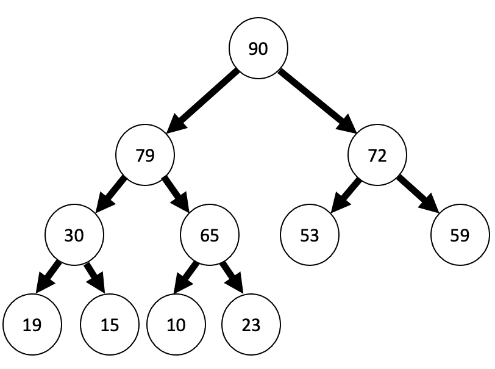
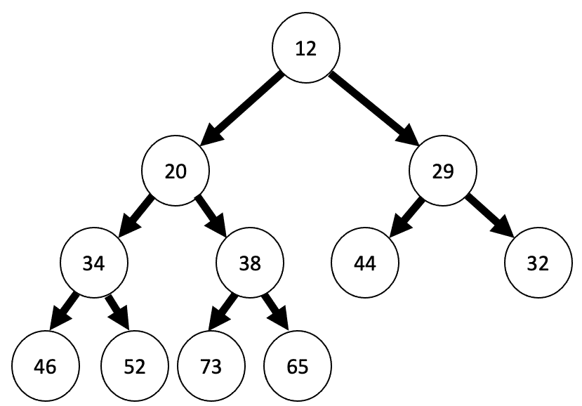
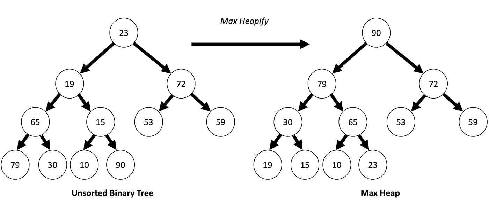
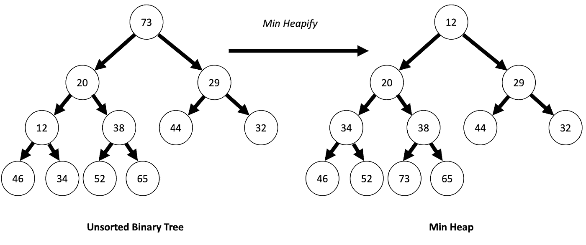
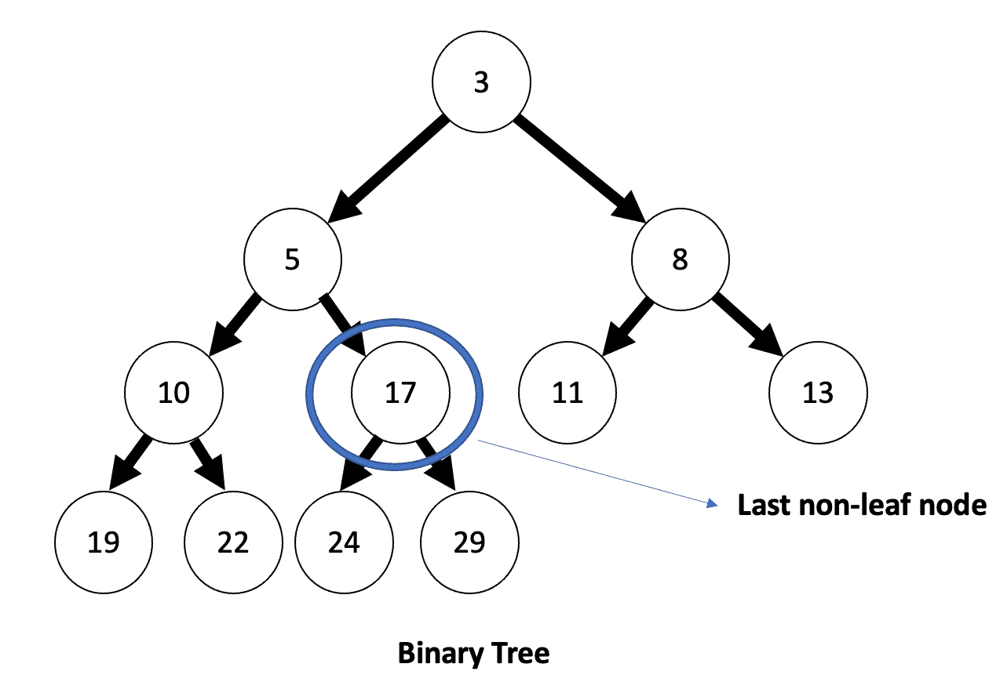
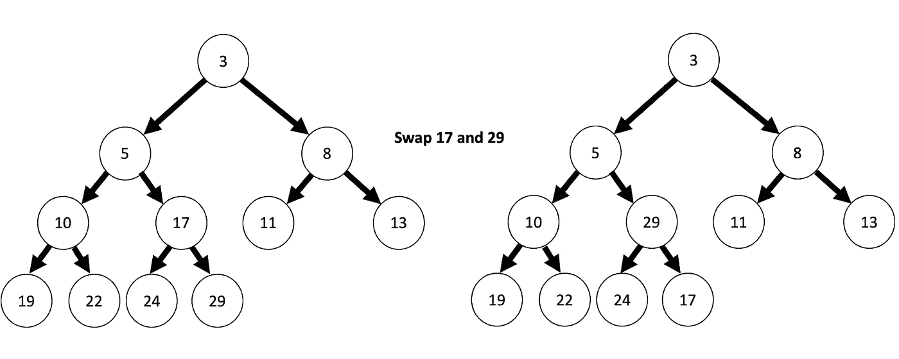
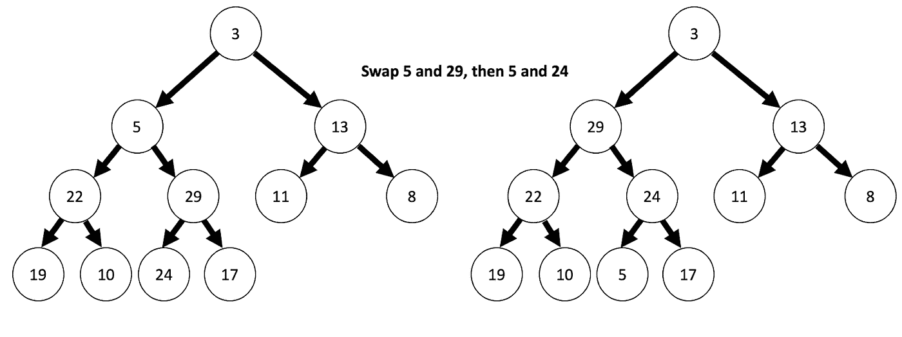
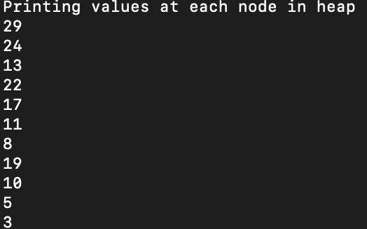
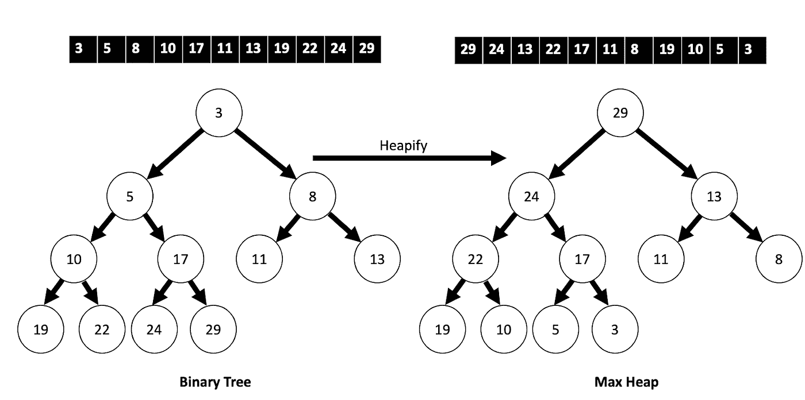

# 如何在 C++中堆一棵树

> 原文：<https://towardsdatascience.com/how-to-heapify-a-tree-in-c-e5abe494097d>

## 用 C++构建堆的初学者指南


照片由[像素](https://www.pexels.com/photo/balance-blur-boulder-close-up-355863/)上的 [Pixabay](https://www.pexels.com/@pixabay/) 拍摄

在计算机科学中，堆是一种树形数据结构，其特殊性质是几乎完全满足堆性质的二进制结构。该属性对应于最大堆和最小堆。最大堆是一种数据结构，其中每个子节点小于或等于其父节点。最小堆是类似类型的数据结构，其中每个子节点大于或等于其父节点。当这些约束被放在树数据结构上时，我们最终得到的是长度相对较短的树。这使得在树中搜索值的过程更快。让我们考虑下面的最大堆:



作者创建的图像

在树的顶部，我们有一个值为 90 的根节点。最大堆的属性是根节点具有最大值。此外，每个节点的值小于或等于其父节点。我们看到 90 是树中最大的值。此外，在第二层，我们看到小于 90 的值 79 和 72，然后是小于 79 的值 30 和 65，依此类推。

相反，看看下面的 min 堆的例子:



作者创建的图像

如果我们将根处的值与根下每个节点处的值进行比较，我们会发现 12 是树中的最小值。在下面的级别，我们有 20 和 29，它们都大于 12，以此类推。

堆树的任务是重新排列树的元素，使其具有最小或最大堆的属性。具体来说，max-heapify 是这样一个过程，它采用一个表示为二叉树的数组，并记录每个节点的值，使得子节点小于或等于父节点，从而满足最大堆:



作者创建的图像

Min-heapify 是记录每个节点的值的过程，使得子节点大于或等于父节点，满足最小堆:



作者创建的图像

由于堆数据结构的有利属性，堆化是有用的。使树满足堆属性可以加速许多算法任务，这些任务在软件工程中非常重要。例如，堆数据结构可用于查找顺序统计信息。顺序统计对应于项目集合中的第 k 个最小(或最大)值。这在一些任务中有应用，例如快速找到一个数组的中间值。

堆数据结构也可以用于查找和跟踪数组中的最小值/最大值。这对于为客户安排优先级队列中的任务非常有用，在优先级队列中，问题花费时间最短的客户将被优先考虑。这可以缩短所有客户的平均等待时间。堆也用在图形算法中，例如用于寻找最短路径的 Djiktra 算法。这可用于基础设施规划任务，如建立道路网络、电线或输油管道。

理解如何实现堆数据结构是每个数据科学家的一项重要技能。此外，理解堆数据结构的基本应用可以使它成为跨各种软件工程应用的许多算法任务的强大工具。

**堆一棵二叉树**

堆化是将二叉树转换成堆数据结构的过程。要了解这是如何实现的，让我们考虑以下阵列:

```
array_in = [3, 5, 8, 10, 17, 11, 13, 19, 22, 24, 29]
```

这个数组有相应的完整二叉树:


作者创建的图像

我们可以定义一个 heapify 函数，它将数组作为输入，并将其转换为最大或最小堆。让我们考虑把这个二叉树转换成一个 max 堆。我们需要做的第一件事是找到不是叶子的最后一个节点。叶子是没有任何子节点的节点。我们看到 11、13、19、22、24 和 29 都是叶子，因为它们不指向任何子节点:


作者创建的图像

此外，从左到右读取每个树级别中的节点，我们看到最后一个非叶节点是 17。这也是最后一个节点的父节点:



作者创建的图像

我们可以通过取节点数量的一半的底值-1:

最后一个非叶节点的索引=的下限(节点数)/2–1。

在我们的示例中，有 11 个节点，因此最后一个非叶节点的索引是:

最后一个非叶节点的索引= floor of(11)/2–1 = 5.5-1 = floor of 4.5 = 4.0。

所以最后一个非叶节点的索引是 4，它的值是 17(记住我们从索引值 0 开始)。

我们想从二叉树中建立一个最大堆。我们可以通过以相反的顺序将节点堆到最后一个非叶节点[3，5，8，10，17]来做到这一点。我们以相反的级别顺序应用 heapify 操作，这意味着从右到左，在每个级别我们将每个子节点与其父节点进行比较。对于 max-heapify，如果子节点大于其父节点，则交换值。例如，我们通过将 17 与其最右边的子代 29 的值交换来开始 heapify 操作，因为子代大于父代:



作者创建的图像

然后我们移动到下一个节点，从左到右，比较 24 和 29。这满足了 max-heap 属性，因此我们接着将 22 与 10 进行比较。因为 10 在父节点上并且小于 22，所以它不满足堆属性，所以我们交换:


作者创建的图像

然后我们移动到下一个节点。因为 19 小于 22，所以它满足 max- heap，所以我们继续下一个级别。我们从 13 开始，和它的父母比较。它不满足堆属性，所以我们交换 8 和 13:


作者创建的图像

要交换的下一个节点值是 5 和 29，然后是 5 和 24:



作者创建的图像

然后我们交换 3 和 29，3 和 24，然后 3 和 17:


作者创建的图像

让我们编写一些实现这种堆化逻辑的 c++代码。让我们创建一个名为 heapify_code.cpp 的. cpp 文件。

```
vi heapify_code.cpp
```

让我们从包含<iostream>开始，它允许我们写入标准输入/输出流。</iostream>

```
#include <iostream>
```

让我们定义一个名为 heapify 的函数，它返回 void:

```
void heapify(){}
```

该函数将接受一个整数数组输入。我们把整数数组叫做 array_in。它还需要一个整数 subtree_root_index 作为子树根的索引。数组的大小也需要一个整数 array_size:

```
void heapify(int array_in[], int index, int array_size){}
```

接下来，我们需要在函数范围内定义一些变量。让我们初始化一个名为 maximum _ value 的变量。让我们也为左边和右边的孩子初始化变量。对于左边的孩子，索引是 2*subtree_root_index +1，右边的孩子是 2*subtree_root_index +2。

```
void heapify(int array_in[], int array_size, int subtree_root_index){int largest_value = subtree_root_index;int left = 2*subtree_root_index + 1;int right = 2*subtree_root_index + 2;}
```

接下来让我们添加逻辑来检查左边的子元素是否大于根元素。如果左孩子大于根，我们重新定义 maximum _ value 为左孩子。在这个逻辑中，我们还需要确保左边子元素的索引小于数组的大小:

```
void heapify(int array_in[], int array_size, int subtree_root_index){
…//code truncated for clarityif (left < array_size && array_in[left] > array_in[largest_value])
{
largest_value = left;
}}
```

接下来，我们需要添加逻辑来检查右孩子是否大于根。和前面的检查一样，如果右孩子大于根，我们将 maximum _ value 重新定义为右孩子。我们还需要确保右孩子的索引小于 array_size:

```
void heapify(int array_in[], int array_size, int subtree_root_index){
…//code truncated for clarityif (left < array_size && array_in[left] > array_in[largest_value])
{
largest_value = left;
}if (right < array_size && array_in[right] > array_in[largest_value]){
largest_value = right;
}}
```

最后，我们需要检查最大值是否等于根的值。如果不是，我们用最大值交换根的值:

```
void heapify(int array_in[], int array_size, int subtree_root_index){
…//code truncated for clarityif (largest_value != subtree_root_index )
{
swap(array_in[subtree_root_index], array_in[largest_value];
}}
```

最后我们在 maximum _ value 不等于 subtree_root_index 的条件下递归调用子树上的堆函数:

```
void heapify(int array_in[], int array_size, int subtree_root_index){…//code truncated for clarityif (largest_value != subtree_root_index )
{
swap(array_in[subtree_root_index], array_in[largest_value]
heapify(array_in, array_size, subtree_root_index);
}}
```

完整的功能如下:

```
void heapify(int array_in[], int array_size, int subtree_root_index){
int largest_value = subtree_root_index;
int left = 2*subtree_root_index + 1;
int right = 2*subtree_root_index + 2;if (left < array_size && array_in[left] > array_in[largest_value])
{
largest_value = left;
}if (right < array_size && array_in[right] > array_in[largest_value]){
largest_value = right;
}if (largest_value != subtree_root_index )
{
swap(array_in[subtree_root_index], array_in[largest_value]
heapify(array_in, array_size, largest_value);
}}
```

**建堆**

现在我们已经写完了 heapify 函数，我们可以写另一个函数，允许我们在给定一个输入数组的情况下构造一个堆。该函数将一个数组及其大小作为输入，并在一个 for 循环中从最后一个节点叶节点开始调用数组上的 heapify 函数。我们将该函数称为构造函数:

```
voidconstruct_heap(int array_in[], int array_size){}
```

让我们定义一个名为 last_non_leaf_node 的变量，它是 array_size/2 -1:

```
voidconstruct_heap(int array_in[], int array_size)
{
int last_non_leaf_node = (array_size/2) -1;
}
```

接下来，我们可以从最后一个叶节点开始以相反的顺序循环，迭代地将索引减 1，并使用索引的每个值调用 heapify 函数:

```
voidconstruct_heap(int array_in[], int array_size){int last_non_leaf_node = (array_size/2) -1;for (int subtree_root_index = last_non_leaf_node; subtree_root_index >=0; subtree_root_index-=1)
{
heapify(array_in, array_size, subtree_root_index);
}}
```

接下来，让我们定义一个打印函数，它将允许我们打印出堆中的值:

```
void print_heap(int array_in[], int array_size){cout << "Printing values at each node in heap" << endl;for (int index = 0; index < array_size; index+=1)
{
cout<< array_in[index] << endl;
}}
```

现在我们可以定义我们的主函数，它将作为执行 heapify、construct_heap 和 print_heap 函数的驱动程序代码。让我们定义我们之前使用的数组，array_in = [3，5，8，10，17，11，13，19，22，24，29]，它有相应的树表示:


作者创建的图像

```
int main(){int array_in[] = { 3, 5, 8, 10, 17, 11, 13, 19, 22, 24, 29};
int array_size = sizeof(array_in) / sizeof(array_in[0]);
construct_heap(array_in, array_size);
print_heap(array_in, array_size);}
```

让我们编译我们的脚本:

```
g++ heapify_code.cpp
```

**并运行我们编译好的脚本:**

```
./a.out
```

我们应该得到以下输出:



作者截图

它的数组表示为 heap = [29，24，13，22，17，11，8，19，10，5，3]，我们执行的转换如下:



作者创建的图像

这篇文章中使用的代码可以在 [GitHub](https://github.com/spierre91/builtiin/blob/main/cpp_tutorials/heapify_code.cpp) 上获得。

**结论**

堆一棵树是很重要的，因为它允许我们从堆数据结构的有利属性中获益。堆是一种基本的数据结构，具有诸如最小/最大搜索、顺序统计和查找最短路径的应用。堆数据结构可以显著加快这些算法任务的速度。当您需要从一个项目集合中重复选择最大或最小值时，这通常是有用的，优先级队列和订单统计就是这种情况。

***本帖原载于*** [***内置博客***](https://builtin.com/software-engineering-perspectives) ***。原片可以在这里找到***<https://builtin.com/software-engineering-perspectives/heapify-heap-tree-cpp?i=5350fc7a-62c7-4937-b206-20e00f021c6f&utm_source=transactional&utm_medium=email&utm_campaign=Built-In-Email>****。****