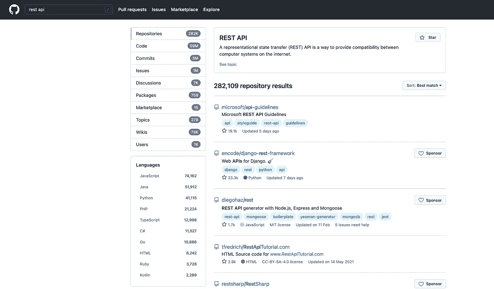
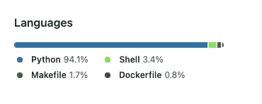

# 如何从 Github 语言统计中忽略 Jupyter 笔记本

> 原文：<https://towardsdatascience.com/how-to-ignore-jupyter-notebook-from-github-language-stats-6ec7004b885a>

## 不要让这些文件掩盖了项目中其他重要的语言

如果你和我一样是 Github 用户，你可能知道在你的库的右边有一个很棒的小部分:语言。


语言统计—作者截图

这一部分列出了项目中涉及的编程语言以及它们的使用百分比:这给出了栈和开发人员使用的不同技术的粗略概念。

如果你想知道这些数据是如何计算的，Github 的工程师们开源了一个 Ruby 库来做这项工作:它叫做[语言学家](https://github.com/github/linguist#linguist)。

# 为什么这个部分甚至有用？

除了给出正在使用的编程语言的分类，这个语言统计部分还提供了一种 Github 索引您的项目的方法，通过按语言搜索的特性可以发现您的项目。



按关键字和编程语言搜索—作者截图

# jupyter 笔记本和语言统计的问题

当你在一个 Python 项目中有很多笔记本时，在计算语言统计数据时会考虑到它们。由于这些文件有膨胀的元数据行数，它们通常出现在顶部，遮蔽了项目中涉及的重要语言。

下面是在我的一个项目中发生的事情:我有一个笔记本文件夹作为我的代码库的一部分，其中的文件提交给 Git 是有意义的，因为它们共享了该库的使用示例。

当 Github 编辑统计数据时，它给出了这个*不切实际的*细目，仅仅因为 Jupyter 笔记本不是纯文本文件，而是大量的元数据。


用户截图

# 解决方案💡

在稍微钻研了一下语言学家的文档后，我找到了一个快速解决方法:只需在`.gitattributes`文件中添加笔记本文件夹作为`linguist-vendored`。

基本上，将这一行添加到`.gitattributes`并提交该文件:

```
notebooks/** linguist-vendored
```

通过这样做，Github 将在计算统计数据时忽略`notebooks`文件夹中的文件(这基本上适用于您想要忽略的任何类型的文件)

在推送代码之后，语言统计更新，显示 Shell、Makefile 和 Dockerfile:我用来编写脚本、打包和部署我的库的三个工具。



用户截图

仅此而已！:)

# 新到中？您可以每月订阅 5 美元，并解锁各种主题的无限文章(技术、设计、创业……)您可以通过点击我的推荐[链接](https://ahmedbesbes.medium.com/membership)支持我

<https://ahmedbesbes.medium.com/membership>  

由 [Unsplash](https://unsplash.com?utm_source=medium&utm_medium=referral) 上 [charlesdeluvio](https://unsplash.com/@charlesdeluvio?utm_source=medium&utm_medium=referral) 拍摄的照片