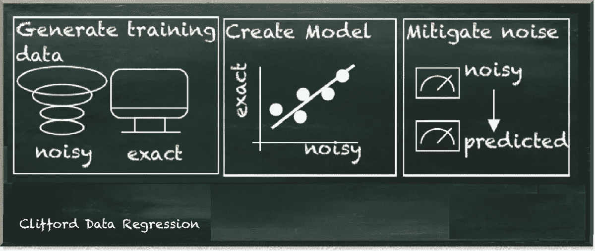
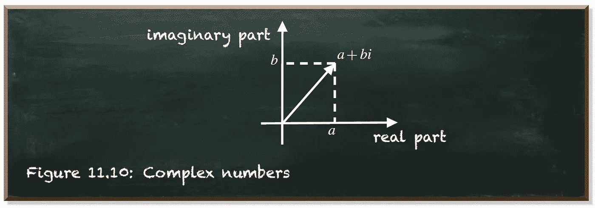
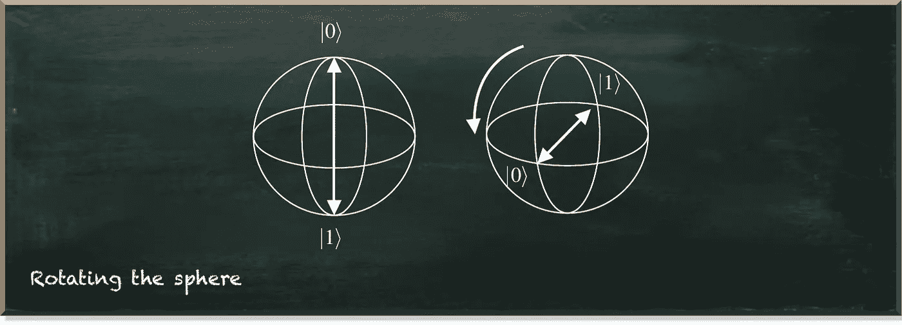

# 如何用 Qiskit 和 Mitiq 实现量子错误缓解

> 原文：<https://towardsdatascience.com/how-to-implement-quantum-error-mitigation-with-qiskit-and-mitiq-e2f6a933619c>

## 了解如何实现 Clifford 数据回归

量子机器学习要不要入门？看看 [**动手量子机器学习用 Python**](https://www.pyqml.com/page?ref=medium_implementcdr&dest=/) **。**



作者图片

量子错误缓解对于挖掘当今量子计算的潜力至关重要。首先，我们今天拥有的量子位元受到环境中噪音的困扰，最终摧毁了任何有意义的计算。第二，绝不是说，我们没有足够的物理量子位捆绑成容错的逻辑量子位。

我们今天能做的最好的事情就是减少噪声对计算的影响。这就是量子误差缓解的意义所在。

最近，IBM 宣布了它的第二个量子科学奖。他们在寻找量子模拟问题的解决方案。他们想让我们用 Trotterization 来模拟一个三粒子海森堡模型哈密顿量。然而，主要的挑战是处理不可避免的噪音，因为他们希望我们在他们的 7 量子位雅加达系统上解决这个问题。

但是在我们可以在真正的量子计算机上解决这个问题之前，让我们首先看看我们如何用 Qiskit 实现一个量子错误减轻方法。在我之前的帖子中，我介绍了由 P. Czarnik 等人开发的 Clifford 数据回归(CDR)方法，Clifford 量子电路数据的误差缓解，Quantum 5，592 (2021) 。在这种最近的和有前途的误差减轻方法中，我们创建了一个机器学习模型，通过使用来自量子电路的数据，我们可以用它来预测和减轻噪声，我们可以经典地模拟量子电路。

我们使用 qi skit(IBM quantum 开发库)和 Mitiq(在量子计算机上实现错误缓解技术的 Python 工具包)。

Mitiq 为 CDR 方法提供了一个 API，它们可以很好地与 Qiskit 集成。所以，这应该是小菜一碟，不是吗？

我们先来看看 [Mitiq 对 CDR 的介绍](https://mitiq.readthedocs.io/en/stable/guide/cdr-1-intro.html)。乍一看，它们清楚地描述了我们需要做什么。这是一个四步程序:

1.  定义一个量子电路
2.  定义遗嘱执行人
3.  可观察量
4.  (近克利福德)模拟器

然而，当我们仔细观察时，我们发现他们的例子使用了 Google 的 Cirq 库。

因此，我们需要修改代码以适应 Qiskit API。

# 定义一个量子电路

我们需要定义的量子电路代表了我们旨在解决的问题，例如 IBM 要求我们提供的哈密顿模拟。然而，我们坚持使用 Mitiq 提供的例子。这是一个两量子位电路，仅由 Clifford 门和绕 z 轴的旋转组成(𝑅𝑍).克利福德门很容易在经典计算机上模拟——这是 CDR 方法的先决条件。

下面的列表描述了 quantum 电路对 Qiskit 的修改。

这里没什么特别的事。在 for 循环中，我们在量子位上应用了一些任意的量子门。这些主要是旋转(`rz`、`rx`和纠结`cx`)。对于 CDR 方法的应用，该电路的细节并不重要。如上所述，让我们假设它们代表了手头的问题。

与 Mitiq 的例子类似，我们多次应用一系列门来增加整个电路的长度。事实上，如果我们期待使用 Trotterization 来解决哈密顿模拟，这种结构会很方便，因为 Trotterization 建立在一系列量子门的重复上。

最后，本例的重要区别在于电路中包含的测量。在 Qiskit 中，我们需要明确指定何时“查看”我们的量子位。

# 定义遗嘱执行人

下一步，我们需要定义一个执行者。这是一个将我们的量子电路作为输入并返回 Mitiq QuantumResult 的函数。听起来很容易。然而，细节决定成败。

当我们查看示例代码时，我们看到它使用了从 mitiq.interface.mitiq_cirq 导入的 Mitiq 函数 compute_density_matrix。显然，它返回了密度矩阵。这是一个描述量子态的矩阵。

遗憾的是，当我们查看 [Mitiq 的 API 文档](https://mitiq.readthedocs.io/en/stable/apidoc.html)时，已经没有这样的函数了。这个例子似乎有点过时了。看一下[实际的源代码](https://github.com/unitaryfund/mitiq/tree/master/mitiq/interface/mitiq_cirq)就可以证实这个假设。现在已经没有这个功能了。

相反，Mitiq 现在提供了四个与 Cirq 相关的函数:`execute`、`execute_with_depolarizing_noise`、`execute_with_shots`和`execute_with_shots_and_depolarizing_noise`。

Qiskit 接口也是如此。这里有`execute`、`execute_with_noise`、`execute_with_shots`、`execute_with_shots_and_noise`。

问题是:我们应该使用哪一个？

在 Mitiq 的例子中，他们说他们增加了单量子位去极化噪声。因此，我们当然希望创建一个带噪声的执行程序。但是，我们需要多次拍摄吗？

答案是:是的，我们有！在最初的例子中，它们返回最终的密度矩阵——一种量子状态的表示。如果我们只运行一次电路(没有镜头)，我们将无法创建这样的矩阵。

所以，这是我们要用的函数:

```
mitiq.interface.mitiq_qiskit.qiskit_utils.execute_with_shots_and_noise(circuit, obs, noise_model, shots, seed=None)Simulates the evolution of the noisy circuit and returns the statistical estimate of the expectation value of the observable.Parameters
   circuit (QuantumCircuit) – The input Qiskit circuit.
   obs (ndarray) – The observable to measure as a NumPy array
   noise – The input Qiskit noise model
   shots (int) – The number of measurements.
   seed (Optional[int]) – Optional seed for qiskit simulator.
   noise_model (NoiseModel) –Return type float
Returns The expectation value of obs as a float.
```

你注意到什么了吗？对，这个函数返回一个浮点数，而不是一个密度矩阵。此外，该函数需要一个`obs`参数。这是一个可观察到的 NumPy 数组。我们将在下一步创造可观察的。所以，让我们把遗嘱执行人的定义推迟一秒钟。

# 可观察量

一般来说，可观察的东西是我们可以测量的。但是，让我们不要过多地进入物理细节。相反，让我们从概念的角度来看。

量子位是一个二维系统，如下图所示。可视化的极点描绘了基础状态|0⟩和|1⟩.箭头是量子态矢量。接近极点(基态)表示振幅，其平方是测量量子位为 0 或 1 的概率。简单地说，量子态向量越接近基态|1⟩，量子位被测量为 1 的概率就越高。


作者图片

到目前为止一切顺利。然而，量子态的振幅是复数。复数是一个二维数字，有实部和虚部，如下图所示。



作者图片

这有效地将量子位变成了我们通常表示为布洛赫球的三维结构。尽管如此，对极点的接近程度决定了测量概率。


作者图片

球体是同质的。一点特别之处都没有。代表|0⟩和|1⟩的极点的定义是任意的。我们可以在球体表面定义另外两个相对的点，并询问测量量子位元的机率。下图描绘了两个这样的点。



作者图片

实际上，这是一个我们通过整个球体的旋转指定的可观测值。旋转球体两极的点成为我们观察量子位元所得到的测量值。

Mitiq 提供了一个 API 来指定一个可观察对象。它需要一个`PauliStrings`的列表。这些表示布洛赫球的旋转。在 Mitiq 例子中，我们有两个量子位。第一个`PauliString`在两个量子位上应用 Z 门(绕 Z 轴翻转)。第二个`PauliString`在第一个量子位上应用绕 x 轴的旋转-1.75(这比等于𝜋(约 3.14)的圆的一半多一点)。

当我们看可观测的时候，我们可以看到它输出了复合旋转。

```
Z(0)*Z(1) + (-1.75+0j)*X(0)
```

所以，有了我们可以观察到的东西，让我们回到执行者。

# 定义一个执行者——再访

execute_with_noise_and_shots 函数要求可观察对象为 NumPy 数组。我们通过调用可观察对象的`matrix`函数来获得这种表示。

接下来，我们需要指定一个噪声模型。noise_model 告诉模拟器将哪种噪声添加到模拟中。

Qiskit 提供了噪声包来创建自定义的噪声模型。我们用它以一定的概率在单量子位和双量子位门上添加误差。这意味着，每当我们应用一个特定种类的门时，我们将以指定的概率得到一个被破坏的量子比特状态。

最后，我们需要指定我们想要运行电路的镜头数。任何超过 1000 张的照片都可以。

# (近克利福德)模拟器

最后一个组件是一个无噪声模拟器。几乎和遗嘱执行人差不多。唯一的区别是它不应该有任何噪音。我们可以简单地使用`execute_with_shots`函数。

# 运行 CDR

我们准备好运行 CDR 了。我们可以原样使用示例代码的其余部分。我们只需要插入我们创建的函数。

我们首先计算无噪声结果。

```
ideal_measurement =  0.6259272372946627
```

然后，我们计算未减轻的噪声结果。

```
unmitigated_measurement =  0.48027121352169094
```

接下来，我们计算来自 CDR 的减轻的结果。

```
mitigated_measurement =  0.6076182171631638
```

最后，我们比较结果。

```
Error (unmitigated): 0.14565602377297177
Error (mitigated with CDR): 0.018309020131498932
Relative error (unmitigated): 0.23270440251572316
Relative error (mitigated with CDR): 0.029251035968066913
Error reduction with CDR: 87.4%.
```

# 结论

结果显示，CDR 减少了噪声引起的几乎 90%的误差。

Mitiq 帮助我们几乎开箱即用地使用 CDR。我们根本不需要费心去实现它。然而，准备使用 API 的代码有点棘手，因为这个例子似乎已经过时了。

量子机器学习要不要入门？看看 [**动手量子机器学习用 Python**](https://www.pyqml.com/page?ref=medium_implementcdr&dest=/) **。**


免费获取前三章[这里](https://www.pyqml.com/page?ref=medium_implementcdr&dest=/)。