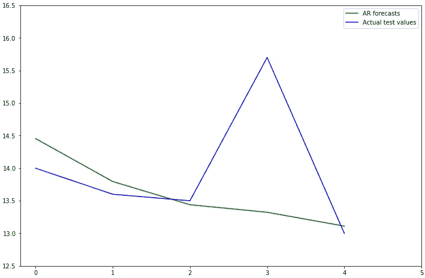

# 如何利用 ARMA 改进时间序列分析中的 AR 预测

> 原文：<https://towardsdatascience.com/how-to-improve-ar-predictions-using-arma-for-time-series-analysis-483b84984490>

## 学会使用 ARMA 模型做出比 AR 模型更好的预测


努尔·尤尼斯在 [Unsplash](https://unsplash.com?utm_source=medium&utm_medium=referral) 上的照片

在我之前的一篇指南中，我们介绍了如何使用时间序列数据，使用自回归模型对未来进行预测。在本帖中，我们将尝试用另一种方法来提高我们预测的准确性。

请务必查看之前关于实现自回归模型的文章，您可以在下面的链接中找到该文章。

[](/how-to-use-an-autoregressive-ar-model-for-time-series-analysis-bb12b7831024) [## 如何使用自回归(AR)模型进行时间序列分析

### python 中使用自回归模型进行预测的初学者指南

towardsdatascience.com](/how-to-use-an-autoregressive-ar-model-for-time-series-analysis-bb12b7831024) 

在那篇文章中，我们通过绘制和分析数据的 ACF 图，得出了 AR 模型的最佳阶数。对于这种方法，我们将使用 *pmdarima* 库来为数据集寻找最佳模型和订单。您稍后将会看到，这将意味着从 AR 模型向 ARMA 模型的转变，ARMA 模型中集成了一个*移动平均*组件。

## 数据集

我们将使用澳大利亚墨尔本市 10 年间的日最低温度的相同数据，正如我在关于自回归的文章中发现的那样。这些数据的原始记录归澳大利亚气象局所有。


一个表格的屏幕截图，包括前 4 行数据和标题—由作者创建

如果你对本指南中的编码感兴趣，那么我在 Github gist [1]中提供了数据集[。](https://gist.github.com/JacobToftgaardRasmussen/78cac8b522ce6d8cab4fc80f7de48ee9)

## 代码部分

在我们开始编写任何代码之前，我首先导入所需的库，因为我是在 Google 协作笔记本上编写的，所以我将首先使用 pip 来安装我想要使用的特定版本。

```
pip install statsmodels==0.13.1
```

在另一间牢房里。

```
pip install pmdarima
```

现在，我们可以导入我们需要的库和函数，以及将数据读取到 pandas 数据框架中，并将其分成训练和测试数据。

```
import pandas as pd
import matplotlib.pyplot as plt
import numpy as np
from pmdarima import auto_arimadf = pd.read_csv('australia_temp_data.csv', index_col='Date', parse_dates=True)df_train = df['Temp'].iloc[:-5]
df_test = df['Temp'].iloc[-5:]
```

在上一篇文章中，我们旨在创建一个自回归模型，只是为了尝试和了解它，因此我们创建了一个 ACF 图，它将为我们的模型提供一个 AR 阶数的指标。

在本指南中，我们将让 *pmdarima* 分析我们的数据，并决定哪种模型最适合我们的需求。我们可以用下面的代码做到这一点。

```
model = auto_arima(df_train, start_P=0, start_q=0, stepwise=True, trace=True)
```

这将提供以下输出(如果您设置可选参数 trace=True)


对我们的数据运行 auto_arima 的输出屏幕截图—由作者创建

这里你可以看到这个函数在尝试不同的 ARMA 模型，(注意 I 阶总是 0，因此它是 ARMA 而不是 ARIMA)。该函数的目标是最小化你在上面截图的每一行中看到的 AIC 值。

AIC 值的绝对值本身没有任何意义，但是它们相对于彼此具有意义，并且我们采用提供最低 AIC 值的一组顺序。在这种情况下，这将是一个 ARIMA(3，0，1)模型，(这实际上是一个 ARMA(3，1)模型)。

运行`auto_arima`的结果保存在变量`model`中，我们可以用它来预测未来的值。

## 先前 AR 模型的结果

在我们继续进行预测之前，让我们先来看看上一篇文章的结果，这样我们就有东西可以比较了。当然，你可以通过查阅那篇文章找到那些结果是如何实现的详细代码，但是为了便于阅读，我在这里也包含了一个摘要版本。这段代码延续了当前文章**中**T3 处的代码。****

```
from statsmodels.tsa.ar_model import AutoRegAR_model = AutoReg(df_train, lags=22).fit()forecasts = model.forecast(5).tolist()fig = plt.subplots(figsize=(12,8))
plt.plot(forecasts, color="green")
plt.plot(df_test.tolist(), color="blue")
plt.xticks(np.arange(0,6,1))
plt.yticks(np.arange(12.5,17,0.5))
plt.legend(["AR forecasts", "Actual test values"])
plt.show()
```

这提供了下面的情节。



该图显示了前一篇文章中 AR 模型的预测，紧挨着实际测试值—由作者创建

## 使用 ARMA(3，1)模型创建新的预测

现在，让我们尝试用上面创建的新 ARMA(3，1)模型来改进这些预测。

```
predictions = model.predict(n_periods=(len(df_test)))
```

我们还可以将这些预测值绘制在测试值旁边，以直观地了解准确性。

```
fig = plt.subplots(figsize=(12,8))
plt.plot(predictions, color='orange')
plt.plot(df_test.tolist())
plt.xticks(np.arange(0,6,1))
plt.yticks(np.arange(12.5,17,0.5))
plt.legend(["ARMA(3, 1) predictions", "Actual test value"])
plt.show()
```


显示 ARMA(3，1)模型预测值与实际测试值的关系图-由作者创建

如您所见，橙色线看起来比之前图中的绿线更接近蓝色测试值。让我们一起来看一下这三行，这样会更清楚。


AR 预测和实际测试值旁边的 ARMA(3，1)预测-由作者创建

现在很明显，ARMA(3，1)预测更接近实际测试温度。为了进行数值比较，我们可以计算两个不同预测的均方误差以及数据集的平均值。

```
from sklearn.metrics import mean_squared_errorprint('AR model MSE', mean_squared_error(test_values, forecasts))
print('ARMA(3, 1) MSE', mean_squared_error(test_values,predictions))
print(df.Temp.mean())
```


打印两个 MSE 值和温度平均值的结果截图—由作者创建

从这些结果中我们可以看出，AR 模型的预测值平均与测试数据中的实际温度相差约 1.18 摄氏度，而 ARMA(3，1)模型的预测值相差约 1.01 度。

与整个数据集上大约 11.18 的平均温度相比，我认为这两个模型都做得很好。

## 摘要

总结本文，可以说我们通过在模型中引入 MA 分量成功地改进了对未来气温的预测。这可以通过使用 *pmdarima* 库的 *auto_arima* 函数找到最适合的模型类型及其相应的订单。

我希望你喜欢阅读这篇文章，并学到一些有用的东西！

感谢阅读。

## 信用

[1](数据来源经 Jason Brownlee 许可)——Jason Brownlee，*用 Python 进行时间序列预测的自回归模型*，机器学习掌握，可从[https://machinelingmastery . com/auto regression-Models-Time-Series-Forecasting-Python/](https://machinelearningmastery.com/autoregression-models-time-series-forecasting-python/)获取，2021 年 12 月 20 日。