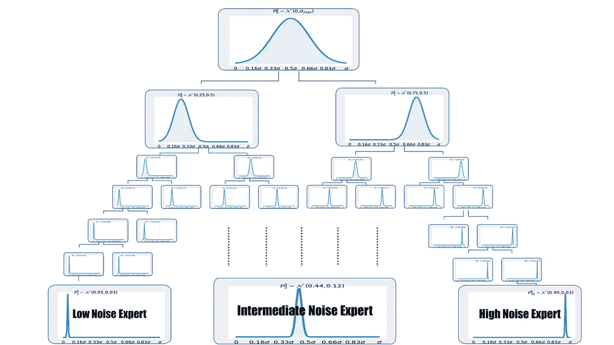
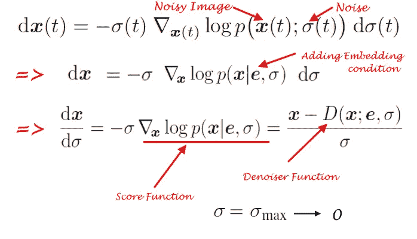
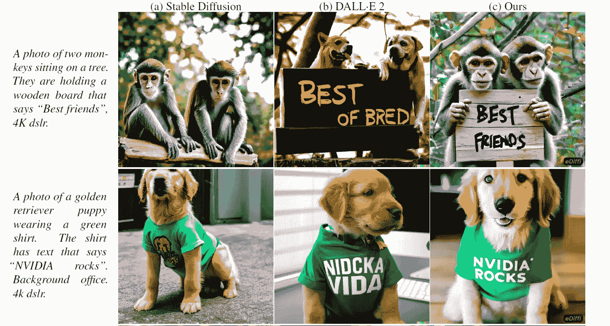
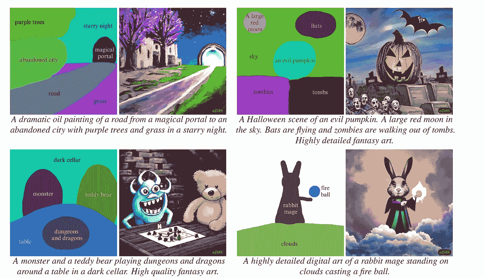

# 如何通过专家模型的集合提高扩散模型的性能

> 原文：<https://towardsdatascience.com/how-to-improve-performance-of-a-diffusion-model-by-an-ensemble-of-expert-models-97e7cfd4c47f>

## NVIDIA 基于系综的扩散模型的全面解释和评论

在本文中，我们将介绍扩散模型领域的最新进展，称为 *eDiff-I* [1]。这是一个扩散模型的集合，其性能似乎优于所有其他最新技术(例如 DALL-E2 和稳定扩散模型)。本文将基于早期的概念(例如，*扩散模型*和*稳定扩散模型*)。请随意查看我之前关于这些话题的帖子。



图 1:描述在不同噪声水平下训练的扩散模型集合的二叉树图(来源:作者)

**简介**

扩散模型(DM)已被证明在生成高度详细的语义丰富的图像方面是成功的，其取代了对抗模型的性能。这种成功的主要原因可以归因于它们在大型和多样化数据集上的良好伸缩能力。如果我们回顾最先进的技术，我们很快就会意识到，大比例的模型比手工制作的模型表现得更好。这意味着如果我们想进一步扩大扩散模型的规模，我们就必须增加模型的大小。这将成倍增加训练这种模型的内存和计算需求。它还会增加推理时间，从而使这些模型无法用于大多数应用领域。因此，扩展解决方案还必须考虑资源限制。

文本到图像的话语标记语倾向于表现出一种时间动态，从而在训练的不同阶段表现不同。而在较早时间步长的训练(即，反向扩散过程)中，当输入更接近高斯噪声时，给予文本输入优先权；然而，在后面的时间步骤中，模型的焦点转移到视觉特征，并忽略来自提示的文本输入。这意味着在最终时间步生成的图像可能不会产生文本提示所需的对象/特征的精确图像。从图 2 中可以看出，在较早的时间步骤中生成的图像更接近文本描述，但是在后来的采样中它们偏离文本太多。


图 2:在去噪的最后阶段忽略文本提示的变化，而在去噪过程的早期阶段切换时覆盖文本输入的扩散过程的描述。(来源:[1])

一个解决办法可能是培训一批专家学者，每个专家学者都专门研究生成过程中的特定阶段。这样可以更好地控制生成过程。然而，这将极大地增加集合模型的训练成本，因为每个时间步长将需要训练具有不同参数的不同降噪模型。解决这个问题的一种方法是在所有时间步训练一个具有共享权重的模型用于大量迭代，然后使用它作为集合中专家降噪模型的初始化器，该集合被训练用于较少的迭代。这是由 *eDiff-I* 作者使用的方法，以便缩放和改进基于扩散模型的图像生成领域的最新成果[1]。

**专家组&编码器**

*eDiff-I* 提出使用一组专家降噪器——每个专家降噪器专门用于扩散过程的特定阶段，从而提高图像生成的整体性能。此外，它还使用编码器的集合(剪辑文本、剪辑图像、T5 文本)。[1]已经观察到，使用不同类型的文本/图像编码器存在一些折衷。例如，CLIP 倾向于图像的总体外观，而忽略精细的细节(例如，对象和特征)。T5 编码器偏爱那些生成的图像，这些图像具有提示所要求的相同对象，但是它忽略了全局观点(即，在上下文中的集成)。除了文本编码器， *eDiff-I* 还使用一个剪辑图像嵌入编码器进行图像到图像的生成。这对于需要图像调节作为图像生成的先决条件的任务(例如，风格转换任务)是有用的。

**能量&采样函数公式:**

*eDiff-I* 是一个扩散模型，因此它遵循与其他标准扩散模型相同的能量函数。然而，作者对其进行了修改，以将文本/图像嵌入作为 denoiser 函数的一个条件。更具体地说，*得分函数*和降噪函数已经被定制以反映这种条件。


图 3:能量函数解释。(来源:作者)

除了能量函数，扩散过程的另一个重要部分是采样方法。扩散过程中的典型采样器由一个*得分函数*组成，该函数将扩散过程导向高密度数据。这样的*得分函数*可以通过求解一个常微分方程(ODE)【3，4】得到。 *eDiff-I* 遵循来自[2]的 ODE 求解和得分函数计算方法，如下图 4 所示。



图 4:得分函数公式作为 ODE 解决方案的说明(来源:作者)

降噪函数是扩散过程的关键。基于自动编码器的扩散模型使用神经网络来预测和去除输入图像中的噪声。由于输入 **x** = **y** + **n** 是干净信号 **y** 和噪声 **n** ~ N( **0** ， **σ** 2 **I** )的组合，其幅度根据噪声水平σ变化很大。出于这个原因，一个常见的做法是不直接将 **D** θ表示为神经网络，而是训练一个不同的网络 **F** θ，从该网络导出**D**θ(θ=**x**—**σ****F**θ)。并且为了克服噪声幅度的波动，神经网络被预处理以预测缩放到单位方差的噪声水平。然而，这在大σ时不起作用，因为网络必须仔细微调其输出，以补偿信号中已经存在的噪声。换句话说，网络误差被放大了σ倍。在这种情况下，直接预测 **D** 比预测 **F** 要容易得多。因此，更好的方法是自适应地将信号与噪声混合。在[2]中，提出了这样的自适应降噪公式，eDiff-I*借鉴并定制了它自己的降噪公式。*


图 5:去噪函数公式说明。(来源:作者)

降噪功能为图像生成过程中的采样提供了基础。[2]给出了采样过程的完整算法，如图 6 所示。


图 6:扩散模型的采样算法(来源:[2])

**培训流程**

扩散模型使用前一节中解释的去噪采样函数来生成图像。在引言中指出，这种去噪过程在去噪过程的后面的时间步骤中经常错过来自文本提示的指令。因此，提出的解决方案是生成一个专家去噪模型的集合，而不是单一的扩散模型。然而，从头开始训练所有 denoiser 模型是没有效率的，并且是对资源的浪费。因此，作者采用了一种有效的基于二叉查找树的集成训练方法。单个基本模型首先被训练 500K 次迭代，然后用于初始化二叉树中的其他模型，该二叉树探索噪声的搜索空间。在树的每一层，噪声分布被分割成两个范围段，并且在每个噪声范围上单独训练新的模型。随着树的深度增加，模型的数量也增加，从而指数地增加了计算和存储需求，因此，树仅增长到边缘，而中间层被合并以具有单个共享网络。这种策略最终在集合中产生三组模型:*低噪声专家*、*高噪声专家*和*中噪声专家*(图 1)。二叉树的早期级别的模型被训练更长时间(例如，> 100K 次迭代),并且对于树的较深级别的模型，训练逐渐减少。

**浏览结果**

*eDiff-I* 提出了一组专家去噪模型，而不是单一模型(例如 DALL-E 或*稳定扩散模型*)。他们证明了基准数据集上的结果优于其他扩散模型。



图 7:文本到图像生成的 eDiff-I 结果(来源:[1])。

除了文本到图像的生成之外，该模型对于其他应用也是有用的(例如，风格转换和语义地图呈现)。在语义地图绘制的情况下，它们提供了一种称为“用文字绘画”的独特解决方案，由此语义标签地图与文本提示一起输入，从而允许定制生成逼真的图像，该图像保持语义标签地图和文本提示提供的语义结构。



图 8:使用 eDiff-I 的带字绘画的示例结果(来源:[1])

**最终想法**

在这篇文章中，我们回顾和解释了在基于扩散模型的图像生成领域的最新进展。NVIDIA 新提出的方法( *eDiff-I* )似乎很强大，但是，一旦开源实现变得可用，除了内存占用之外，看到推理&微调的计算成本将是有趣的。

**订阅更多内容:**

[https://azad-wolf.medium.com/subscribe](https://azadwolf.medium.com/subscribe)

**成为 Patreon 会员:**

[](https://www.patreon.com/azadlab)  

**关注推特更新:**

[https://www.twitter.com/@azaditech](https://www.twitter.com/@azaditech)

**在子栈上找到我:**

[](https://azadwolf.substack.com)  

**参考文献:**

```
[1] Balaji et. al., “*eDiff-I*: Text-to-Image Diffusion Models with Ensemble of Expert Denoisers “, arXiv:2211.01324, 2022[2] Tero Karras, Miika Aittala, Timo Aila, Samuli Laine,” Elucidating the Design Space of Diffusion-Based Generative Models”, arXiv:2206.00364 [cs.CV], 2022[3] Aapo Hyvärinen, “Estimation of Non-Normalized Statistical Models by Score Matching”, The Journal of Machine Learning Research, volume 6, 2005[4] Pascal Vincent, “A connection between score matching and denoising autoencoders”, Neural Computation, Volume 23, Issue 7, 2011
```