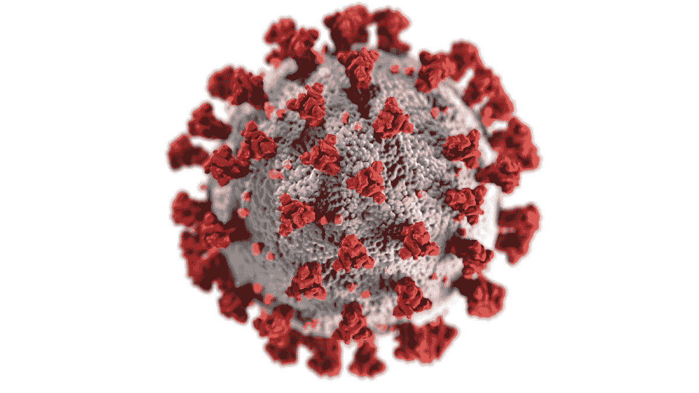
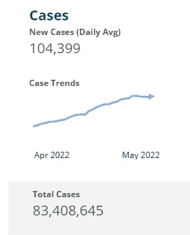
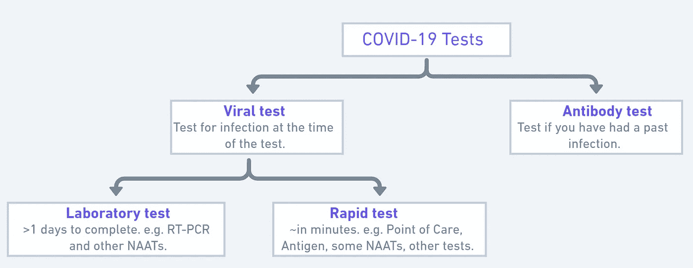
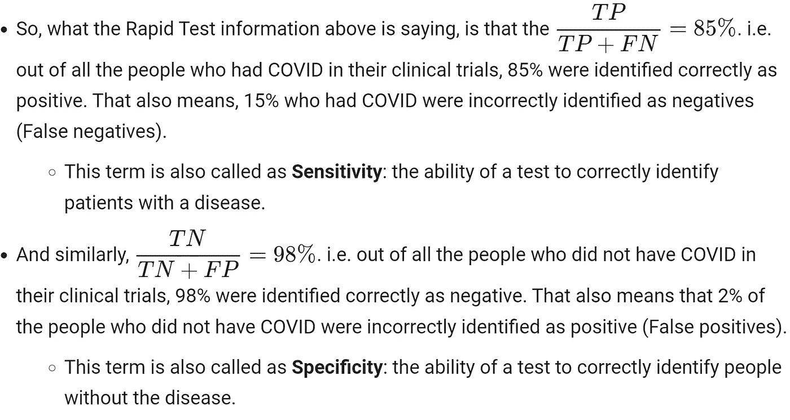
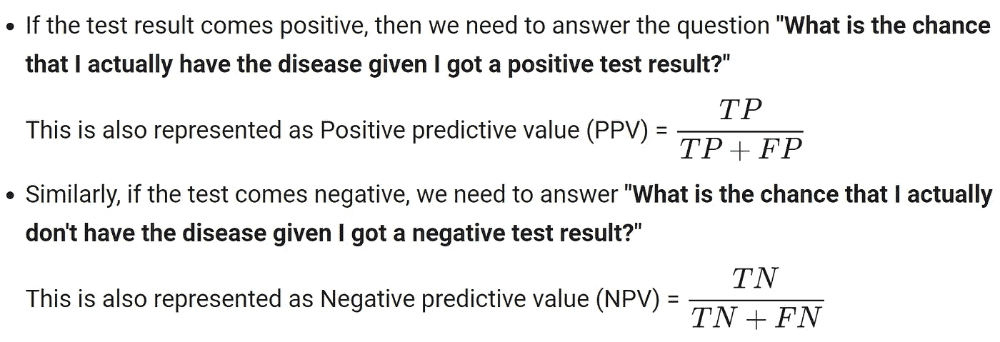
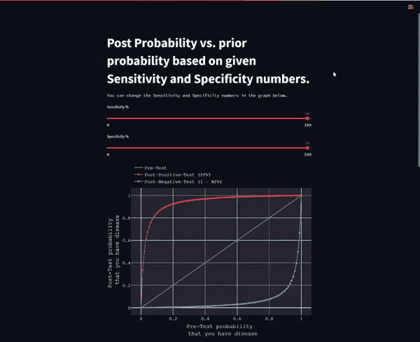

# 用贝叶斯方法解释新冠肺炎快速家庭测试结果:概率模拟第 1-2 部分

> 原文：<https://towardsdatascience.com/how-to-interpret-covid-19-rapid-home-test-results-using-bayes-probability-simulation-part-1-2-edfb1d1bc224>

## 你参加过新冠肺炎家庭测试并试图解释结果吗？让我们用一些贝叶斯方法来回答这个问题，并通过使用 Python 模拟场景来验证答案。

[疾控中心](https://unsplash.com/@cdc?utm_source=medium&utm_medium=referral)在 [Unsplash](https://unsplash.com?utm_source=medium&utm_medium=referral) 拍摄的照片

这篇文章是我上一篇概率文章第一部分的延续。(这是一个临时帖子，我将在稍后发布该系列的第 2 部分)。

</probability-simulations-solve-complex-probability-problems-using-randomness-part-1-6010026d4f49>  

# 背景

让我们假设有一种叫做*的罕见疾病*，它影响了总人口的 1%。并且说有一种检测这种疾病的最快速的测试方法，无论是阳性还是阴性测试都有 95%的准确率。

*   现在，如果你用这种最快的方法检测出阳性，你真的得了这种病的可能性有多大？
*   答案是 **~16%** 。**为什么会这样？为了更好地理解，让我们看看下面的新冠肺炎例子。**

# 介绍

当我们都开始认为新冠肺炎已经得到控制时，人数又开始增加了。仅在美国，每天就有超过 10 万例阳性病例被报道。

[来源](https://covid.cdc.gov/covid-data-tracker/#datatracker-home)，2022 年 5 月 25 日。美国 cdc.gov 每日更新

上周，我密切接触的一个人的 COVID 19 检测呈阳性。我决定接受新冠肺炎快速家庭测试，这样我就可以自我隔离，如果我是阳性的话[ [接受测试的理由](https://www.cdc.gov/coronavirus/2019-ncov/symptoms-testing/testing.html) ]。做完测试后，我想知道如何解释结果，我想你们中的很多人可能会有同样的问题。所以，让我们试着用概率来回答这个问题，并用蒙特卡罗模拟来验证这个答案。

> **免责声明**:我的职业是工程师和数据科学家，没有医学专业知识。这篇文章更多的是关于数据和概率，并不打算提供任何形式的医学建议。请参考最新的[疾病预防控制中心指南](https://www.cdc.gov/coronavirus/2019-ncov/index.html)或向你的医生咨询医学专业知识。

**注意:**这篇文章假设读者*对概率和贝叶斯定理有所了解。如果没有，我会推荐你阅读我的最后一篇文章。*

# 新冠肺炎测试

[资料来源:cdc.gov](https://www.cdc.gov/coronavirus/2019-ncov/symptoms-testing/testing.html)([NAATs](https://www.cdc.gov/coronavirus/2019-ncov/lab/naats.html))

[**自测**](https://www.cdc.gov/coronavirus/2019-ncov/testing/self-testing.html) **是一种快速测试**，可以在家里或任何地方进行，易于使用，并能快速得出结果。 ***在本帖中，我们将重点关注我是如何试图解读我的快速家庭测试结果的。***

请参考 CDC 的[在家或任何地方自测](https://www.cdc.gov/coronavirus/2019-ncov/testing/self-testing.html#test-negative)链接，获取官方指导。

# 让我们深入研究一下

我参加了智能拭子新冠肺炎快速测试。

照片由[史蒂夫·诺玛克斯](https://unsplash.com/@nomax?utm_source=medium&utm_medium=referral)在 [Unsplash](https://unsplash.com?utm_source=medium&utm_medium=referral) 上拍摄

根据检测试剂盒和网站中的信息，他们声称在他们的临床研究中，该检测正确识别了约 85%的阳性样本和约 98%的阴性样本。

*   **我们来试着理解一下**是什么意思；

图片由作者提供

图片由作者提供

*   更高的**灵敏度**意味着更低的假阴性，更高的**特异性**意味着更低的假阳性。
*   根据疾病和控制措施，政府或 CDC 可能会制定一些准则，规定一项测试获得大规模批准的最低允许灵敏度和特异性数字，他们还可能会优先考虑一个数字。(例如，FPs 可能会增加医疗保健系统的负担，而 FNs 可能会增加传播)。

现在回到主要问题:“**给定某个测试结果，我感染的概率是多少？”**。

这些数字可能看起来类似于敏感性和特异性数字，但它们实际上是不同的(看分母)。

****注:*** *在 DS 社区，我们也知道灵敏度为召回，PPV 为精准。*

*   让我们假设你得了一种罕见的疾病 **X** ，这只影响 1%的人口。您可以从这个数字开始，作为您的先验(或预测试)概率。
*   你也可以用新的信息更新这种概率:例如，如果你与患有这种疾病的人有密切接触，或者如果这种疾病在你的家族中传播，或者如果考虑到你目前的健康状况，你更容易患这种疾病，等等..
*   然后，比方说，你决定做个测试。根据测试结果，你可以进一步更新你患这种疾病的概率。**敏感度和特异度数字有助于您确定在获得测试结果后，您应该增加或减少先前患病概率的可能性因素。**

图片由作者提供

你明白了，对吧？

***我们将假设我们在进行快速测试之前已经计算了一个良好的先验，并将只关注在获得测试结果后更新概率。*

*   **贝叶斯定理可以帮助我们计算这个似然因子，更新我们的先验。**

> ***测试后概率=基于测试结果的可能性∫测试前概率***

用更专业的术语来说就是。

我们有兴趣知道左边的值，即 **PPV。**等式右边的第一部分是可能性部分。请注意，这个比率基本上是计算如果您有 Covid19，获得阳性测试结果的机会与您获得阳性测试结果的总机会的比率(** *记住，由于测试可能有假阳性，这个分母将包括两种情况→当您有 Covid19 时获得阳性，以及当您没有 Covid19 时获得阳性*)。

*您能看出特异性和敏感性数字将如何影响上述似然比以及更新因子吗？*

**分解上式的成分，**

> 上述等式中最难得到也是最有争议的数字是 ***P(你有 Covid19) →*** 预测试概率(也称为先验或患病率)。这取决于各种因素，很难确定，我们将在后面讨论。

*   为了举例计算，基于我上面提到的条件，我们暂时用 ***P(我有 Covid19) = 1* 0%** 作为保守估计。从而 ***P(我没有 Covid19) = 90%。***
*   将所有的数字放在上面的等式中，

*   **我的检测结果为阴性，因此，鉴于我的预测试估计正确** ，我患 Covid19、** *的几率仅为 1.67%。***

我在这里做的其他**假设**是:

*   我按照试剂盒上的说明正确地进行了自我测试。
*   我是在密切接触后 5 到 7 天(疾控中心推荐)做的测试。
*   检测试剂盒上报告的灵敏度和特异性数据对每个人都是正确有效的，并且随着时间的推移保持不变。
*   请注意，如果您有症状，您应该在症状出现的 7 天内进行测试。[ [来源](https://inteliswab.com/faq/#results-accuracy)

# 回到这篇文章的主题——模拟

也许上面的解释和计算完全有道理，没有任何混乱。或者也许你确实计算了数字，但不确定它们是否正确？

这就是模拟场景将有所帮助的地方。在我们的[上一篇](/probability-simulations-solve-complex-probability-problems-using-randomness-part-1-6010026d4f49)中，我们已经建立了如何模拟某个概率问题的基础。让我们在这里使用相同的框架。

模拟得出的答案与我们之前的计算相符。

*   为了更确定我的测试结果，我实际上做了两次测试(系列抗原测试)，两次测试之间有 36 个小时的间隔。
*   两个结果都是否定的，因此，我实际上拥有 Covid19 的几率只有 *0.29% (*同样，假设我们的假设为真)。*

让我们从结果中验证灵敏度和特异性数字。请注意，当我们计算这些数字与上述数字相比时，分母是如何变化的。

它们与我们提供的输入数字相匹配，这是意料之中的。

*****请参考*** [***这个站点和算法由疾控中心***](https://www.cdc.gov/coronavirus/2019-ncov/lab/resources/antigen-tests-guidelines.html#evaluating-test-results) ***设定你应该根据抗原检测结果的阳性或阴性采取什么行动。也可以参考***<https://www.cdc.gov/coronavirus/2019-ncov/lab/faqs.html#Interpreting-Results-of-Diagnostic-Tests>****。****

******此外，如果您的检测结果呈阳性，并且在更长时间内持续呈阳性，请查看***<http://can-i-stop-isolating-if-im-still-testing-positive-for-the-virus/>****。*****

# **先验(预测试概率)**

**正如我们之前看到的，在评估 Covid19 抗原测试的结果时，需要考虑以下因素→测试灵敏度和特异性，以及**预测试概率**(其中取决于**covid 19 感染在社区和个人临床环境中的流行程度)。[ [来源](https://www.cdc.gov/coronavirus/2019-ncov/lab/resources/antigen-tests-guidelines.html)****

> ****如果社区中的感染流行率高，受试者有症状，并且替代诊断的可能性低，则预测试概率通常被认为高。****
> 
> ****如果社区中的感染率较低，且被测试者无症状，且未与新冠肺炎患者有过[密切接触](https://www.cdc.gov/coronavirus/2019-ncov/php/contact-tracing/contact-tracing-plan/appendix.html#contact)，则预测试概率通常被认为较低。****

*   ****计算 Covid19 先验的一种方法是检查您所在地区报告的病例数。[或者阳性测试占总测试的比例也是一个可以考虑的选项](https://www.cdc.gov/coronavirus/2019-ncov/lab/resources/calculating-percent-positivity.html)。例如，你可以在这里找到纽约市[的号码，在这里](https://covid.cdc.gov/covid-data-tracker/#county-view?list_select_state=New+York&data-type=Cases&null=36061&list_select_county=36061)找到整个美国[的号码，在这里](https://covid.cdc.gov/covid-data-tracker/#trends_dailycases_7daytestingpositive)找到[的号码。](https://covid.cdc.gov/covid-data-tracker/#cases)****
*   ****因此，如果你在纽约，你可以使用 9%作为你有 Covid 的开始之前的估计。****
*   ****上述数字可以根据其他因素进行更新，如您的健康状况或暴露程度。例如，[这项研究](https://www.cebm.net/study/covid-19-risk-of-transmission-in-covid-19-among-close-contacts/)指出，如果你暴露于 Covid，你将有大约 2.6%的机会被诊断为 Covid(似乎很低，对吗？).****
*   *******请注意，以上数值仍为估计值。至少我找不到可靠的消息来源有把握地说，如果你来自 XYZ 地区并符合 ABC 参数，这是你患 Covid19 的先验概率。CDC 确实有* [*社区层面的信息*](https://www.cdc.gov/coronavirus/2019-ncov/science/community-levels.html) *，但那是在类别上，而不是数字上。*****

******因此，考虑到这种不确定性，让我们在给定某项测试的某些灵敏度和特异性数的情况下，在可能的先验概率[0 到 1]的整个范围内，计算具有 Covid19 的人的测试后概率(PPV 和 1 - NPV)。******

****例如，在我的情况下，考虑到我的健康状况、密切接触和其他因素，如果我假设我的预测试概率在 10%至 30%之间，我的单一阴性测试结果将使我患 Covid19 的概率在 1.7%至 6%之间(2 次阴性测试为 0.3%至 1%)。****

****在 Streamlit 上查看[全交互图(*见黑暗模式)。](https://share.streamlit.io/pratha19/probability_simulation_post/main)****

********

*****稍微摆弄一下交互式图表，试着理解这三个主要因素——检测的灵敏度和特异性以及预测试概率——如何影响您在检测结果为阳性(或阴性)的情况下实际患病的概率。*****

## ****结论****

*   ****估计先验概率至关重要。较高的先验会降低你对非常准确的阴性测试的信心，而非常低的先验会降低你对非常准确的阳性测试的信心。****
*   ****高度敏感的测试具有较低的假阴性。****
*   ****类似地，高度特异性的测试具有较低的假阳性。****
*   ****上面的两个值决定了一个因子，通过这个因子，你将在测试后更新你先前的感染信念。****
*   ****两次得到阴性结果会让你对没有感染更有信心，尤其是当敏感度数值很高的时候。* *如果您继续出现症状，您应该向您的医务人员寻求后续护理。****
*   ****如果你得到阳性结果，你很有可能感染了，特别是对于高度特异性的测试，你应该遵循 CDC 的指导方针来决定什么对你最好。****

## ****参考****

****[Covid 数据跟踪每周回顾](https://www.cdc.gov/coronavirus/2019-ncov/covid-data/covidview/index.html)****

****[Covid 测试概述](https://www.cdc.gov/coronavirus/2019-ncov/hcp/testing-overview.html)****

****[如何解释自检结果](https://www.youtube.com/watch?v=yoZL1BVP9Bs)****

****[解释诊断测试的结果](https://www.cdc.gov/coronavirus/2019-ncov/lab/faqs.html#Interpreting-Results-of-Diagnostic-Tests)****

****[抗原检测指南](https://www.cdc.gov/coronavirus/2019-ncov/lab/resources/antigen-tests-guidelines.html)****

****[为什么在新冠肺炎时代前后测概率很重要](https://asm.org/Articles/2020/June/Why-Pretest-and-Posttest-Probability-Matter-in-the#:~:text=Posttest%20probabilities%20may%20also%20be,the%20disease%20within%20the%20community.)****