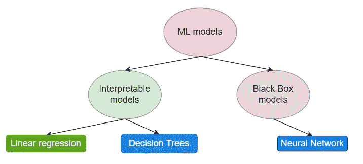
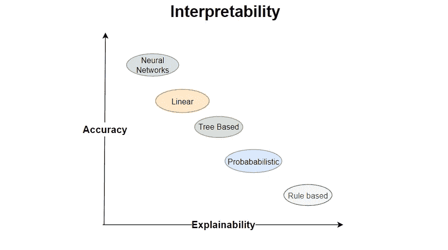
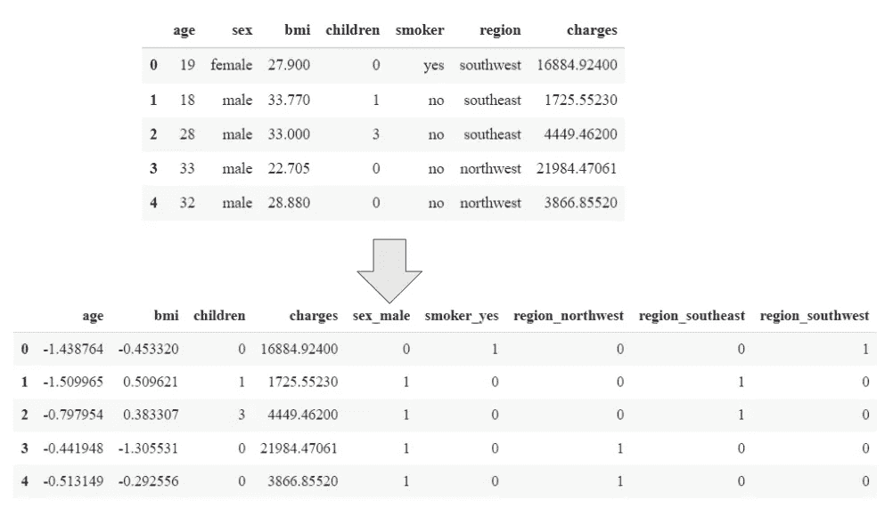
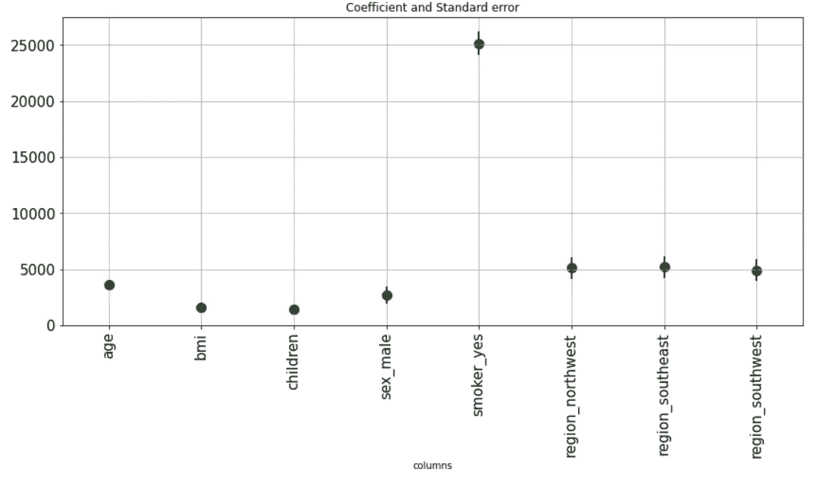
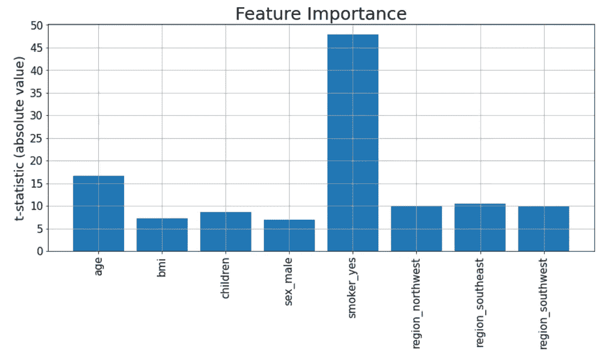
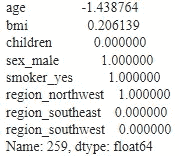
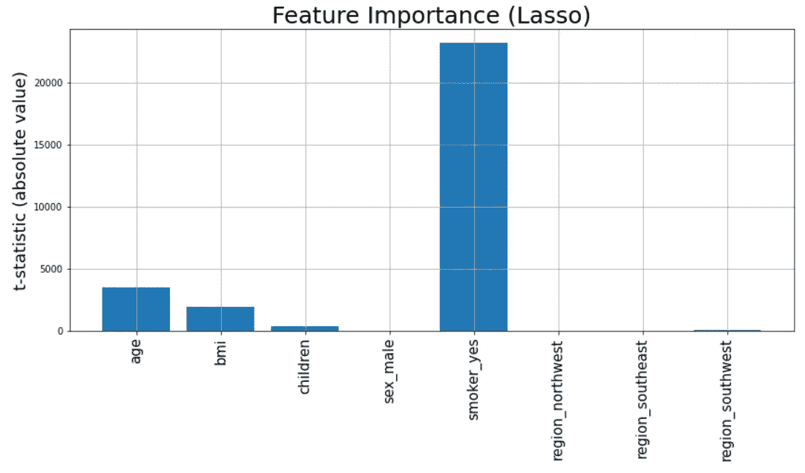
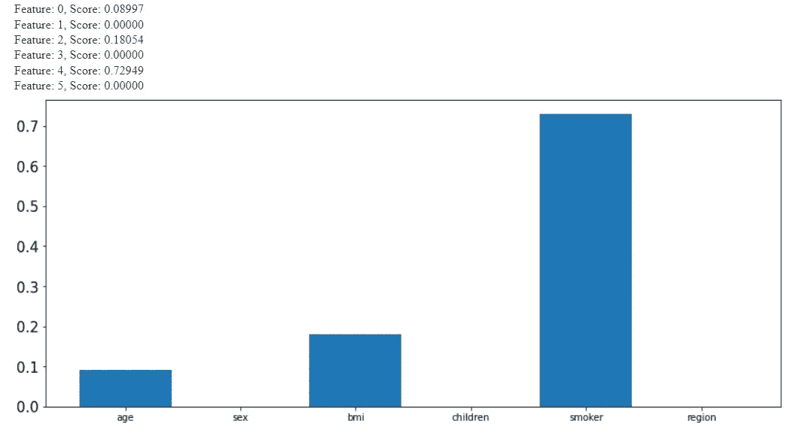

# 如何用 Python 解释线性回归、套索、决策树(易)

> 原文：<https://towardsdatascience.com/how-to-interpret-machine-learning-models-part-1-easy-978ddade7ada>

## 最重要的特性(特性重要性)是什么？为什么模型会做出这个特定的决定？

# 1.介绍

在这篇文章中，我将尝试解释**线性回归、Lasso 和决策树**模型，这些模型本身都是可以解释的。我将分析*全局可解释性*——分析总体预测的最重要特征，以及*局部可解释性*——解释个别预测结果。

机器学习模型用于银行交易中的欺诈和风险检测、语音助手、推荐系统、聊天机器人、自动驾驶汽车、社交网络分析等应用中。然而，有时很难解释它们，因为算法代表了一个黑盒(例如神经网络)，人类很难理解为什么模型做出了特定的决定。所以我们需要额外的技术来分析黑盒决策。



来源:作者照片

# 2.什么是可解释性？

> 可解释性是人类能够理解决策原因的程度[Miller，Tim 2017]。

我们可以互换使用**可解释性**和**可解释性**。然而，术语**解释**用于解释单个预测，而非整个模型。如上所述，一些算法很容易解释，然而，在算法预测准确性和可解释性之间存在粗略的相关性。模型越复杂，解释力就越弱。



作者照片

# 3.为什么可解释性很重要？

以下是几个原因:

*   解释为什么模型做出特定的决定。
*   建立对关键应用程序模型的信任。
*   调试和改进模型。

# 4.线性回归、套索和要素重要性

## 4.1 线性回归

线性模型预测是特征输入的加权和。

y' = W0 + W1*x1 + W2*x2 + … +WnXn

其中 Wj 为特征，W0 为截距。

使用线性模型时，数据集上有一些**约束**:

*   **线性:**目标变量是输入特征的线性组合。
*   **正态性:**给定目标变量，假设特征遵循正态分布。
*   **同方差:**假设误差项的方差在整个特征空间上是恒定的
*   **独立性:**每个实例都独立于任何其他实例。
*   **无多重共线性**:输入要素的相关性应较弱，否则会影响预测。

**实用建议**:如果只有几个特征，线性模型就不错。

**问题**:当我们拥有很多功能时会发生什么？线性回归发现很难处理它们并相应地解释特征。这就是为什么我们可以使用套索功能选择。

## 4.2 套索

Lasso 是采用 L1 正则化的线性回归，负责使用惩罚权重进行要素选择，这意味着模型的大权重会缩小，小权重会变为零。alpha 参数定义权重的惩罚。

**注**:如果想了解更多关于**线性回归**或者**套索**的内容，可以参考我之前关于线性模型的文章。

</fish-weight-prediction-regression-analysis-for-beginners-part-1-8e43b0cb07e>  

## 4.3 特征在线性回归和套索中的重要性

特征重要性是其 [t 统计量](https://en.wikipedia.org/wiki/T-statistic#:~:text=In%20statistics%2C%20the%20t%2Dstatistic,or%20reject%20the%20null%20hypothesis.)的绝对值。因此，如果特性的权重增加，其重要性也会增加。然而，如果标准误差增加(我们不太确定正确的值)，重要性就会降低。


t 统计公式

## 4.4 线性模型解释评价

用线性来解释对人们来说更简单自然。因此，如果线性回归或 Lasso 是数据的良好预测器，这意味着数据满足上面提到的大多数重要约束，那么解释将是真实的。在另一种情况下，如果数据中存在非线性相互作用，线性模型将越不准确，因此，解释将越不真实。

# 5.决策树和特征重要性

## 5.1 决策树

当数据不是线性的、要素和结果之间的关系是非线性的或者存在多重共线性时，线性回归模型会失败，因此输入要素会相互影响。这就是为什么在这种情况下可以使用基于**树的**算法。

决策树背后的直觉是，数据根据某些临界值被分割成不同的子集，预测结果是每个叶节点。

**注意**:如果你想了解更多关于**决策树的知识，**请参考我之前关于基于树的方法的文章。

</regression-analysis-for-beginners-using-tree-based-methods-2b65bd193a7>  

## 5.2 决策树中的特征重要性:

解释起来很容易。决策树的总体特征重要性可以通过以下方式计算。浏览所有分割，并注意每个要素分割相对于父节点减少了多少方差(对于回归)或基尼指数(对于分类)。

## 5.3 决策树解释评估:

预测的真实性取决于树的预测性能。对短树的解释非常简单和通用，因为对于每一次分裂，实例要么落入一片叶子，要么落入另一片叶子。二元决策很容易理解。

# **6。总结**


作者照片

# 使用 Python 实现可解释性

**GitHub 代码可用:**[此处](https://github.com/gurokeretcha/ML_interpretability/blob/main/ML_model_interpretability.ipynb)

在这一节中，我将向您展示线性回归、Lasso 和决策树解释的实际实现。**全局解释**表示每个特征对于总体预测的重要性。**局部解释**试图帮助我们理解机器学习模型的个体预测。

**来自 Kaggle** 的数据集:[医疗费用个人数据集](https://www.kaggle.com/mirichoi0218/insurance)

**共 7 项功能**:

*   **年龄**:保险承包人年龄
*   **性别**:保险签约人性别，女，男
*   **BMI** :身体质量指数，提供对身体的了解，体重相对于身高相对较高或较低，体重的客观指数(kg / m ^ 2)使用身高与体重的比率，理想值为 18.5 至 24.9
*   **儿童**:健康保险覆盖的儿童人数/受抚养人人数
*   **吸烟者**:吸烟
*   **地区**:受益人在美国的居住区域，东北、东南、西南、西北。
*   **费用**:由健康保险支付的个人医疗费用

**我们的目标**是建立一个预测个体承包商费用的 ML 模型，然后解释结果。

**第 0 步**:导入库

```
**import** pandas **as** pd
**import** numpy **as** np
**import** matplotlib.pyplot **as** plt
**import** statsmodels.api **as** sm
**from** sklearn.linear_model **import** LinearRegression,Lasso
**from** sklearn.preprocessing **import** MinMaxScaler, StandardScaler, LabelEncoder,OneHotEncoder
**from** sklearn.metrics **import** mean_squared_error, mean_absolute_error, r2_score
**from** sklearn.model_selection **import** train_test_split,GridSearchCV
**from** sklearn.pipeline **import** Pipeline
**from** sklearn.tree **import** DecisionTreeRegressor
**from** sklearn **import** tree
```

# **1。线性回归:**

## **步骤 1** :导入数据预处理数据——对分类列进行编码，并进行标准缩放。

```
# 1\. import data
data **=** pd**.**read_csv("insurance.csv")# 2\. categorical encoding
data_linear_reg **=** pd**.**get_dummies(data,columns**=**['sex', 'smoker','region'], drop_first**=True**)# 3\. scalling
col_names **=** ['age', 'bmi']
features **=** data_linear_reg[col_names]
scaler **=** StandardScaler()**.**fit(features**.**values)
features **=** scaler**.**transform(features**.**values)
data_linear_reg[col_names] **=** features# 4.train test split
x_train, x_test, y_train, y_test **=** train_test_split(data_linear_reg**.**drop(columns**=**["charges"]), data_linear_reg["charges"], test_size**=**0.2, random_state**=**42)#5\. linear regression model 
linear_reg **=** sm**.**OLS(y_train, x_train)**.**fit()
```



## **第二步:预测结果**

```
**def** pred_result(pred,y_test):
  score_MSE **=** round(mean_squared_error(pred, y_test))
  score_MAE **=** round(mean_absolute_error(pred, y_test))
  score_r2score **=** round(r2_score(pred, y_test),2)
  print(f"MSE: {score_MSE} | MAE: {score_MAE} | R2score: {score_r2score}")linear_pred **=** linear_reg**.**predict(x_test)
pred_result(linear_pred,y_test)
```

**Out[]:MSE:46124128 | MAE:5032 | R2 score:0.67**

如您所见，均方误差为 46124128，平均绝对误差为 5032，R2 分数为 0.67。

## **第三步:全局可解释性**

```
err **=** linear_reg**.**params **-** linear_reg**.**conf_int()[0]
coef_df **=** pd**.**DataFrame({'coef': round(linear_reg**.**params),
                        'Standard Error': round(linear_reg**.**bse),
                        't_Stats': round(linear_reg**.**tvalues,1),
                        'error': round(err)
                       })**.**reset_index()**.**rename(columns**=**{"index":"columns"})
coef_df
```


**Coef** -代表特征的权重。

**标准误差**:砝码的标准误差。

**t_Stats** :每个特征的 t 统计量。

**误差**:权重与其第一置信区间水平之差。

**Coef(权重)背后的直觉**:

*   **数字特征(例如:年龄)**:年龄增加 1 岁，在所有其他特征保持不变的情况下，预测费用数增加 3598。
*   **分类特征**(例如:吸烟者):在所有其他特征保持不变的情况下，当一个人吸烟时，收费值比不吸烟的人高 25153。

```
coef_df**.**plot(y**=**'coef', x**=**'columns', kind**=**'bar', color**=**'none', yerr**=**'error', legend**=False**, figsize**=**(14,6))
plt**.**scatter(x**=**np**.**arange(coef_df**.**shape[0]), s**=**100, y**=**coef_df['coef'], color**=**'green')
plt**.**axhline(y**=**0, linestyle**=**'--', color**=**'black', linewidth**=**1)
plt**.**title("Coefficient and Standard error")
plt**.**grid()
plt**.**yticks(fontsize**=**15)
plt**.**xticks(fontsize**=**15)
plt**.**show()
```



作者照片

我们可以在图中观察每个特征的权重和标准误差。值得注意的是，标准误差可以忽略，因为它们很小，这意味着模型确定每个特征的权重。

```
plt**.**figure(figsize**=**(14,6))
plt**.**bar(linear_reg**.**tvalues**.**keys(), abs(linear_reg**.**tvalues**.**values))
plt**.**title("Feature Importance",fontsize**=**25)
plt**.**ylabel("t-statistic (absolute value)",fontsize**=**18)
plt**.**grid()
plt**.**xticks(rotation**=**90,fontsize**=**15)
plt**.**yticks(range( 0,int(max(round(linear_reg**.**tvalues)))**+**5,5) ,fontsize**=**15)
plt**.**show()
```



作者照片

如上所述，可以使用 *t 统计量*来测量线性回归特征的重要性。所以基于线性回归**最重要的特征**是**吸烟者 _ 是**(它定义了这个人是否吸烟)。第二个最重要的特征是年龄。最不重要的特征是**性别 _ 男性**和**体重指数**。

## **步骤 4:局部可解释性**

让我们检查一个单独的预测(例如，第 5 个样本点)和它的预测是什么。

```
forth_sample **=** x_test**.**iloc[4]
forth_sample
```



```
print("predicted: ",int(linear_reg**.**predict(forth_sample**.**values)))
print("actual: ",int(y_test**.**iloc[4]))
```

**Out[]:预测:28147 实际:33750**

**注**:该样本点性别为男性，吸烟。**想象一下**如果那个人**不吸烟**会有什么预测？

```
forth_sample**.**values[4] **=** 0 # make a person non-smoker
print("predicted non smoker: ",int(linear_reg**.**predict(forth_sample**.**values)))
```

**Out[]:预计不吸烟人数:2994 人**

```
print("difference : ", 28147 **-** 2994 ) *# same as smoker_yer weight.*
```

**Out[]:差额:25153**

**注意**:正如我们从特征重要性图中看到的，smoker_yes 特征是线性回归模型中最重要的特征。事实确实如此。第五种情况的预测是 28 147，而当我们改变它的值并使一个人不吸烟时，预测值变成 2 994。**差 25153 与吸烟者体重相同 _ 是特征！**

# 2.套索

## 步骤 1:导入数据预处理数据—对分类列进行编码并进行标准缩放。

```
data **=** pd**.**read_csv("insurance.csv")data_lasso **=** pd**.**get_dummies(data,columns**=**['sex', 'smoker','region'], drop_first**=True**)col_names **=** ['age', 'bmi']
features **=** data_lasso[col_names]
scaler **=** StandardScaler()**.**fit(features**.**values)
features **=** scaler**.**transform(features**.**values)
data_lasso[col_names] **=** featuressearch **=** GridSearchCV(Lasso(),
                      {'alpha':np**.**arange(0.1,200,1)},
                      cv **=** 5, scoring**=**"neg_mean_squared_error",verbose**=**0
                      )x_train, x_test, y_train, y_test **=** train_test_split(data_lasso**.**drop(columns**=**["charges"]), data_lasso["charges"], test_size**=**0.2, random_state**=**42)search**.**fit(x_train,y_train)search**.**best_params_
```

**Out[ ]: {'alpha': 74.1}**

alpha 参数定义了权重惩罚能力。如果它很高，权重就变成了 0。在这种情况下，我进行了交叉验证的网格搜索，以找到最佳的 alpha 参数，在这种情况下是 74.1。

```
lasso_reg **=** Lasso(alpha **=** 74.1)
lasso_reg**.**fit(x_train,y_train)
```

## **第二步:预测结果**

```
lasso_pred **=** lasso_reg**.**predict(x_test)
pred_result(lasso_pred, y_test)
```

**Out[]:MSE:34153021 | MAE:4237 | R2 score:0.69**

## 步骤 3:全局可解释性

```
coefficients **=** lasso_reg**.**coef_
importance **=** np**.**abs(coefficients)plt**.**figure(figsize**=**(14,6))
plt**.**bar(x_train**.**columns, importance)
plt**.**title("Feature Importance (Lasso)",fontsize**=**25)
plt**.**ylabel("t-statistic (absolute value)",fontsize**=**18)
plt**.**grid()
plt**.**xticks(rotation**=**90,fontsize**=**15)
plt**.**show()
```



作者照片

结果显示，**套索**使得**性别 _ 男性，地域 _ 西北，地域 _ 西南**特征权重到**为零**和**地域 _ 西南特征和子特征(几乎为零)。**所以，模型几乎用 3 个特征:年龄、bmi、吸烟者 _ 是作为预测指标。和之前一样，smoker_yes 特征最重要，其次是年龄和 bmi 特征。值得一提的是，仅使用这 3 个特征，该模型比使用所有特征的简单线性回归做出了更好的预测。

## 步骤 4:本地可解释性

```
forth_sample **=** x_test**.**iloc[4]
lasso_reg**.**coef_print("predicted: ",int(lasso_reg**.**predict([forth_sample**.**values])))
print("actual: ",int(y_test**.**iloc[4]))
```

预测:26662
实际:33750

# 3.决策图表

## 步骤 1:导入数据预处理数据—对分类列进行编码并进行标准缩放。

```
data **=** pd**.**read_csv("insurance.csv")
encoder **=** LabelEncoder()
data[['age','sex','smoker','region']] **=** data[['age','sex','smoker','region']]**.**apply(encoder**.**fit_transform)
data_tree **=** data**.**copy()tree_reg **=** DecisionTreeRegressor(random_state**=**42,max_leaf_nodes**=**5) *# max_leaf_node =5 for simlicity*x_train, x_test, y_train, y_test **=** train_test_split(data_tree**.**drop(columns**=**["charges"]), data_tree["charges"], test_size**=**0.2, random_state**=**42)tree_reg**.**fit(x_train,y_train)
```

为了简单起见，我将 max_leaf_nodes 设置为 5，以便更好地查看可视化效果。

## 第二步:预测结果

```
tree_pred **=** tree_reg**.**predict(x_test)
pred_result(tree_pred, y_test)
```

**MSE:26368109 | MAE:3325 | R2 score:0.8**

结果远比简单的线性回归和套索要好

## 步骤 3:全局可解释性

```
importance **=** tree_reg**.**feature_importances_
plt**.**figure(figsize**=**(14,6))**for** i,v **in** enumerate(importance):
	print('Feature: %0d, Score: %.5f' **%** (i,v))
*# plot feature importance*
plt**.**bar(x_train**.**columns, importance)
plt**.**yticks(fontsize**=**15)
plt**.**show()
```



作者照片

如决策树特征重要性图所示，最**重要的特征**是**吸烟者**，其次是 bmi 和年龄。这些都是和以前一样重要的特性。同样值得注意的是，特征重要性分数的总和是 1。

## 步骤 4:本地可解释性

```
forth_sample **=** x_test**.**iloc[4]
print("predicted: ",int(tree_reg**.**predict([forth_sample**.**values])))
print("actual: ",int(y_test**.**iloc[4]))
```

**出[]:预测:36691 实际:33750**

这个个人预测的解释是如此简单。正如我们看到的，第 5 个样本点预测是 36691。我们可以在下面直观地检查为什么我们会得到这样的结果。

```
**from** sklearn.tree **import** export_graphviz
**from** IPython.display **import** Image
**from** subprocess **import** call
export_graphviz(tree_reg, out_file**=**'tree.dot', 
                feature_names **=** x_train**.**columns,
                rounded **=** **True**, proportion **=** **False**, 
                precision **=** 2, filled **=** **True**)
call(['dot', '-Tpng', 'tree.dot', '-o', 'tree.png', '-Gdpi=600']) *# Convert to png using system command (requires Graphviz)*
Image(filename **=** 'tree.png')
```


作者照片

在右侧，我们可以看到第 5 个样本特征值。吸烟者=1，bmi=31.92，年龄=1。如果我们沿着树从上到下，我们可以很容易地评估预测。

# 结论:

所以我建立了线性回归、套索和决策树的可解释性。当我们改变机器学习算法时，可解释性和最重要的特征会改变，因为它们的性质不同。

在下面的文章中，我将使用部分依赖图、累积局部效应、置换特征重要性和许多其他方法来解释更复杂的 ML 方法。

如果你想了解更多关于**应用数据科学**的信息，这里是**我的新 YouTube 频道**——[AI 学院与朋友](https://www.youtube.com/channel/UCvlF0PPaQ2GAuqYKJT4UpJQ)

<https://www.youtube.com/channel/UCvlF0PPaQ2GAuqYKJT4UpJQ>  

> *您可以在* [*中*](https://medium.com/@gkeretchashvili) *上关注我，为即将到来的文章保持更新。*

<https://medium.com/@gkeretchashvili>  

# 参考

[1]克里斯托弗·莫尔纳尔，[可解释机器学习](https://christophm.github.io/interpretable-ml-book/tree.html) (2022)

[2]马勒·杨奇煜，[可解释性与可解释性](https://www.explorium.ai/blog/interpretability-and-explainability-part-1/) (2019)

[3] Will Koehrsen，[如何使用 Scikit-Learn 在 Python 中可视化来自随机森林的决策树](/how-to-visualize-a-decision-tree-from-a-random-forest-in-python-using-scikit-learn-38ad2d75f21c) (2018)

[4] [Sklearn 线性模型](https://scikit-learn.org/stable/modules/linear_model.html)