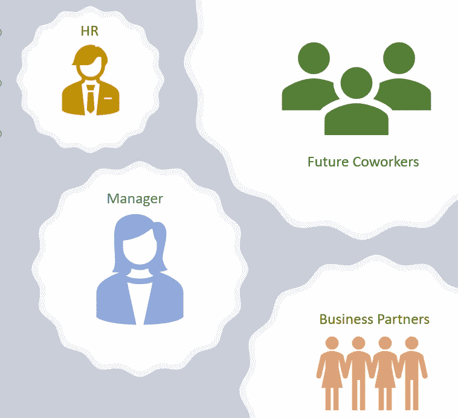
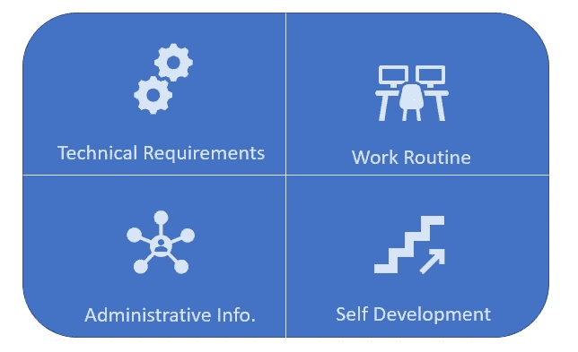

# 如何面试正在面试你数据工作的公司

> 原文：<https://towardsdatascience.com/how-to-interview-the-company-that-is-interviewing-you-for-data-jobs-3b4fcce77c03>

## 利用面试最后 5 分钟的指导方针

照片由[西格蒙德](https://unsplash.com/@sigmund?utm_source=medium&utm_medium=referral)在 [Unsplash](https://unsplash.com?utm_source=medium&utm_medium=referral) 拍摄

# **1。背景——面试不是单向的选择**

开始一份新工作既令人兴奋又让人害怕。在我之前的博客里，我讲过一个 [**4 步法在面试中谈你的项目**](/how-to-talk-about-your-projects-in-a-data-science-job-interview-a14ebdda5a1e#:~:text=The%20goal%20of%20Step%201,to%20describe%20your%20main%20goal.) **。对于许多寻找新角色的人来说，开始新角色就像买了一个“神秘盒子”——在你打开盒子之前，你不知道里面是什么。尤其是对于像数据科学家、数据工程和数据分析师这样的数据工作来说，“典型的工作日”可能会有很大的不同——对于同一行业甚至同一公司的角色来说。即使你有相同的头衔，你使用的工具，需要的技能，以及项目使用的数据种类也因团队而异。因此，了解你需要什么和你的工作是至关重要的。**

我怀疑没有人会喜欢惊讶地发现新工作与他们想象的相去甚远，尤其是以一种不受欢迎的方式。许多人努力准备在面试中展示自己最好的一面，以给公司留下深刻印象，但许多经验不足的候选人通常会忽略一点:评估和面试公司，而不仅仅是让公司评估你。

# 2.什么时候？

现在我们知道我们想在面试中更多地了解这个职位，下一个问题是我们什么时候可以对公司进行面试？通常，在面试中，最后 5-10 分钟是被面试者向面试官提问的时间。很高兴能得到我们需要的关于新工作的答案。如果你认为这个时间不够或者没有机会完成这一步，我建议你提出来，要求一些时间来完成你的采访部分。

# 3.谁啊。

大多数人可能认为未来的经理是提问的最佳人选，但我不建议你在考虑面试人员时有这样的限制。每个人都有自己的角色和观点，但每个人都可能因为自己的立场而有所偏颇。因此，你应该学会根据受访者的角色问什么问题。在讨论什么是好问题之前，我们先来了解一下面试官的角色是如何决定你的问题内容的:

作者图片

## 人力资源（部）

人力资源筛选通常是大多数数据工作的第一次面试。对话通常是关于一些一般性的问题，比如你目前的工作状况、签证状况、换工作的动机、面试过程等等。我建议你问更多关于面试过程的细节问题，而不是公司文化。我不是说你不应该“面试”人力资源，我的意思是问人力资源关于公司文化不如弄清楚你会有什么样的面试以及如何准备面试，因为在对话中与人力资源的时间有限。

## 未来经理

没有好经理的支持，很难有成功的职业生涯。然而，在一些面试中(新毕业生或普通员工),你可能没有机会和你未来的经理交谈——事实是，在这次面试中，你可能不知道谁会是你的经理。

对于直接招聘过程，经理可能是决定你的报价的最重要的人。他/她是最能帮助你在新角色中成长的人。所以，在面试中，他/她是一个很好的资源来了解团队的大范围，以及对你工作的期望。你需要确保你能接受他的管理风格，以便将来共事。

## 未来的同事

同一个团队的同事可能是你在工作中互动最多的人。他们通常已经在团队中呆了一段时间，熟悉团队的运作方式，以及你的新角色的日常生活。你想从他们那里了解的是球队的氛围和文化。

## 未来的商业伙伴

他们通常会在“小组面试”阶段与你交谈。他们的角色可能是您的 LOB 合作伙伴(业务线)、内部客户、产品经理、项目经理等。他们的工作会受到你的影响，但他们不一定和你在同一个团队，也不一定了解 data/ML。因为他们依靠你的工作来完成他们的工作，他们会对你的表现有所期待。

## 其他面试官

在你的新工作中，你很少或永远不会再与面试官共事，这种情况并不少见。这些人可以是你团队之外的其他员工、另一个姐妹团队的经理或部门主管。虽然你们两个都知道你们以后不会有太多的互动，但我仍然认为它们是了解这个部门或公司本身的很好的资源。

总之，我鼓励你向每一个面试你的人提出有价值的问题，无论是你未来的老板、同事、商业伙伴，还是另一个团队中永远不会在新工作中与你共事的人。

# 4.怎么会？

接下来要讨论的重要事情是什么问题好问。虽然每个人在工作中可能会有不同的衡量标准，但我建议从以下几个方面来评估这份工作:

作者图片

## 4.1 技术要求

如上所述，根据角色的不同，实际工作可能会有很大的不同。如果面试官在面试中没有提到这些问题，你可能会问这些问题:

*   这个角色最大的挑战是什么？

***问谁？***
询问未来的经理和同事，因为他们可能会提供不同的观点。你也可以问问未来的商业伙伴。
***问这个问题我们想学什么？对于经理来说，这个答案表明了他/她对你工作的期望——他/她需要员工好好处理的领域。对于未来的同事，他们的回答代表了这份工作的潜在痛点，从中你可以预测什么可能会让你生气。例如，如果他们的答案是“为 ML 模型获取干净的数据”。那么你知道伟大的数据清理技能对于这份工作是必要的。***

如果这份工作需要你和商业伙伴密切合作，你可以问他们这个问题。与经理类似，他们会对经常合作的人设定期望。

*   **常用的工具有哪些？更具体地说，是什么编程语言(例如 Python R，SAS)。他们使用什么云服务(例如 Google cloud 或 AWS)？什么样的数据库/数据湖(如雪花、Qubole)？**

***问谁？***
未来的同事。如果你不能从未来的同事那里得到答案，你也可以问未来的经理。
***我们通过问这些问题想了解什么？职位描述通常会列出理想候选人的技能。但有时描述要么太笼统，要么列出 100 项技能。确认所需的技能永远不会有坏处，而且知道你目前的技能组合是否能满足这些技能也很关键。此外，问这个问题可以帮助你找出缺少什么，这样你就可以在新工作的第一天开始改进。***

## 4.2 工作程序

你想确定你会喜欢新工作的工作节奏，这样你就会对日常生活有所了解。以下是一些可以问的好问题:

*   **这部作品中有多少与人的互动？**

***问谁？***
未来的经理、同事和商业伙伴。
***我们问这个问题是想了解什么？***
数据工作需要与他人频繁互动。有些角色可能需要与客户、商业伙伴和同事等不同的人进行多次会面，因此您只有有限的时间来专注于开发 ML 模型或数据产品。在某些角色中，您可能会与来自不同背景的技术人员合作(例如，数据科学家与数据工程师一起工作)，其他角色需要与非技术人员一起工作，以提供业务见解或数据产品。也有可能你独自工作，只向你的经理汇报。问这个问题可以帮助你了解你每天/每周的例行工作，看看你是否喜欢这种工作方式。当面试官是你未来的同事时，你也可以问一个相关的问题，比如“典型的一天是什么样的？”

*   **那里的工作生活平衡如何？**

***问谁？***
未来的同事和其他不在你团队中的员工。
***我们问这个问题是想了解什么？***
不管你是喜欢保持忙碌，还是想要一些时间享受生活，你都应该经常问这个问题。这是一个比问“下班后我们多久需要工作一次”更好的问题。

## 4.3 行政信息

许多人忽略了它，但它很重要。世界每天都在变化。即使你是团队中最好的员工，也不要期望永远呆在原地。公司重组、领导层变动、政策调整……这些都会对员工个人产生巨大影响。保持警惕，做好准备，甚至在踏进公司之前。

*   团队结构是什么样的？

***问谁？***
未来的经理和同事。
***我们问这个问题是想了解什么？***
这个团队是新成立的吗，你会是那里的第一个数据科学家吗？这个团队的扩大是因为更多的资金随着许多激动人心的新项目而来吗？还是团队在招人，因为最近有几个人走了？是的，团队的结构很重要，你可以想象在一个新的团队和一个成熟的团队中工作是非常不同的。

你可能还想了解这个团队中的其他人。例如，对于一个中级数据科学家角色，我建议你询问团队中是否有其他 d。有为数据模型做管道工作的数据工程师吗？是每个人都有技术背景的数据科学团队，还是你将是团队中唯一支持所有其他非技术人员的 DS？

为什么会有这些问题？我认为它们与你的职业目标高度相关。当我还是一名初级员工时，我想在一个有高级 DS 的团队中工作，我可以向他们学习。我想在一个成熟的团队中工作，那里的人有经验，知道做事的最佳方式。每个人都有不同的职业目标，所以要确保新工作能适合你的需求。

*   **团队坐在公司的什么位置？**

***问谁？***
未来的经理，可能是同事和商业伙伴。
***问这个问题我们想学什么？***
我们问这个问题是想看看这个团队是一个**“成本中心”还是一个**“利润中心”。成本中心，也称为收入中心，是公司内部的一个小组或部门，其职能有助于业务运营，但不直接产生收入。利润中心是公司中直接产生收入和利润的部门。

与数据相关的角色可以位于成本中心或收入中心。一些公司依靠 ML 或其他数据产品以各种方式产生利润，因此创造这些产品的团队是这些公司的核心。此外，一些公司建立他们的人工智能或人工智能部门来支持他们的核心业务。换句话说，这些公司用传统的方式经营他们的业务，ML 是好东西，但不是必需的。我并不是不鼓励你在成本中心工作，但我认为如果你想减少因一些不可预测的情况而被解雇的可能性，在成本中心工作的风险要比在利润中心高。

## 4.4 自我发展

*   公司提供了哪些增长机会？

***问谁？***
未来的经理和同事。
***我们问这个问题是想了解什么？我认为在评估这份工作时，了解未来的发展机会是很重要的。工作不仅仅是用工作来换取金钱；这也是为了积累经验和成长。尤其是因为数据工作需要终生学习，30 年后我们不太可能在工作中使用同样的工具和技术。我建议你问问团队或公司是否提供在线学习平台，如 LinkedIn learning 或 DataCamp，以及他们是否鼓励员工参加研讨会和会议。如果你打算获得另一个学位，你也可以问问他们是否有学费资助。***

# 5.请尽量避免问这些问题

*   **关于金钱和利益的问题。**

无论你多么急切地想知道薪水，不要在面试中讨论，尤其是和未来的经理。你可以在人力资源筛选时讨论这个问题，也可以在得到工作机会后再和经理讨论。

*   我在面试中搞砸了吗？

我明白当你认为自己没有展现出最好的一面时，你可能会感觉很糟糕，但尽量不要在面试的最后 5 分钟问这个问题。面试官有他们的判断，你可能认为你搞砸了，但也许你比其他候选人做得更好。或者面试官问你一些具有挑战性的问题来测试你如何应对高压。**不要表现出你对得到这份工作没有信心，永远不要！**

# 总结——也是关于你的！

对大多数人来说，找到你的下一份理想工作从来都不是小菜一碟。请记住，工作是一个双向选择，不仅仅是公司找到它需要的东西，还包括**找到一个你乐意工作、学习、成长和成为更好的自己的地方**！

感谢您的阅读，我希望这篇博客对您的数据求职有所帮助， [**这里还有一篇关于数据面试的博客，您可能会对**](/how-to-talk-about-your-projects-in-a-data-science-job-interview-a14ebdda5a1e) **感兴趣。我希望你能得到一个好的报价。祝你好运！**

## 💖喜欢这个故事吗？请随时[订阅 DS 和 ML 粉丝的邮件列表](https://mingjie-zhao.medium.com/subscribe)，并[成为媒介会员](https://medium.com/@mingjie-zhao/membership)！🤩

## 这篇博客最初发表在我的个人网站上。

参考
【1】[https://www . indeed . com/career-advice/career-development/profit-center-vs-cost-center](https://www.indeed.com/career-advice/career-development/profit-center-vs-cost-center)