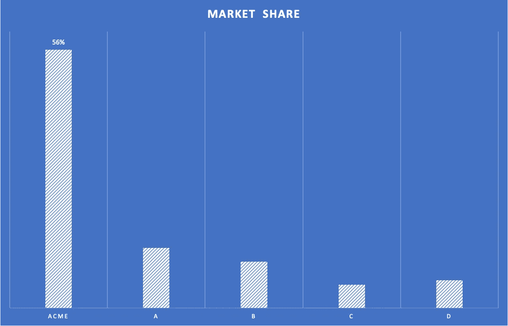
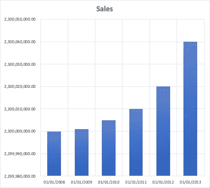
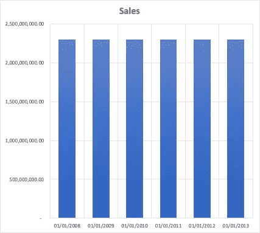
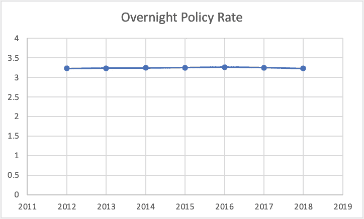
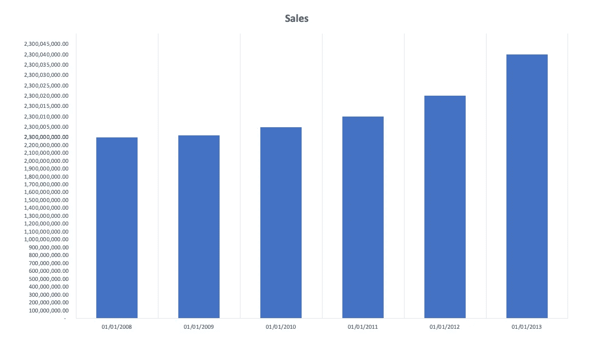
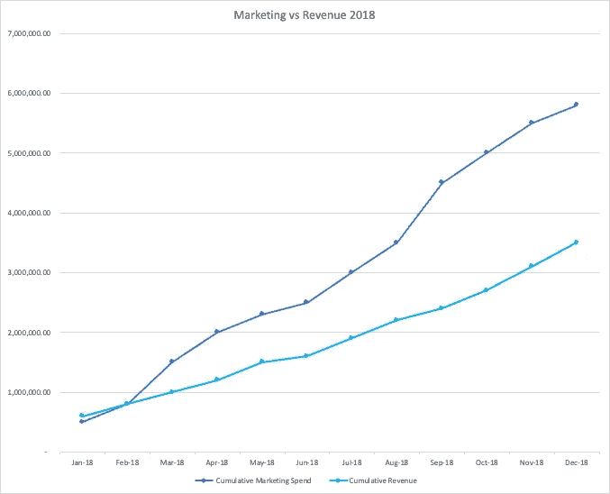
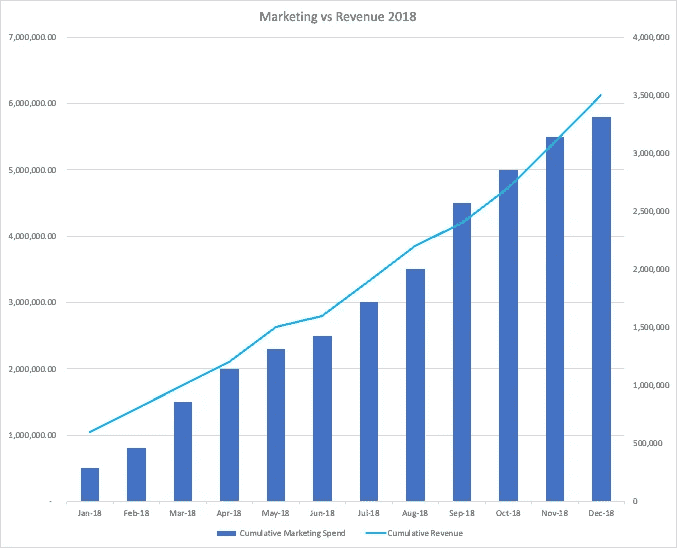
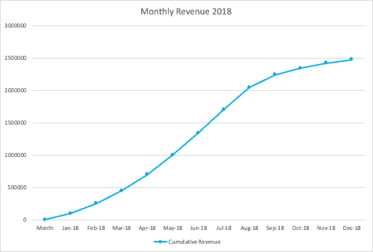

# 发现数据失真

> 原文：<https://towardsdatascience.com/how-to-lie-with-data-c58df403bdce>

艾萨克·史密斯在 [Unsplash](https://unsplash.com?utm_source=medium&utm_medium=referral) 上拍摄的照片

## 批判性评估图表和数字的演练

# 介绍

数据分析团队的目标是帮助他们的组织基于数据和见解做出业务决策。

经过几个月的艰苦工作，通过稳健设计的数据管道收集了跨多个部门的组织数据，然后小心翼翼地将它们存储在精心设计的数据库中，您的数据分析师现在终于可以分析它们了，希望发现的任何见解都可以促使管理层做出一些突破性的决策，并帮助组织实现其业务目标。

反正就是这个愿景。

然而，我们(数据分析师)想要传达的和他们(观众)最终得到的是两回事。

有时，这种错位可能是有意的。但更多的时候，它们是偶然的。

这篇文章旨在成为一系列文章中的第一篇，这些文章强调了一个人在展示数据时可能“误导”他人的方式(无论是无意的还是其他的)，以及受众在解释数据时可以做得更好的方式(通过意识到这是如何做到的)。

这背后的大部分灵感来自丹尼尔·J·莱维汀的作品，他的书《谎言实地指南》[1]中，作者通过大量的数据误报案例以及如何做到这一点。这本书，以及我在研究这个主题时发现的许多其他后续资源，构成了本文和后续文章中将要分享的内容的基础。

现在，我们将把重点放在人们可以摆弄图表的最明显的方式上——它的轴。

# 玩斧子

我想不言而喻，当一个人拿到图表时，他首先应该看的是坐标轴和图例。

> 轴**为用户将数据点与值**相关联提供了重要的参考信息，尤其是当数据点没有在图表中直接标记时。— [4]

在这一节中，我们将探讨一些技术，这些技术可以用来误导他人如何通过摆弄轴来解释数据。

## **1。未标记图表/坐标轴**

如前所述，如果没有任何标签或轴，读者将很难联想或比较呈现的图表。

为了开始我们对数据虚假陈述的研究，考虑下面一个假设的公司— ACME 的例子:

ACME 的市场份额(图片由作者提供)

在上图中，我们可以看到，与市场上的其他公司相比，ACME 拥有 56%的最大市场份额。

但是差别到底有多大呢？

标签的缺失——在本例中是 Y 轴——使得读者无法理解 ACME 相对于其竞争对手的优势有多大。

## 2.截断轴

如前所述，Y 轴通常用来显示事物在 X 轴上变化的幅度(通常是时间，或者一些类别)。

然而，为了额外强调 Y 轴上的增加或减少(例如，目的可能是强调在某人的领导下事情有了多大的改善)，可以选择通过截断 Y 轴来改变它们(即。通过移除一部分 Y 值直到与我们相关的点)。

考虑下面的图表。

两张图表都显示了不同时间段的销售数字。然而，左边的更讨人喜欢。(图片由作者提供)

这两个图表都是使用相同的数据集创建的，其中绘制了一家公司在 2008 年至 2013 年期间的销售数据。

然而，左边的这个看起来更讨人喜欢——因为随着时间的推移，它显示出一条漂亮的上升曲线。与此同时，右边的图表显示，随着时间的推移，没有发生太大的变化——基本上没有任何进展。

怎么会这样呢？

不同之处在于 Y 轴的设置方式。放大的那个(通过截断 Y 轴)放大了 2.299B 到 2.300B 之间的值，因此从一个不经意的观察者的角度来看，随着时间的推移，改进似乎是显著的。

右边的图表从 0 开始，到 2.5 亿结束，因为对于这种规模的企业(即数十亿)——以每年 10，000 件的增量进行销售可能是我们不想宣扬的事情。然而——这是实际上需要发送给管理层的信息。

那么我们需要总是确保我们看到的任何图表的 Y 轴都固定在 0 吗？

在[7]中，塞思·朗认为这要视情况而定。根据具体情况，微小的差异实际上可能会产生重大影响，并且可能需要数据分析师在 Y 轴上放大，以便向受众清楚地表明，随着时间的推移，情况确实发生了变化。

考虑下面的例子，我们有两个图表描述了一个虚构国家的隔夜政策利率(OPR)。左边的是 Y 轴被截断，而右边的是 Y 轴从 0 开始。

一个虚构国家的隔夜政策利率。左边的图表截断了 Y 轴。右边的图表有一个完整的 Y 轴。(图片由作者提供)

在这种情况下，利率值的微小差异可能会转化为每月贷款/融资付款的巨大差异，我们可以清楚地看到左侧的图表更受欢迎，因为它清晰地展示了利率随时间的差异(与右侧相反)。

## 3.轴中数据的不连续性

在我们之前的例子中，我们展示了我们可以通过有选择地放大销售数字的 Y 轴来误导观众，以强调我们试图强调的价值。

通过使用不连续的 Y 轴，对销售收入进行另一种尝试。(图片由作者提供)

现在，让我们使用前面示例中的相同销售数据。从前面的教训中，我们知道一个更有说服力的图表应该从 Y 轴的 0 开始。

然而，我们上面的新图表没有在 Y 轴上使用相同的刻度，而是在刻度中引入了一个不连续点，在 2.3B 标记开始的每个刻度处使用 5000，而不是在每个刻度处表示 100 米。

通过这样做，我们现在能够(向不经意的观察者)证明我们的销售数字随着时间呈指数增长。

真是厚颜无耻。

## 4.双 Y 轴

双 Y 轴本质上是一种在同一图表上绘制两组观察值的绘图技术。这种技术的危险在于，如果分析师为了证明一个观点而调整轴线(或者让它完全消失)，它可能会误导观众。

让我们考虑一个例子。现在是 2017 年，假设我们需要根据即将到来的 2018 年业务计划的预测销售收入来证明我们的营销费用。

(左):营销支出似乎高于收入。(右图):收入似乎高于营销支出。(图片由作者提供)

在上面的图表中，我们现有的困境描绘在左边；我们的预计营销支出远远高于我们的预计收入。当描绘在同一个 Y 轴上时，可以立即看出差异。事情看起来对我们不太有利。

在右图中，我们引入了另一个 Y 轴来表示我们的收入数字。这样，我们的收入数字终于出现在我们的营销支出之上。我们的商业计划现在“看起来”比以前更加坚实。

一个更极端的、真实的例子，关于人们如何试图逃避玩双 Y 轴可以参考[8]，其中代表 Jason Chaffetz 试图指出，计划生育(一个非政府组织)在 7 年期间增加了堕胎数量，减少了癌症筛查和预防服务。最初的图表似乎支持他的观点，如果不是因为数字线本身不应该交叉，如果绘制在相同的 Y 轴上的话。

不过，返回到双 Y 轴——在构建图表时，这种技术本身并不令人不快(在某些情况下，它确实有它的用途)。然而，在应用它时，需要注意不要误导观众。

## 5.累积的

现在是 2018 年底(在我们的假设故事中)，我们未能达到我们的收入目标。我们的经理完全无视我们的收入数字，安排了一次市场简报会，我们将在会上向市场分析师和投资者简要介绍公司今年的表现。

让我们试着深入挖掘我们的月销售收入。

我公司 2018 年月度营收。(图片由作者提供)

以上表明，我们在 2018 年上半年一直做得相对较好，但自 2018 年 8 月以来走下坡路。对我们产品的需求急剧下降，而且没有回升的迹象，这肯定会吓坏市场、投资者和我们未来的客户。

我们如何描绘一幅更积极的画面，并改变叙事？

输入累积图。

月收入累积图。(图片由作者提供)

虽然上图仍然显示收入增长率在下降，但对于普通观众来说，我们的销售收入确实在增加。总而言之，积极的一面！

事实上，这种方法正是苹果公司[2]在 2013 年的演示中使用过的。在那次演讲中，蒂姆·库克展示了一段时间内 iPhone 的累计销量——从一个不经意的观察者的角度来看，这似乎表明苹果一切都很顺利。然而，分析每个季度的数据显示了一个不同的故事，iPhone 的销售在过去几个季度实际上一直停滞不前。

# 摘要

在本文中，我们通过几个例子说明了如何通过摆弄图表的坐标轴来歪曲数据。

我们涵盖了:

1.  未标记图表/坐标轴
2.  截断轴
3.  轴中数据的不连续性
4.  双 Y 轴
5.  累积的

有些技术非常明显，很容易被发现。其他的(如双 Y 轴)对于未受过训练的人和不习惯定期阅读图表的人来说可能需要一段时间才能理解。

这篇文章背后的想法，如果还不明显的话，就是不鼓励数据失实。更确切地说，写这篇文章是希望我们能更好地了解数据和图表是如何适应演讲者的叙述的。

请记住，误传往往是偶然的。虽然有时，他们可能是故意的。

理解了这一点，我们就能更好地解读任何对我们有利的图表。希望我们现在能更好地质疑我们在图表中看到的东西，而不是图表中实际显示的东西。

# 参考

[1][https://www . Amazon . com/Field-Guide-Lies-Critical-Information/DP/1524702528](https://www.amazon.com/Field-Guide-Lies-Critical-Information/dp/1524702528)

[2][https://www . tech junkie . com/Tim-cook-trying-prove-needness-chart/](https://www.techjunkie.com/tim-cook-trying-prove-meaningless-chart/)

[3][https://www . calling bullshit . org/tools/tools _ missinging _ axes . html](https://www.callingbullshit.org/tools/tools_misleading_axes.html)

[4][https://xd gov . github . io/data-design-standards/components/axes](https://xdgov.github.io/data-design-standards/components/axes)

[5][https://www . statistics show to . com/probability-and-statistics/descriptive-statistics/missinging-graphs/](https://www.statisticshowto.com/probability-and-statistics/descriptive-statistics/misleading-graphs/)

[6]https://www.heap.io/blog/how-to-lie-with-data-visualization

[7][https://technaverbascripta . WordPress . com/2014/04/16/lie-with-data-visualizations-is-it-missing-to-truncate-the-y-axis/](https://technaverbascripta.wordpress.com/2014/04/16/lying-with-data-visualizations-is-it-misleading-to-truncate-the-y-axis/)

[8][https://www . vox . com/2015/9/29/9417845/planned-parenthood-terrible-chart](https://www.vox.com/2015/9/29/9417845/planned-parenthood-terrible-chart)