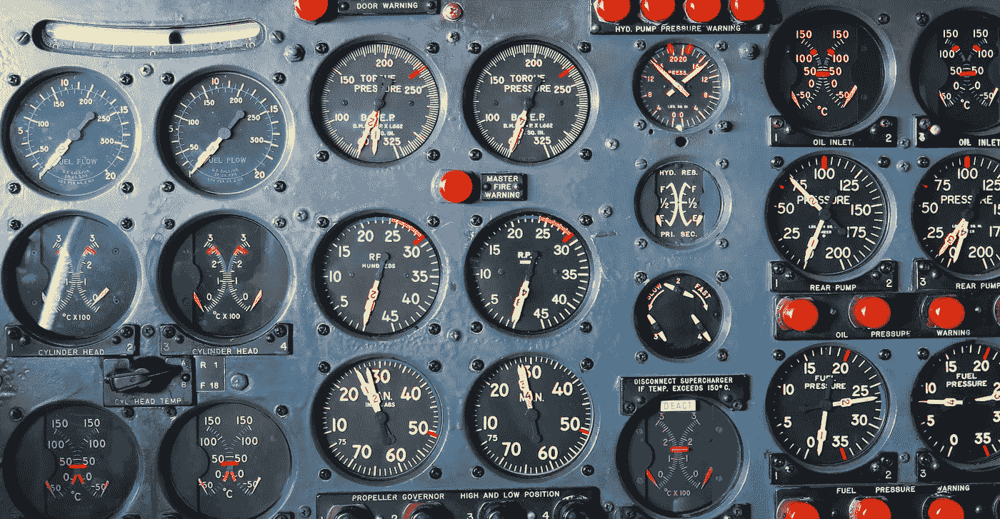
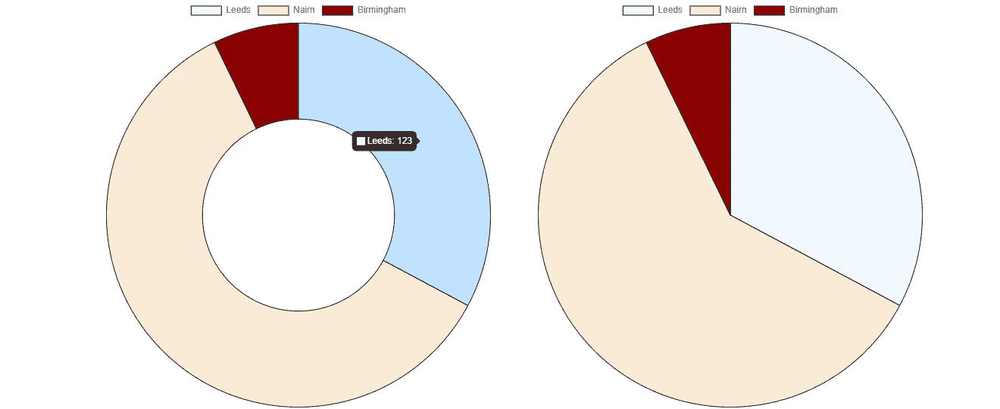

# 如何在几分钟内制作一个免费的、无服务器的交互式仪表板

> 原文：<https://towardsdatascience.com/how-to-make-a-free-serverless-interactive-dashboard-in-minutes-e6ce5a1088e0>

## 我向你保证，你可以像制作相同口径的标准图像一样快地制作这个仪表盘。这将比你的 Matplotlib 或 ggplot 图更好看。



[阿里·乌本](https://unsplash.com/@condorito1953?utm_source=unsplash&utm_medium=referral&utm_content=creditCopyText)在 [Unsplash](https://unsplash.com/s/photos/dashboard?utm_source=unsplash&utm_medium=referral&utm_content=creditCopyText) 上拍摄的照片

与其给同事发送可视化效果，为什么不发送仪表板呢？想给你的老板留下深刻印象，请他或她在浏览器中打开其中一个。

我知道你在想什么，这听起来像是要付出更多的努力——其实不然。

你甚至可以像发送图片一样，用一个简单的文件发送它。

我将在这里向您展示一个非常简单的方法，甚至给您一个将来使用的模板。你可以在几分钟内做出一个来。

最棒的是，打开它只需要一个网络浏览器。幸运的是，每个人都有一个。

# 那么我们要怎么做呢？

我们将在一个 HTML 文件中完成这一切。是的，HTML。HTML，借助于 [chart.js](https://www.chartjs.org/) ，一个极其用户友好的图表框架。

当然，我们也会用到一些 JavaScript，但是如果你不知道 JavaScript，不用担心，我会给你提供模板，你会做得很好的。

您几乎不需要自己编写 JavaScript 代码。我们将使用 chart.js cdn 将所有内容保存在一个文件中，对任何其他用户都没有要求。

我也将向你展示如何毫不费力地设计它。

# 我们要创造什么？

我们将创建一个仪表板—一组交互式图表和可视化。我们希望这一切都在一个地方，我们希望它很容易被任何人看到和理解。因此，它必须是用户友好的和交互式的。

这正是我们要创造的。


仪表板 GIF —由作者创建的仪表板和 GIF。

如您所见，这里有条形图、圆环图、饼图和折线图的示例。任何你能想到的情节，我们都可以很容易地添加进去。图类型的完整列表可在此处找到[。](http://chartjs.org)仪表盘是完全交互式的，可以在所有主流浏览器中打开。

如果您使用 bootstrap，它也可以完美地扩展到移动设备，我也将向您展示这一点。


由作者创作。

# 一个简单的热身例子

我将从一个极其简单的例子开始。我们将从只有一个图形的仪表板开始，仍然是交互式的，但只有一个完整的页面图形。


由作者创建。

创造这一点非常容易，这个例子可以作为你进一步观想的模板。这是代码。

由作者创建—保存此文件并在浏览器中打开它。

如你所见，它非常简单，只有两个 HTML 元素和几行 JS。让我们从头开始。第 1–5 行是你以前没见过的，标准的 HTML 文件开头，告诉计算机所需的编码和视窗设置。第 6 行很重要，是 chart.js cdn(内容交付网络)。cdn 实际上是从原始服务器分发内容的服务器网络。我喜欢把它想象成从网上导入一个包。没有这条线什么都不会起作用，所以不要忘记它。

在第 10 行，我们进入了 HTML 主体，如前所述，我们只有两个标签——一个标题和一个画布。如果你不想要，你甚至不需要标题，但有标题总是好的。所以在第 10 行，我们有一个简单的标题标签，带有一些内联样式，使其为红色并居中。简单明了。

第 11-13 行是 HTML 最重要的部分，实际上是唯一重要的部分。它只不过是一个画布标签，包装在一个 div 中。canvas 标签用于动态绘制图形，几乎总是由 JS 脚本完成。我们给 canvas 标签一个 id“my chart ”,这样我们可以在以后隔离它。这就是 HTML 的全部内容。

现在来构建图表，正如前面提到的，我们正在使用 chart.js 框架。但是首先，我们需要指定我们的数据。我做了一个非常简单的例子，在一个数组中使用了三个观察值，可以在第 15 行看到。

第 16–29 行是奇迹发生的地方。这是几乎所有 chart.js 图表的样子。我们在第 16 行使用 getElementById 方法将我们的图形附加到我们已经创建的 canvas 标记上，下面几行创建了绘图。首先我们必须指定我们想要使用哪种类型的图表— [这里是](https://www.chartjs.org/docs/latest/charts/line.html)所有的例子。显然，这仅限于您输入的数据类型。然后我们输入标签和数据。我已经创建了数据，所以我可以引用这个变量，或者我可以在里面指定数组，就像我对颜色所做的那样。如果颜色数组的长度与数据数组的长度不匹配，它将继续从头开始循环。我把 options 选项留为空，但是在里面只是向您展示如何合并它，您可以在那里指定诸如响应之类的东西。全部选项都在[这里。](https://www.chartjs.org/docs/latest/general/options.html)

仅此而已。真的就这么简单。你可以复制这个文件，改变数据和标签，你就有了我们自己的交互式可视化，你可以把它发送给任何你想要的人。它非常容易操作，要制作一个饼图，只需将“线”改为“饼”。在浏览器中打开 HTML 文件，任何人都可以随意摆弄你的图形。请注意，它不会加载到 outlook 预览中，它必须在浏览器中。这里是[文件。](https://gist.github.com/jasher4994/559b0d68cca0a100f019100141943cb8)

虽然我不认为这是一个仪表板，但是我们需要更多的图表。让我告诉你怎么做。

# 完整的仪表板

基本上，我在这里做的是完全相同的，但只是多了几个图，多了一点风格，并引导图表对齐我们想要的位置。让我们直接进入代码。它看起来远不止如此，它实际上是一个简单的例子，用一些引导包复制并粘贴了四次。

由作者创建—看起来比实际复杂。基本上就是第一个例子复制了 4 次。

第一部分和以前一样，除了我们增加了第 7 行和第 8 行，第 7 行是我为一些额外的样式选择的 google 字体，第 8 行是 bootstrap 样式表，它将帮助我们稍后轻松地设计和定位我们的项目。

正文标签的开头也几乎相同，除了我们在副标题中添加了一个 H3 标签。我还为它们添加了一些额外的样式，让它们看起来更漂亮——使用我之前导入的谷歌[字体](https://fonts.google.com/specimen/Rowdies)。

第 19 到 32 行是 bootstrap 发挥作用地方。在这里，我们希望一些元素并排，即我们的饼图和圆环图。我意识到他们对这些数据做了完全相同的事情，但我只是用它们来说明如何水平而不是垂直堆叠图。



由作者创建。

我不打算详细介绍 Bootstrap 的[网格](https://getbootstrap.com/docs/4.0/layout/grid/)系统是如何工作的，尽管拿 5 来读读吧——这是网络定位的一个新发现。用 Bootstrap 自己的话说:“Bootstrap 的网格系统使用一系列容器、行和列来布局和对齐内容。它采用 [flexbox](https://developer.mozilla.org/en-US/docs/Web/CSS/CSS_Flexible_Box_Layout/Using_CSS_flexible_boxes) 制造，反应灵敏。屏幕被有效地分成 12 个垂直列，你可以在特定的屏幕尺寸上为每个对象分配一些列。

因此，在我们的容器元素中，我们有一个包含两个元素的行，这两个元素在中等大小的屏幕上被分配了 12 列中的 6 列。这些元素和以前一样是画布标签。

所以我们有一个图表，在一排两个图表之上，在一个单独的图表之上。

其余代码与简单示例完全相同，只是复制和粘贴。在我们的简单示例中，我们可以复制并粘贴图表，更改它们的类型和 ID，将它们封装在一些引导程序中，这样我们就有了一个仪表板。*简单。*

你可以把仪表板做得简单或复杂，可能性是无限的。随意复制[代码](https://gist.github.com/jasher4994/d141153b64b1d28b800f5c13fbec332c)，给你的同事留下深刻印象。

感谢阅读，我希望这能帮助你。

```
If I’ve inspired you to join medium I would be really grateful if you did it through this [link](https://jamesasher4994.medium.com/membership) — it will help to support me to write better content in the future.If you want to learn more about data science, become a certified data scientist, or land a job in data science, then checkout [365 data science](https://365datascience.pxf.io/c/3458822/791349/11148) through my [affiliate link.](https://365datascience.pxf.io/c/3458822/791349/11148)
```

这是我写的其他一些东西:

[](/how-to-easily-run-python-scripts-on-website-inputs-d5167bd4eb4b) [## 如何在网站输入上轻松运行 Python 脚本

### 这是我建立的一个网站的演示，它将动态分析文本情感

towardsdatascience.com](/how-to-easily-run-python-scripts-on-website-inputs-d5167bd4eb4b) [](/how-to-easily-show-your-matplotlib-plots-and-pandas-dataframes-dynamically-on-your-website-a9613eff7ae3) [## 如何轻松地在你的网站上动态显示你的 Matplotlib 图和 Pandas 数据框。

### 这是一种令人惊讶的简单方法，可以在线向全世界展示您的图表和数据框架，而且不到…

towardsdatascience.com](/how-to-easily-show-your-matplotlib-plots-and-pandas-dataframes-dynamically-on-your-website-a9613eff7ae3) [](/how-to-easily-automate-your-keyboard-to-do-tasks-in-python-b698e98a5c40) [## 如何轻松地自动化您的键盘来完成 Python 中的任务

### 永远告别单调的任务

towardsdatascience.com](/how-to-easily-automate-your-keyboard-to-do-tasks-in-python-b698e98a5c40)