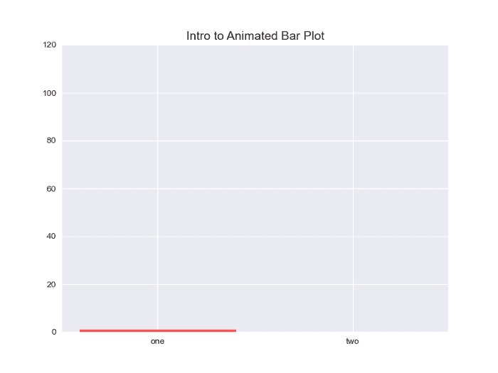
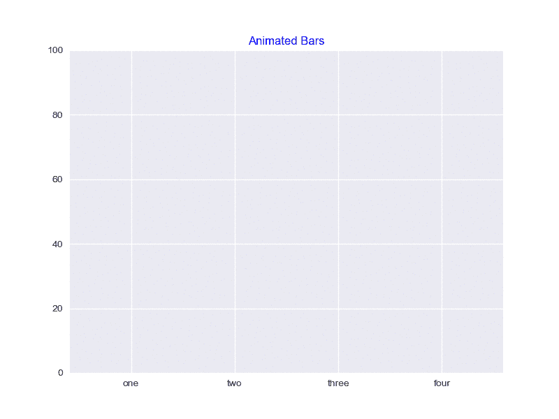
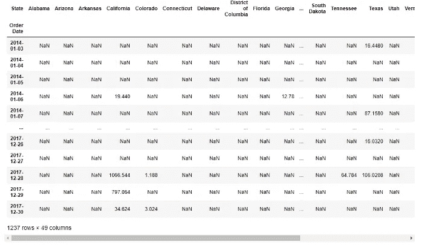
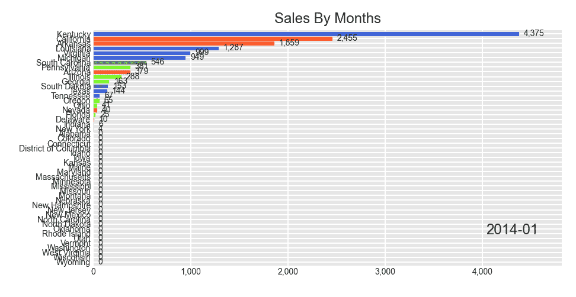
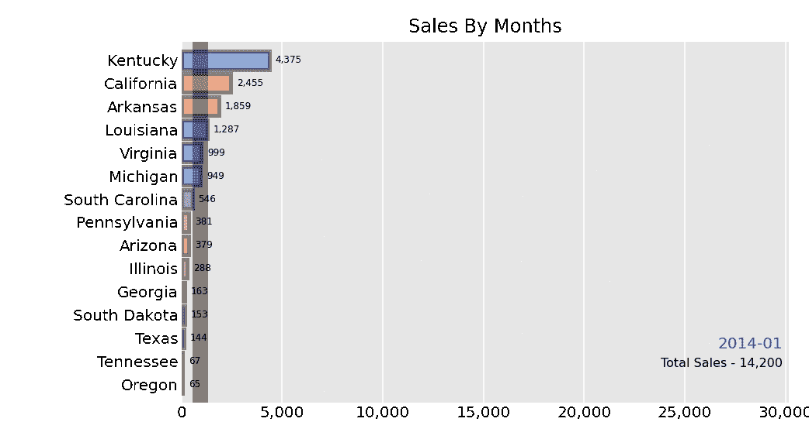
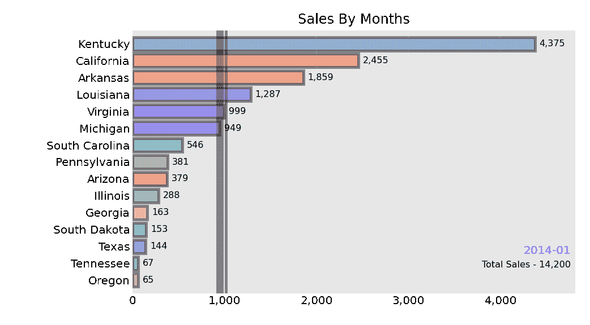

# 如何用 Python 制作动画和赛车条形图

> 原文：<https://towardsdatascience.com/how-to-make-animated-and-racing-bar-plots-in-python-c5c7c3c648f7>


在 [Unsplash](https://unsplash.com?utm_source=medium&utm_medium=referral) 上由[卡兰·史密斯](https://unsplash.com/@cullansmith?utm_source=medium&utm_medium=referral)拍摄的照片

## 完整的工作代码

条形图是非常基本和常见的。所有的绘图库都有条形图选项。这篇文章将集中在动画酒吧情节。我将分享一些动画条形图的代码。如果你以前没看过，你可能会喜欢。

我试图简单地介绍它们，以便于理解。我总是喜欢从基本情节开始。在这里，我从受[这一页](https://holypython.com/python-visualization-tutorial/creating-bar-chart-animations/)启发的两个情节开始。

我不得不使用下面的命令在我的 anaconda 环境中安装“ImageMagick ”,因为我想保存这些图并上传到这里。你可能想保存你的动画情节，以便上传或在其他地方展示。

```
conda install -c conda-forge imagemagick
```

这些是一些必要的进口:

```
import pandas as pd
import numpy as np
from matplotlib import pyplot as plt
import seaborn as sns
from matplotlib.animation import FuncAnimation
```

这是一个基本的动画条形图的完整代码。我将在代码和可视化部分之后解释代码:

```
%matplotlib qt
fig = plt.figure(figsize=(8,6))
axes = fig.add_subplot(1,1,1)
axes.set_ylim(0, 120)
plt.style.use("seaborn")lst1=[1, 2, 3, 4, 5, 6, 7, 8, 9, 10, 11, 12, 13, 14, 15 ]
lst2=[0, 5, 10, 15, 20, 25, 30, 35, 40, 50, 60, 70, 80, 90, 100]def animate(i):
    y1=lst1[i]
    y2=lst2[i]

    plt.bar(["one", "two"], [y1,y2], color = ["red", "blue"])

plt.title("Intro to Animated Bar Plot", fontsize = 14)
anim = FuncAnimation(fig, animate, frames = len(lst1)-1)
anim.save("bar1.gif", writer="imagemagick")
```



作者图片

现在让我们看看代码是如何工作的。首先，我为两个条形创建了两个列表。

这里的 animate 函数获取两个列表的元素，并使用两个列表 y1 和 y2 创建两个名为“one”和“two”的条形。

FuncAnimation 函数实际上创建了动画。它采用动画函数和数据长度。

为了保存该图，我们需要为该图提供一个名称。这里我用了一个很普通的名字，‘bar 1 . gif’。它使用我们一开始安装的“imagemagick”来编写情节。

这个和第一个差不多，这里有更多的小节。

```
%matplotlib qt
fig = plt.figure(figsize=(8,6))
plt.style.use("seaborn")
axes = fig.add_subplot(1,1,1)
axes.set_ylim(0, 100)l1=[i if i<20 else 20 for i in range(100)]
l2=[i if i<85 else 85 for i in range(100)]
l3=[i if i<30 else 30 for i in range(100)]
l4=[i if i<65 else 65 for i in range(100)]palette = list(reversed(sns.color_palette("seismic", 4).as_hex()))y1, y2, y3, y4 = [], [], [], []
def animate(i):
    y1=l1[i]
    y2=l2[i]
    y3=l3[i]
    y4=l4[i]

    plt.bar(["one", "two", "three", "four"], sorted([y1, y2, y3, y4]), color=palette)

plt.title("Animated Bars", color=("blue"))
anim = FuncAnimation(fig, animate, frames = len(l1)-1, interval = 1)
anim.save("bar2.gif", writer="imagemagick")
```



作者图片

注意这里我在开头包含了 axes.set_ylim。如果不设置 y 轴限制，绘图将如下所示:


作者图片

几个月前，我在社交媒体上看到了一个关于 Covid 死亡的动画条形图，并决定检查如何做到这一点。我在这里分享这个情节。

在接下来的图中，我将使用这个超市数据集。请随意从这里下载数据集:

[](https://www.kaggle.com/datasets/vivek468/superstore-dataset-final)  

***作者在页面描述中提到，仅允许将该数据集用于教育目的。***

让我们导入数据集并查看列:

```
df = pd.read_csv("Superstore.csv", encoding='cp1252')
df.columns
```

输出:

```
Index(['Row ID', 'Order ID', 'Order Date', 'Ship Date', 'Ship Mode',
       'Customer ID', 'Customer Name', 'Segment', 'Country', 'City', 'State', 'Postal Code', 'Region', 'Product ID', 'Category', 'Sub-Category', 'Product Name', 'Sales', 'Quantity', 'Discount', 'Profit'], dtype='object')
```

如你所见，数据集相当大。但是在接下来的图中，我们将只使用“订单日期”、“利润”和“州”列。

> ***地块将按每个州按月统计总销售额。***

我们需要为此进行一些数据准备。因为我们将为此使用 bar_chart_race 函数，并且该函数需要特定格式的数据用于绘图。

首先，“订单日期”列需要采用“日期时间”格式。

```
df['Order Date'] = pd.to_datetime(df['Order Date'])
```

我将使用 pivot_table 函数将每个州的销售数据作为列:

```
pv = df.pivot_table("Sales", index = "Order Date", columns = ["State"], aggfunc = np.sum)
```

以下是部分输出:



它给了我们这么多空值，因为每天的销售数据是不可用的。请注意,“订单日期”列现在是索引。

我将用零填充这些空值。此外，我按照“订单日期”对数据集进行排序

```
pv.sort_index(inplace=True, ascending=True)
pv = pv.fillna(0)
```

现在，我们用零替换了所有的空值。

正如我之前提到的，我想按月查看每个州的销售额。因此，我将省略日期部分，只保留“订单日期”中的月和年部分。

```
pv['month_year'] = pv.index.strftime('%Y-%m')
pv_month = pv.set_index("month_year")
```

稍后您将看到数据集。

如果我们想得到每月的数据，我们必须对 month_year 数据使用 group by。

```
pv_month.reset_index()
pv_monthgr = pv_month.groupby('month_year').sum()
```


作者图片

这是数据集现在的样子。我们有每个州的月度销售数据。要使用 bar_chart_race 函数，需要有这种格式的数据集。

> 我应该提醒你，渲染这些图比渲染普通的条形图要花更多的时间。当我为这个教程做这些的时候，有时会卡住。我让我的电脑休息了一会儿，然后回来重启我的内核，然后它运行得更快了。但是，总的来说需要更长的时间。

这是基本的柱状图。**我使用过滤器列颜色参数为真，这样它就不会重复酒吧的颜色。**

```
import bar_chart_race as bcr
bcr.bar_chart_race(df = pv_monthgr, filename = "by_month.gif", filter_column_colors = True, 
cmap = "prism", 
title = "Sales By Months")
```



作者图片

可以看到默认情况下是降序排列的。每个月各州的顺序都在变化。但它移动得如此之快，以至于你甚至很难看清美国的名字。在右下角，它显示月份。

在接下来的剧情中，我们会看到一些改进。period_length 参数控制速度。我用了 2500，挺高的。因此，它将显示一个月，比默认时间长很多。

有一个 n_bars 参数来指定我们希望在一帧中看到多少条。我定在 10 点。因此，我们将看到基于每月销售额的前 10 个州。“fixed_max”参数将 x 轴固定为总的最大销售额。所以它不会在每一帧都改变。

```
bcr.bar_chart_race(df=pv_monthgr,filename="bar_race3.gif", filter_column_colors=True, 
cmap='prism', 
sort = 'desc', 
n_bars = 10, 
fixed_max = True, 
period_length = 2500, 
title='Sales By Months', 
figsize=(10, 6)))
```


作者图片

在下一个情节中，我们将在情节中增加一条信息。每一帧都展示了一个月的情节。右下角会显示当月的销售总额。

为此，我添加了一个名为 summary 的函数。我还包含了一些更多的样式参数。**酒吧标签大小，酒吧风格，使其有点透明，并给出一个边界。**我们还添加了一个垂直条，显示每个月的平均销售额。每个月的平均销售额都不同。所以，垂直杆会继续移动。

```
def summary(values, ranks):
    total_sales = int(round(values.sum(), -2))
    s = f'Total Sales - {total_sales:,.0f}'
    return {'x': .99, 'y': .1, 's': s, 'ha': 'right', 'size': 8}bcr.bar_chart_race(df=pv_monthgr,
filename="bar_race4.gif", filter_column_colors=True,
                   cmap='prism', sort = 'desc', n_bars = 15,
                   fixed_max = True, steps_per_period=3, period_length = 1500,
                   bar_size = 0.8,
                   period_label={'x': .99, 'y':.15, 'ha': 'right', 'color': 'coral'},
                   bar_label_size = 6, tick_label_size = 10,
                   bar_kwargs={'alpha':0.4, 'ec': 'black', 'lw': 2.5},
                   title='Sales By Months',
                   period_summary_func=summary,
                   perpendicular_bar_func='mean',
                   figsize=(7, 5)
                  )
```



作者图片

这将是我添加另一个函数的最后一个图，该函数将添加一个自定义函数来添加条形中的第 90 个分位数。steps_per_period 等于 3 意味着需要三个步骤才能转到下一帧。如果您注意到右下角标签中的月份发生了变化，那么条形移动了三次，您可以看到它们是如何重叠并慢慢改变位置的。

```
def func(values, ranks):
    return values.quantile(0.9)bcr.bar_chart_race(df=pv_monthgr,filename="bar_race5.gif", filter_column_colors=True,
                   cmap='prism', sort = 'desc', n_bars = 15,
                   steps_per_period=3, period_length = 2000,
                   bar_size = 0.8,
                   period_label={'x': .99, 'y':.15, 'ha': 'right', 'color': 'coral'},
                   bar_label_size = 6, tick_label_size = 10,
                   bar_kwargs={'alpha':0.4, 'ec': 'black', 'lw': 2.5},
                   title='Sales By Months',
                   period_summary_func=summary,
                   perpendicular_bar_func=func,
                   figsize=(7, 5)
                  )
```



作者图片

如果你喜欢竖条而不是横条，请使用 orientation='v '。我更喜欢单杠。

要了解更多关于可用于修改图的不同参数的信息，[请访问此链接](https://github.com/dexplo/bar_chart_race)。

请随意为摘要或垂直栏尝试更多的样式选项或不同的功能。

您可能还想尝试标签和刻度的不同颜色、字体和字体大小

## 结论

尽管有些人可能会认为简单的条形图能更清楚地显示信息。我也同意这一点。但尽管如此，在收藏中有一些像这样有趣的情节还是不错的。你可以看到每个月各州的排名是如何根据销售数据变化的，以及平均销售额或第 90 个分位数是如何移动的。使用静止图无法感受到这种类型的变化。此外，如果你有一些有趣的情节，它抓住了注意力。

请随时关注我在[推特](https://twitter.com/rashida048)，和[脸书页面](https://www.facebook.com/Regenerative-149425692134498)，并查看我的 [YouTube 频道](https://www.youtube.com/channel/UCzJgOvsJJPCXWytXWuVSeXw)。

## 更多阅读

[](/30-very-useful-pandas-functions-for-everyday-data-analysis-tasks-f1eae16409af)  [](/regression-in-tensorflow-using-both-sequential-and-function-apis-314e74b537ca)  [](/20-very-commonly-used-functions-of-pyspark-rdd-90b8271c25b2)  [](https://pub.towardsai.net/an-overview-of-the-major-sql-query-clauses-and-most-commonly-used-functions-60720e2a20d7)  [](/details-of-violinplot-and-relplot-in-seaborn-30c63de23a15)  [](/what-is-a-recurrent-neural-network-and-implementation-of-simplernn-gru-and-lstm-models-in-keras-f7247e97c405) 