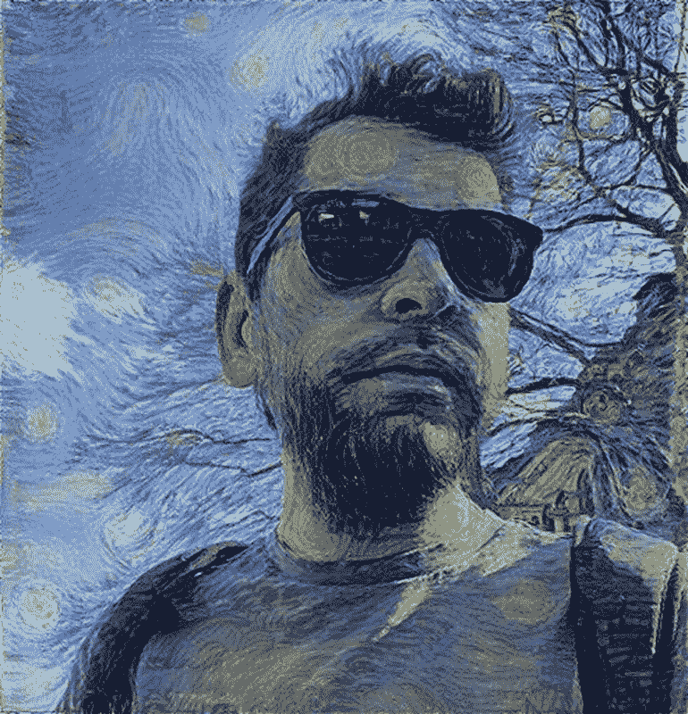
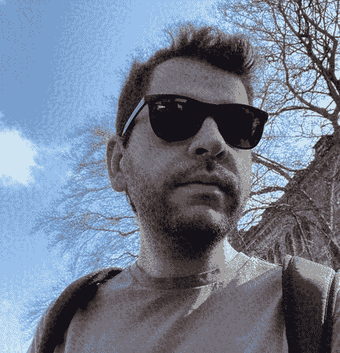
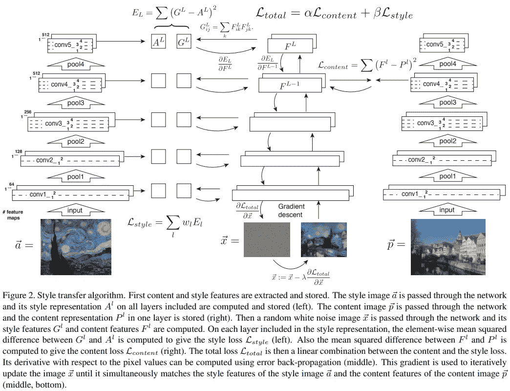
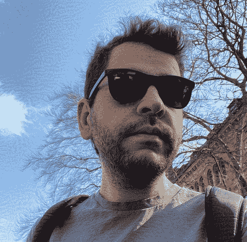
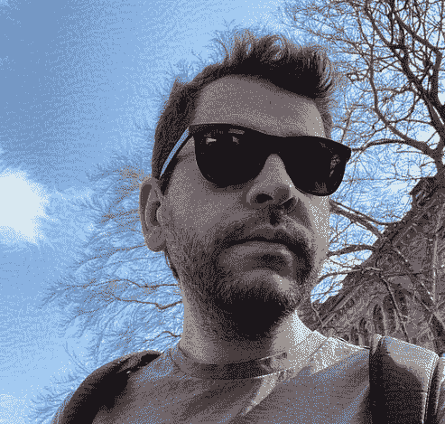

# 如何用神经风格转移制作艺术形象

> 原文：<https://towardsdatascience.com/how-to-make-artistic-images-with-neural-style-transfer-345a376d56cf>

## 用 python 实现名画风格到图像的转换

机器学习的深度学习子领域在图像处理中特别有用。卷积神经网络是深度学习的子单元之一，它通过使用卷积层为用户提供灵活的访问，卷积层呈现图像内容的几个特征。这些功能可以由开发者配置用于许多领域，例如图像分类和识别标题下的对象检测和图像分割。本文解释了神经风格转移，这是指使用预训练的模型 VGG-19 在保留图像内容的同时转移图像的风格。图 1 是用文森特·梵高的名画《星夜》和作者的一张照片创作的。

图一。作者与星夜的图像，作者的图像

# 神经类型转移

为了让主题更容易理解，提醒 CNN 一些要知道的基本事情是有好处的。卷积神经网络(CNN)，顾名思义，使用卷积过程，通过基本的数学像素运算来过滤图像。这种过滤揭示了图像的各种特征(边缘、纹理、颜色等。)，从而为模型提供了一个更有意义、更轻松的学习过程。

所构建的 CNN 架构按照它所遵循的层次来提取图像的特征，换句话说，网络是分层学习特征的。这些提取的特征还提供了关于图像细节的信息。例如，当低层去除边缘、像素和纹理时，高层学习关于图像的形状和更多技术特征。

图二。一个充满活力的足球运动员的作者的形象，由翁贝特·波丘尼绘画，作者的形象

> 《足球运动员的活力》，意大利画家翁贝特·波丘尼未来主义时期的最佳作品之一，1913 年。根据博乔尼的观点，没有必要为了在画中描绘一个人而画一个人。由于这个原因，他通过描绘演员来关注动作，因此只有他的腿是可见的。

使用上述方法将神经网络转移与以下过程混合:

## **图像:**

将导入两个图像:内容图像和样式图像。内容形象，顾名思义就是受风格形象影响的主要形象。样式图像是提供内容图像的图像。需要低层特征，因为样式图像是一个馈线。另一方面，内容图像需要网络的更高层特征来维持其属性。

## **网络:**

使用 imagenet 权重构建 VGG-19 预训练模型。原始论文的作者建议使用 VGG-19。通过尝试/构建不同的模型也可以获得独特的结果。特征地图必须提供最佳结果，因为这里研究的是提取图像的特征。VGG-19 被推荐为标准。使用该网络提取内容图像和样式图像属性。

提取更高层的特征，以便保留内容图像的主要属性。这些层可以是 conv4_2 和/或 conv5_2。当然，尝试不同的组合会产生明显不同的视觉效果。对于风格图像，通过以各种方式使用低特征，即 conv1_1、conv2_1、conv3_1、conv4_1 和 conv5_1 组合，获得各种视觉结果。

## **损失**

**:内容损失:**是指利用网络从内容图像和生成图像中提取的特征之间的相似性。

**风格损失:**风格损失表示风格损失风格图像和生成图像之间激活层相关性的相似性。这里，生成的图像和样式图像之间的相关性通过 gram 矩阵找到。

**Gram Matrix:** 相关值，表示风格图像与生成图像的相似度，是本题的关键点之一。使用卷积层提取图像的各种特征。这些特征是边缘、点、曲线、线条、纹理、颜色分布等。相关性确定这些特征之间的关系，并且更新样式损失值以在样式图像和生成的图像中保持这种关系。更具体地说，如图 1 所示，星夜表中的太阳(黄色圆圈)在生成的图像中也显示为黄色圆圈。已经确定黄色和具有 gram 矩阵的圆之间存在关系，并且已经尝试通过减少风格损失将这种关系转移到生成的图像。

**总损失:**总损失计算为如上所述获得的样式损失+内容损失。

图 3。样式传递算法，[来源](http://L. A. Gatys, A. S. Ecker, and M. Bethge, "Image Style Transfer Using Convolutional Neural Networks.")

图 3 显示了原始论文的风格转换算法(计算损失)。这篇文章可以从下面的参考文献部分获得。以下代码块包括使用 Python 中的 Tensorflow 实现神经样式转换:

# 结论

神经风格转移最令人愉快的方面是，通过超参数调整获得了各种视觉结果，而不是结果的一致性。这里获得的各种结果是通过改变

*   content_weight=1e4，
*   style_weight=1e2，
*   content _ layers =[' block 5 _ con v2 ']
*   style_layers = ['block1_conv1 '，' block2_conv1 '，' block3_conv1 '，' block4_conv1 '，' block5_conv1']

上面代码块中的超参数和结果如图 4 和图 5 所示。可以看出，以高风格损失权重开始的图像的纹理更倾向于内容图像。另一方面，图 5 所示的图像以低风格损失权重开始，趋向于风格图像，这意味着与图 4 相比，从风格图像提取的特征被更好地转移。

图 4。从高 style_weight(1.0)开始的过程，图片由作者提供

如上所述，指示生成的图像和内容&风格图像之间的相似性的损失值的初始值被改变，并且以学习速率完成具有梯度下降的训练过程。虽然图像传输的波段范围是用初始损失值设置的，但传输速度是由 learning_rate 决定的。此外，如上所述，从中提取特征的内容层和样式层也显示了图像的属性被转移了多少(哪些特征)。

图 4。从低 style_weight(1e2)开始的过程，由作者创建图像

通过用不同的值尝试这些超参数，可以使用上面的代码块直观地观察每个时期的进度。

# 参考

*   长度使用卷积神经网络的图像风格转换。
*   长度 A. Gatys，A. S. Ecker，M. Bethge，《艺术风格的神经算法》，2015。

 