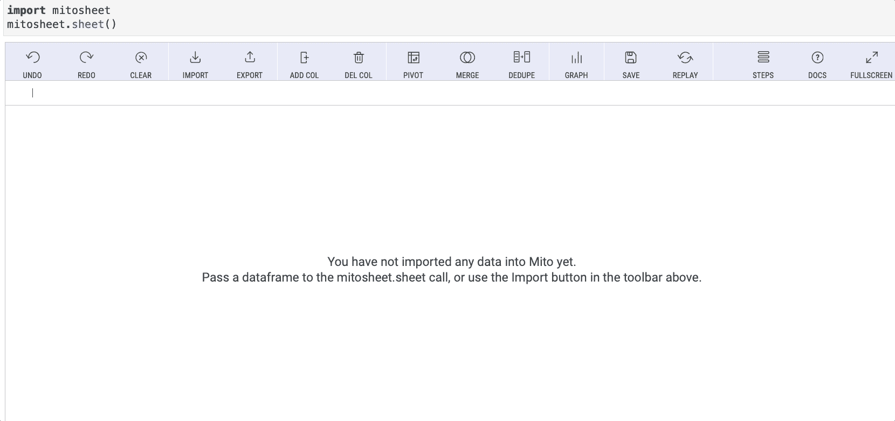
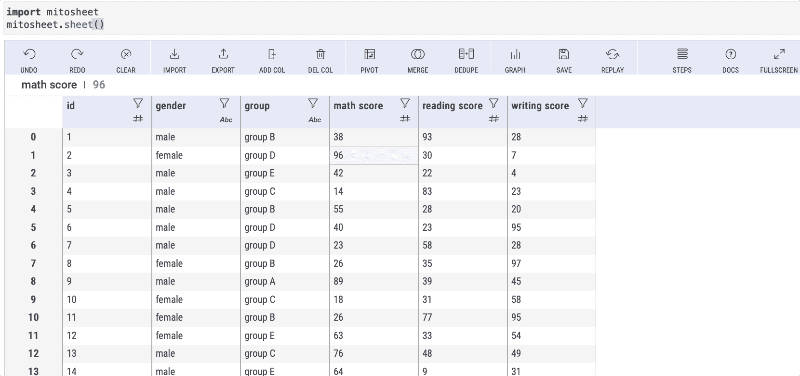
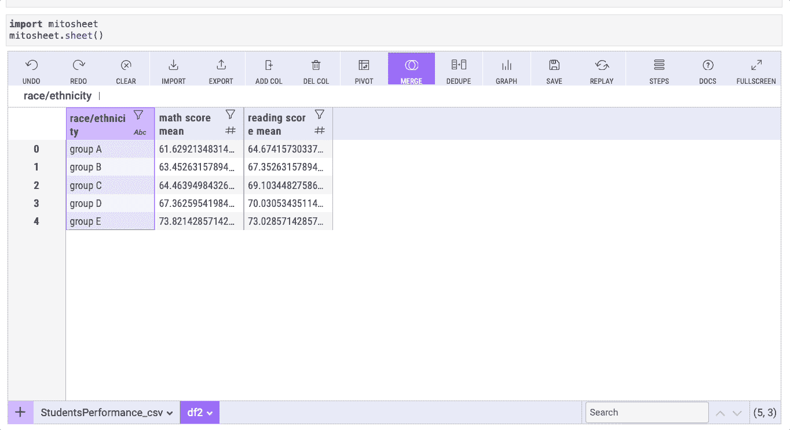
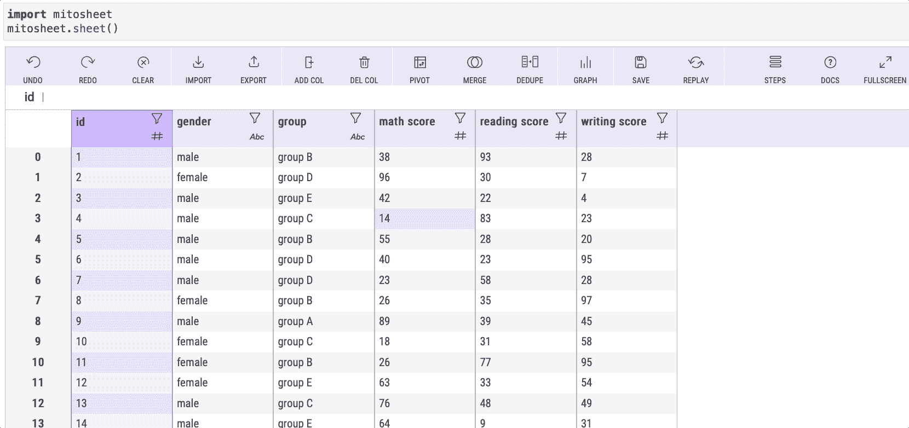

# 如何在不编码的情况下用 Python 实现基本的可视化

> 原文：<https://towardsdatascience.com/how-to-make-basic-visualizations-in-python-without-coding-f1da689d838e>

## 使用 Mitosheet，只需几次点击即可创建可视化效果


弗兰克·布施在 [Unsplash](https://unsplash.com?utm_source=medium&utm_medium=referral) 上的照片

箱线图、直方图和条形图等可视化工具有助于我们探索和更好地理解数据。然而，用 Seaborn 或 Pandas 创建情节可能会花费很多时间(更不用说 Matplotlib)。

这样的库对于创建高度可定制的好看的可视化效果很好，但是当你赶时间并且你的情节的美学不是优先考虑的时候，有一个替代方案可以节省你的时间——米托。

在本文中，我将向您展示如何使用米托库来创建数据可视化，只需点击几下鼠标。

# 装置

为了在不编码的情况下实现可视化，我们需要安装[米托](https://www.trymito.io)(你需要 **Python 3.6** 或更高版本，还有 **JupyterLab** )

要安装米托，请打开新的终端或命令提示符，并运行以下命令(如果可能，请将其安装在新的虚拟环境中):

```
python -m pip install mitoinstaller
python -m mitoinstaller install
```

如果您已经安装了米托，请运行以下命令，确保您安装了最新版本的 mitoinstaller:

```
python -m pip install mitoinstaller --upgrade
```

然后，实际运行升级过程:

```
python -m mitoinstaller upgrade
```

在这之后，重启 JupyterLab 内核，并刷新浏览器页面以加载新版本的米托。要查看最近更新中的新内容，请查看[官方文档](https://docs.trymito.io/misc./release-notes)。

# 用 mitosheet 创建数据框架

要用米托创建一个数据帧，我们只需要`import mitosheet`并通过键入`mitosheet.sheet()`来启动它。

```
**import** mitosheet
mitosheet.sheet()
```

上面的代码将创建一个有丝分裂表。现在，我们可以继续导入数据集。

在本指南中，我们将使用 [Google Drive](https://drive.google.com/drive/folders/1d3N4hs0dDEdEsUqI9J_MHaF5CdYIlSLM?usp=sharing) 上的一个“students performance _ id”CSV 文件，它是我自己使用随机数据生成的。

要使用米托导入该数据集，请单击“导入”按钮，然后选择 CSV 文件，如下所示:



作者图片

注意:用米托对数据框架进行修改后，检查下面的单元格，查看由米托自动生成的代码。如果是图形，你可以点击右下角的“复制图形代码”按钮。

# 箱线图

箱线图有助于我们了解数据是如何分布的。这显示了最小值、第一个四分位数(Q1)、中值、第三个四分位数(Q3)和最大值。为了容易地看到这些值，我们必须创建一个交互式箱线图。有了米托，我们只需要几次点击就可以创建一个箱线图。

让我们为数学成绩、阅读成绩和写作成绩创建一个箱线图。为此，单击“图表”按钮，然后在“图表类型”选项中选择“方框”。在此之后，将您想要的列添加到 X 轴或 Y 轴，以分别获得水平或垂直箱线图。


作者图片

创建的箱线图是交互式的，因此您可以通过将鼠标悬停在图上来查看其背后的值。

记住，您可以复制米托生成的图形代码。这是我得到的代码:

# 柱状图

直方图表示数字数据的分布。我们来看看数学成绩是怎么分布的。

要用米托制作柱状图，点击“图表”按钮，然后在“图表类型”选项中选择“柱状图”。在这之后，在 X 轴上添加列，以防你想要得到如下所示的垂直直方图。



作者图片

在直方图中，我们可以看到大多数学生(由最高的柱表示)在数学考试中获得了 65 到 69 之间的分数。

# 条形图

条形图显示分类数据，条形的权重与其代表的值成比例。

要使用这个数据集制作柱状图，我们首先需要创建一个数据透视表。对于本例，我们将在“种族/民族”列(分组列)中对数学成绩和阅读成绩进行分组，这样我们就可以看到每组的平均成绩。

要用米托创建数据透视表，请按照下列步骤操作。


作者图片

现在我们有了数据透视表，我们可以按照下面的步骤为这个数据透视表创建一个条形图:



作者图片

# 额外收获:更改任何单个单元格的值

你可以和米托一起做更多的事情。例如，您可以像使用 Microsoft Excel 一样更改任何单个单元格的值。

假设我们想要更改 id 为 1 的学生的数学成绩:



作者图片

如上所示，如果你向下滚动，你会看到米托自动生成的熊猫代码。

如果你想知道米托的其他特色，看看下面的指南。

[](/this-python-library-will-help-you-move-from-excel-to-python-in-no-time-139e45ce9c69) [## 这个 Python 库自动化熊猫，并帮助你取代 Excel

### 一个 Python 库，帮助我们像使用 Excel 一样处理熊猫。

towardsdatascience.com](/this-python-library-will-help-you-move-from-excel-to-python-in-no-time-139e45ce9c69) 

[](https://frankandrade.ck.page/bd063ff2d3)

**如果你喜欢阅读这样的故事，并想支持我成为一名作家，可以考虑报名成为一名媒体成员。每月 5 美元，让您可以无限制地访问数以千计的 Python 指南和数据科学文章。如果你用[我的链接](https://frank-andrade.medium.com/membership)注册，我会赚一小笔佣金，不需要你额外付费。**

**[](https://frank-andrade.medium.com/membership) [## 通过我的推荐链接加入媒体——弗兰克·安德拉德

### 作为一个媒体会员，你的会员费的一部分会给你阅读的作家，你可以完全接触到每一个故事…

frank-andrade.medium.com](https://frank-andrade.medium.com/membership)**