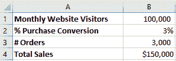
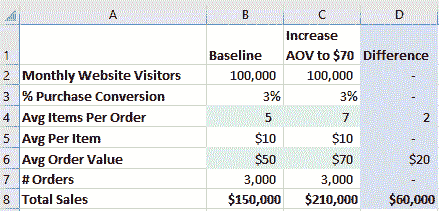

# 如何让你的数据科学项目脱颖而出

> 原文：<https://towardsdatascience.com/how-to-make-your-data-science-projects-stand-out-d9e0eb6bb3df>

## 增加收入以显示业务影响

图片来自 [Pixabay](https://pixabay.com/?utm_source=link-attribution&utm_medium=referral&utm_campaign=image&utm_content=4898096) 的 [Storme22k](https://pixabay.com/users/storme22k-4337202/?utm_source=link-attribution&utm_medium=referral&utm_campaign=image&utm_content=4898096)

数据科学家的工作竞争越来越激烈，能够从众多申请者中脱颖而出将增加你被录用的机会。数据科学项目组合是展示你的知识的好方法，特别是对于有抱负的数据科学家，但是招聘经理如何知道这个项目的价值呢？添加收入估计可以帮助您的项目脱颖而出，因为它向招聘经理展示了您知道如何将数据科学成果与业务影响联系起来。今天，我想讨论如何评估数据科学项目的收入影响。

## 建立基线

第一步是建立基线收入。您使用的输入将因公司的业务模式而异。一种方法是使用[漏斗分析](https://chartio.com/learn/product-analytics/what-is-a-funnel-analysis/)来确定收入计算的最佳输入。

下面是一家电子商务公司的简单收入计算。

示例 1 作者创建的电子商务收入计算

我假设网站每月有 100，000 个访问者(单元格 B1)。如果你的项目使用真实公司的数据，试着为你的收入计算找到实际的数字，使它更加真实。比如我用的[美国电商转化率 3%](https://www.invespcro.com/blog/the-average-website-conversion-rate-by-industry/) ( cell B2)。订单数量(单元格 B3)的计算方法是 100，000 个访问者(单元格 B1)乘以 3%的转化率(单元格 B2)。

## 将结果与业务影响联系起来

现在，让我们将您的数据科学项目与业务影响联系起来。提高普通 KPI(如转换率或流失率)的项目很容易联系起来，因为它们对收入有直接影响。

然而，这种关系并不总是简单明了的。例如，情感分析项目如何帮助提高收入？情绪分析有助于公司了解客户投诉，从而提高客户保留率，进而增加终身收入。

挑战自我，弄清楚您的数据科学项目如何帮助提高业务 KPI，以将影响联系起来。

## 计算收入

假设你的数据科学项目将转化率从 3%提高到了 4%。这意味着每月收入增加了 50，000 美元，增幅为 33%。显示你的项目增加了 1%的转化率不会得到太多的关注，但增加 33%的收入肯定会脱颖而出。

示例 2 作者创建的电子商务收入计算

让我们尝试另一个产品推荐项目的例子，该项目增加了每个订单平均购买的两件商品。下面，我们将第 4 行到第 6 行中的输入添加到收入计算中，以估计影响。

示例 3 作者创建的电子商务收入计算

假设平均订单值为 50 美元(单元格 B6 ),计算方法是每个订单 5 件商品(单元格 B4 ),每件商品 10 美元(单元格 B5 ),每个订单再增加 2 件商品将使平均订单值达到 70 美元。与第一个示例类似，显示您的项目将每个订单的平均项目从 5 个增加到 7 个，不如添加您的项目将每月收入增加 60，000 美元，即增加 40%。

## **最终想法**

我已经展示了几个如何将数据科学项目结果与收入影响联系起来的示例，但投入会因项目而异。为您的收入计算找到合适的输入是展示您知道如何将数据科学结果与业务绩效联系起来的另一种方式。在讨论为您的投资组合创建哪些数据科学项目时，请考虑结果如何与收入相关联，以帮助您决定最具业务影响力的项目。

## 你可能也会喜欢…

     