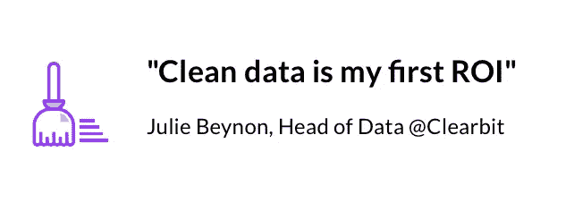
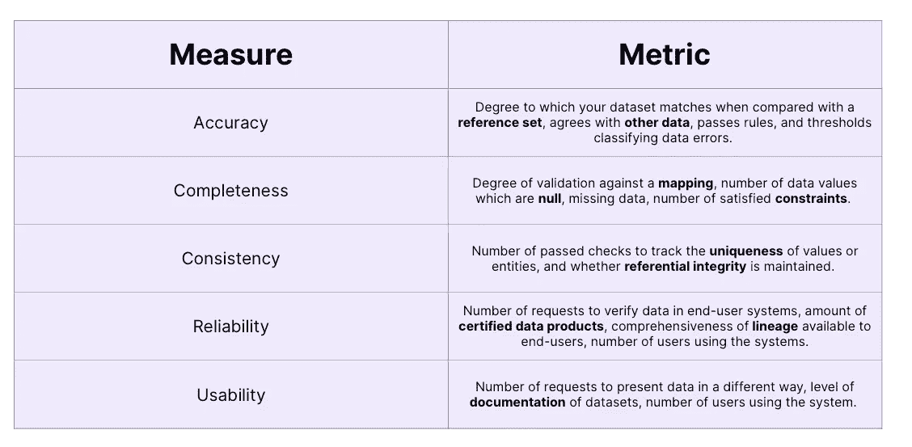
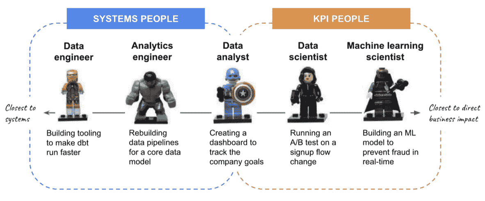
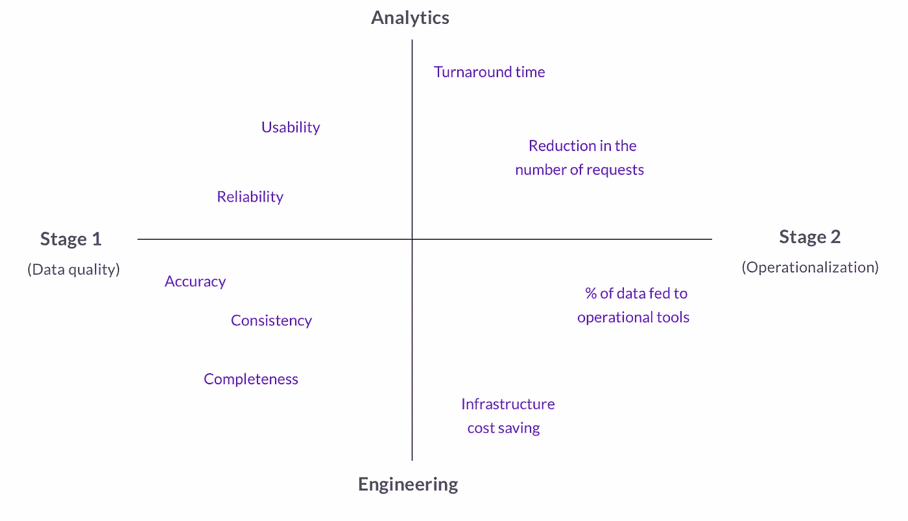

# 如何衡量你的数据团队的投资回报率？

> 原文：<https://towardsdatascience.com/how-to-measure-the-roi-of-your-data-team-9c60a939f247>

## 并证明在数据人员、数据工具等方面的支出是合理的..适当地

衡量数据团队的投资回报率—图片来自 [Castor](https://www.castordoc.com)

# I .为什么衡量您的数据团队的投资回报率如此重要？

衡量数据团队投资回报率的重要性—来自 Castor 的图片

我感到困惑的是，尽管数据团队花了很多时间来量化一切，但他们仍然很难量化自己的表现。

问题是，如果不能证明数据团队对业务有重大的、可衡量的影响，他们就不能放弃。原因很简单。数据团队需要相应的投资来高效运作。我们知道投资通常需要充分的理由。出于这个简单的原因，如果你能证明你的数据团队的**经济影响**，你将永远只能**协商预算**，投资**工具**或**壮大你的数据团队**。你可能已经知道了。问题是:如何衡量这种影响？

这件事已经有人考虑过了。事实上， [Benn Stancil](https://benn.substack.com/p/method-for-measuring-analytical-work?r=mr5qp&s=r) 、[Mikkel dengse](https://medium.com/data-monzo/how-to-think-about-the-roi-of-data-work-fc9aaac84a3c)和 [Barry McCardel](https://hex.tech/blog/data-team-roi) 已经提出了三个有见地的框架来衡量数据团队的 ROI。

通过与 Clearbit 的数据主管 Julie Beynon 和 Khan Acadamy 的数据主管 Kelli Hill 的讨论，我们试图了解这些框架在实践中是如何应用的。这有助于我们确定可行的步骤，使您能够以简单而有意义的方式衡量数据团队的投资回报率，同时考虑到您团队的规模和成熟度。

# 二。为什么衡量数据团队的投资回报率如此困难？

*   数据团队相对较新，或者至少比财务、营销和工程团队新。因此，还没有确定的衡量数据 ROI 的最佳实践。尽管已经出现了各种框架来衡量数据团队的 ROI，但是还没有普遍的方法来这样做。
*   数据团队以一种非常独特的方式运作。他们通常支持其他团队，如营销、财务或工程团队，以影响绩效。因此，他们会间接影响业务，这就是为什么还不能 100%确定应该跟踪哪些 KPI 来评估他们的绩效。
*   最后，数据团队需要考虑的相关 KPI 集根据特定行业、团队的规模和成熟度而有所不同。这也使得很难建立一种通用的衡量绩效的方式。

# 三。衡量您的数据团队的投资回报——来自数据领导者的重要提示。

# A.数据团队的两个关键阶段及其各自的 KPI

# I)阶段 1:清理数据

“干净的数据是我的第一个投资回报”,引自 Julie Beynon

新数据团队的首要任务是获得干净、可用和可信的数据。如果没有这一点，数据就无法影响企业的整体绩效。在数据团队的早期阶段，你需要确保数据是好的，你的工作是润色你的数据，直到它处于最佳状态。自然地，您将测量的第一个 KPIs 指标与数据质量相关联。**数据质量**是一个总括术语，涵盖了影响数据是否可用于预期用途的所有因素。因此，您测量的第一个数据 ROI 与您能否从干净的数据中获得答案紧密相关。以下是确保您的数据至少 80%良好的最重要的衡量要素。关于数据质量维度的更多内容，【Metaplane 的这篇文章是一个很好的资源。

数据质量测量及其相关指标—来自 Castor 的图片

1.  **精度**

准确性与你拥有的数据是否描述现实有关。例如，如果您这个月在数据仓库中销售的商品数量与销售团队报告的实际数量不一致，那么您就遇到了准确性问题。

**衡量准确性的关键指标**:“当与参考集比较时，您的数据集匹配的程度，与其他数据一致的程度，通过规则的程度，以及对数据错误进行分类的阈值的程度。”([凯文胡，2021](https://www.metaplane.dev/blog/data-quality-metrics-for-data-warehouses) )

2.**完整性**

完整性与你的数据描述现实的完整程度有关。完整性的两个层次如下:首先，您需要查看您的数据模型有多完整。其次，你应该看看数据本身相对于数据模型有多完整。

**衡量完整性的关键指标**:“针对映射的验证程度、空数据值的数量、缺失数据、满足的约束的数量。”([凯文胡，2021](https://www.metaplane.dev/blog/data-quality-metrics-for-data-warehouses) )

3.**一致性**

一致性是指你的数据内部是否**一致**。当不同值的聚合与应该聚合的数字不一致时，数据就是不一致的。例如，如果每月的利润与每月的收入和成本数字不一致，那么就存在一致性问题。一致性检查的一个例子是 Codd 的引用完整性约束。

**衡量一致性的关键指标:**“通过检查的次数，以跟踪值或实体的唯一性，以及参照完整性是否得到维护。”([凯文·胡，2021](https://www.metaplane.dev/blog/data-quality-metrics-for-data-warehouses) )

4.**可靠性**

可靠性与数据用户是否认为您仓库中的数据是真实的有关。当你有足够的血统和质量保证时，你的数据可以被认为是可靠的。如果您的销售团队认为由于技术问题，产品的使用不能反映真实的使用情况，那么您就面临着数据可靠性的问题。一个[数据目录](https://www.castordoc.com/)通常可以帮助你快速获得数据可靠性的证明。

**衡量可靠性的关键指标**:“验证最终用户系统中数据的请求数量、认证数据产品的数量、最终用户可用谱系的全面性、使用系统的用户数量。”([凯文胡，2021](https://www.metaplane.dev/blog/data-quality-metrics-for-data-warehouses) )

5.**可用性**

这指的是数据能否被顺利访问和理解。当数据易于理解并以明确的方式正确解释时，数据可用性就很好。当一个外观仪表板很难理解时，你就有一个可用性问题。总的来说，用元数据丰富你的数据(即记录你的数据)使它在移动中变得可用和容易解释。

**衡量可用性的关键指标**:“以不同方式呈现数据的请求数量，数据集的文档化水平，使用系统的用户数量。”([凯文胡，2021](https://www.metaplane.dev/blog/data-quality-metrics-for-data-warehouses) )

# 第二阶段:运作化

一旦您掌握了干净、可靠的数据，提高性能的下一步就是进行运营分析。这种方法包括让“运营”团队可以访问数据，用于运营用例(销售、营销，..).我们将它与将存储在仓库中的数据仅用于报告和商业智能的更经典的方法区分开来。运营分析不是使用数据来影响长期战略，而是为业务的**日常运营**提供战略信息。简而言之，就是让公司的数据发挥作用，让组织中的每个人都能做出更明智、更快速的决策。

运营分析—将数据从您的仓库推送到运营工具。图片来自 Castor

这是数据团队发展过程中非常自然的一步。收集数据的最终目的是**提高组织的效率和决策**。接下来，您应该衡量如何将数据交给其他团队，以便他们能够以独立的方式使用数据。这意味着将数据推入运营工具，以便销售或营销团队可以在他们的活动中有效地使用这些数据。[逆向 ETL](https://www.castordoc.com/blog/reverse-etl-benchmark-for-mid-market-companies) 工具非常适合数据操作化，允许你自动将数据从你的仓库推到其他团队的操作工具中。

数据操作化有两个好处，可以让您提高投资回报率。首先，它允许其他团队做出更有效的、数据驱动的决策。其次，这解放了分析团队，让他们能够进行更深入、更有意义的数据分析。当分析可以脱离基本的报告、向其他团队提供数据事实和回答问题时，他们可以专注于我们真正需要分析师技能的事情。

**但是，您如何衡量自己在自助服务中推出数据的能力呢？**

Clearbit 的数据主管 Julie Beynon 建议从你为其他团队解决问题的数量来考虑这个问题。您可以专门查看特定类别中请求数量的减少情况。例如，数据团队可能会收到很多关于归属的请求。将相关数据放在营销团队手中，应该会导致后者在这类问题上对数据团队的依赖减少，最终将归因相关请求的数量降至零。衡量数据可操作性的一个好方法是**查看不同类别中请求数量的减少**。你能从列表中剔除的问题越多，你的数据就越容易操作。

这个想法也出现在 HEX 提出的一个著名的[数据 ROI 框架](https://hex.tech/blog/data-team-roi)中。该框架认为，如果您的数据团队真正提供了价值，其他职能部门(如营销或财务)的领导会强烈主张代表您对团队进行更多投资。相反，如果你的合作伙伴不愿意为你辩护，你可能没有将你的数据操作化。也就是说，其他团队没有从你的工作中受益，或者你不允许他们独立处理数据。

# B.不同的子团队有不同的 ROI。

我们已经确定，您应该根据数据团队所处的阶段查看不同的指标。但不是这样。数据团队由子团队组成，这些子团队应该根据不同的 KPI 指标进行评估。我们区分以下两个主要的子团队:工程和分析。这些子团队中的每一个都有不同的目标，并以不同的方式影响业务，因此为什么他们应该被不同地评估。

在一篇关于衡量数据工作投资回报率的非常酷的文章中，[Mikkel dengse](https://medium.com/@mikldd?source=post_page-----fc9aaac84a3c-----------------------------------)介绍了系统人员和 KPI 人员之间的区别。我们把这种区别变得更简单，我们只从工程(系统人员)和分析(KPI 人员)的角度来谈。

系统人员与 KPI 人员—图片来自 Mikkel Dengsoe

# I)工程(系统)

数据工程团队的目标是构建可靠的基础架构，以确保分析人员能够访问可信数据。因此，以下指标最适合用于衡量他们的绩效

## 乘数效应

工程师的工作不会直接影响顶级 KPI。他们工作的独特之处在于，它起到了“乘数效应”的作用，让分析团队工作得更快、更有效率。例如，如果数据工程师可以让 dbt 移动得更快，分析工程师也可以移动得更快，并建立更多的数据模型。如果没有工程团队，数据分析师和数据科学家将花费 70%-80%的时间清理数据。拥有一个强大的工程团队可以提高分析团队的绩效，这反过来会积极影响其他团队的绩效。

但是如何衡量乘数效应呢？嗯，数据工程功能通过向其他团队提供**干净、可靠的数据**，允许其他人更快地行动。因此，衡量数据工程师绩效的关键指标是**数据质量**和**数据正常运行时间**。

**数据质量**

我们已经在第一部分中详细介绍了数据质量包含的组件。在更一般的情况下，数据质量可以通过数据问题触发的事件数量来衡量。我们可以将数据事件定义为包括内部警报、失败的测试以及外部消费者提出的相关问题。

**数据正常运行时间**

数据正常运行时间可以定义为数据集按时交付的时间相对于预期频率或 SLA 要求的百分比。

*预期频率*指的是数据集的预期更新频率。这通常是每天、每小时或实时的。

*SLA(服务水平协议)要求*是由数据生产者和消费者之间的 SLA 协议规定的频率条款，规定数据必须在何时更新。例如，SLA 可能会规定一个绝对时间，如早上 7:00，或者一个相对时间，如每 3 小时一次。

## 基础设施成本节约

我们最初惊讶地听到，在 KhanAcademy 的数据团队中，在衡量分析工程团队的绩效时，通常会考虑基础架构成本节约。让我们思考一下，为什么这种测量会有启发性。

除了向其他团队提供干净可靠的数据，数据工程师还负责**良好的数据管理**。这包括清理表格、归档不必要的表格，以及充分利用云所提供的优势。事实证明，良好的数据管理可以在**存储成本**方面节省大量资金。类似地，数据工程师通常寻求**自动化流程**或使其更高效。这节省了时间和金钱。因此，基础设施成本的节约是表现良好的数据工程团队的自然结果。从这个意义上说，在衡量你的团队的表现时，这是一个非常有趣的指标。当然，你需要保持谨慎，并且总是在引擎盖下寻找*成本下降的原因。你的团队是更有效率了(好现象)还是他们只是处理的数据比以前少了(不好了)？不管答案是什么，这个数字除了非常容易测量之外，还会告诉你一些事情。*

# II)分析(关键绩效指标)

分析团队以不同的方式工作。他们对业务 KPI 有更直接的影响，或者至少他们更接近决策。评估他们的表现应该考虑到这一点。

在分析方面，真正重要的是从提出问题到给出答案之间的周转时间。分析的工作是为关键问题提供快速答案，从而启发企业的决策。目标是最小化从提出问题到分析师给出答案之间的时间，并且测量这个时间应该给出团队表现的一个很好的指示。这个[框架](https://benn.substack.com/p/method-for-measuring-analytical-work?s=r)最初是由 Benn Stancil 提出的，并被证明在 KhanAcamedy 的数据团队中运行良好。

以这种方式衡量分析性能的好处在于，它鼓励分析师将工作重点放在现实生活的决策上，避免他们迷失在探索性的数据分析中。

你的分析团队关注什么？这说明了您业务中的大量数据投资回报率。很简单，如果你的团队花了大部分时间为其他团队(营销、财务等)答题，这意味着你的数据没有被操作化。其他团队完全依赖分析团队解决数据问题，而您无法实现数据自助服务。这也意味着你的分析团队花了太多时间**运行**，解决日常业务问题和基本报告，而不是**构建**并专注于更深层次的分析。尽管这一指标无法充分衡量，但它让您很好地了解了自己在数据之旅中的位置。这也有助于您确定应该关注哪些指标。如果您的数据没有完全可操作化，您可能应该在**数据质量上花费更多时间，**确保您拥有干净的&可信数据。

# 结论

这些思考带给我们一个甜蜜的结论和一个相对简单的解决数据 ROI 难题的方法。一旦您理解了您的数据团队当前面临的挑战(数据质量或数据可操作性)，确定您应该关注的用于测量性能的指标就非常简单了。我们试图通过这个很酷的地图让事情变得更简单。下面是怎么读的。您的数据团队相对年轻，您还没有解决数据质量问题？这意味着你处于第一阶段。您应该关注数据**准确性**、**一致性**和**正常运行时间**等指标来评估工程职能的绩效，同时您应该关注文档工作和数据可用性来衡量数据分析师的绩效。就这么简单。

衡量数据团队投资回报率的指南针—来自 Castor 的图片。

# 关于我们

我们写了利用数据资产时涉及的所有过程:从[现代数据堆栈](https://notion.castordoc.com/)到数据团队组成，再到数据治理。我们的[博客](https://www.castordoc.com/about/blog)涵盖了从数据中创造有形价值的技术和非技术层面。

想去看看卡斯特吗？[联系我们](https://meetings.hubspot.com/xavier76/trist-xav-calendar)，我们将向您展示一个演示。

*原载于*[*https://www.castordoc.com*](https://www.castordoc.com/blog/how-to-measure-the-roi-of-your-data-team)*。*