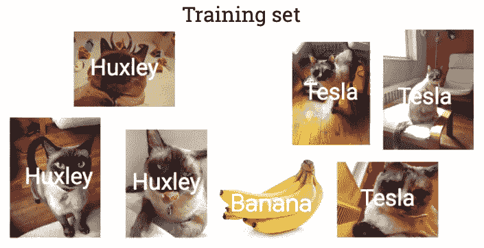
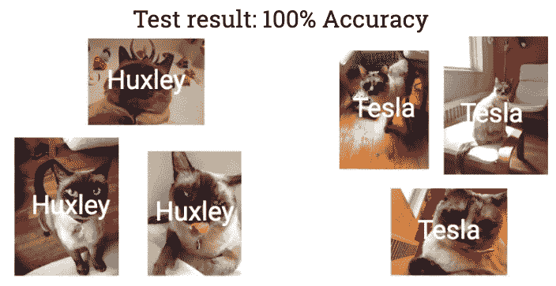
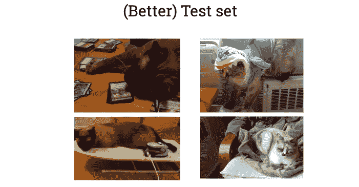

# 如何测试你的人工智能系统

> 原文：<https://towardsdatascience.com/how-to-mess-up-testing-your-ai-system-36d97ec56fe7>

## 避免典型的数据科学新手错误

当与[机器学习(ML)](http://bit.ly/quaesita_simplest) 和[人工智能(AI)](http://bit.ly/quaesita_aim) 一起工作时，保持头脑清醒的一个好方法是像老师一样思考。毕竟， [ML/AI](http://bit.ly/quaesita_emperor) 的重点是你让你的(机器)学生通过给出例子而不是明确的指令来学习一项任务[。](http://bit.ly/quaesita_sbucks)

正如任何老师都会提醒你的:如果你想用例子来教学，例子必须是好的。任务越复杂，你需要的例子就越多。如果你想相信你的学生已经学会了这个任务，测试必须是好的。

由 [Husniati Salma](https://unsplash.com/@husniatisalma?utm_source=medium&utm_medium=referral) 在 [Unsplash](https://unsplash.com?utm_source=medium&utm_medium=referral) 上拍摄的照片

> 如果你想用例子来教学，例子必须是好的。如果你想信任你的学生，测试必须是好的。

这就是为什么测试在 ML/AI 中极其重要，但不幸的是这并不总是容易的。让我们来看看两种使测试变得一团糟的经典方法:一种是初学者的错误，另一种更阴险一些——大多数从业者至少已经上当一次了。

# 初学者犯的错误

想象一下，我正计划训练一个人工智能图像识别系统来对香蕉的照片以及我的两只猫赫胥黎和特斯拉的照片进行分类。

由于从头开始构建一个图像识别系统需要数千张照片，所以上面七张图像中的每一张都是 10，000 张类似照片的占位符。

我们将把这 70，000 张图像输入到一个[人工智能算法中，并训练我们的模型](http://bit.ly/quaesita_emperorm)。我们看到了相当不错的培训表现，但是我们的解决方案真的有效吗？

我们不知道，直到我们测试它…所以我们来测试一下吧！

注意到我们选择的 60，000 张测试图片有什么问题吗？

他们看起来非常眼熟，不是吗？也许我们在哪里见过他们？

忽略我们内心的警钟，我们将提交它们而不贴标签，看看我们的系统是否已经学会应用正确的标签。瞧，它以 100% [的准确率执行任务](http://bit.ly/mfml_044)！

没有任何测试错误…所以我们没有任何问题，对不对？这个系统是 100%可信的吧？不对！

知道我们的系统是否值得信赖的唯一方法是检查它是否能够应对相关的新情况，而这与我们所做的正好相反。我们只给了它旧的数据。那里有 60，000 个错误！我们应该更清楚地知道不要重复使用我们的训练数据，但因为我们搞砸了我们的测试程序，我们的人工智能解决方案可能只是记住了它的胜利之路。

我们刚刚做的是用人类大学生已经看过的例子来测试他们的机器等价物。我们怎么知道他们没有记住答案？我们没有。像这样的考试绝对没有证据表明我们的学生能够[概括](http://bit.ly/quaesita_parrot)并在未来的例子中表现良好……这是机器*学习*的全部意义，而不是机器*通过查找表记忆*(你不需要 ML/AI 来做这件事)。

> 记忆的麻烦在于它只对过去有效，对未来无效。

无论你认为用人类学生已经看过的例子来测试他们是多么愚蠢，机器学生的情况更糟。由于机器学习和人工智能解决方案的复杂性，如果没有原始的、未使用的数据集，很难检测到过度拟合和记忆。计算机对数据有非常好的记忆力——这就是它们的用途。我的电脑已经记住了你现在正在读的文章的每一个字，而你可怜的作者甚至不能在文章发表 5 分钟后再现它。

> 由于机器学习和人工智能解决方案的复杂性，如果没有原始的、未使用的数据集，很难检测到过度拟合和记忆。

如果你允许的话，计算机当然可以记住它们找到完美解决方案的方法。唉，记忆的麻烦在于它只对过去有效，对未来无效。如果我们只对过去感兴趣，我们就不会使用机器学习。([此处解释](http://bit.ly/quaesita_parrot)。)

由于机器学习和人工智能解决方案的复杂性，如果没有原始的、未使用的数据集，很难检测到[过度拟合](http://bit.ly/mfml_049)和记忆。在我的课程中了解更多:[http://bit.ly/mfml_049](http://bit.ly/mfml_049)

> 当你建立机器学习解决方案时，你的目标是你能得到的最忠实和准确的未来模拟器。

这就是为什么一个更好的测试集应该是由系统不可能记住的例子组成的。换句话说，全新的数据。这是对未来数据的更准确的模拟…你的目标是你能得到的最忠实和准确的未来模拟。让我们用 40，000 张新图片进行测试吧！

我们表现如何？

从技术上来说，事情将会变得非常糟糕，因为这个类是少数。在像我们这样不平衡的数据集中，你更有可能看到所有东西都被贴上多数标签的失败。或者随机标签。但是香蕉是一个有趣的词，所以请原谅我。

原来我们的制度就是一堆臭垃圾。提示悲伤的长号！

因为我们使用新数据进行测试，所以系统无法通过过度拟合和记忆来作弊，所以我们能够发现它的真实性能(或缺乏性能)。

# 揭开我们的零

顺便说一句，0% [准确率](http://bit.ly/mfml_044)作为分数很诡异。一个由 70，000 个可靠的相关训练图像组成的数据集掌握在专家手中，不太可能导致如此糟糕的测试性能。鉴于目前可用的工具，特别是如果你使用云提供商的人工智能解决方案，如谷歌云的 [AutoML Vision](https://bit.ly/googlecloudvision) ，你必须*非常努力地尝试*才能做得如此糟糕。

在测试数据中获得 0%通常意味着在训练我们的系统时，除了无辜的“我们真的有”*no-*idea-what-we-being-that-training-our-system 之外，还有一些错误。像 0%这样的精度实际上很难达到。你不太可能遇到这些情况，因为即使是随机猜测也会给你比 0%更好的结果，当你的数据中没有[有用的模式](http://bit.ly/quaesita_parrot)时，随机猜测是许多算法默认的。这表明出现了灾难性的错误，至少像输入的测试数据集与训练集的格式或领域不同一样糟糕。比如尝试输入你的纳税申报表的截图，而不是 4 万张猫的照片。

我告诉你这些不是因为你需要知道如何处理 0%类型的结果(检查测试集的源、元数据和模式)，而是因为获得比零更好的性能是标准的。这不是你的项目好运的预兆，也不是庆祝你的未孵化小鸡的理由；真正的胜利是一个分数超过了[合理的预定基准](http://bit.ly/quaesita_dmguide2)，通常这个数字至少比随机猜测要好一点。

# 避免新手的错误

确保你总是在原始的数据上测试，并且从来没有被 ML/AI 系统或者构建它的团队看到过。这就是你如何避免[过度拟合](http://bit.ly/mfml_049)的方法，你可以把这种情况想象成学生记住了考试的问题和答案。

> 总是使用原始数据进行测试。

为了确保您在原始数据上进行测试，周围必须有原始数据。你是怎么得到它的？一种方法是做出坚定的承诺——包括预算和计划！—在未来收集更多数据…这有时说起来容易做起来难。如果你不断有新的数据流入，你应该感到幸运，对于我们这些为拥有面向用户应用的公司工作的人来说，这是一种太容易被视为理所当然的特权；[不是每个人都有这样丰富的数据。](http://bit.ly/quaesita_notyours)

照片由 [Unsplash](https://unsplash.com?utm_source=medium&utm_medium=referral) 上的 [regularguy.eth](https://unsplash.com/@moneyphotos?utm_source=medium&utm_medium=referral) 修改而来

如果你不能在需要的时候廉价地收集大量数据，那就养成在每个项目开始时解决测试问题的习惯，方法是[分割你的数据](http://bit.ly/quaesita_sydd)并将其中一些数据锁起来，直到对你的数据解决方案的性能进行最终统计评估的时候。不幸的是，许多其他方面值得尊敬的公司和团队搬起石头砸了自己的脚，因为他们未能分割数据，然后测试他们的训练数据，推出垃圾系统，并为他们的错误付出高昂的代价。

即使新数据丰富且易于收集，我也不会过分强调组织通过良好的数据访问策略建立健康的数据文化的重要性，因此改善数据科学实践的最佳和最快的快速解决方案之一是让团队中的每个人都了解[数据拆分](http://bit.ly/quaesita_sydd)的重要性。

  

数据领导者不是要求每个新手做正确的事情，而是通过将[数据分割](http://bit.ly/quaesita_sydd)设计到您的数据访问策略中，或者更好的是，如果您已经运行了一个具有定制基础架构的大型团队，则设计到您的数据科学工具中，从而使他们不可能做错误的事情。

# 专家犯的错误

现在我们已经讨论了新手的错误，我们已经准备好处理专家的错误，你可以在本系列的[第 2 部分](http://bit.ly/quaesita_testmistake2)中找到:

  

# 感谢阅读！YouTube 课程怎么样？

如果你在这里很开心，并且你正在寻找一个为初学者和专家设计的有趣的应用人工智能课程，这里有一个我为你制作的课程:

在这里欣赏整个课程播放列表:【bit.ly/machinefriend 

# 喜欢作者？与凯西·科兹尔科夫联系

让我们做朋友吧！你可以在 [Twitter](https://twitter.com/quaesita) 、 [YouTube](https://www.youtube.com/channel/UCbOX--VOebPe-MMRkatFRxw) 、 [Substack](http://decision.substack.com) 和 [LinkedIn](https://www.linkedin.com/in/kozyrkov/) 上找到我。有兴趣让我在你的活动上发言吗？使用[表格](http://bit.ly/makecassietalk)取得联系。

# 有兴趣尝试图像分类吗？

从这里开始使用 Google Cloud Vision API 和 AutoML Vision:

 